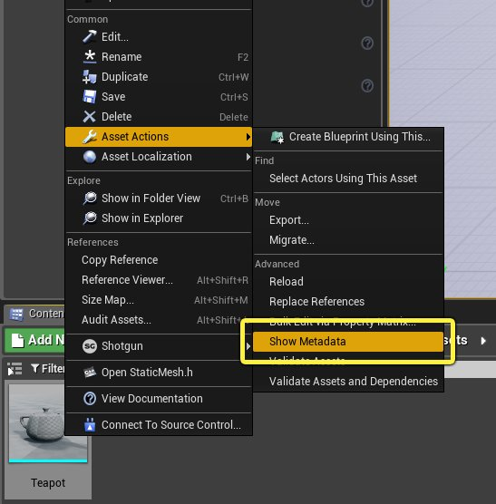
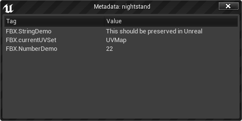
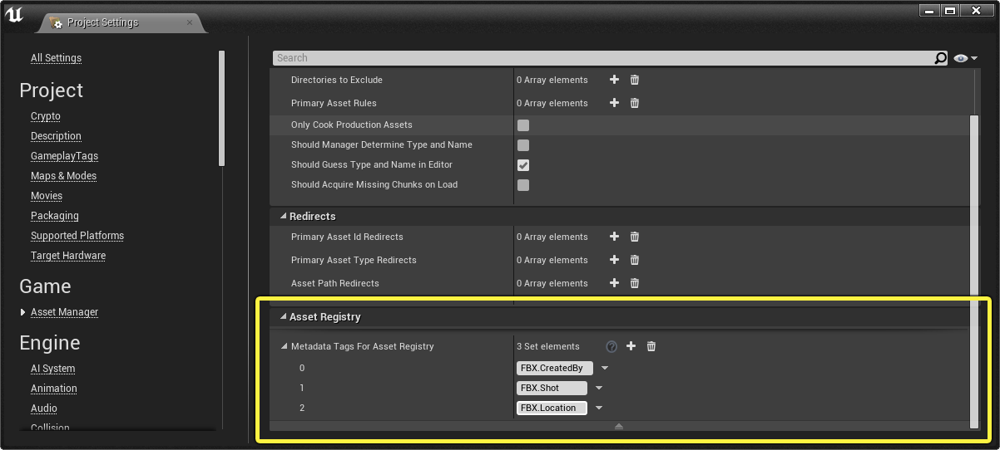
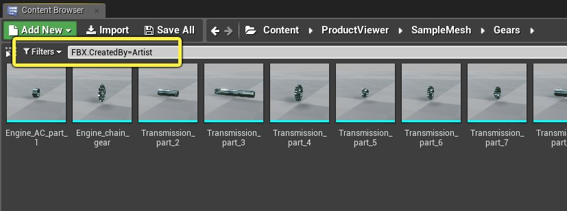
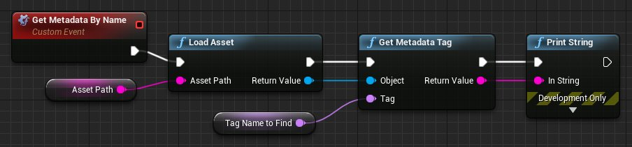
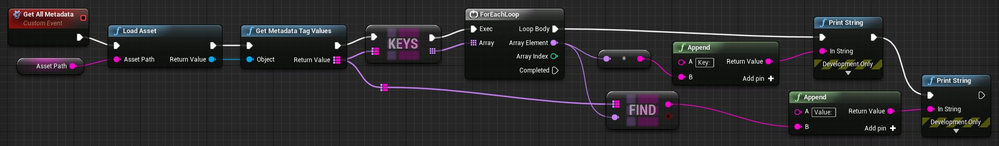
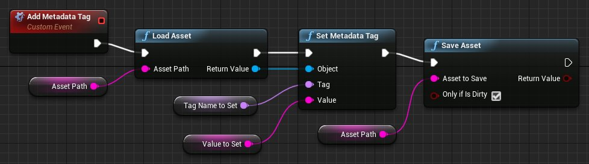
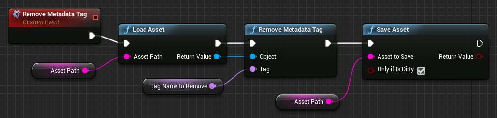

# 资产元数据

> 路径：虚幻引擎5.7文档 / 理解基础知识 / 资产和内容包 / 资产元数据

> 原始页面：https://dev.epicgames.com/documentation/unreal-engine/asset-metadata-in-unreal-engine

你可以将元数据（Metadata）指定给虚幻引擎项目中的任何资产，以便记录资产的信息。元数据是一组键值对，可以根据用途自由定义。

元数据可以包含这些信息：资产创建者姓名、资产在项目中的预期用途、资产在工作流程中的状态（例如正在进行、已完成、已批准等）等等。

你可以用元数据筛选内容浏览器中的资产，或者识别蓝图或Python脚本中的资产。

> [!NOTE]
> 由于元数据与项目资产绑定，所以无法在运行时通过游戏代码直接访问它。它主要用于在虚幻编辑器中编写资产的管理和操作方式。

> [!TIP]
> 你还可以将在某些第三方应用中创建的元数据连同资产导入到虚幻编辑器中。有关如何通过FBX导入流程将元数据导入虚幻引擎的详细信息，请参阅[FBX资产元数据管线](../../../working-with-content/fbx-content-pipeline/fbx-asset-metadata-pipeline/index.md)。

## 在虚幻编辑器UI中使用元数据

虽然目前无法在UI虚幻编辑器中修改元数据，但你可以查看与资产绑定的元数据，并且可以使用元数据的键来筛选在内容浏览器中显示的资产。

### 查看资产上的元数据

要查看分配给任何资产的元数据，请在内容浏览器中右键单击该资产，并选择 **资产操作（Asset Actions）> 显示元数据（Show Metadata）**。



你将看到一个附加到该资产的所有键和值的列表：



### 过滤内容浏览器

要在内容浏览器中按特定的元数据标签过滤资产，请执行以下操作：

1. 在主菜单中选择 **编辑（Edit）> 项目设置（Project Settings）**，打开 **项目设置（Project Settings）** 窗口。
2. 选择 **游戏（Game）> 资产管理器（Asset Manager）** 部分，然后找到 **资产注册表（Asset Registry）> 资产注册元数据标签（Metadata Tags For Asset Registry）** 设置。 将你希望能够被用于过滤资产的所有键的名称添加到此列表中。

   

   *点击显示大图。*
3. 在内容浏览器的 **过滤（Filters）** 栏中，键入标签名称，后跟`=`，再后跟要搜索的值。资产列表将自动进行过滤，仅显示包含你指定的元数据标签的资产，对于这些资产，该标签的值与你在`=`后面键入的值匹配。

   

## 使用资产元数据

> [!NOTE]
> 如果你还没有安装 **编辑器脚本工具（Editor Scripting Utilities）** 插件，则需要安装该插件。有关详情，请参阅[脚本化和自动化编辑器](../../../production-pipeline/scripting-and-automating-the-unreal-editor/index.md)。

选择实现方法：

Blueprints

Python

你将在 **编辑器脚本（Editor Scripting）> 元数据（Metadata）** 类别下找到管理资产元数据所需的节点。

> [!NOTE]
> 要使用这些节点，你的蓝图类必须派生自仅编辑器类，例如 **PlacedEditorUtilityBase** 类。有关详情，请参阅[使用蓝图脚本化编辑器](../../../production-pipeline/scripting-and-automating-the-unreal-editor/scripting-the-unreal-editor-using-blueprints/index.md)。

- 在使用元数据之前，必须先加载要使用的资产。你可以使用

  Editor Scripting > Load Asset

  节点来实现这一点。如果设置或移除元数据值，想要保留做出的更改，后面还需要使用

  Save Asset

  或

  Save Loaded Asset

  等节点。

**从资产获取元数据**

- 如果你知道要检索的元数据键的名称，可以使用 **Get Metadata Tag** 节点。例如，该脚本根据名称检索单个标签的值，并将其输出到视口：

  

  *点击显示大图。*
- 还可以使用 **Get Metadata Tag Values** 节点检索所有元数据，将所有元数据作为标签-值对的 *映射*。例如，该脚本检索一个资产的所有元数据，并按顺序将每个键和每个值写入视口：

  

  **设置新的元数据标签**

使用 **Set Metadata Tag** 节点。例如：



*点击显示大图。*

如果你指定的标签名称在资产的元数据中还不存在，则使用你指定的值添加此名称。如果资产已经具有指定名称的标签，则更新此标签的值。

**移除现有元数据**

使用 **Remove Metadata Tag** 节点，并提供想要移除的标签名称。例如：



*点击显示大图。*

如果想要从资产中移除 *所有* 元数据标签，可以循环调用此节点：

> 图片已省略：Remove all metadata tags

*点击显示大图。*

你将在`unreal.EditorAssetLibrary`类中找到管理元数据所需的函数。

- 在使用元数据之前，必须先加载要使用的资产。你可以使用

  unreal.EditorAssetLibrary.load_asset()

  根据资产在项目内容中的文件名添加资产。如果设置或移除元数据值，想要保留做出的更改，后面还需要使用

  unreal.EditorAssetLibrary.save_asset()

  或

  unreal.EditorAssetLibrary.save_loaded_asset()

  之类的函数。

**从资产获取元数据**

- 如果你知道要检索的元数据键的名称，可以使用`get_metadata_tag(asset, tag_name)`函数。例如，该脚本根据名称检索单个标签的值，并将其输出到日志：

  ```
          import unreal        asset_name = "/Game/ProductViewer/SampleMesh/Gears/Transmission_part_10"        tag_name = "CreatedBy"        loaded_asset = unreal.EditorAssetLibrary.load_asset(asset_name)        value = unreal.EditorAssetLibrary.get_metadata_tag(loaded_asset, tag_name)        if not value is "":            unreal.log("Value of tag " + tag_name + " for asset " + asset_name + ": " + value)
  ```
- 你还可以使用`get_metadata_tag_values(asset)`函数来检索分配给资产的所有元数据，将所有元数据作为一个字典。然后，你可以循环遍历这些键和值。例如，该脚本检索一个资产的所有元数据，并按顺序将每个键和每个值写入日志：请注意，此词典中的键实际上不是字符串，而是`unreal.Name`对象。你可以使用内置的`str()`函数将这些对象强制转换为字符串。

  ```
          import unreal        asset_name = "/Game/ProductViewer/SampleMesh/Gears/Transmission_part_10"        loaded_asset = unreal.EditorAssetLibrary.load_asset(asset_name)        all_metadata = unreal.EditorAssetLibrary.get_metadata_tag_values(loaded_asset)        for tag_name, value in all_metadata.iteritems():            if not value is "":                unreal.log("Value of tag " + str(tag_name) + " for asset " + asset_name + ": " + value)
  ```

**设置新的元数据标签**

使用`set_metadata_tag(asset, tag_name, value)`函数。例如：

```
	import unreal	asset_name = "/Game/ProductViewer/SampleMesh/Gears/Transmission_part_10"	tag_name = "CreatedBy"	value_to_set = "My Name"	loaded_asset = unreal.EditorAssetLibrary.load_asset(asset_name)	unreal.EditorAssetLibrary.set_metadata_tag(loaded_asset, tag_name, value_to_set)	unreal.EditorAssetLibrary.save_asset(asset_name) 
```

如果你指定的标签名称在资产的元数据中还不存在，则使用你指定的值添加此名称。如果资产已经具有指定名称的标签，则更新此标签的值。

**移除现有元数据标签**

使用`remove_metadata_tag(asset, tag_name)`函数，并提供想要移除的标签的名称。例如：

```
	import unreal	asset_name = "/Game/ProductViewer/SampleMesh/Gears/Transmission_part_10"	tag_name = "CreatedBy"	loaded_asset = unreal.EditorAssetLibrary.load_asset(asset_name)	unreal.EditorAssetLibrary.remove_metadata_tag(loaded_asset, tag_name)	unreal.EditorAssetLibrary.save_asset(asset_name) 
```

如果想要从资产中移除 *所有* 元数据标签，可以循环调用此函数：

```
	import unreal	asset_name = "/Game/ProductViewer/SampleMesh/Gears/Transmission_part_10"	tag_name = "CreatedBy"	loaded_asset = unreal.EditorAssetLibrary.load_asset(asset_name)	all_metadata = unreal.EditorAssetLibrary.get_metadata_tag_values(loaded_asset)	for tag_name in all_metadata:		unreal.EditorAssetLibrary.remove_metadata_tag(loaded_asset, tag_name)	unreal.EditorAssetLibrary.save_asset(asset_name)  
```
