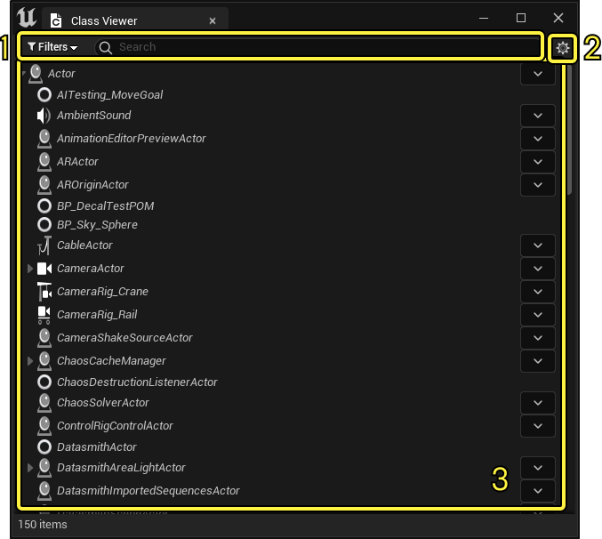
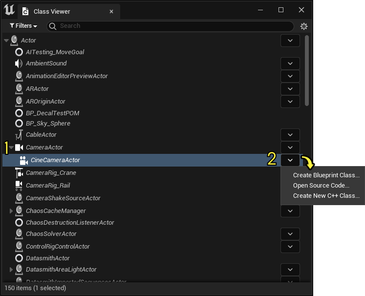

# 类查看器

> 路径：虚幻引擎5.7文档 / 理解基础知识 / 资产和内容包 / 类查看器

> 原始页面：https://dev.epicgames.com/documentation/unreal-engine/class-viewer-in-unreal-engine

虚幻引擎中的 **类查看器（Class Viewer）** 用于以下操作：

- 查看编辑器使用的类的层级列表。
- 创建并打开蓝图。
- 打开关联C++头文件，并基于特定类创建新的C++类。

## 打开类查看器

要打开类查看器（Class Viewer），请从虚幻引擎的主菜单前往 **工具（Tools）> 类查看器（Class Viewer）** 。

## 类查看器界面

类查看器界面包括以下区域：

| **编号** | **名称** | **说明** |
| --- | --- | --- |
| 1 | 过滤器和搜索栏 | 使用 **过滤器（Filters）** 下拉菜单限制显示以下一项或多项的类： Actor 可放置Actor 蓝图基类 使用 **搜索（Search）** 栏按名称找到类。 |
| 2 | 设置按钮 | 点击此按钮打开 **设置（Settings）** 菜单，你可以通过该菜单执行以下操作： 展开或折叠全部类。 显示或隐藏内部类。 显示使用开发人员文件夹的其他开发人员的类。 |
| 3 | 类视图 | 显示符合你所选条件的所有类。 |

## 类操作

如果类有子项，点击类名称（1）左侧的下拉箭头，显示该类的子项。

点击类名称（2）右侧的下拉箭头或右键点击类名称，打开带有下述选项的上下文菜单。

> [!NOTE]
> 根据类类型（蓝图或C++），你可执行的类操作会有所不同。

| **选项（Option）** | **蓝图类（Blueprint Class）** | **C++类（C++ Class）** |
| --- | --- | --- |
| **创建蓝图（Create Blueprint）** | 创建以所选蓝图为父级的新蓝图。 | 创建以所选蓝图为父级的新蓝图。 |
| **编辑蓝图（Edit Blueprint）** | 在[蓝图编辑器](../../../blueprints-visual-scripting/user-interface-reference-for-the-blueprints-vis-53faed96/index.md)中打开所选蓝图。 | 不适用 |
| **在内容浏览器中查找（Find in Content Browser）** | 在[内容浏览器](../../content-browser/index.md)中查找蓝图Actor。 | 不适用 |
| **打开源代码（Open Source Code）** | 不适用 | 在Visual Studio中打开类头文件。 |
| **新建C++类（Create New C++ Class）** | 不适用 | 打开[C++类向导](../../../cpp-programming/setting-up-your-development-environment-for-cplusplus/using-the-cplusplus-class-wizard/index.md)，创建以所选类为父类的新类。 |

### 拖放类

从类查看器（Class Viewer）中点击蓝图类并将其拖放至视口，将该类的新蓝图Actor添加到当前打开的关卡。

如果一个类是与组合框关联的类的子项，你还可以将该类从类查看器（Class Viewer）拖放到细节（Details）面板或世界设置（World Settings）的组合框中。例如，你可以将 `GameMode` 子类拖放到世界设置（World Settings）中的"游戏模式覆盖（GameMode Override）"组合框中。

> [!NOTE]
> 当将类拖放到组合框中时，需注意以下事项：
>
> - 未加载的类不会在组合框中显示。
> - 将类拖放到组合框中，将强制加载该类。

## 使用类选择器

"类选择器（Class Picker）"是仅使用代码就可切换到"类查看器（Class Viewer）"的模式。类选择器（Class Picker）将显示可用类的列表，例如，可用于转换静态网格体或可为新蓝图选择父项的类。

> [!NOTE]
> 使用类选择器需要了解如何在虚幻引擎中使用C++。

### 配置类选择器

`FClassViewerInitializationOptions` 用于初始化类选择器，具有控制类选择器行为的以下选项：

| **选项** | **说明** |
| --- | --- |
| `模式（Mode）` | 默认情况下，设置为 `ClassPicker` 。 你可以将此更改为 `ClassBrowsing` ，这会生成一个常规类查看器。请注意，下面大多数选项在类查看器中不运行。 |
| `显示模式（DisplayMode）` | 你可以从以下选项中选择： `TreeView` ，将显示类之间的父子项关系。 `ListView` ，将显示类的简单列表。 |

你可以使用以下过滤器配置在类选择器中显示哪些类：

| **过滤器** | **说明** |
| --- | --- |
| `bIsActorsOnly` | 仅显示属于 `Aactor` 子项的类。 |
| `bIsPlaceableOnly` | 仅显示可放置在关卡中的类。如果此项为 `true` ， `bIsActorsOnly` 也将被认定为 `true` 。 |
| `bIsBlueprintBaseOnly` | 仅显示蓝图基类。当你仅想查看可用于创建蓝图的类时，此项非常有用。 |
| `bShowUnloadedBlueprints` | 显示未加载的蓝图，即使它们的父项由于自定义过滤器的原因被过滤掉也不例外。 |
| `bShowNoneOption` | 在类选择器中显示 **无（None）** 选项。不影响类查看器。当你选择某项时，将传递 `NULL` 类。 |
