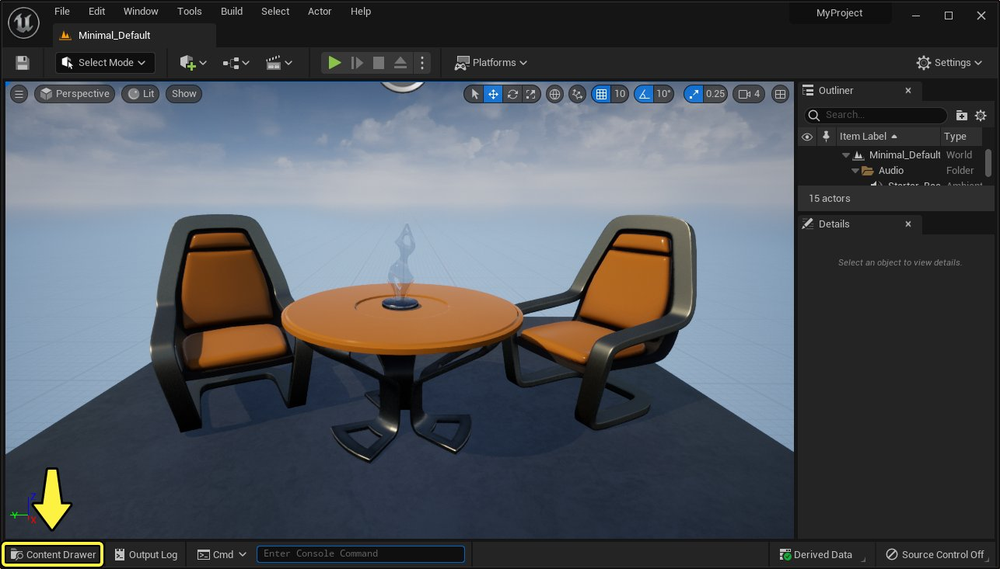
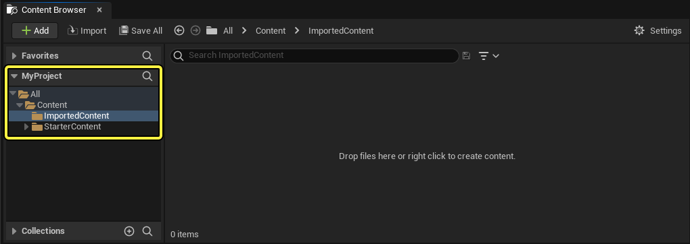
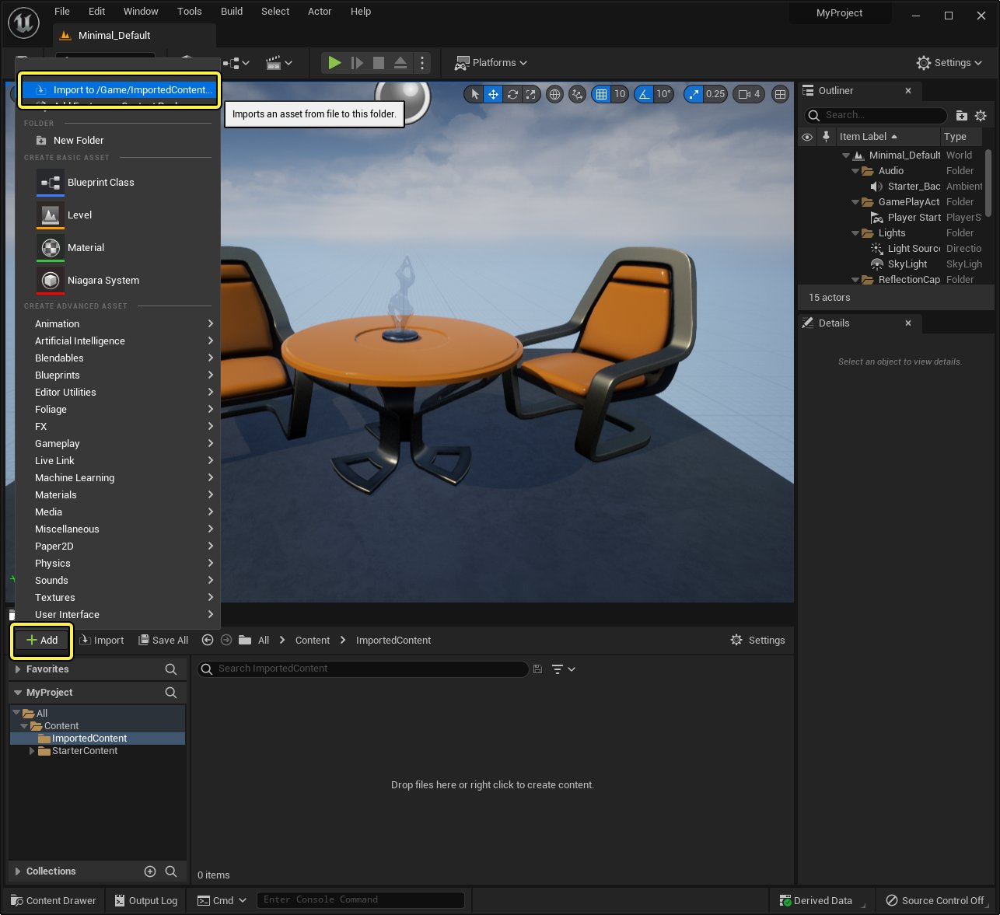
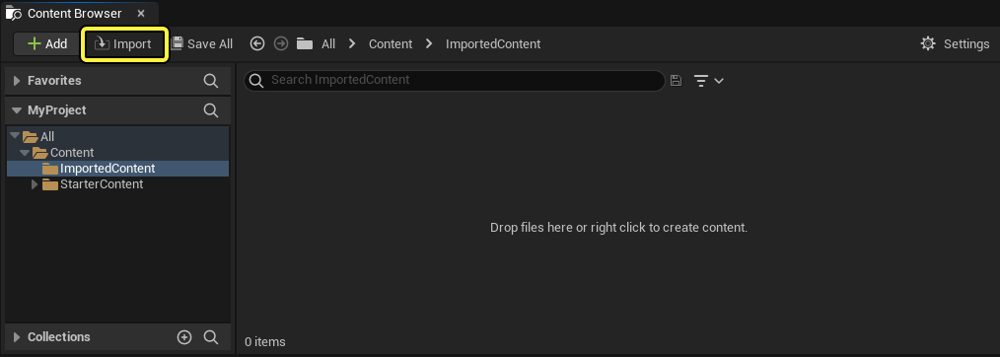
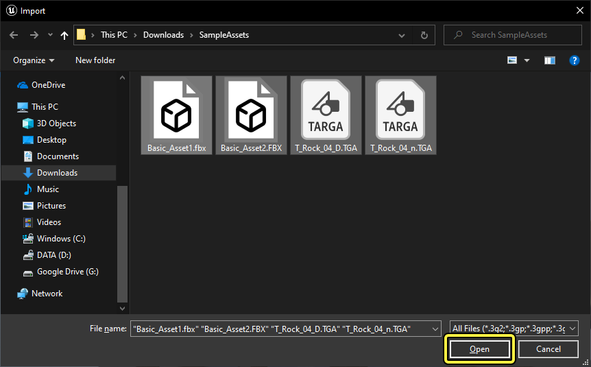
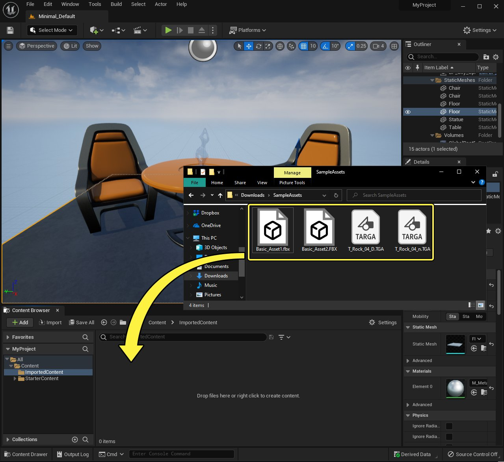

# 直接导入资产

> 路径：虚幻引擎5.7文档 / 理解基础知识 / 资产和内容包 / 直接导入资产

> 原始页面：https://dev.epicgames.com/documentation/unreal-engine/importing-assets-directly-into-unreal-engine

本页面介绍了将内容导入到 **虚幻引擎5（Unreal Engine 5）** 的两种最常见方法。有其他更高级的方法来导入专用内容，例如使用[Datasmith](../../../working-with-content/datasmith/datasmith-plugins-overview/index.md)从CAD应用程序导入内容。但是，对于大部分类型的基本内容（例如纹理或静态网格体），本页面上介绍的方法足以应对。

## 必需设置

在按照本页面上的说明操作之前，请首先下载并解压缩这些[示例资产](https://d1iv7db44yhgxn.cloudfront.net/documentation/attachments/d5ffb4a7-d7e6-4fff-84e6-135f18f04a9f/sampleassets.zip)。

## 选择要导入的文件

### 从内容浏览器导入

要使用 **内容浏览器（Content Browser）** 的 **导入（Import）** 按钮导入一个或多个资产，请执行以下步骤：

1. 打开 **内容侧滑菜单（Content Drawer）** 或 **内容浏览器（Content Browser）** 的实例。为此，请点击虚幻编辑器左下角的 **内容侧滑菜单（Content Drawer）** 按钮。

   

   内容侧滑菜单（Content Drawer） 按钮的位置。点击查看大图。
2. 在右侧的[**源（Sources）**](../../content-browser/sources-panel-reference/index.md)面板中，从你的项目的文件夹树，选择你要在其中导入资产的文件夹。

   > [!NOTE]
   > 如果你选择的文件夹不能包含资产，点击 **添加（Add）** 和 **导入（Import）** 按钮将不起作用。例如，你不能将资产导入到项目的顶级文件夹（下面截图中的 `All` ）。

   

   在这个例子中，我们创建了名为 ImportedContent 的新文件夹，并在源（Sources）面板中将其选中。
3. 执行以下操作 **之一** ：

   - 点击 **添加（Add）** 按钮。然后，从上下文菜单，选择 **导入到[文件夹路径]（Import to [folder path]）** 。

     

     点击查看大图。

     请注意，此菜单选项中显示的文件夹路径不同于你在内容浏览器的文件夹树中看到的内容。 `/Game/` 等同于 `All/Content/` 。

     > [!TIP]
     > 你还可以右键点击内容浏览器中的文件夹窗口或右键点击树中的文件夹，并将鼠标悬停在 **添加/导入内容（Add/Import Content）** 上来打开此上下文菜单。
   - 点击 **导入（Import）** 按钮。

     
4. 在打开的窗口中，浏览到你将下载的示例资产解压缩到的文件夹。点击并拖动以选择此文件夹中的所有四个文件，然后点击 **打开（Open）** 。

   

#### 步骤结果

点击 **打开（Open）** 后，虚幻引擎将显示一个对话框，其中包含你选择的资产的导入选项。请参阅下面的[导入资产](#%E5%AF%BC%E5%85%A5%E8%B5%84%E4%BA%A7)分段。

### 使用拖放导入

要使用拖放导入一个或多个资产，请执行以下步骤：

1. 打开 **内容侧滑菜单（Content Drawer）** 或 **内容浏览器（Content Browser）** 的实例。为此，请点击虚幻编辑器左下角的 **内容侧滑菜单（Content Drawer）** 按钮。

   

   内容侧滑菜单（Content Drawer） 按钮的位置。点击查看大图。
2. 在右侧的[**源（Sources）**](../../content-browser/sources-panel-reference/index.md)面板中，从你的项目的文件夹树，选择你要在其中导入资产的文件夹。

   > [!NOTE]
   > 如果你选择的文件夹不能包含资产，点击 **添加（Add）** 和 **导入（Import）** 按钮将不起作用。例如，你不能将资产导入到项目的顶级文件夹（下面截图中的 `All` ）。

   

   在这个例子中，我们创建了名为 ImportedContent 的新文件夹，并在源（Sources）面板中将其选中。
3. 打开操作系统的文件管理器（Windows上的 **Windows资源管理器（Windows Explorer）** ，或macOS上的 **访达（Finder）** ）。然后，导航至你的资产所在的文件夹。
4. 选择你的资产，然后将其拖放到 **内容浏览器（Content Browser）** 中。

   

   点击查看大图。

#### 步骤结果

点击 **打开（Open）** 后，虚幻引擎将显示一个对话框，其中包含你选择的资产的导入选项。请参阅下面的[导入资产](#%E5%AF%BC%E5%85%A5%E8%B5%84%E4%BA%A7)分段。

## 导入资产

无论你使用什么方法，在你选择想导入的文件之后，将显示 **导入选项（Import Options）** 窗口。这些选项将根据你导入的文件类型而变化。例如，下面的截图显示FBX文件的导入选项。

> 图片已省略：FBX导入选项窗口

> [!NOTE]
> 如需详细了解这些导入选项，请参阅[FBX导入选项参考](../../../working-with-content/fbx-content-pipeline/fbx-import-options-reference/index.md)页面。

要完成导入过程，你可以：

- 点击 **全部导入（Import All）** 以导入所有选定资产。
- 如果你想单独配置每个资产的设置，请针对每个单独的资产点击 **导入（Import）**。

在导入过程中，将在屏幕右下角显示对话框，告知你 `T_Rock_04_n.TGA` 已导入为法线贴图。这是因为虚幻引擎自动检测某些纹理类型，如法线贴图，并将其导入为正确的资产类型。点击 **确定（OK）** 以关闭此对话框。

> 图片已省略：纹理导入确认窗口

#### 步骤结果

虚幻引擎在项目中创建 `.uasset` 文件，用于保存你导入的每个文件的内容。

## 保存导入的资产

完成导入资产后，你会在内容浏览器中注意到，它们的图标标记有星号（*）。星号意味着资产尚未保存。

> [!NOTE]
> 虚幻引擎不会将你选择的文件移入你的项目文件夹。相反，它会创建 `.uasset` 文件来存储新导入的资产。

> 图片已省略：内容浏览器中未保存的资产

点击内容浏览器的菜单栏中的 **全部保存（Save All）** 按钮，以保存导入的资产。

> 图片已省略：内容浏览器中的全部保存按钮

将显示一个对话框，其中列出所有未保存的资产，你可以通过启用或禁用相应资产名称旁边的复选框来选择你想保存的资产。

选择你想保存的资产，然后点击 **保存选定项（Save Selected）**。

> 图片已省略：保存选定项按钮

保存资产后，你将注意到，其图标上的星号已删除，指示资产已成功保存。

> 图片已省略：内容浏览器中已保存的资产

#### 步骤结果

虚幻引擎保存了导入之后创建的所有 `.uasset` 文件。
