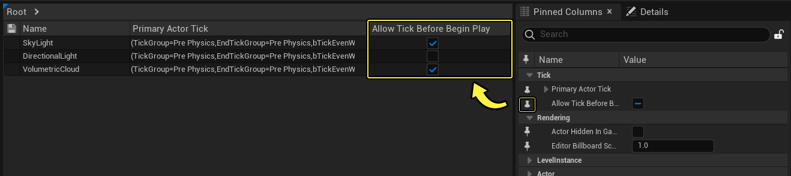
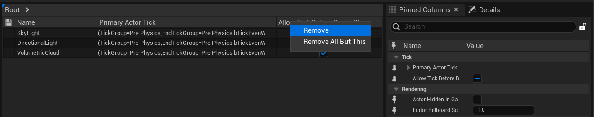
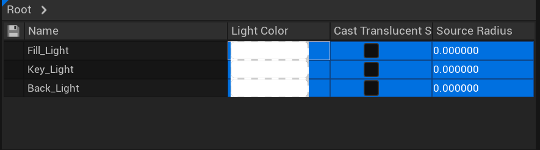

# 属性矩阵

> 路径：虚幻引擎5.7文档 / 理解基础知识 / 资产和内容包 / 属性矩阵

> 原始页面：https://dev.epicgames.com/documentation/unreal-engine/property-matrix-in-unreal-engine

在一个关卡中处理多个Actor时，一次更新一个属性会非常耗时。你可以使用 **属性矩阵（Property Matrix）** 来批量编辑和比较大量对象或Actor的值。它会使用表格视图，分列显示一组对象的可配置属性集。属性矩阵还提供标准属性编辑器，显示当前选择组的所有属性。

## 功能

| 功能 | 优势 |
| --- | --- |
| **批量对象编辑** | 一种更轻松的工作流程，用于为一组对象设置一系列可变值，同时又能将一组对象上的属性设置为同一个值。 同时处理数千个对象。 能够同时编辑多种对象类型。 |
| **批量细粒度对象比较** | 一次对数千个对象的值排序。 快速查找设置不正确的资产和Actor。 |
| **深度属性和数组支持** | 可以对数组和结构体类型的属性执行所有上述操作。 可以公开任意属性的列。 甚至可以处理数组索引。 |

## 访问属性矩阵

你可以通过以下方法访问属性矩阵：

- 选择

  搜索

  栏旁

  细节

  面板中的属性矩阵按钮。
- 在

  内容浏览器

  中选择资产，点击右键，在快捷菜单中选择

  资产操作（Asset Actions）

  ，然后选择

  在属性矩阵中编辑所选项（Edit Selection in Property Matrix）

  。
- 在

  大纲视图

  中，右键点击你的所选项，然后在快捷菜单中选择

  在属性矩阵中编辑所选项（Edit Selection in Property Matrix）

  。
- 在

  大纲视图

  中，右键点击你的所选项，然后在快捷菜单中选择

  在属性矩阵中编辑组件（Edit Components in the Property Matrix）

  ，选择任意共享的组件类型。

## 使用属性矩阵

属性矩阵是一个表格，与其他基于网格的编辑器一样处理数据。所有单元格都有显示（Display）和 _编辑（Edit）两种模式。根据当前模式，单元格功能集会有所不同。

### 添加和移除列

你可以在表右 **固定列（Pinned Columns）** 面板中固定和取消固定属性来添加和移除列。面板中的属性列表被称为"属性树"。

你也可以通过右键点击列标题，或 **中键点击** 列标题本身来移除列。

属性矩阵将尝试根据与表格绑定的对象类型，在表格中自动填充有价值的列。

### 编辑属性

大多数单元格会显示绑定值作为文本，并允许你编辑文本表示，但单元格是完全可以由程序员自定义的，因此可能会有很大差别。例如，某些但单元格有完全自定义单元格实现，如布尔值和颜色值。

属性树与表格中的所选行绑定。这种绑定意味着你对属性所做的改动只会被应用到所选项上。

在表格中，设置会被应用到你所选择最后一个单元格。

You can also copy selected cells and paste them to relative settings in the table.

其他编辑功能包括：

- 深度对比某个对象中的属性。
- 处理数组索引。

> [!TIP]
> 将鼠标悬停在标题名称上，即可查看列中属性的路径。

属性变化时，你的关卡也会被更新；但你必须点击保存图标才能正式应用设置。

### 排序

你可以点击列标题，按升序或降序对任意列排序。标题上会显示一个箭头，告诉你列的排序方式。

## 功能按钮

| 功能按钮 | 说明 |
| --- | --- |
| 键盘功能键 |  |
| **Esc** | 退出当前单元格的编辑模式。某些单元格有复杂的编辑控件，它们的ESC键有自己的优先行为，因此用户可能需要多次按下ESC键。 |
| **Ctrl + C** | 将当前单元格的字符串表示复制到剪贴板。 |
| **Ctrl + V** | 将当前单元格的值设置为剪贴板中的文本。 |
| **Ctrl + A** | 选择表格中的所有单元格。 |
| **Home** 或 **Ctrl + 左箭头** | 将当前单元格移到当前行的第一个单元格处。 |
| **End** 或 **Ctrl + 右箭头** | 将当前单元格移到行的最后一个单元格处。 |
| **Ctrl + Home** | 将当前单元格移到表的第一个单元格处。 |
| **Ctrl + End** | 将当前单元格移到表的最后一个单元格处。 |
| **左箭头** 或 **Shift + Tab** | 将当前单元格移到当前行的前一个单元格处。 |
| **右箭头** 或 **Tab** | 将当前单元格移到当前行的下一个单元格处。 |
| **上箭头** | 将当前单元格移到列的上一个单元格处。 |
| **下箭头** | 将当前单元格移到列的下一个单元格处。 |
| **Ctrl + 上箭头** | 将当前单元格移到列的第一个单元格处。 |
| **Ctrl + 下箭头** | 将当前单元格移到列的最后一个单元格处。 |
| **Shift + 上箭头** | 将当前单元格移到当前列的上一个单元格，并将其所在行添加到现有选择范围。 |
| **Shift + 下箭头** | 将当前单元格移到当前列的下一个单元格，并将其所在行添加到现有选择范围。 |
| **Ctrl + Shift + 上箭头** | 将当前单元格移到当前列的第一个单元格，并选择期间的所有行。 |
| **Ctrl + Shift + 下箭头** | 将当前单元格移到当前列的最后一个单元格，并选择期间的所有行。 |
| **F2** | 当前单元格进入编辑模式。 |
| 鼠标控制 |  |
| **LMB单击** 单元格 | 被单击的单元格变成当前单元格，该单元格所在的行变为新选择范围。 |
| **Ctrl + LMB单击** 单元格 | 如果被单击的单元格不属于已经选中的行，则该单元格变为当前单元格，它所在的行添加到当前选择范围，否则会从选择范围中移除该单元格所在的行。 |
| **Shift + LMB单击** 单元格 | 被单击的单元格变为当前单元格，原始当前单元格所在行和被单击单元格所在行之间的所有行将添加到现有选择范围。 |
| **LMB单击** 当前单元格 | 当前单元格进入编辑模式。 |
| **LMB双击** 单元格 | 单元格变为当前单元格，并进入编辑模式。 |
| **MMB单击** 列标题 | 从表中移除该列。 |
| **MMB单击** "细节"（Details）面板中的属性 | 切换是否将被单击属性固定到表格中。 |
