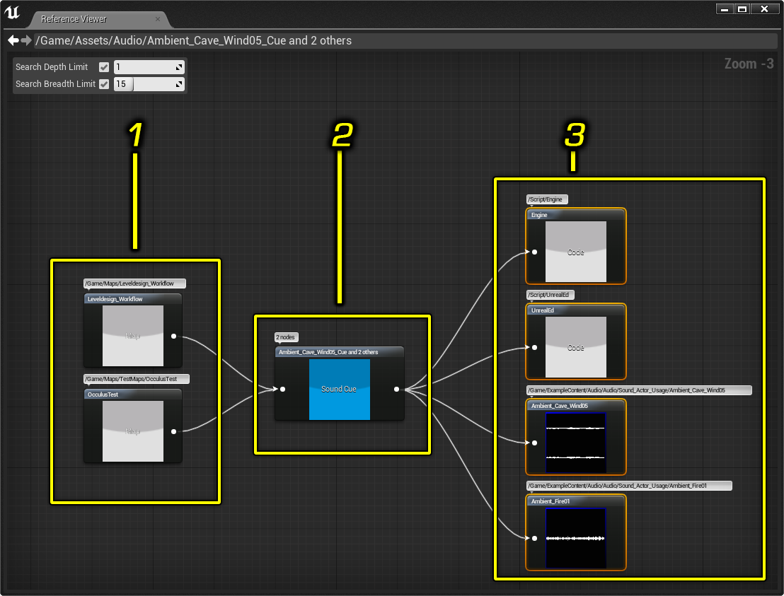
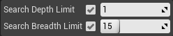
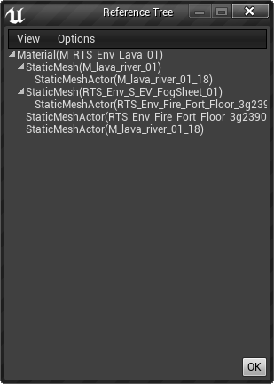

# 查找资产引用

> 路径：虚幻引擎5.7文档 / 理解基础知识 / 资产和内容包 / 查找资产引用

> 原始页面：https://dev.epicgames.com/documentation/unreal-engine/reference-viewer-in-unreal-engine

*引用查看器（Reference Viewer）* 显示资产图表，这些资产与 **内容浏览器** 中当前选中的资产存在引用或被引用的关系。

要使"引用查看器（Reference Viewer）"显示，在 **内容浏览器** 中 **右键单击** 选中的一个或多个资产，然后在显示的快捷菜单上单击 **引用查看器（Reference Viewer）**。

1. 引用选中的资产的其他资产。
2. 选中的资产。
3. 被选中的资产引用的其他资产。

> [!TIP]
> 你还可以通过另一种方法访问"引用查看器（Reference Viewer）"—— **右键单击** **资产树** 中的文件夹。引用查看器（Reference Viewer）将显示文件夹中所有资产的引用图表。

有关 **内容浏览器** 的更多信息，请参阅 **[内容浏览器](../../content-browser/index.md)**。

## 搜索选项

在"引用查看器（Reference Viewer）"的左上角，你可以看到虚幻编辑器用于构建图表的两个搜索相关选项。

| 项目 | 说明 |
| --- | --- |
| **搜索深度限制（Search Depth Limit）** | 引擎搜索引用的深度。例如，如果值为2，则图表不仅会显示与选中的资产相关的资产，还会显示与那些相关的资产相关的资产。 |
| **搜索广度限制（Search Breadth Limit）** | 给定列中列出的引用（引用或被引用）的数量。例如，如果某个资产引用了20个资产，但是由于"搜索广度限制（Search Breadth Limit）"设置为10，该列中仅显示10个资产。 |

## 快捷菜单选项

要查看图表中某个资产的选项，**右键单击** 该资产。此时将会显示一个快捷菜单。

| 项目 | 说明 |
| --- | --- |
| **在内容浏览器中查找此项（Find In Content Browser）** | 在 **内容浏览器** 中查找选中的资产。 |
| **重新居中图表（Re-Center Graph）** | 围绕选中的资产重新创建图表（包含它引用的资产以及被它引用的资产）。 |
| **列出被引用的对象（List Referenced Objects）** | 显示被选中的资产引用的资产的列表。 |
| **列出引用的对象（List Objects That Reference）** | 显示引用选中的资产的资产的列表。 |
| **使用引用的资产创建集合（Make Collection With Referenced Assets）** | 使用引用选中的资产的资产及被选中的资产引用的资产创建集合。 |
| **显示引用树（Show Reference Tree）** | 显示选中的资产的引用树。请注意，这可能要花费一些时间，具体视游戏复杂度而定。有关引用树的更多信息，请参阅 。 |

## 引用树工具

引用树允许你列出某个资产的引用链（Reference Chains）。引用链是一张引用列表，列表中的每个对象都引用下方的那个对象。引用树工具允许你快速了解对象是如何被引用的。

在下图中，可以看到引用树的根节点是一张贴图（T_Ivy_01_D）。树的根节点始终是那个被检查的对象。可以看到，贴图被4个静态网格体Actor所引用。

## 使用引用树

你可以通过"引用查看器"（Reference Viewer）来打开引用树（Reference Tree）——一个图形化的资产依赖关系显示工具。只要简单地在 **内容浏览器** 中 **右击** 某个资产，并选择 **引用查看器（Reference Viewer）** 即可。

在引用查看器中，如果在某个资产上 **点击右键** 显示菜单后，可以选择 **显示引用树（Show Reference Tree）**，这样便能打开该资产的引用树窗口。

更多关于"引用查看器"（Reference Viewer）的信息，点击查看 **[查找资产引用](index.md)** 页面。

> [!NOTE]
> 首次打开引用树（Reference Tree）窗口可能会需要花费几秒钟，这取决于游戏内容的复杂度以及由多少物件（object）。引用树确实很有用，不过在引用查看器（Reference Viewer）中也能找到有用的信息，并且通常来说引用查看器开启速度远快于引用树窗口。

## 选项

### 查看菜单

- 重新构建树（Rebuild Tree）：

  - 这将会重新构建树并检查所有加载的对象。 这个过程可能会花一些时间，但是如果正在被检查的资产的引用已经发生了变化时这是有用的。
- 展开所有（Expand All）：

  - 展开树中的所有节点。
- 合并所有（Collapse All）：

  - 合并树中的所有节点。

### 选项菜单

- 显示脚本引用（Show Script Objects）

  默认情况下，不显示脚本中对资产的引用。为了显示它们，你可以选中这个选项。

### 情景菜单

如果在引用树窗口中 **右键点击** 一项内容，可以看到这个菜单以及可用选项：

- 打开编辑器（Open Editor）：

  打开针对你点击的资产的特定编辑器。 比如，当在骨架网格物体上实施这个操作时将会显示动画集查看器。
- 在内容浏览器中显示（Show in Content Browser）：

  同步内容浏览器到选中的资产。

> [!TIP]
> 在引用树中 **双击** 那个资产也会在 **内容浏览器（Content Browser）** 中定位并选中。

## 注意

- 引用树工具仅显示可浏览的对象或Actor。
- 由于树的性能原因，在树的每个叶子节点中仅显示前 100 项。如果叶子节点所具有的项多于 100，那么将会添加一个节点说明那个叶子节点共具有多少项。
- 目前这个工具也还在开发中（功能可能还不完整并还会调整）。
