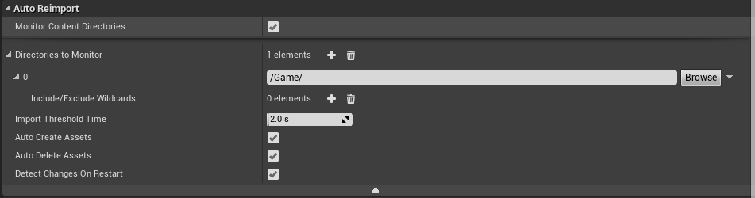

# 自动重新导入资产

> 路径：虚幻引擎5.7文档 / 理解基础知识 / 资产和内容包 / 自动重新导入资产

> 原始页面：https://dev.epicgames.com/documentation/unreal-engine/reimporting-assets-automatically-in-unreal-engine

借助虚幻引擎4的自动重新导入功能，当你在外部程序中工作时，所有改动内容可以自动同步到虚幻引擎4中，无需用户执行任何处理。当你需要迭代开发资产并立即查看效果时，该功能能大幅提高你的开发效率。

UE4会对一组文件夹中的内容进行监视（该目录由用户定义），并且检测该源内容是否发生变化。当某个源文件发生改动，并且该文件被用于导入资产到游戏中，则虚幻4会自动将改动后的文件重新导入。

## 设置

自动重新导入设置位于 **编辑器偏好设置（Editor Preferences）> 加载与保存（Loading & Saving）> 自动重新导入（Auto Reimport）** 之下：

**监视内容目录（Monitor Content Directories）** 复选框可用于启用和禁用此功能。

使用默认设置时，建议你将所有源内容文件与其相关资产一起放在Content文件夹中。对于任何其他工作流程而言，需要定制配置。

| 属性 | 说明 |
| --- | --- |
| **要监视的目录（Directories to Monitor）** | 此设置定义虚幻引擎4将在哪些文件夹中监视更改。这些文件夹可以是虚拟路径（例如/Game/Textures）或绝对路径（C:/Game/SourceArt/）。只有位于这些文件夹内的源内容文件才能自动重新导入。 |
| **包括/排除通配符（Include/Exclude Wildcards）** | 默认情况下，虚幻引擎4将检测对任何文件进行的任何更改，并在必要时重新导入这些文件。有时，最好将此操作限制为仅针对特定文件类型进行，或者排除特定的子文件夹或扩展名。必须添加多个通配符作为新条目。下面是一些配置示例： 要仅包括fbx文件，请添加新*include*通配符并使用值*.fbx 要对fbx、png和psd文件执行操作，请添加3个新*include*通配符并分别使用值*.fbx、*.png和*.psd 要忽略对某个子文件夹中任何源文件进行的更改，请添加*exclude*通配符并使用值Subfolder/* |
| **导入阈值时间（Import Threshold Time）** | 指定检测到更改后开始处理该更改之前等待的时间量（秒）。 |
| **自动创建资产（Auto Create Assets）** | 确定对于新创建的文件，是否应自动为其创建资产。为了让此选项工作，你必须监视虚拟路径（例如/Game/）或者已指定安装点（用于确定创建新文件的*位置*） |
| **自动删除资产（Auto Delete Assets）** | 确定删除源内容文件时，是否还应删除UE4中的相关资产。仅当源文件与资产之间存在一对一的映射时，才应执行此删除。 |
| **重新启动时检测更改（Detect Changes on Restart）** | 虚幻引擎4能够检测UE4关闭期间对文件进行的更改。重新打开UE4时，将对所有这些更改进行处理。在启用了将会更新源内容的源内容控制功能的情况下，你可能不希望使用这项特定功能。在此环境中，建议你关闭*重新启动时检测更改（Detect Changes on Restart）*，以避免获取最新内容后执行冗余重新导入的可能性。 |
