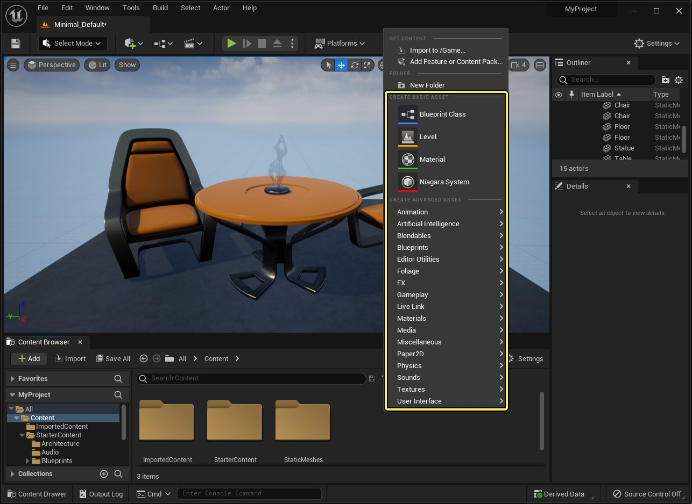
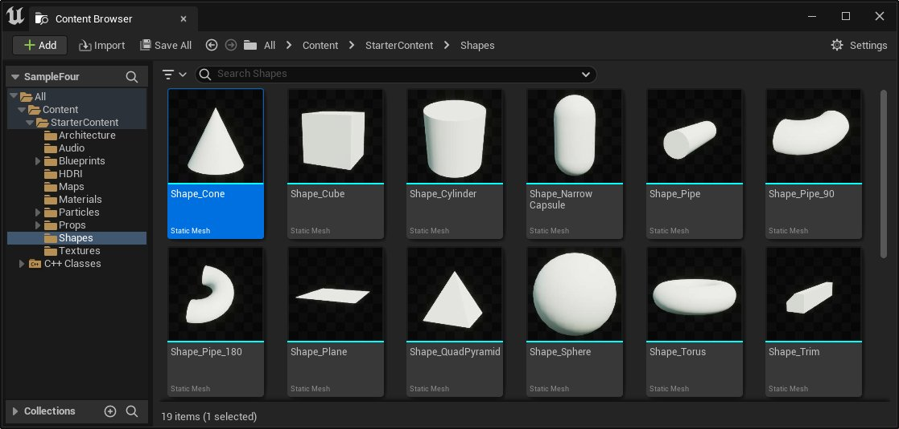
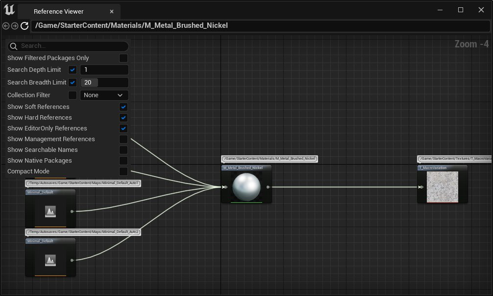
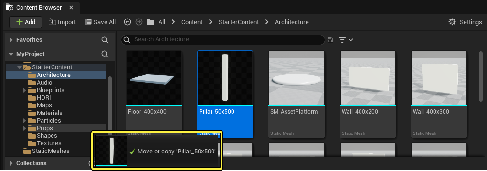
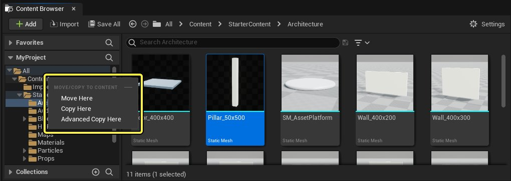
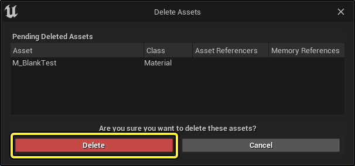
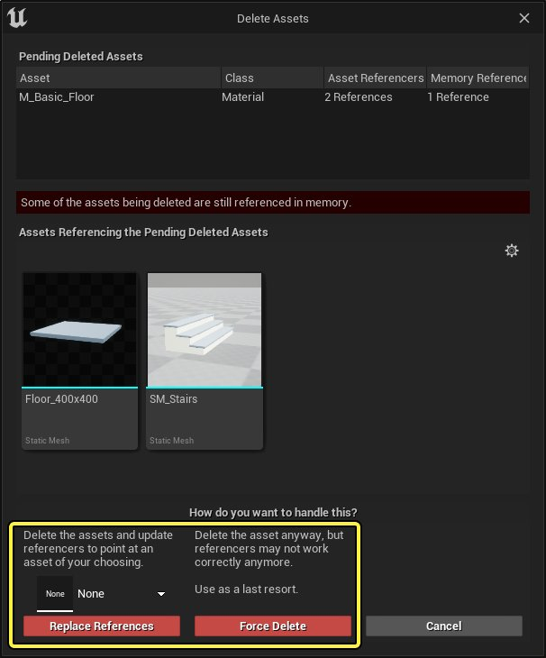

# 使用资产

> 路径：虚幻引擎5.7文档 / 理解基础知识 / 资产和内容包 / 使用资产

> 原始页面：https://dev.epicgames.com/documentation/unreal-engine/working-with-assets-in-unreal-engine

在 **虚幻引擎** 中，你可以直接从 **内容浏览器** 创建、删除和管理资产。本页面描述了常见的资产工作流程，并解释了什么是资产引用，以及如何在编辑器中处理资产的移动或删除。此外，你将探索如何将某些类型的资产从虚幻引擎导出为可导入其他应用程序的格式。

## 创建资产

要创建新资产，请在 **内容浏览器** 的空白区域内右键单击。然后，从出现的上下文菜单中，选择要创建的资产。这将创建指定类型的空白资产。对于某些资产，例如蓝图，你可以选择其他选项，如蓝图的父类。



此菜单中的选项可能会根据你的虚幻引擎版本以及你为项目启用的插件而有所不同。点击图片以查看大图。

与[导入资产](../importing-assets-directly-into/index.md)（即，将你在外部应用程序中制作的内容带入虚幻引擎）不同，此方法会创建一个空白资产，你可以在其中填充内容。

## 资产路径



来自初学者内容包的形状资产显示在内容浏览器中。点击查看大图。

虚幻引擎中的资产由其 **路径** 定位和引用。在内容浏览器中查看资产时，你查看的其实是一个 **包（Package）**。在上图的示例中，`Shape_Cone` 是一个路径为 `/Game/StarterContent/Shapes/Shape_Cone` 的包，其中仅包含一个资产，该资产的路径为 `/Game/StarterContent/Shapes/Shape_Cone.Shape_Cone`。虚幻引擎通常遵循每个包一个资产的规则，只有两个例外：

- 每个蓝图包含将两个资产。

  - 例如，如果你有一个蓝图包，其路径为Fh

    /Game/BP_MyBlueprint

    ，则此包将包含两个资产：

    - /Game/BP_MyBlueprint.BP_MyBlueprint
    - /Game/BP_MyBlueprint.BP_MyBlueprint_C

      .
- 每个HLOD包可以包含多个资产。

  - 例如，你有一个HLOD包，其路径为

    /Game/HLOD/MyHLOD

    。则此包可能包含：

    - /Game/HLOD/MyHLOD.HLOD_StaticMesh
    - /Game/HLOD/MyHLOD.HLOD_Material
    - /Game/HLOD/MyHLOD.HLOD_TextureBaseColor
    - /Game/HLOD/MyHLOD.HLOD_TextureMRS
    - /Game/HLOD/MyHLOD.HLOD_TextureNormal

另一个值得注意的点是，虽然 `/Game/StarterContent/Shapes/Shape_Cone` 被视为一个包，但 `/Game/StarterContent/Shapes` 和 `/Game/StarterContent` 不会被视为包。包和资产都被视为 **对象**。对象的 **外围（Outer）** 是其所属的对象。例如，一个资产的外围是包含该资产的包。对象的 **最外围（outermost）** 是对象所属的包。资产通常由其 **对象路径名** 指定。再举一个例子，**Shape_Cube** 资产的对象路径名是 /Game/StarterContent/Shapes/Shape_Cube.Shape_Cube`。包中位于最上层的资产也可以由包的对象路径名指定，因此你可以使用`/Game/StarterContent/Shapes/Shape_Cube`指定`Shape_Cube`，因为系统假定资产与其所属包的对象路径的叶节点使用相同的名称。

## 资产引用

如果一个资产以某种方式使用另一个资产，我们说资产相互 **引用**（或具有引用）。例如，如果立方体Actor使用了一个颜色材质，则该Actor引用该材质。这就是为什么在移动或重命名资产时要确保更新引用以及在删除资产之前删除对资产的任何引用很重要的原因。

### 查看资产引用

要查看资产的引用，请在 **内容浏览器** 中右键单击该资产。然后，从出现的上下文菜单中，选择 **引用查看界面**。将打开一个新窗口，显示资产引用的视觉效果。



材质资产的引用查看界面窗口。点击图片以查看大图。

> [!TIP]
> 有关引用查看界面的更多信息，请参阅[查找资产引用](../reference-viewer/index.md)页面。

### 复制资产引用

要将一个或多个资产的引用复制到剪贴板，请在 **内容浏览器** 中选择一个或多个资产。然后，右键单击你的选择，然后从出现的上下文菜单中选择 **复制引用（Copy Reference）**。

引用包含资产类型和 `.uasset` 文件的路径。类似于以下示例所示：

```
		Material'/Game/StarterContent/Materials/M_Metal_Brushed_Nickel.M_Metal_Brushed_Nickel'		Material'/Game/StarterContent/Materials/M_Metal_Burnished_Steel.M_Metal_Burnished_Steel'		Material'/Game/StarterContent/Materials/M_Metal_Chrome.M_Metal_Chrome'
```

如果你需要将资产的引用粘贴到文本字段中，或者生成资产的外部列表，这将非常有用。

### 替换引用工具

**替换引用工具** 提供了一种将多个资产组合为一个资产的方法。

有关此工具的更多信息，请参阅[替换引用工具](../consolidating-assets/index.md)页面。

## 管理资产

要执行常见的资产操作，请右键单击资产，并从出现的上下文菜单中选择所需的操作。这些操作包括：

| **操作** | **描述** |
| --- | --- |
| **编辑（Edit）** | 在其编辑器中打开选定的资产。例如，对蓝图执行此操作会在蓝图编辑器中将其打开。 |
| **重命名（Rename）** | 使资产的名称可编辑。要重命名资产，请输入新名称并按Enter键。重命名资产后，虚幻引擎会将对该资产的所有引用更新为其新的名称。 |
| **复制（Duplicate）** | 在当前位置创建选定资产的副本。要更改副本的位置，请将其拖到另一个文件夹中。 |
| **保存（Save）** | 保存选定的资产。 |
| **在文件夹视图中显示（Show in Folder View）** | 在文件夹树中高亮显示资产的父文件夹。这对查找属于集合的资产的实际位置很有用。 |
| **在资源管理器中显示（Show in Explorer）（Windows）/在Finder中显示（ Show in Finder） (Mac)** | 从资产在磁盘上的位置打开一个Windows资产管理器或Finder的实例。这是 `.uasset` 文件的位置。 切勿直接在磁盘上移动、复制或删除资产，这可能会破坏项目中的功能并导致数据损坏或丢失。应始终通过虚幻编辑器管理 `.uasset` 文件。 如果你要将资产从一个项目移动到另一个项目，请参阅[迁移资产](../migrating-assets/index.md)页面了解如何执行此操作。 |

## 移动和复制资产

你可以通过 **内容浏览器** 移动或复制项目中的资产和文件夹。

移动或复制资产的步骤是：

1. 单击要移动的资产，然后将其拖到内容浏览器或文件夹树中的另一个文件夹。当你拖动资产时，将出现一个弹出窗口跟随你的鼠标光标，指示要移动的资产。

   
2. 当你松开鼠标按钮时，将出现一个菜单。

   

   该菜单确认文件夹名称并包含三个选项的列表：

| **选项** | **描述** |
| --- | --- |
| **移到这里（Move Here）** | 将资产移动到新位置。 |
| **复制到这里（Copy Here）** | 在新位置创建资产的副本，并将原始资产保留在其当前位置。 |
| **高级复制到这里（Advanced Copy Here）** | 在新位置创建资产的副本，并尝试自动解析该资产的所有引用和依赖项。此选项包括一个额外的保存对话框，你需要在其中确认是否要保存你复制的资产。 |

## 删除资产

要删除资产，你可以：

- 在 **内容浏览器** 中右键单击该资产。然后，从出现的上下文菜单中选择 **删除（Delete）**。
- 在 **内容浏览器**、**世界大纲视图** 或 **关卡视口** 中选择资产，然后按键盘上的 **Delete** 键。

此操作将弹出一个确认窗口。如果你的资产未被 **引用**（也就是说，该资产并未在你的虚幻项目中的任何地方使用），请单击 **删除（Delete）** 按钮进行确认：



如果你的资产在某处被引用，确认窗口将通知你并询问进一步的操作。可能发生两种类型的引用：

- 如果该资产被 **其他资产** 引用，则表示你的项目中的另一个资产正在使用该资产。例如，如果你尝试删除某个材质，而静态网格体使用该材质，则会看到此警告。
- 如果资产 **在内存中** 被引用，该资产可能在单独的编辑器窗口中打开，或者可能最近被使用过且仍缓存在内存中。

  > [!TIP]
  > 如果你看到资产引用为零，但至少有一个内存引用，请关闭所有其他编辑器窗口并重试。如果不起作用，请保存你的工作并重新启动虚幻引擎。

在这种情况下，你有两种选择：



- 如果你选择 **替换引用（Replace References）**，可选择另一个资产来替换该资产，无论其在项目中的引用位置如何。例如，如果静态网格体使用某个材质，并且你想删除该材质，你可以选择让静态网格体在删除后将使用的不同材质。
- 如果你选择 **强制删除（Force Delete）**，资产将被删除，而 **不会** 执行任何其他更正。

  > [!WARNING]
  > 这可能会导致数据损坏和数据丢失。至少，引用已删除资产的资产将无法正常工作，但这可能会破坏你的整个项目。

## 导出资产

项目中的资产以 `.uasset` 文件的形式存储在磁盘上，这是一种特定于虚幻引擎的文件格式。**Exporting（导出）** 资产可将其以其他应用程序可以读取的格式保存到磁盘。

要从项目中导出资产，请在 **内容浏览器** 中右键单击该资产。然后，从出现的上下文菜单中，选择 **资产操作（Asset Actions）> 导出（Export）**。这将打开一个窗口，你可以在其中命名导出的资产并选择保存位置。

可用于导出的文件类型将根据你选择的资产类型而有所不同。例如，对于静态网格体资产，你将看到导出选项为FBX、OBJ、COPY或T3D文件。

并非所有资产都可以导出。
