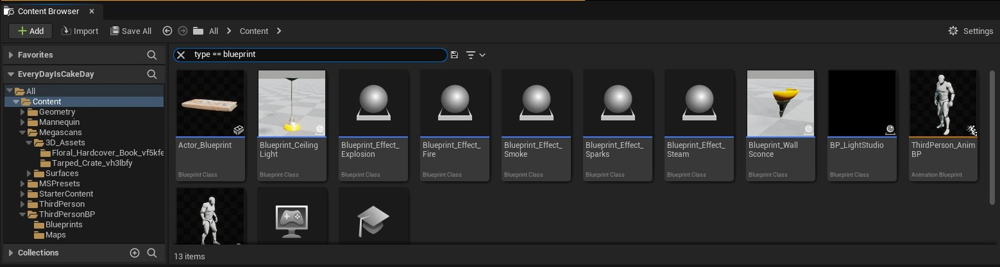
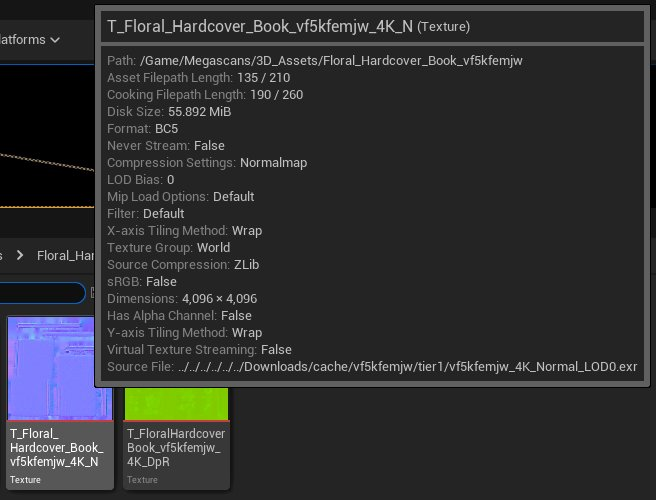

# 高级搜索语法

> 路径：虚幻引擎5.7文档 / 理解基础知识 / 内容浏览器 / 高级搜索语法

> 原始页面：https://dev.epicgames.com/documentation/unreal-engine/advanced-search-syntax-in-unreal-engine

在[内容浏览器](../index.md)中可以使用高级搜索运算符来查找内容。这些运算符可以进行更细致的搜索，让你更快地找到需要的内容。你还可以用它来搜索资产元数据的"键-值"对，并访问特殊键值。



在内容浏览器的 搜索（Search） 框中使用高级搜索运算符的示例。

下表显示了所有可用的运算符：

| 运算符（类型） | 语法 | 描述 | 示例 |
| --- | --- | --- | --- |
| **Equal（二元运算）** | `=` `==` `:` | 判断指定键的返回值是否等于指定值。 | `Name="Blast"` `Name==Blast` `Name:Bla...` |
| **NotEqual（二元运算）** | `!=` `!:` | 判断指定键的返回值是否不等于指定值。 | `Name!=Blast` `Name!:"Blast"` |
| **Less（二元运算）** | `<` | 判断指定键返回的值是否小于指定值。该运算符仅支持数字类型的值。 | `Triangles<92` |
| **LessOrEqual（二元运算）** | `<=` `<:` | 判断指定键返回的值是否小于等于指定值。该运算符仅支持数字类型的值。 | `Triangles<=92` `Triangles<:92` |
| **Greater（二元运算）** | `>` | 判断指定键返回的值是否大于指定值。该运算符仅支持数字类型的值。 | `Triangles>92` |
| **GreaterOrEqual（二元运算）** | `>=` `>:` | 判断指定键返回的值是否大于等于指定值。该运算符仅支持数字值。 | `Triangles>=92` `Triangles>:92` |
| **Or（二元运算）** | `OR` `\|\|` `\|` | 测试两个值，任意一个为 `true` 即返回 `true`。 | `Blast OR Type:Blueprint` `!Blast \|\| Path:Testing` `Name:"Blast" \| Path:Testing...` |
| **And（二元运算）** | `AND` `&&` `&` | 测试两个值，两个值均为 `true` 则返回 `true`。 | `Blast AND Type:Blueprint` `!Blast \|\| Path:Testing` `Name:"Blast" \| Path:Testing...` |
| **Not（一元运算）** | `NOT` `!` | 测试运算符后面的值，返回反转结果。 | `NOT Blast` `! "Blast"` |
| **TextCmpInvert（一元运算）** | `-` | 修改文本值，以便返回其所参与的运算的反转结果。 | `-Blast` `-"Blast"` |
| **TextCmpExact（一元运算）** | `+` | 修改文本值，以便执行"精确"文本比较。 | `+Blast` `+"Blast"` |
| **TextCmpAnchor（一元运算）** | `...` | 修改文本值，以便执行"结尾"文本比较。 | `...ast` `..."ast"` |
| **TextCmpAnchor（后一元运算）** | `...` | 修改文本值，以便执行"开头"文本比较。 | `Bla...` `"Bla"...` |

## 特殊键

大多数可用于搜索的键来自于从资产注册表提取的资产元数据（Asset metadata）。不过，有几个特殊键适用于所有资产类型。这些特殊键仅支持 `Equal` 或 `NotEqual` 比较运算符。

| 键 | 别名 | 描述 |
| --- | --- | --- |
| **Name** | N/A | 资产名称。 |
| **Path** | N/A | 资产路径。 |
| **Class** | Type | 资产类。 |
| **ParentClass** | N/A | 资产的父类。 |
| **Collection** | Tag | 包含资产的任何集合的名称。 |

## 字符串

字符串可以带引号（单引号或双引号），也可以不带引号。带引号的字符串可以包含嵌套引号；但是，必须使用反斜杠（\）表示嵌套引号结束。使用无引号和带引号字符串的主要差异在于带引号字符串允许在搜索词中使用空格和特殊字符。默认情况下，它们将执行部分字符串匹配，除非使用了 `TextCmpExact` 或 `TextCmpAnchor` 运算符来修改此行为。

以下是使用单引号和双引号以及反斜杠的部分示例：

```
	"Foo\"bar"  ->  Foo"bar	'Foo\'bar'  ->  Foo'bar	"Foo\'bar"  ->  Foo'bar	'Foo\"bar'  ->  Foo"bar	"Foo\\bar"  ->  Foo\bar	'Foo\\bar'  ->  Foo\bar  
```

> [!NOTE]
> 必须使用反斜杠来转义对另一个反斜杠的使用。

## 资产元数据

将鼠标悬停于内容浏览器中的资产名称上将显示其元数据。



纹理资产元数据示例。

不同资产可能会列出特定于该类型的不同元数据，因此静态网格体不同于骨架网格体。

你可以使用任意一种元数据来搜索带有该特征的资产。搜索时应使用以下语法：

**[元数据名称] [运算符] [字符串或数字值]**

例如：

`Triangles>=10500`

`Type==Skeletal`

`UVChannels>2`

`CollisionPrims!=0`

> [!NOTE]
> 元数据不区分大小写，但字符中间不需要空格。例如，要搜索变形目标（Morph Target），应写成 `MorphTarget` 。

### 基本搜索示例

基本搜索以元数据对象为输入，并使用运算符来测试字符串或值。

例如：

- 搜索包含超过1500个三角形的任何资产，应使用 `Triangles>1500` 。
- 要搜索所有的蓝图资产，应使用 `Type==Blueprint`。

### 高级搜索示例

通过使用 `AND`、`OR` 和 `NOT` 运算符，你可以同时测试多个搜索运算。例如，搜索任何使用半透明材质且该材质使用默认光照着色模型的资产，应使用以下句法：

```
 	BlendMode==Translucent AND ShadingModel==DefaultLit 
```

通过使用 `AND` 运算符，两个测试混合模式和着色模型的运算都必须求值为True才能显示结果。

当你使用 `OR` 运算符时，任一运算单独求值为True即可显示结果。比如，并不是每个使用半透明混合模式的材质都使用默认光照。对于复杂的高级搜索，同类型运算符必须始终合并起来。如果开始使用不同的运算符类型，括号可以消除不明确性。例如，我们可以执行两个搜索，然后求值来显示结果。第一个运算对半透明和默认光照的任何材质求值：

```
 	BlendMode==Translucent AND ShadingModel==DefaultLit 
```

第二个运算会对所有属于延迟贴花类型并且不使用场景颜色的材质进行求值：

```
 	MaterialDomain==DeferredDecal AND HasSceneColor==False 
```

可以使用括号对上述两个搜索的结果求值。

```
 	(BlendMode==Translucent AND ShadingModel==DefaultLit) OR (MaterialDomain==DeferredDecal AND HasSceneColor==False) 
```

通过在两个括号括起的表达式之间使用 `OR` 运算符，结果将单独对每个括号中的表达式求值，然后显示任意一个为 `True` 的结果。如果使用 `AND` 运算符，则所有四个运算都必须返回 `True` 才会显示结果。
