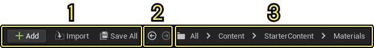
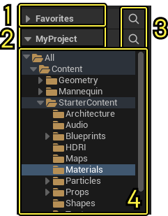
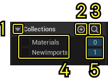
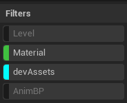
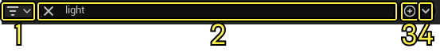
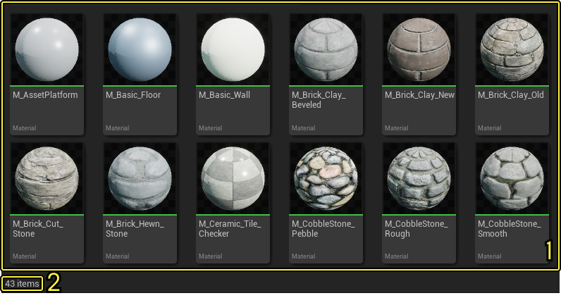
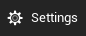

# 内容浏览器界面

> 路径：虚幻引擎5.7文档 / 理解基础知识 / 内容浏览器 / 内容浏览器界面

> 原始页面：https://dev.epicgames.com/documentation/unreal-engine/content-browser-interface-in-unreal-engine

**内容浏览器（Content Browser）** 分为以下几个区域：

| **编号** | **名称** |
| --- | --- |
| 1 | 导航栏（Navigation Bar） |
| 2 | 源面板（Sources Panel） |
| 3 | 集合（Collections） |
| 4 | 筛选器（Filters） |
| 5 | 搜索栏（Search Bar） |
| 6 | 资产视图（Asset View） |
| 7 | 设置按钮（Settings Button） |

## 导航栏

**导航栏（Navigation Bar）** 包含用于处理资产、在文件夹路径之间来回浏览的功能按钮，并显示当前打开的文件夹浏览记录路径。

| **编号** | **名称** | **说明** |
| --- | --- | --- |
| 1 | **资产控制按钮（Asset Control Buttons）** | 这些按钮具有以下功能： **添加（Add）** ：点击此按钮，可以将现有资产添加到你的项目或创建新资产。 **导入（Import）** ：点击此按钮，可以打开文件浏览器，并选择一个或多个资产，添加到你的项目中。 **保存全部（Save All）** ：点击此按钮，保存未保存更改的全部资产。 要了解有关将资产导入项目的更多信息，请参阅[直接导入资产](../../assets-and-content-packs/importing-assets-directly-into/index.md)页面。 |
| 2 | **历史记录后退和前进按钮（History Back and Forward Buttons）** | 这些按钮的功能类似于Web浏览器中的后退（Back）和前进（Forward）按钮。使用它们在最近的文件路径之间来回浏览。 |
| 3 | **浏览记录路径（Breadcrumb Trail Path）** | 此分段显示当前文件夹路径。点击任何文件夹，快速找到它。 |

## 源面板

**源（Sources）** 面板包含虚幻引擎项目中所有文件夹的列表。

| **编号** | **名称** | **说明** |
| --- | --- | --- |
| 1 | **收藏夹面板（Favorites Panel）** | 此面板包含对你已添加到收藏夹中的资产的引用。 |
| 2 | **项目名称（Project Name）** | 这是当前打开项目的名称。点击项目名称旁边的箭头，可以折叠或展开文件夹列表。 |
| 3 | **搜索按钮（Search Buttons）** | 点击此按钮可以打开搜索（Search）栏，使用该栏通过输入搜索条件，你可以缩小按钮关联面板中可用文件夹的列表范围。文件夹将被实时过滤，以将名字缩小至仅包括你所输入字符名称的文件夹。 |
| 4 | **资产树（Asset Tree）** | 此层级列表显示了你的虚幻引擎项目中的所有文件夹。它的行为与Windows浏览器中的文件夹树或macOS中的访达（Finder）相同。要展开或折叠文件夹，请点击其名称旁边的箭头。 在搜索文本前加上连字符（-），你可以从资产树中排除文件夹。例如，在搜索框中输入-anim会隐藏名称包含该字符串的任何文件夹，例如Animation或Animator。 |

> [!TIP]
> 有关源（Sources）面板的更多信息，请参阅[源面板参考](../sources-panel-reference/index.md)页面。

## 集合

**集合（Collections）** 面板显示你有权访问的所有集合（Collections）的列表。

| **编号** | **名称** | **说明** |
| --- | --- | --- |
| 1 | **折叠/展开按钮（Collapse / Expand Button）** | 点击此按钮可以折叠或展开集合（Collections）区域。 |
| 2 | **添加集合按钮（Add Collections Button）** | 点击此按钮可以创建新集合。 |
| 3 | **搜索按钮（Search Buttons）** | 点击此按钮可打开搜索（Search）栏，使用该栏输入搜索条件，你可以缩小可用集合列表的范围。集合将被实时过滤，以将名字缩小至仅包括你所输入字符名称的集合。 |
| 4 | **集合列表（Collections List）** | 此项目中所有集合按字母顺序排列的列表。 |
| 5 | **资产计数（Asset Count）** | 显示每个集合中的资产数量。 |

> [!TIP]
> 有关集合及其用法的更多信息，请参阅[筛选器和集合](../filters-and-collections/index.md)页面。

## 筛选器栏

**筛选器（Search and Filters）** 栏提供了广泛的功能，可根据资产的名称和类型快速找到资产。**资产视图（Asset View）** 显示你在 **源（Sources）** 面板中选择的文件夹的内容，根据你在此处输入的参数动态更新。

> [!TIP]
> 关于筛选设置的更多信息，请参考[筛选和集合](../filters-and-collections/index.md)页面。

## 搜索栏

**搜索** 栏提供了许多功能，允许你根据名称和类型定位资产。**资产查看器（Asset View）** 会根据你在 **源** 面板中选中的目录来显示内容，并根据你输入如的参数动态更新。

| **编号** | **名称** | **说明** |
| --- | --- | --- |
| 1 | **筛选器按钮（Filters Button）** | 点击此按钮，可以打开筛选器（Filters）菜单，你可以使用该菜单自定义资产视图（Asset View）中显示的资产种类。 有关使用筛选器的更多信息，请参阅[筛选器和集合](../filters-and-collections/index.md)页面。 |
| 2 | **搜索栏（Search Bar）** | 使用搜索栏按名称搜索资产。资产将被实时过滤，以将名字缩小至仅包括你所输入字符名称的资产。 |
| 3 | **保存搜索按钮（Save Search Button）** | 点击此按钮可以将你当前的搜索保存为新集合。如果你要在以后再次运行相同的搜索，这将非常有用。 |
| 4 | **上一个搜索按钮（Previous Searches Button）** | Click this button to see a list of previous searches. |

## 资产视图

**资产视图（Asset View）** 显示当前选定文件夹或集合中的所有可用资产。

在资产视图（Asset View）中，你可以：

- 将资产直接拖放到关卡中。
- 从你在资产视图（Asset View）中右键点击时打开的 **上下文菜单** ，创建和导入资产。
- 创建新文件夹。

| **编号** | **名称** | **说明** |
| --- | --- | --- |
| 1 | **视图区域（View Area）** | 在应用所有筛选器和搜索条件后，这将显示当前选定文件夹或集合中的所有资产。 |
| 2 | **资产计数（Asset Count）** | 显示应用所有筛选器和搜索后显示资产的当前数量。 |

## 设置按钮

此按钮可以打开 **设置（Settings）** 菜单，你可以在其中调整内容浏览器的以下设置：

- 视图类型（资产的显示方式：图块、列表或列）。
- 搜索筛选器。
- 要包含或排除的内容。
- 搜索选项。

有关更多信息，请参阅[内容浏览器设置参考](../content-browser-settings/index.md)页面。
