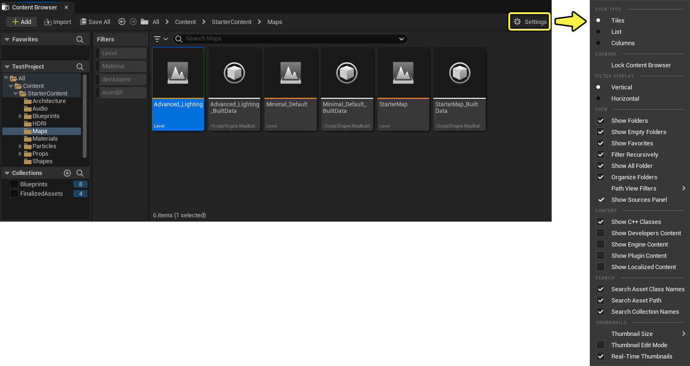
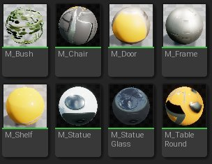
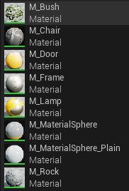
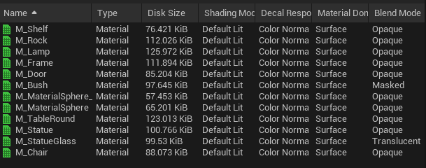

# 内容浏览器设置参考

> 路径：虚幻引擎5.7文档 / 理解基础知识 / 内容浏览器 / 内容浏览器设置参考

> 原始页面：https://dev.epicgames.com/documentation/unreal-engine/content-browser-settings-in-unreal-engine

**设置（Settings）** 按钮位于 **内容浏览器（Content Browser）** 的右上角。点击该按钮会打开一个菜单，你可以在其中调整内容浏览器当前实例的各种设置，例如：

- 视图类型（资产的显示方式：图块、列表或列）。
- 搜索筛选器。
- 要包含或排除的内容。
- 搜索选项。

## 视图类型

这些设置会影响资产视图中资产的显示方式。你可以选择以下某个视图类型：

### 图块

**图块（Tiles）** 视图将所有资产布局为图块网格，如下所示：

### 列表

**列表（List）** 视图将所有资产布局为带有名称和文件类型的缩略图列表，如下所示：

### 列

**列（Columns）** 视图使用属性的电子表格式排列来布局所有资产，如下所示：

> [!TIP]
> 显示的细节会根据资产类型而变化。例如，蓝图资产显示其类型和父类，静态网格体显示其顶点和三角形数量。

你可以对每个列执行以下操作：

- 左键点击列名，按列值的升序或降序对资产排序。
- 将鼠标悬停在列名上，然后点击垂直省略号菜单并选择 **隐藏列（Hide Column）** ，以隐藏该列。
- 在 **设置（Settings）** 菜单中选择 **切换列（Toggle Columns）** 选项并启用你想显示的列，以将该列取消隐藏。

你还可以将所有资产细节导出为 `.csv` 文件。从 **设置（Settings）** 菜单，选择 **导出为CSV（Export to CSV）** 选项。请注意，仅当资产查看者当前使用的是列视图时，才会显示此选项。

## 锁定

**锁定内容浏览器（Lock Content Browser）** 选项是可切换的设置。如果启用，此内容浏览器实例将忽略"在内容浏览器中查找"的请求。

## 视图

使用 **视图（View）** 设置切换内容浏览器中显示的内容，以及筛选行为。

| **选项** | **说明** |
| --- | --- |
| **显示文件夹（Show Folders）** | 禁用此选项以使内容浏览器在单个视图中显示项目中的所有资产。 禁用 **显示空文件夹（Show Empty Folders）** 子选项以使内容浏览器仅显示至少包含一个资产的文件夹。 |
| **显示空文件夹（Show Empty Folders）** | 禁用此选项以使内容浏览器隐藏空文件夹。 |
| **显示收藏夹（Show Favorites）** | 启用此选项会在"源"面板顶部添加新的 **收藏夹（Favorites）** 类别。此类别显示你是否已将至少一个文件夹或资产添加到收藏夹。 要将文件夹或资产添加到收藏夹，请右键点击它，然后从上下文菜单选择 **添加到收藏夹（Add To Favorites）** 。 |
| **以递归方式筛选（Filter Recursively）** | 切换此选项以控制资产视图筛选器是否应该以递归方式应用。 |
| **显示所有文件夹（Show All Folder）** | 切换 `All`（所有）文件夹在"源"面板文件夹层级中的可视性。如果禁用，文件夹层级将上移一个级别。 |
| **整理文件夹（Organize Folders）** | 启用此选项以在内容浏览器的 **资产（Asset）** 视图中自动整理文件夹。 |
| **路径视图筛选器（Path View Filters）** | 切换会影响内容浏览器中的 **路径视图（Path View）** 的选项。在处理使用来自多个源的内容的大规模项目时，此选项很有用。 |
| **显示源面板（Show Sources Panel）** | 切换此选项以显示或隐藏"源"面板。 |

### 内容

切换以下选项以控制特定类型的资产是否显示在资产视图中。

| **选项** | **说明** |
| --- | --- |
| **显示C++类（Show C++ Classes）** | 如果启用，将在"源"面板中显示 `Engine C++ Classes` 文件夹。此文件夹包含虚幻引擎中所有C++类的可浏览层级。 |
| **显示开发人员内容（Show Developers Content）** | 如果启用，将在"源"面板中显示 `Developers` 文件夹。此文件夹用于在多用户项目上与其他开发人员协作。 |
| **显示引擎内容（Show Engine Content）** | 如果启用，将在"源"面板中显示 `Engine Content` 文件夹。此文件夹包含带有各种内容和功能的虚幻引擎现有资产的集合。 |
| **显示插件内容（Show Plugin Content）** | 如果启用，特定于插件的内容将在内容浏览器中显示。 |
| **显示本地化内容（Show Localized Content）** | 如果启用，本地化内容将在内容浏览器中显示。 |

## 搜索

使用 **搜索（Search）** 选项可控制在内容浏览器中执行的搜索中包含或排除哪些内容。

- 资产类名
- 资产路径
- 集合名称

### 缩略图

使用 **缩略图（Thumbnail）** 选项可控制生成和显示缩略图的方式。

| **选项** | **说明** |
| --- | --- |
| **缩略图大小（Thumbnail Size）** | 为资产视图中显示的缩略图选择五种可能的大小之一： 微小 小 中 大 超大 |
| **缩略图编辑模式（Thumbnail Edit Mode）** | 如果启用，你可以在3D资产的缩略图内左键点击并拖动以调整相应缩略图。完成后，点击"编辑完成（Done Editing）"按钮以保存更改。要恢复更改，请点击缩略图右上角的"撤销（Undo）"按钮。 你必须保存资产以保存对其缩略图所做的更改。 \| |
| **实时缩略图（Real-Time Thumbnails）** | 如果启用，资产缩略图将实时渲染。 |

## 内容浏览器编辑器偏好设置

你可以从[编辑器偏好设置](../../foundational-knowledge-in/unreal-editor-preferences/index.md)调整会对内容浏览器造成影响的更多设置（菜单：**编辑（Edit）> 编辑器偏好设置（Editor Preferences）**，然后选择 **内容浏览器（Content Browser）** 分段）。

| **设置** | **说明** |
| --- | --- |
| **发出警告前可同时加载的资产数（Assets to Load at Once Before Warning）** | 在虚幻引擎显示警告之前，内容浏览器中可以同时加载的资产数量。 |
| **默认打开源面板（Open Sources Panel by Default）** | 如果启用，内容浏览器将默认打开"源"面板。 |
| **要保留在"最近打开"筛选器中的资产数（Number of Assets to Keep in the Recently Opened Filter）** | 资产视图中"最近打开"筛选器显示的资产数量。 |
| **启用实时材质实例缩略图（Enable Realtime Material Instance Thumbnails）** | 如果启用，材质实例缩略图将实时渲染。 |
