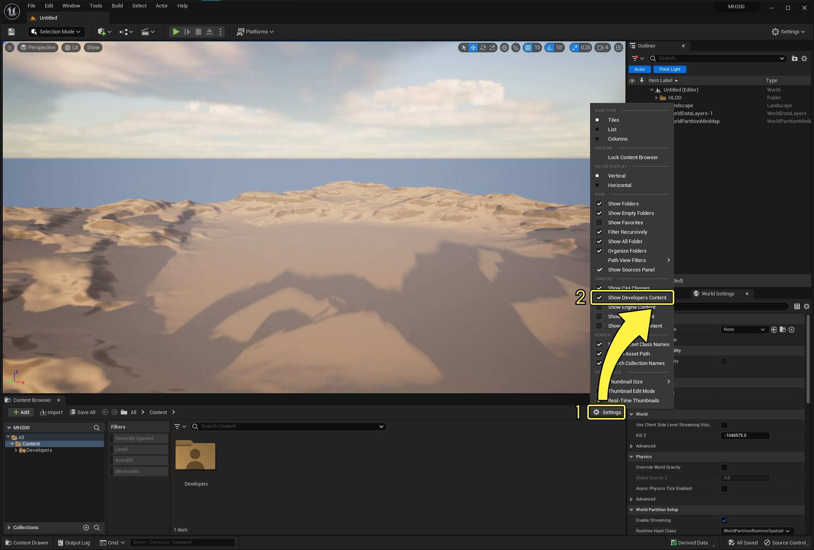
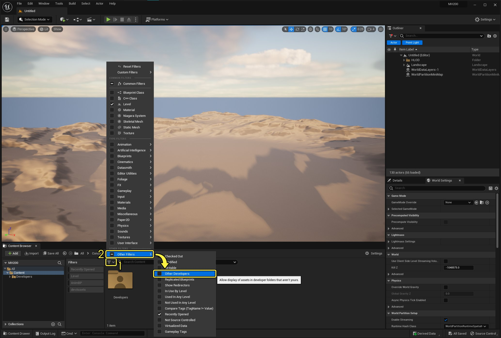
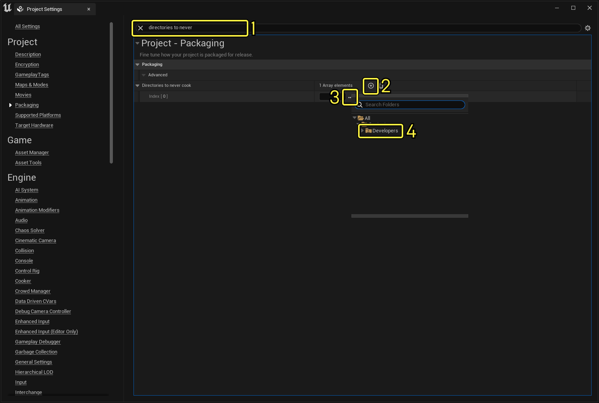

# 开发者文件夹

> 路径：虚幻引擎5.7文档 / 理解基础知识 / 内容浏览器 / 开发者文件夹

> 原始页面：https://dev.epicgames.com/documentation/unreal-engine/developers-folder-in-unreal-engine

在 **内容浏览器（Content Browser）** 的 **开发者（Developers）** 文件夹中，可复制和处理资产，不必担心破坏项目中的内容。使用"开发者（Developers）"文件夹可尝试不同的操作，包括小规模资产修改，一直到项目级重构。

如果你与其他开发者在共享项目中进行协作，则每个开发者都会有自己的文件夹。

"开发者（Developers）"文件夹使用与Windows用户名相同的名称，但不包含虚幻引擎文件夹名称中不允许使用的字符，如句点或空格。

> [!WARNING]
> 由于"开发者（Developers）"文件夹旨在用作沙盒环境，因此切勿在此文件夹之外的任何位置引用此文件夹中的资产。这样做可能会导致在烘焙项目时出错或导致烘焙失败。

## 启用开发者文件夹

如果在"内容浏览器（Content Browser）"中看不到"开发者（Developers）"文件夹，请按照以下步骤启用该文件夹：

1. 在 **内容浏览器（Content Browser）** 中，单击 **设置（Settings）**。
2. 在"设置（Settings）"菜单中，启用 **显示开发者内容（Show Developer Content）** 选项。

点击图片以查看大图。

## 与其他开发者协作

如果使用[源码控制系统](../../source-control/index.md)，则可配置虚幻引擎以查看其他开发者的文件夹中的资产。请按照以下步骤执行此操作：

点击图片以查看大图。

1. 在 **内容浏览器（Content Browser）** 中，单击 **过滤器（Filters）** 按钮。
2. 在"过滤器（Filters）"菜单中，选择 **其他过滤器（Other Filters）> 其他开发者（Other Developers）**。

## 从烘焙版本中排除开发者文件夹

如果要确保不会意外打包已损坏或正在处理的资产，可从烘焙版本中排除"开发者（Developers）"文件夹。请按照以下步骤执行此操作：

点击图片以查看大图。

1. 在主菜单中，转到

   编辑（Edit）> 项目设置（Project Settings）

   ，然后搜索

   从不烘焙的目录（Directories to never cook）

   数组。

> [!TIP]
> 可使用该分段顶部的 **搜索（Search）** 框找到此数组。

1. 单击 **添加（+）（Add (+)）** 按钮向数组中添加新项目。
2. 单击 **…** 以打开项目中的文件夹列表。
3. 单击 **开发者（Developers）** 文件夹以将其选中。
