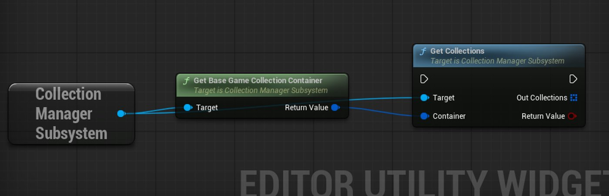
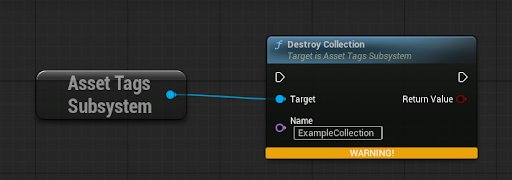
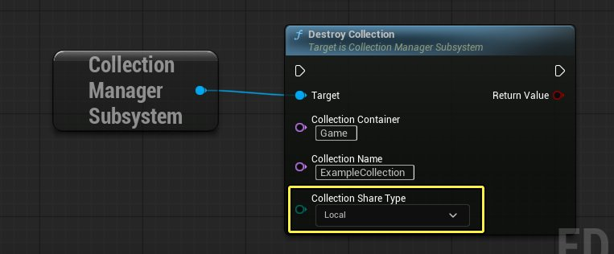

# 集合管理器脚本编辑子系统

> 路径：虚幻引擎5.7文档 / 理解基础知识 / 内容浏览器 / 筛选器和集合 / 集合管理器脚本编辑子系统

> 原始页面：https://dev.epicgames.com/documentation/unreal-engine/collection-manager-scripting-subsystem

## 概述

**集合管理器脚本编辑子系统**旨在通过蓝图访问集合系统。 其功能包括创建和删除集合，添加、移除和搜索指定集合中的资产。

集合管理当前通过**资产标签子系统**向蓝图公开。 该系统同时提供集合的编辑器功能与游戏功能。 编辑器功能包括可以创建、删除和修改集合，游戏功能仅支持读取与搜索集合。

## 突破局限的集合管理器脚本编辑子系统

新系统突破了资产标签子系统的两大局限。

### 内容容器

在虚幻引擎5.6之前，存储的所有集合均与基础游戏项目关联。 为支持模块化工作流程 （如元宇宙工作流项目），新增了**集合容器**功能。 该功能允许集合集与基础游戏项目之外的其他项目关联。 集合管理器脚本编辑子系统允许蓝图访问这些容器，使蓝图开发者能够跨不同项目访问集合。

在上述示例中，基础游戏集合容器（Base Game Collection Container）只是集合的众多潜在来源之一。

### 集合可访问性

集合有三种可访问级别：

- **本地**：不受源码控制。 存储在用户本地计算机上，仅限该用户访问。
- **私有**：受源码控制，但仅限创建者本人访问。
- **共享**：受源码控制，所有团队成员均可访问。

资产标签子系统不会向蓝图公开这些共享类型，导致无法区分名称相同但共享类型不同的集合。 在当前的机制中，如果提供集合名称，系统会返回最先找到且名称匹配的项目。 如果两个集合名称相同但共享类型不同，可能会导致蓝图开发者选错集合。

在上述示例中，如果存在多个名为“ExampleCollection”但共享类型不同的集合（一个是本地级别，一个是共享级别），将删除哪一个？

集合管理器脚本编辑子系统会公开共享类型，要求开发者明确指定目标集合：

在上述示例中，只有一个Local共享类型的“ExampleCollection”集合，因此不会删错集合。

### 其他改进

虽然可以扩展资产标签子系统，但创建新的子系统主要基于以下两大原因的考量。

| 改进 | 说明 |
| --- | --- |
| **通过明确的命名提高可发现性** | 采用与底层功能匹配的名称，有助于蓝图开发者快速识别系统并理解其用途。 |
| **仅限编辑器实现** | 资产标签子系统同时支持为编辑器和游戏编译，而集合管理器脚本编辑子系统**仅为编辑器**编译，用法更加明确。 |

## 功能变化

以下资产标签子系统的**编辑器专用**函数现已废弃，应改用集合管理器脚本编辑子系统中的对应版本：

| 废弃函数： | 当前函数： |
| --- | --- |
| 资产标签子系统 | 集合管理器脚本编辑子系统 |
| `CreateCollection` | `CreateCollection` |
| `DestroyCollection` | `DestroyCollection` |
| `RenameCollection` | `RenameCollection` |
| `ReparentCollection` | `ReparentCollection` |
| `EmptyCollection` | `EmptyCollection` |
| `AddAssetToCollection` | `AddAssetToCollection` |
| `AddAssetDataToCollection` | `AddAssetDataToCollection` |
| `AddAssetPtrToCollection` | `AddAssetPtrToCollection` |
| `AddAssetsToCollection` | `AddAssetsToCollection` |
| `AddAssetDatasToCollection` | `AddAssetDatasToCollection` |
| `AddAssetPtrsToCollection` | `AddAssetPtrsToCollection` |
| `RemoveAssetFromCollection` | `RemoveAssetFromCollection` |
| `RemoveAssetDataFromCollection` | `RemoveAssetDataFromCollection` |
| `RemoveAssetPtrFromCollection` | `RemoveAssetPtrFromCollection` |
| `RemoveAssetsFromCollection` | `RemoveAssetsFromCollection` |
| `RemoveAssetDatasFromCollection` | `RemoveAssetDatasFromCollection` |
| `RemoveAssetPtrsFromCollection` | `RemoveAssetPtrsFromCollection` |
|  | `GetCollectionContainers` |
|  | `GetCollections` |
|  | `CollectionExists` |
|  | `GetCollectionsByName` |
|  | `GetAssetsInCollection` |
|  | `GetCollectionsContainingAsset` |
|  | `GetCollectionsContainingAssetData` |
|  | `GetCollectionsContainingAssetPtr` |
|  | `GetBaseGameCollectionContainer` |

以下**游戏内**函数仍支持在运行时使用：

- `CollectionExists`
- `GetCollections`
- `GetAssetsInCollection`
- `GetCollectionsContainingAsset`
- `GetCollectionsContainingAssetData`
- `GetCollectionsContainingAssetPtr`
