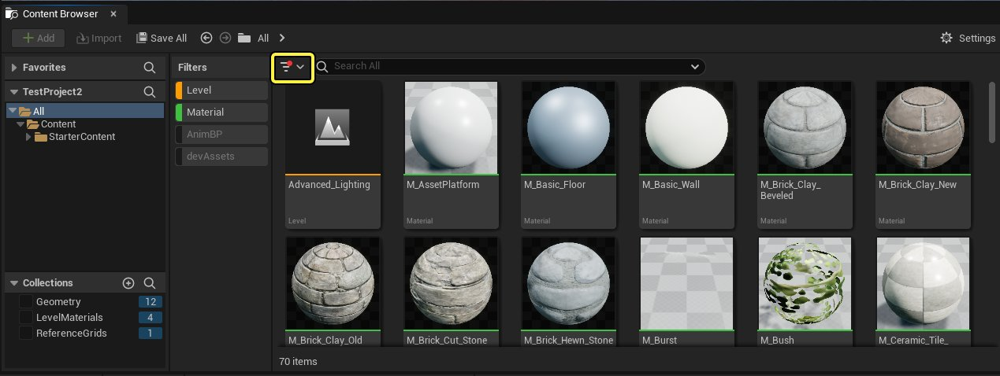
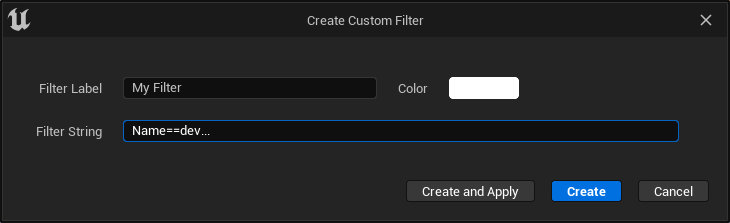
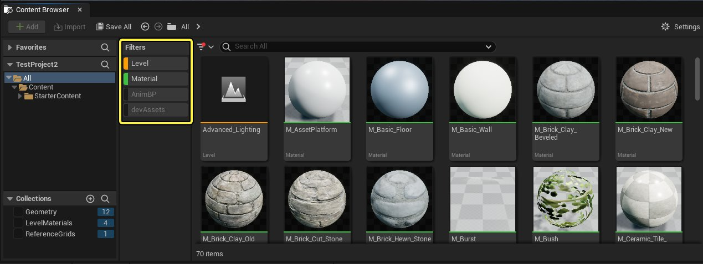
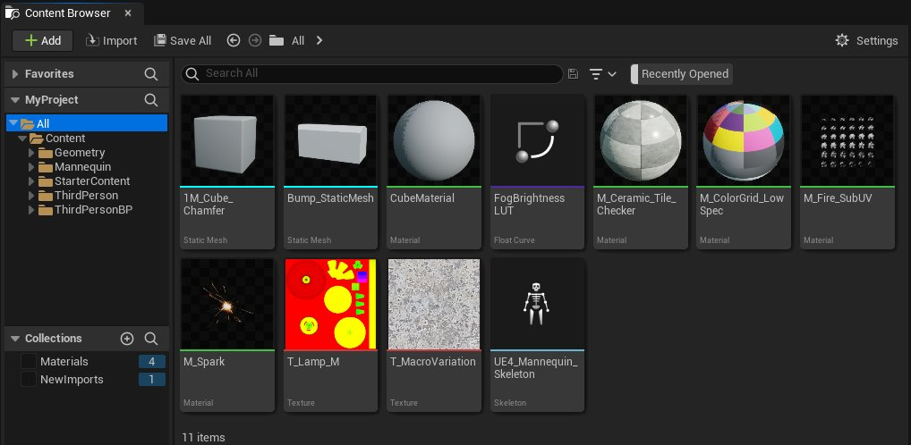
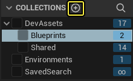
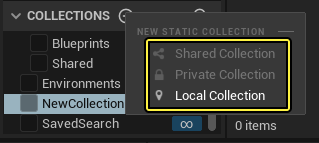

# 筛选器和集合

> 路径：虚幻引擎5.7文档 / 理解基础知识 / 内容浏览器 / 筛选器和集合

> 原始页面：https://dev.epicgames.com/documentation/unreal-engine/filters-and-collections-in-unreal-engine

**筛选器（Filters）** 和 **集合（Collections）** 是在内容浏览器中对资产进行排序和分组的两种不同方法。它们之间有一些主要区别：

- 筛选器**自动**在资产视图（Asset View）中显示或隐藏资产。你可以同时启用多个筛选器，并单独切换打开或关闭它们。筛选器可以保存在本地，并在不同项目之间共享。
- 集合包含 **手动** 添加的资产引用。你一次只能在资产视图（Asset View）中查看一个集合的内容。集合可以在你的机器本地，你也可以与其他用户共享。

筛选器和集合应用于单独的内容浏览器。这意味着你可以用不同的内容浏览器显示不同类型的资产，例如，一个内容浏览器只能显示属于特定集合的静态网格体，而另一个可以显示20个最近打开资产。

## 资产筛选器

**筛选器（Filter）** 提供了一种可以缩小内容浏览器资产视图中可见资产范围的方式。筛选器可以基于：

- 资产类型，例如蓝图、材质、静态网格体等。
- 资产状态，例如资产当前是否已从源控制点检出。

与集合不同，你可以同时激活多个筛选器。

### 启用筛选器

要启用筛选器，首先要在 **内容浏览器（Content Browser）** 的 **筛选器** 部分进行添加。在内容浏览器的 **搜索栏**， 点击 **筛选器** 下拉菜单（如下图中所示）。这样会打开一个菜单，包含全部可以选择的筛选器，并且分为不同类别。

点击一个筛选器来将其添加到 **筛选器** 区域。你还可以点击类别来添加整个类别的全部筛选器。筛选器类别旁边的复选框可以表示该类别下是否有使用中的筛选器：

- 加号 (

  +

  ) 意味着类别中的全部筛选器都启用。
- 减号 (

  -

  ) 意味着类别中一部分筛选器启用。
- 空白的复选框意味着类别中没有筛选器被启用。

> [!TIP]
> 筛选器是累加的，这意味着你添加的任何新筛选器都会增加资产视图（Asset View）中可能显示的资产数量。例如，如果你从选择 **静态网格体（Static Mesh）** 筛选器开始，你将只会看到静态网格体。如果你随后选择 **蓝图（Blueprint）** 筛选器，你将看到静态网格体和蓝图。

你还可以从下拉菜单创建 **自定义筛选器（custom filters）**。前往 **自定义筛选器（Custom Filter） > 创建新筛选器（Create New Filter）**，然后在弹出的窗口中输入以下信息：

- 筛选器标签（Filter Label）

  : 为你的筛选器命名。筛选器名称不能重复。
- 颜色（Color）

  : 使用调色盘来选择该筛选器在内容浏览器的筛选器区域中显示的颜色。
- 筛选器字符串（Filter String）

  : 输入该筛选器的条件。你可以使用

  高级搜索运算符

  。

### 停用筛选器

有两种方式可以停用筛选器：

- 直接在

  筛选器

  区域点击来切换开关。停用了的筛选器会显示为灰色，不再生效。再次点击就可以重新打开筛选器。这样停用筛选器不会将其从

  筛选器

  区域中移除。
- 从

  筛选器

  下拉菜单，找到启用的筛选器并且点击其名称就可以将其停用。这样也会将其从

  筛选器

  区域中移除。

在这个示例中，启用了 关卡（Level） 和 材质（Material） 筛选器，而 动画蓝图（AnimBP） 和 开发者资产（devAssets） 筛选器没有启用。

### 删除自定义筛选器

> [!WARNING]
> 通过这种方式删除自定义筛选器 **不会** 弹出确认对话框，并且无法撤销操作。

要删除一个自定义筛选器，执行以下操作：

1. 在 **筛选器** 下拉菜单中，找到 **自定义筛选器（Custom Filters）**。
2. 找到要删除的筛选器，点击它旁边的 **编辑（Edit）** 按钮 ()。
3. 在弹出的窗口中，点击 **删除** 按钮。

### 批量筛选器操作

右键点击 **搜索和筛选器栏（Search and Filters）** 栏中的筛选器，打开上下文菜单，其中包含以下批量筛选器操作：

| **操作** | **说明** |
| --- | --- |
| **Remove: [Filter Name]** | Removes this filter from the **Filters** area. If it is a custom filter, it will not be deleted and you can re-add it from the **Filters** drop-down. |
| **仅启用此：[筛选器名称]（Enable Only This: [Filter Name]）** | 禁用除当前选定的筛选器之外的所有其他筛选器。 |
| **启用全部筛选器（Enable All Filters）** | 启用全部筛选器。 |
| **禁用全部筛选器（Disable All Filters）** | 禁用全部筛选器。请注意，这不会从搜索和筛选器（Search and Filters）栏中删除任何筛选器。 |
| **删除全部筛选器（Remove All Filters）** | 从搜索和筛选器（Search and Filters）栏中删除全部筛选器。 此操作无法撤销。 |
| **删除除此：[筛选器名称]外的全部筛选器（Remove All But This: [Filter Name]）** | 从搜索和筛选器（Search and Filters）栏中删除除当前选择的筛选器之外的全部筛选器。 此操作无法撤销。 |

### 使用最近打开筛选器

**最近打开（Recently Opened）** 筛选器使你能够查看选定文件夹的20个最近打开资产，可以在 **筛选器（Filters）** 菜单中的 **其他筛选器（Other Filters）** 类别下找到。

使用最近打开（Recently Opened）筛选器时，选择 **内容（Content）** 文件夹，将显示整个项目文件夹的最近打开资产。选择子文件夹可能只显示几个项目，或者什么都不显示。该列表取决于所选文件夹中包含的最近打开资产。

请注意，如果你在全新的项目中操作，此筛选器可能返回20个以下项目，甚至没有项目。

In this example, the Recently Open filter only shows 8 items, because these are the only items that were opened since the project was created.

你可以更改最近打开筛选器列出的资产数量。在 **编辑器偏好设置（Editor Preferences）** 的 **内容浏览器（Content Browser）** 下，更改 **在最近打开筛选器中保留的资产数量（Number of Assets to Keep in the Nearly Opened Filter）** 。

## 集合

**集合** 是一种将资产集整理成组的方式。与文件夹不同，集合不包含资产本身，而仅包含对这些资产的引用。实际上，这意味着一个资产可以属于多个集合。

集合显示在文件夹树下的 **源（Sources）** 面板中。

### 创建集合

要创建新集合，请按照以下步骤操作：

1. 点击集合（Collections）面板上的 **添加（Add）** （**+**） 按钮。

   
2. 选择集合 **类型** 。

   

   你可以选择以下选项之一：

   | **类型** | **说明** |
   | --- | --- |
   | **共享集合（Shared Collection）** | 共享集合对其他用户可见。此选项仅在你处理多用户项目时可用。 |
   | **私人集合（Private Collection）** | 私人集合仅适用于被明确邀请查看集合的用户。此选项仅在你处理多用户项目时可用。 |
   | **本地集合（Local Collection）** | 本地集合仅在你的本地机器上可用。 |
3. 输入新集合的名称，然后按 **回车键（Enter）** 。

> [!TIP]
> 你可以右键点击集合（Collection），然后从出现的上下文菜单中选择 **新增（New）** ，并按照上述步骤1-3来创建子集合。

### 将资产添加到集合

你可以使用以下方法之一，将一项或多项资产添加到集合中：

- 点击资产选择它，然后将其拖到集合中。
- 右键点击资产。然后，从上下文菜单中，选择 **管理集合（Manage Collections）**，然后点击你要添加资产的目标集合。

  > [!TIP]
  > 资产已经归属集合的名称旁边将有复选标记。
- 点击资产可以选择它，然后启用你要添加资产的目标集合旁边的复选标记。

  > [!NOTE]
  > 如果资产已经是该集合的一部分，则该集合旁边的复选标记将已启用。在这种情况下，清除复选标记将从该集合中 **删除** 资产。

如果你将资产添加到具有父集合的集合，则该资产也将添加到父集合。

### 从集合中删除资产

你可以使用以下方法之一从集合中删除资产：

- 右键点击资产。然后，从上下文菜单中，选择 **管理集合（Manage Collections）**，然后点击你要从中删除资产的集合。

  > [!TIP]
  > 资产已经归属集合的名称旁边将有复选标记。
- 点击资产可以选择它，然后禁用你要从中删除资产的集合旁边的复选标记。

> [!WARNING]
> 如果你在集合中选择资产，并按 **删除（Delete）** ，你可以完全删除该资产。你将收到提示，确认这是你要执行的操作，但请记住，删除资产意味着它 **完全** 从你的项目中删除。要简单地从集合中删除资产，请始终使用上述方法之一即可。

### 重命名和删除集合

要重命名集合，请右键点击它，并从上下文菜单中选择 **重命名（Rename）** 。然后，输入新名称，并按 **回车键（Enter）**。要取消重命名，请按 **Esc键** 。

要删除集合，请右键点击它，并从上下文菜单中选择 **删除（Delete）** ，然后在出现的确认窗口中点击 **删除（Delete）** 。请注意，由于集合是对实际资产的引用，因此删除你的集合不会删除集合中的资产。
