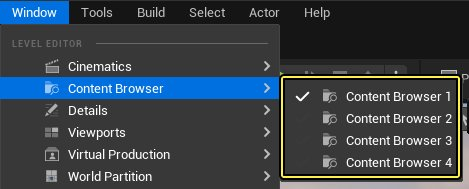
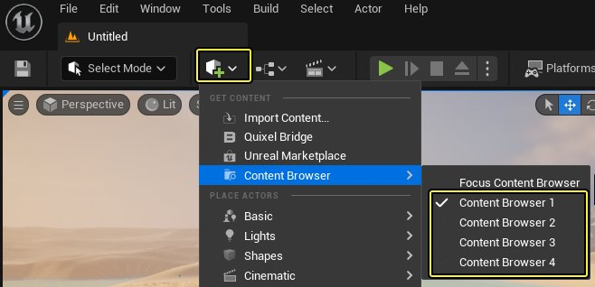
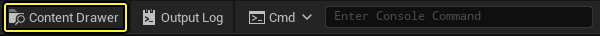
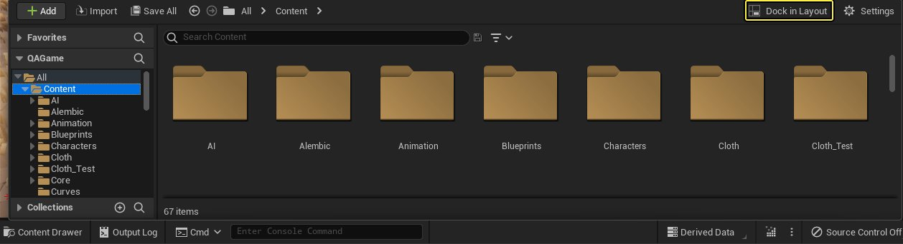

# 内容浏览器

> 路径：虚幻引擎5.7文档 / 理解基础知识 / 内容浏览器

> 原始页面：https://dev.epicgames.com/documentation/unreal-engine/content-browser-in-unreal-engine

**内容浏览器（Content Browser）** 是虚幻编辑器的主要区域，用于在虚幻项目中创建、导入、整理、查看和修改内容资产。你还可以使用它管理内容文件夹，并执行专有资产操作，例如：

- 前往浏览项目中的所有资产并与之交互。
- 使用文本筛选器查找资产，你可以选择将其与更高级的筛选功能结合使用。
- 将资产整理到私有、本地或共享集合中。
- 识别可能存在问题的资产。
- 在内容文件夹之间迁移资产，或迁移到不同的项目。

要了解有关每项操作的更多信息，请参阅此页面上的内容浏览器主题（Content Browser Topics）小节。

## 访问内容浏览器

可以通过以下三种方式打开内容浏览器：

1. 使用顶部菜单栏中的 **窗口（Window）** 菜单。

   
2. 使用主工具栏（Main Toolbar）上的 **创建（Create）** 菜单。

   
3. 点击编辑器底部工具栏上的 **内容侧滑菜单（Content Drawer）** 按钮。这会打开临时的内容浏览器（Content Browser），然后你可以停靠到编辑器窗口。要了解更多信息，请参阅此页面上的内容侧滑菜单（Content Drawer）小节。

   

你可以同时打开最多四个内容浏览器实例。例如，如果你要执行以下操作，这很有用：

- 在不同的内容浏览器（Content Browser）中筛选不同的资产类型，例如一个只显示静态网格体，另一个只显示材质。
- 在项目的不同文件夹之间迁移资产。

默认情况下， **内容浏览器（Content Browser）** 停放在虚幻编辑器（Unreal Editor）窗口的底部。你可以点击并拖动，将其重新停靠在编辑器中的任何位置，或使其成为浮动窗口。你还可以右键点击内容浏览器（Content Browser）选项卡，并选择 **移至侧边栏（Move to Sidebar）** ，这样内容浏览器（Content Browser）会折叠到虚幻编辑器（Unreal Editor）窗口左侧边栏中的可点击选项卡。

## 内容侧滑菜单

**内容侧滑菜单（Content Drawer）** 是内容浏览器的特殊实例，其行为略有不同。要打开它，请执行以下任一操作：

- 点击编辑器底部栏上的 **内容侧滑菜单（Content Drawer）** 按钮。
- 使用键盘快捷键 **Ctrl + 空格键（Ctrl + Space Bar）** （Windows）或 **Cmd + 空格键（Cmd + Space Bar）**（macOS）。

内容侧滑菜单（Content Drawer）在失焦（即，当你点击离开它时）时会自动最小化。要使其保持打开状态，请点击 **停靠在布局中（Dock in Layout）** 按钮。这会创建内容浏览器的新实例，但你仍然可以打开新的内容侧滑菜单（Content Drawer）。

内容侧滑菜单（Content Drawer）中的 停放在布局中（Dock in Layout） 按钮。

## 内容浏览器主题

请查阅下文，进一步了解内容浏览器。

- [内容浏览器界面](content-browser-interface/index.md)

- [源面板参考](sources-panel-reference/index.md) - 在内容浏览器中使用源面板的参考

- [内容浏览器设置参考](content-browser-settings/index.md) - 调整内容浏览器的缩略图显示、资产筛选以及其他方面。

- [筛选器和集合](filters-and-collections/index.md) - 使用筛选器和集合在内容浏览器中对资产进行排序和分组。

- [高级搜索语法](advanced-search-syntax/index.md) - 介绍在内容浏览器中可以使用的高级搜索运算符。
