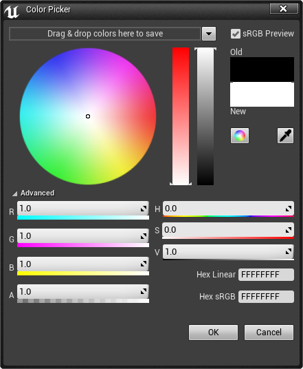
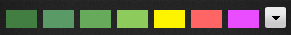
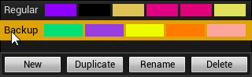
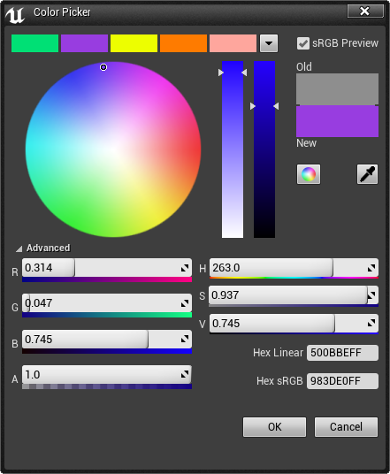
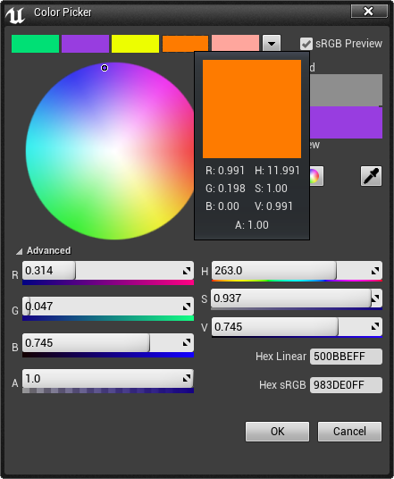

# 取色器

> 路径：虚幻引擎5.7文档 / 理解基础知识 / 基础知识 / 取色器

> 原始页面：https://dev.epicgames.com/documentation/unreal-engine/color-picker-in-unreal-engine

**取色器（Color Picker）** 让你可以轻松地在虚幻编辑器中调整某个颜色属性的颜色值。你可以用RGBA（红色、绿色、蓝色、透明）、HSV（色调、饱和度、值）和十六进制颜色码（ARGB）。你也可以单击色环中的任意位置，或者采集鼠标指针所在位置的颜色（屏幕任何位置都可以）。

| 选项 | 说明 |
| --- | --- |
| 主题和sRGB（Themes & sRGB） | 允许选择[主题](#%E4%B8%BB%E9%A2%98)和 **sRGB** 预览（请参见以下注释）。 |
| 色环 | 在色环中，用鼠标单击并拖拽即可直观地选择颜色。其他调整可以使用两个竖条完成。除了色环，也可以使用色谱，但前提是启用了这个选项。 |
| 色卡 | 当前指定给属性的颜色显示为（Old），当前在取色器中选中的颜色显示为（New）。颜色可以从 *Old* 或 *New* 部分中拖到 **主题** 栏进行保存，以便后续重复使用。 |
| 取色选项 | 在色环和或色谱（左图）之间切换。**滴管**（右图）可以用于从虚幻引擎内部或外部的任意窗口选择带颜色的像素。 |
| 红色通道 | 拖拽或输入值来设置 **红色** 通道。 |
| 绿色通道 | 拖拽或输入值来设置 **绿色** 通道。 |
| 蓝色通道 | 拖拽或输入值来设置 **蓝色** 通道。 |
| 色调通道 | 拖拽或输入值来设置 **色调**。 |
| 饱和度通道 | 拖拽或输入值来设置 **饱和度**。 |
| 值通道 | 拖拽或输入值来设置 **值**（颜色亮度）。 |
| 透明通道 | 拖拽或输入值来设置 **透明** 通道。 |
| 十六进制值 | 以“十六进制线性（Hexadecimal Linear）”或“十六进制sRGB（Hexadecimal sRGB）”格式手动输入值。 |

在使用取色器时，它不会将“滴管”在屏幕上采集的色样直接进行逆伽玛转换（inverse gamma conversion）。而是将sRGB视为所有颜色的取样空间，这样从Photoshop采集的色样就与转换到线性空间的颜色版本相同。当重新转换回到sRGB空间时，它就是你在Photoshop中看到的相同颜色。

> [!NOTE]
> `FColor` 和 `FLinearColor` 也可以使用UPROPERTY标签 **sRGB=true**（或 **false**）默认为sRGB空间，你可以强制默认选中某个特定的sRGB复选框。
>
> [虚幻示意图形(UMG)](../../../user-interfaces/index.md)中的一些地方现在强制实施该默认设置,因为sRGB是（PC上）渲染UMG的空间。在Mac上，最终的渲染空间是伽玛2.2，因此需要进行更多操作。

## 主题

**主题（Themes）** 是可以轻松复用的颜色集合。它们可以提供一些常用颜色，或者将美术和设计师使用的颜色限制于一个特定的调色盘。

### 创建主题

单击 **主题菜单（Theme Menu）** 按钮。

单击 **新建主题（New Theme）** 按钮以向列表添加空主题。

单击 **复制（Duplicate）** 按钮以创建复制现有主题的新主题。

### 重命名主题

单击 **重命名（Rename）** 按钮可以将主题重命名。

这样会显示一个文本字段，其中包含默认文本“新主题（New Theme）”。

为主题输入新名称。然后单击 **接受（Accept）** 按钮。

### 添加和移除颜色

主题中的颜色可以通过拖放进行添加、移除或重新排序。

从主色卡拖拽颜色以添加到主题。

向左或向右拖拽颜色可以对主题中的颜色重新排序。

将颜色拖拽到 **垃圾桶** 图标可以从主题中删除颜色。

颜色也可以用 **主题菜单（Theme Menu）** 进行重新排序和移除。

要编辑主题，请将颜色向左或向右拖拽。

要从主题删除颜色，请将其拖到 **垃圾桶** 图标。

### 为主题中保存的颜色添加标签

你可以为 **主题栏** 中保存的颜色添加标签，方法是右键单击保存的颜色，然后在 **颜色标签（Color Label）** 窗口中为颜色输入名称。

将鼠标悬浮于已经添加了标签的颜色上时，你会看到该颜色的工具提示属性中列出了其名称。

颜色也可以用 **主题菜单（Theme Menu）** 添加标签。右键单击颜色，然后在 **颜色标签（Color Label）** 窗口中为颜色输入名称。

### 使用主题

要更改主题，在 **主题菜单（Theme Menu）** 中选择你要激活的主题。

要使用当前主题中的颜色，双击要应用的颜色。这样会更新取色器中当前选中的颜色。

将光标悬浮于主题中的某种颜色上将显示该颜色的信息。

