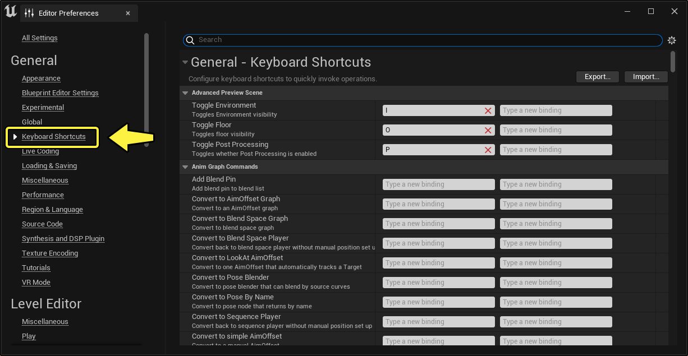
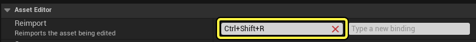
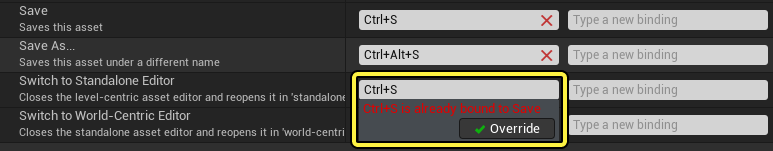
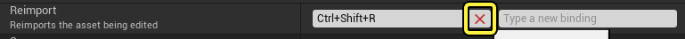
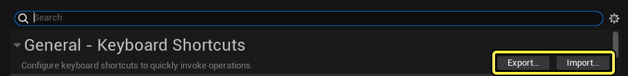

# 自定义按键快捷键

> 路径：虚幻引擎5.7文档 / 理解基础知识 / 基础知识 / 自定义按键快捷键

> 原始页面：https://dev.epicgames.com/documentation/unreal-engine/customizing-keyboard-shortcuts-in-unreal-engine

**按键快捷键**，也叫做 **键绑定**，本质上是一种组合按键，可以执行特定命令或操作。你可以为一些常用命令和工具设置快捷键，以便满足你的个人习惯。设置方法如下：打开 **编辑器偏好设置** 窗口，在主菜单中，进入 **编辑 > 编辑器偏好设置**，然后选择 **键盘快捷键**。

编辑器偏好设置 窗口中的快捷键编辑器。

此处的命令按功能区域分组。每个命令最多可以绑定两个快捷键。

## 新建一个键盘快捷方式

1. 点击需要绑定快捷键的命令旁的 **文本字段**。
2. 按下你希望使用的组合键。

   

当你点击文本字段以外的任何位置时，虚幻引擎会自动保存新的快捷键。

> [!TIP]
> 如果你设置的组合键已经与另一个命令绑定，你会看到一个警告。
>
> 
>
> 如果你想删除已有的绑定，并将快捷键分配给新的命令，请点击 **覆盖** 按钮。如果你想保留现有的绑定，并取消新的绑定，请点击文本字段外的位置。

## 移除已有的快捷键

要删除一个已有的快捷键，请点击它旁边的 **删除**（**X**）按钮。

## 导入和导出键盘快捷键

你可以将自定义按键绑定导出为一个 `.ini` 文件，然后导入并用于其他虚幻引擎编辑器。假如你需要在不同计算机上工作，或者经常需要重新安装引擎，这就很有用。

如需将自定义键位保存为 `.ini` 文件，请单击 **导出** 按钮。点击 **导入** 按钮可以导入外部 `.ini` 文件的自定义键位。这两个按钮都位于 **按键快捷键** 编辑器的顶部。

导出 和 导入 按钮的位置。
