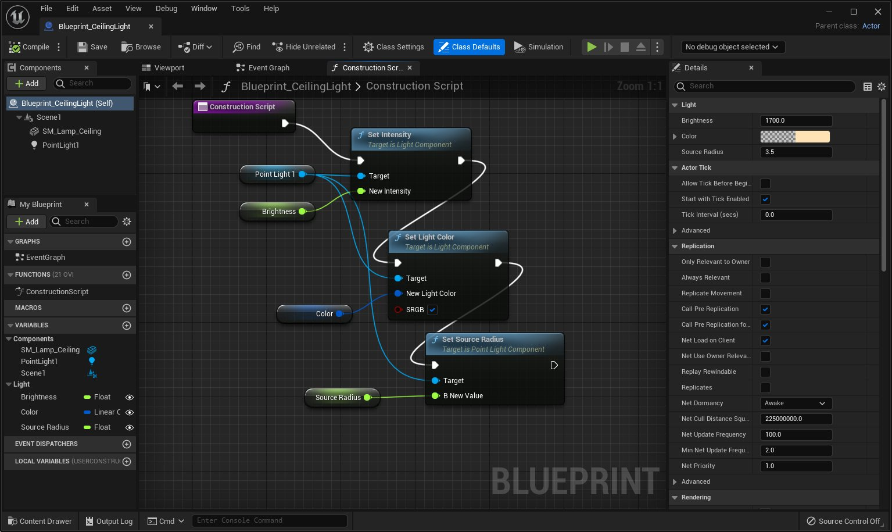
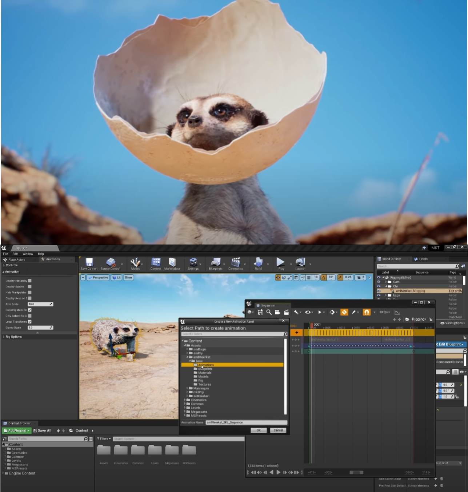
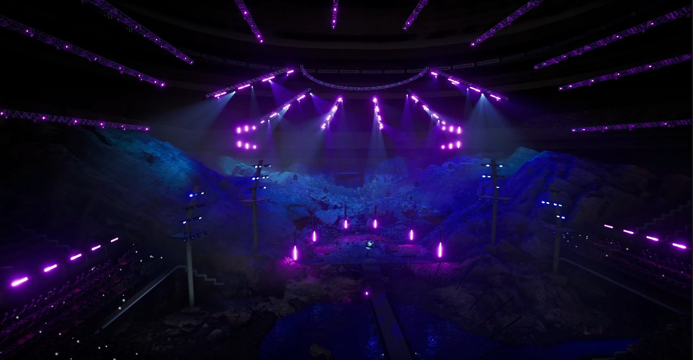

# 工具和编辑器

> 路径：虚幻引擎5.7文档 / 理解基础知识 / 基础知识 / 工具和编辑器

> 原始页面：https://dev.epicgames.com/documentation/unreal-engine/tools-and-editors-in-unreal-engine

**虚幻引擎5** 提供了 **工具** 、 **编辑器** 和 **系统** 组合，供你用于创建游戏或应用程序。

本页使用以下术语：

- 工具

  即你用来执行特定任务的用具，如在关卡中放置Actor，或绘制地形。
- *编辑器

  即你用来实现更复杂目标的工具集合。例如，

  关卡编辑器

  可让你构建游戏关卡，或者你可以在

  材质编辑器** 中改变材料的外观体验。
- 系统

  是功能大合集，这些功能会协同产生游戏或应用程序各方面内容。例如，

  蓝图

  是用于视觉化脚本Gameplay元素的系统。

> [!NOTE]
> 有时，系统和编辑器可能有类似的名称。例如，材质编辑器用于编辑材质资产，而材质系统为在虚幻引擎中使用材质提供底层支持。

虚幻引擎中的部分工具和编辑器是内置的，而其他工具和编辑器则是可选的 **插件（plugins）** ，这些插件可以根据项目需求来启用或禁用。要详细了解插件，请参考[使用插件](../working-with-plugins/index.md)页面。

本页概述了你将在虚幻引擎5中使用的主要工具和编辑器。功能说明文档中涵盖了各种虚幻引擎工具的详细使用说明。

无论你使用 **蓝图编辑器** 为关卡中的Actor编写行为脚本，还是使用 **Niagara编辑器** 创建粒子效果，了解每个编辑器的用途以及导航方法，均能优化你的工作流程，从而帮助你在开发过程中避开绊脚石。

## 关卡编辑器

#### Gameplay关卡

**关卡编辑器** 是你构建Gameplay关卡的主要编辑器。在这里通过添加不同类型的[Actor和几何体](../../actors-and-geometry/index.md)、[蓝图可视化脚本](../../../blueprints-visual-scripting/index.md)、[Niagara](../../../visual-effects/getting-started-in-niagara-effects/overview-of-niagara-effects/index.md)等来定义播放空间。在默认情况下，当你创建或打开项目时，虚幻引擎5会打开关卡编辑器。

如需了解更多信息，请参阅[关卡编辑器](../../../building-virtual-worlds/level-editor/index.md)。

## 静态网格体编辑器

#### 静态网格体

可以使用 **静态网格体编辑器（Static Mesh Editor）** 来预览外观、碰撞和UV贴图，以及设置和操控[静态网格体](../../actors-and-geometry/unreal-engine-actors-reference/static-mesh-actors/index.md)。在静态网格编辑器中，你也可以针对你的静态网格体资产设置[LOD](../../../working-with-content/static-meshes/creating-and-using-lods/index.md)（或细节级别设置），以根据你的游戏运行方式和地点控制静态网格体资产出现的简洁程度或详细程度。

如需更多信息，请参阅[静态网格体编辑器UI](../../../working-with-content/static-meshes/static-mesh-editor-ui/index.md)。

## 材质编辑器

#### 材质

**材质编辑器** 是你创建和编辑材质的地方。材质是可应用于网格体以控制其视觉效果的资产。例如，你可以创建污垢材质，并将其应用到关卡中的各个地板上，从而创建看似有污垢覆盖的表面。

如需了解详细信息，请参阅[材质编辑器指南](../../../designing-visuals-rendering-and-graphics/unreal-engine-materials/unreal-engine-material-editor-user-guide/index.md)。

## 蓝图编辑器

#### 蓝图

虚幻引擎5中的蓝图编辑器。点击查看完整视图。

**蓝图编辑器** 是你使用和修改蓝图的地方。这些特殊资产可用来创建Gameplay元素（如控制Actor或对事件编写脚本），修改材质或执行其他虚幻引擎功能，省去编写任何C++代码的过程。

如需更多信息，请参阅[蓝图编辑器参考](../../../blueprints-visual-scripting/user-interface-reference-for-the-blueprints-vis-53faed96/index.md)。

## 物理资源编辑器

#### 物理

你可以使用 **物理资产编辑器** 创建物理资产，以配合[骨骼网格体](../../../working-with-content/skeletal-mesh-assets/index.md)使用。在实践中，你可以使用此方法实现变形和碰撞等物理特性。你可以从零开始，构建完整的布娃娃设置，或使用自动化工具来创建一套基本物理形体和物理约束。

如需更多信息，请参阅[物理资产编辑器](../../../gameplay-systems/physics/physics-asset-editor/index.md)。

## 行为树编辑器

#### AI行为

**行为树编辑器** 是你通过一种可视化的基于节点脚本系统（类似于蓝图）为关卡中的Actor编写人工智能（AI）脚本的地方。你可以为敌人、非游戏角色（NPC）、载具等创建任意数量的不同行为。

如需更多信息，请参阅[行为树用户指南](../../../gameplay-systems/artificial-intelligence/behavior-trees/behavior-tree-in-unreal-engine---user-guide/index.md)。

## Niagara编辑器

#### 粒子效果

**Niagara编辑器** 利用由分离粒子发射器组成的全套模块化粒子效果系统，为每个效果创建特殊效果。可将发射器保在内容浏览器中，以备后用，并将作为当前和未来项目中的新发射器基础使用。

如需了解详细信息，请参阅[Niagara关键概念](../../../visual-effects/getting-started-in-niagara-effects/key-concepts-in-niagara-effects/index.md)。

## UMG界面编辑器

#### 用户界面

**虚幻示意图形UI编辑器** 是视觉UI创作工具，可用来创建UI元素，如在游戏内头顶显示、菜单或其他界面相关的图形。

如需更多信息，请参阅[UMG UI设计器快速入门](../../../user-interfaces/basics-of-user-interface-development/building-your-ui/umg-ui-designer-quick-start-guide/index.md)。

## 字体编辑器

#### 字体

使用 **字体编辑器** 添加、组织和预览字体资产。你也可以定义字体参数，如字体资产布局和提示策略（*字体提示*是一种数学方法，可确保文本在任意尺寸的显示屏中都可读）。

如需更多信息，请参阅 [字体资源和编辑器](../../../user-interfaces/text-formatting-localization-and-fonts/fonts/font-asset-and-editor/index.md)。

## Sequencer编辑器

#### 过场动画和动态事件

在制作Weta Digital动画短片猫鼬的过程中使用了Sequencer。点击查看完整视图。

利用 **Sequencer编辑器** 可通过专用多轨迹编辑器创建游戏过场动画。通过创建 **关卡序列（Level Sequences）** 和添加 **轨迹** （Tracks），你可以定义各个轨迹的组成，这样将确定场景的内容。轨迹可以包含动画（Animation）（用于将角色动画化）、变形（Transformation）（在场景中移动各个东西）、音频（Audio）（用于包括音乐或音效）等等。

如需了解更多信息，请参阅[Sequencer概述](../../../animating-characters-and-objects/cinematics-and-movie-making/unreal-engine-sequencer-movie-tool-overview/index.md)。

## 动画编辑器

#### 动画

**动画编辑器** 是虚幻引擎5中的动画编辑器。你可以使用该工具来编辑[骨骼资产](../../../animating-characters-and-objects/skeletal-mesh-animation-system/animation-assets-and-features/skeletons/index.md)、[骨骼网格体](../../../working-with-content/skeletal-mesh-assets/index.md)、[动画蓝图](../../../animating-characters-and-objects/skeletal-mesh-animation-system/animation-blueprints/index.md)，以及其他各种动画资产。

如需更多信息，请参阅[动画编辑器](../../../animating-characters-and-objects/skeletal-mesh-animation-system/animation-editors/index.md)。

## Control Rig编辑器

#### 动画

**Control Rig** 是动画工具套件，可以用于直接在引擎中操纵角色并实现其动画。使用Control Rig，你无需在外部工具中进行操纵和制作动画，而是直接在虚幻编辑器中制作动画。使用此系统，你可以在角色上创建和操纵自定义控制点，在 [Sequencer](../../../animating-characters-and-objects/cinematics-and-movie-making/index.md) 中制作动画，并使用各种其他动画工具来帮助完成动画制作过程。

如需了解更多信息，请参阅[控制绑定](../../../animating-characters-and-objects/control-rig/index.md)。

## Sound Cue编辑器

#### Sound Cue

虚幻引擎5中的音频播放的行为在Sound Cue中得到定义，可使用 **Sound Cue编辑器** 对其进行编辑。在此编辑器中，你可以组合多个声音资产后混音，以此生成单混音输出，另存为一个Sound Cue。

如需了解更多信息，请参阅[Sound Cue编辑器](../../../working-with-audio/sound-source/sound-cue/sound-cue-editor/index.md)。

## 媒体编辑器

#### 外部媒体播放

使用 **媒体编辑器** 来定义媒体文件或URL，以作为虚幻引擎5内部播放的源媒体使用。

你可以定义源媒体播放方式设置，如自动播放、播放速度和循环，但不能直接编辑媒体。

如需了解更多信息，请参阅[媒体编辑器参考文档](../../../working-with-media/integrating-media/media-framework/media-editor-reference/index.md)。

## nDisplay 3D配置编辑器

#### 虚拟制作和实时事件

[nDisplay](../../../working-with-media/integrating-media/rendering-to-multiple-displays-with-ndisplay/index.md)在多个同步显示设备上渲染虚幻引擎场景，如能量墙、穹顶和曲面界面。你可以使用 **nDisplay配置编辑器** 创建nDisplay设置，并使所有显示设备上的内容渲染方式可视化。

如需了解更多信息，请参阅[nDisplay 3D配置编辑器](../../../working-with-media/integrating-media/rendering-to-multiple-displays-with-ndisplay/ndisplay-3d-config-editor/index.md)。

## DMX库编辑器

#### 实时事件

DMX实操。此截图来自Moment Factory的示例项目。点击查看完整视图。

**DMX（数字多路复用）** 是在整个实时事件行业中用来控制各种设备的数字通信标准，如照明灯具、激光、烟雾机、机械设备和电子广告牌。在 **DMX库编辑器** 中，你可以自定义相关设备及其命令。

如需了解更多信息，请参阅[DMX](../../../working-with-media/communicating-with-media-components-from/dmx/index.md)。
