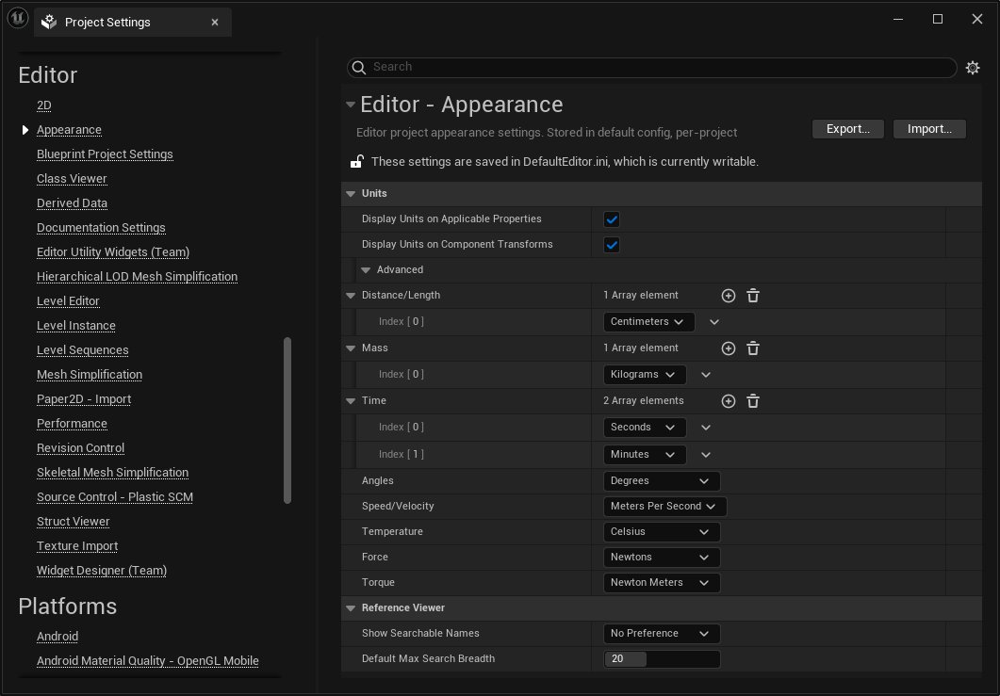

# 测量单位

> 路径：虚幻引擎5.7文档 / 理解基础知识 / 基础知识 / 测量单位

> 原始页面：https://dev.epicgames.com/documentation/unreal-engine/units-of-measurement-in-unreal-engine

虚幻引擎（UE）默认采用以下国际制（SI）测量单位：

| **量** | **单位** |
| --- | --- |
| 距离/长度 | 厘米（cm） |
| 质量 | 千克（kg） |
| 时间 | 分钟（min）、秒（s） |
| 角度 | 度（deg） |
| 速度 | 米/秒（m / s） |
| 温度 | 摄氏度（C） |
| 力 | 牛顿（N） |
| 扭矩 | 牛顿米（N • m） |

如需详细了解UE中可用的所有单位，请参阅下面的[可用单位](#%E5%8F%AF%E7%94%A8%E5%8D%95%E4%BD%8D)小节。

### 更改默认单位

在虚幻编辑器中，你可以更改项目中这些量的单位。要更改这些单位，请按照以下步骤操作：

1. 在菜单栏中选择

   编辑（Edit）> 项目设置（Project Settings...）

   。这会打开新的

   项目设置（Project Settings）

   窗口或选项卡。
2. 找到

   编辑器（Editor）> 外观（Appearance）

   。
3. 在

   单位（Units）> 高级（Advanced）

   下展开该类别。
4. 现在你应该会看到测量的所有量及其单位。要更改量，从你想更改的量旁边的下拉菜单选择新单位。

在虚幻编辑器中查看或更改单位。

> [!NOTE]
> 距离/长度、质量和时间可以使用复合单位。

### 可用单位

以下小节包含UE中所有可用测量单位的列表，按测量的量整理：

#### 距离和长度

| **单位** | **缩写** |
| --- | --- |
| **SI** |  |
| 微米 | µm |
| 毫米 | mm |
| 厘米 | cm |
| 米 | m |
| 千米 | km |
| **英制** |  |
| 英寸 | in |
| 英尺 | ft |
| 码 | yd |
| 英里 | mi |
| 光年 | ly |

#### 速率和速度

| **单位** | **缩写** |
| --- | --- |
| **SI** |  |
| 厘米/秒 | cm/s |
| 米/秒 | m/s |
| 千米/秒 | km/s |
| **英制** |  |
| 英里/时 | mph |

#### 加速度

| **单位** | **缩写** |
| --- | --- |
| 厘米/平方秒 | cm/s2 |
| 米/平方秒 | m/s2 |

#### 角度

| **单位** | **缩写** |
| --- | --- |
| 度 | ° , deg |
| 弧度 | rad |

#### 角速度

| **单位** | **缩写** |
| --- | --- |
| 度/秒 | deg/s |
| 弧度/秒 | rad/s |

#### 温度

| **单位** | **缩写** |
| --- | --- |
| **温度 - SI** |  |
| 摄氏度 | C |
| 开氏度 | K |
| **温度 - 英制** |  |
| 华氏度 | F |

#### 质量

| **单位** | **缩写** |
| --- | --- |
| **质量 - SI** |  |
| 微克 | µg |
| 毫克 | mg |
| 克 | g |
| 千克 | kg |
| 公吨 | t, Mg |
| **质量 - 英制** |  |
| 盎司 | oz |
| 磅 | lb |
| 英石 | st |

#### 密度

| **单位** | **缩写** |
| --- | --- |
| **密度 - SI** |  |
| 克/立方厘米 | g/cm3 |
| 克/立方米 | g/m3 |
| 千克/立方厘米 | kg/cm3 |
| 千克/立方米 | kg/m3 |

#### 力

| **单位** | **缩写** | **以基本单位计** |
| --- | --- | --- |
| **力 - SI** |  |  |
| 牛顿 | N | 1 N = 1 kg • m / s2 |
| 千克力 | kgf | 1 kgf = 9.80665 kg • m / s2 |
| 千克厘米/平方秒 | kg • cm / s2 |  |
| **力 - 英制** |  |  |
| 磅力 | lbf | 1 lbf = 32.174049 lb • ft / s2 |

#### 扭矩

| **单位** | **缩写** | **以基本单位计** |
| --- | --- | --- |
| **扭矩 - SI** |  |  |
| 牛顿米 | N·m | 1 N·m = 1 kg • m2 / s2 |
| 千克平方厘米/平方秒 | kg • cm2 / s2 |  |

#### 动量

| **单位** | **缩写** | **以基本单位计** |
| --- | --- | --- |
| **动量 - SI** |  |  |
| 牛顿秒 | N·s | 1 N • s = 1 kg • m / s |

#### 频率

| **单位** | **缩写** | **以基本单位计** |
| --- | --- | --- |
| **频率 - SI** |  |  |
| 赫兹 | Hz | 1 Hz = 1 s-1 |
| 千赫兹 | kHz |  |
| 兆赫兹 | MHz |  |
| 千兆赫兹 | GHz |  |
| 转/分钟 | rpm | 1 rpm = 1/60 s-1 |

#### 像素密度

| **单位** | **缩写** |
| --- | --- |
| 像素/英寸 | PPI |

#### 数字信息

| **单位** | **缩写** |
| --- | --- |
| 字节 | B |
| 千字节 | kB |
| 兆字节 | MB |
| 千兆字节 | GB |
| 太字节 | TB |

#### 光通量

| **单位** | **缩写** |
| --- | --- |
| 流明 | lm |

#### 发光强度

| **单位** | **缩写** |
| --- | --- |
| 坎德拉 | cd |

#### 照度

| **单位** | **缩写** | **以基本单位计** |
| --- | --- | --- |
| 勒克斯 | lx | 1 lx = 1 lm/m2 |

#### 亮度

| **单位** | **缩写** |
| --- | --- |
| 坎德拉/平方米 | cd/m2 |

#### 时间

| **单位** | **缩写** |
| --- | --- |
| 纳秒 | ns |
| 微秒 | µs |
| 毫秒 | ms |
| 秒 | s |
| 分钟 | min |
| 小时 | hr |
| 天 | d |
| 月 | mo |
| 年 | yr |

#### 压强

| **单位** | **缩写** | **以基本单位计** |
| --- | --- | --- |
| 帕斯卡 | Pa | 1 Pa = 1 kg / m • s2 |
| 千帕斯卡 | KPa |  |
| 兆帕斯卡 | MPa |  |
| 千兆帕斯卡 | GPa |  |

#### 其他单位

| **单位** | **缩写** | **备注** |
| --- | --- | --- |
| 曝光数值 | EV | 描述场景中有多少光线。 |
| 百分比 | % | 0到100之间的数字值。 |
| 乘数 |  | 无单位的数量，表示某个基础数量的倍数。 |
| 未指定 |  | 没有指定的单位。 |

## 更多信息

如需详细了解坐标系，请参阅以下资源：

- 国际单位制
