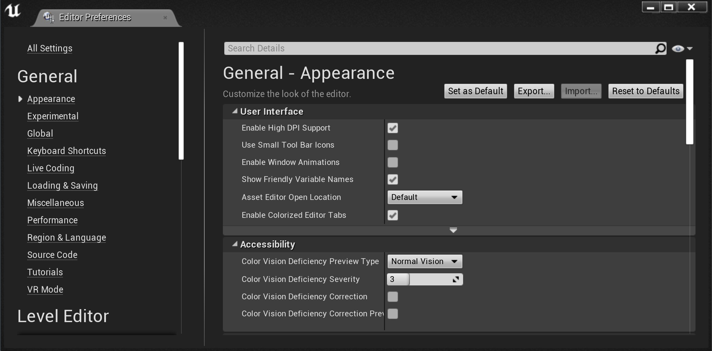
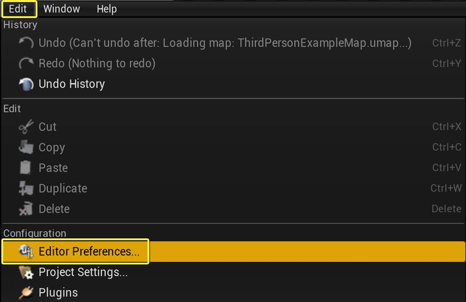
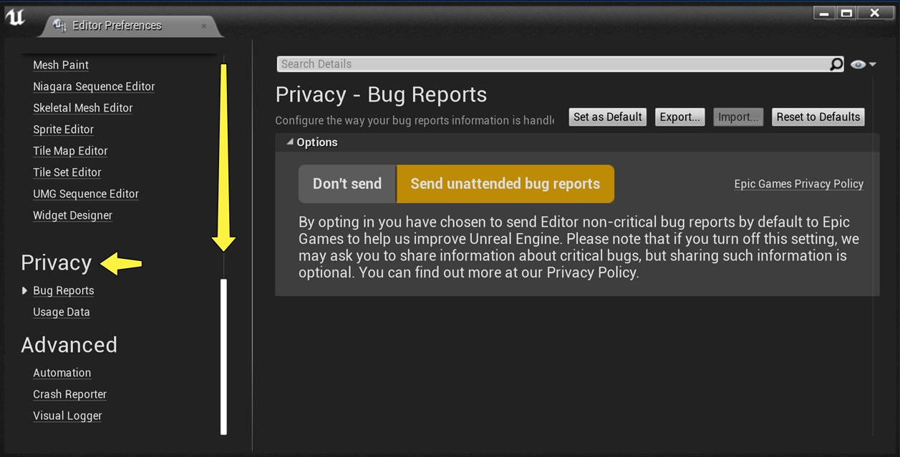
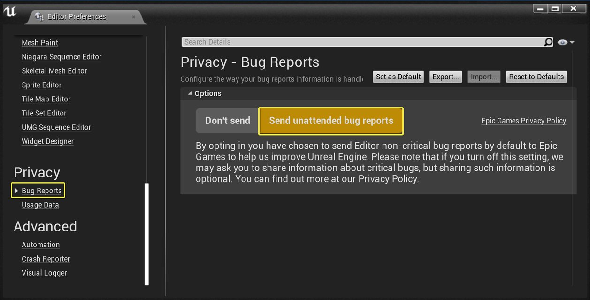
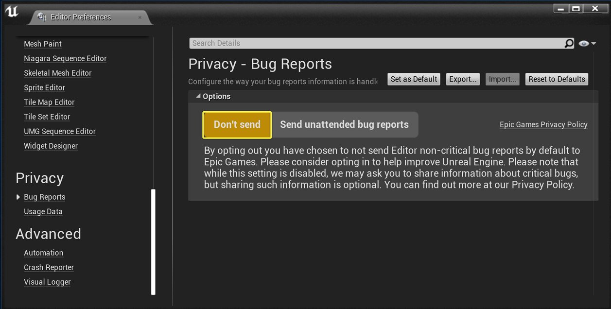
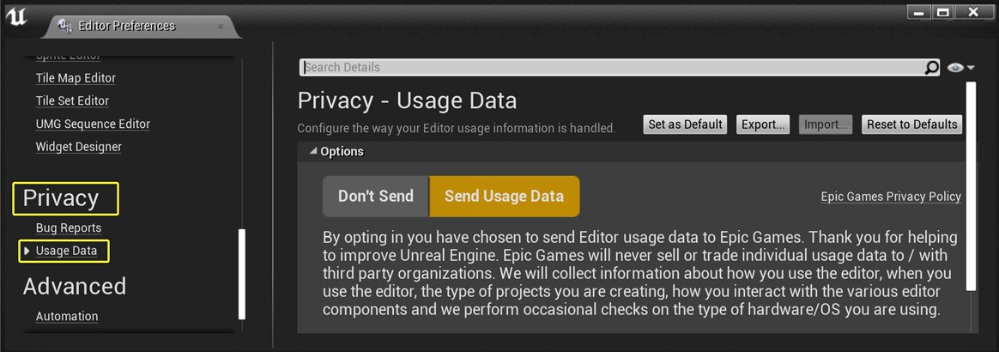
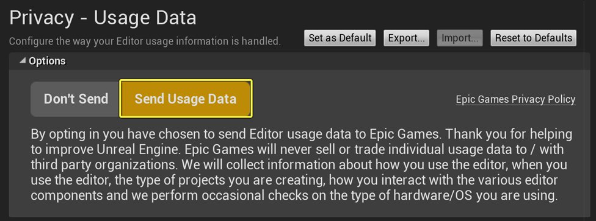

# 编辑器偏好设置

> 路径：虚幻引擎5.7文档 / 理解基础知识 / 基础知识 / 编辑器偏好设置

> 原始页面：https://dev.epicgames.com/documentation/unreal-engine/unreal-editor-preferences

**编辑器偏好设置（Editor Preferences）** 窗口用于修改与控件、视口、源码控制、自动保存等相关的编辑器行为的设置。

要打开 **编辑器偏好设置（Editor Preferences）** 窗口，单击 **编辑（Edit）> 编辑器偏好设置（Editor Preferences）**。

## 关卡编辑器偏好设置 - 视口

## 控制选项

| 选项 | 说明 |
| --- | --- |
| **飞行摄像机控制类型（Flight Camera Control type）** | 该设置决定了是否使用飞行摄像机及如何获得它。飞行摄像机使用W、A、S和D键来推动和平移摄像机，与标准的FPS控件的工作方式类似。W和S向内和外推动摄像机，而A和D从一侧向另一侧平移或扫过摄像机。启用此选项后，将覆盖使用这些控件的所有热键，包括用于切换显示标志的热键。 **使用WASD控制摄像机（Use WASD for Camera Controls）**：始终启用飞行摄像机和WASD控制。 **仅当按下鼠标右键时使用WASD控制（Use WASD Only When Right Mouse Button is Held）**：仅当按下鼠标右键时才启用飞行摄像机和WASD控制。 **永远不使用WASD摄像机控制（Never Use WASD for Camera Controls）**：永远不启用飞行摄像机和WASD控制。 |
| **通过拖拽来移动正交摄像机（Grab and Drag to Move Orthographic Cameras）** | 如果启用该项，那么在正交视口中单击鼠标左键或右键并拖拽鼠标将会滚动摄像机。本质上讲，这在实际操作中意味着当你单击并拖拽时场景将会随着鼠标移动。如果禁用该项，场景将向鼠标相反的方向移动。 |
| **正交缩放到光标位置处（Orthographic Zoom to Cursor Position）** | 如果启用该项，在正交视口中进行缩放操作将会围绕鼠标光标中心进行。当禁用该项，缩放将以视口中央为中心进行。 |
| **连接正交视口移动（Link Orthographic Viewport Movement）** | 如果启用该项，那么将会连接所有正交视口，使它们聚焦到同一位置。因此，当在一个正交视口中移动摄像机时将会导致其他正交视口跟随着移动。当禁用该项时，每个视口可以独立移动。 |
| **高宽比轴约束（Aspect Ratio Axis Constraint）** | 确定当改变大小时使用透视口的哪个坐标轴来控制视场(FOV)，从而维持高宽比。 **维持Y-轴视场（Maintain Y-Axis FOV）**：使用Y-轴（垂直轴）来决定视场。 **维持X-轴视场（水平）（Maintain X-Axis FOV**：使用X-轴（水平轴）来决定视场。 **维持主轴视场（Maintain Major Axis FOV）**：使用两个轴中较大的一个来决定视场。 |
| **鼠标滚动摄像机的速度（Mouse Scroll Camera Speed）** | 确定在使用鼠标导航时透视图摄像机的移动速度。 |

### 视口外观和感觉

| 选项 | 说明 |
| --- | --- |
| **突出显示鼠标下的对象（Highlight Objects Under Mouse Cursor）** | 如果启用该项，那么当将鼠标光标悬停到某个对象上时，将会在视口中使用一个透明的覆盖层突出显示该对象。 |

### 编辑器外观和感觉

| 选项 | 说明 |
| --- | --- |
| **使用小工具栏图标（Use Small Tool Bar Icons）** | 如果启用该项，整个编辑器的工具栏图标将变为较小的图标，且没有标签。[详见下文](https://dev.epicgames.com/documentation/404) |

#### 小工具栏图标

|  |  |
| --- | --- |
|  |  |
| **普通图标** | **小图标** |

### 关卡编辑

| 选项 | 说明 |
| --- | --- |
| **启用组合的平移/旋转控件（Enable Combined Translate/Rotate Widget）** | 启用后，合并后的平移和旋转-Z工具将变为可用。 |
| **单击BSP启用画刷（Clicking BSP Enables Brush）** | 如果启用该项，单击画刷（Brush）表面选中画刷，并按下 **Ctrl + Shift + 单击** 选中表面。当禁用该项时，则相反；单击鼠标选中表面，按下 **Ctrl + Shift + 单击** 键选中画刷。 |
| **自动更新BSP（Update BSP Automatically）** | 如果启用该项，当在视口中移动或修改画刷时会自动重新构建画刷（Brush）几何体。当启用该项时，则必须手动重新构建几何体来查看改变。 |
| **在替换对象上保持Actor缩放比例（Preserve Actor Scale on Replace）** | 如果启用该项，那么替换的Actor将遵循原始Actor的比例。否则，替换Actor的比例是1.0。 |

## 源码控制

| 选项 | 说明 |
| --- | --- |
| **当修改包时提示检出它（Prompt for Checkout on Package Modification）** | 如果启用该项，编辑器将自动在修改包时提示从源码控制签出该包。 |
| **允许源码控制（Allow Source Control）** | 如果启用该项，则为包和地图应用编辑器源码控制集成。 |
| **修改后添加新文件（Add New Files when Modified）** | 如果启用该项，将自动添加新文件到源码控制中。 |
| **主机（Host）** | 源码控制服务器的主机和端口。示例：`hostname:1234` |
| **用户名（Username）** | 连接源码控制时使用的用户名。 |
| **工作区（Workspace）** | 源码控制的客户端配置项。 |

### 粒子

| 选项 | 说明 |
| --- | --- |
| **使用分布曲线（Use Curves for Distributions）** | 如果启用该项，当在编辑器中渲染分布时，分布将使用曲线展现而不是烘焙的查找表。 |

### 内容浏览器

| 选项 | 说明 |
| --- | --- |
| **自动重新导入纹理（Auto Reimport Textures）** | 如果启用该项，则监控纹理的源文件，当源文件发生改变时自动重新导入纹理。 |
| **在警告出现之前设置一次性导入资源的数量（Assets to Load at Once before Warning）** | 在显示加载太多资源的警告之前 **内容浏览器** 内一次性加载对象的数量。 |

### 隐私

虚幻引擎4（UE4）中的编辑器收集使用数据，以帮助Epic不断改进UE4。编辑器可以收集三种类型的数据：

- 崩溃报告 - 在出现导致引擎崩溃的错误时生成。
- Bug报告（也称为保证） - 在出现某些问题，导致项目进入某种未预见到的特定状态，但没有崩溃时生成。
- 使用数据（也称为分析）- 关于用户的数据集。

引擎崩溃时会生成崩溃报告。崩溃报告自动为你提供是否向Epic发送崩溃数据的选择。

#### 禁用Bug报告

关于Bug报告，可以在编辑器偏好设置的 **隐私** 分类下禁用数据收集。请按以下步骤操作以禁用Bug报告。

1. 在菜单栏中，单击 **编辑（Edit）> 编辑器偏好设置（Editor Preferences）**。

   
2. 在编辑器偏好设置（Editor Preferences）对话框中，向下滚动至 **隐私（Privacy）** 类别。

   
3. 单击 **Bug报告（Bug Reports）**。在右窗格的 **选项（Options）** 下，默认设置为 **发送无人值守的Bug报告（Send unattended bug reports）**。

   
4. 如果不希望将bug报告发送给Epic，请单击 **不发送（Don't Send）**。

   

#### 禁用使用数据

使用数据主要由聚合或匿名信息组成，这些信息不会直接将你作为个人用户识别出来。然而，这些使用数据也可能包括以下内容：

- 用户的IP地址
- 用户的Internet服务提供商（ISP）
- 用户所在的洲、国家/地区和城市
- 用户的Epic帐户ID
- 用户的项目名称

如果你担心隐私问题，希望选择退出用户数据收集，你可以在编辑器偏好设置的 **隐私** 分类下进行设置。要禁用使用数据收集，请参见下面的步骤。

1. 在 **编辑器偏好设置（Editor Preferences）** 对话框中，向下滚动至 **隐私（Privacy）** 类别。

   
2. 单击 **使用数据（Usage Data）**。在右窗格的 **选项（Options）** 下，默认设置为 **发送使用数据（Send Usage Data）**。

   
3. 如果不希望将使用数据发送给Epic，请单击 **不发送（Don't Send）**。

   > 图片已省略：undefined

> [!NOTE]
> 要了解更多有关Epic的一般隐私惯例，请查看Epic的[隐私政策](https://www.epicgames.com/site/en-US/privacypolicy)。

### 自动保存

| 选项 | 说明 |
| --- | --- |
| **启用自动保存（Enable AutoSave）** | 如果启用该项，编辑器将按指定的时间间隔自动保存操作。 |
| **保存地图（Save Maps）** | 如果启用该项，自动保存过程将会尝试保存已加载的修改后地图。 |
| **保存包（Save Packages）** | 如果启用该项，自动保存过程将会尝试保存已修改的内容包。 |
| **保存频率，以分钟为单位（Frequency in Minutes）** | 每次自动保存之间的时间间隔，以分钟为单位。 |
| **多少秒后出现警告（Warning in Seconds）** | 在执行自动保存前的多少秒内显示警告。 |
