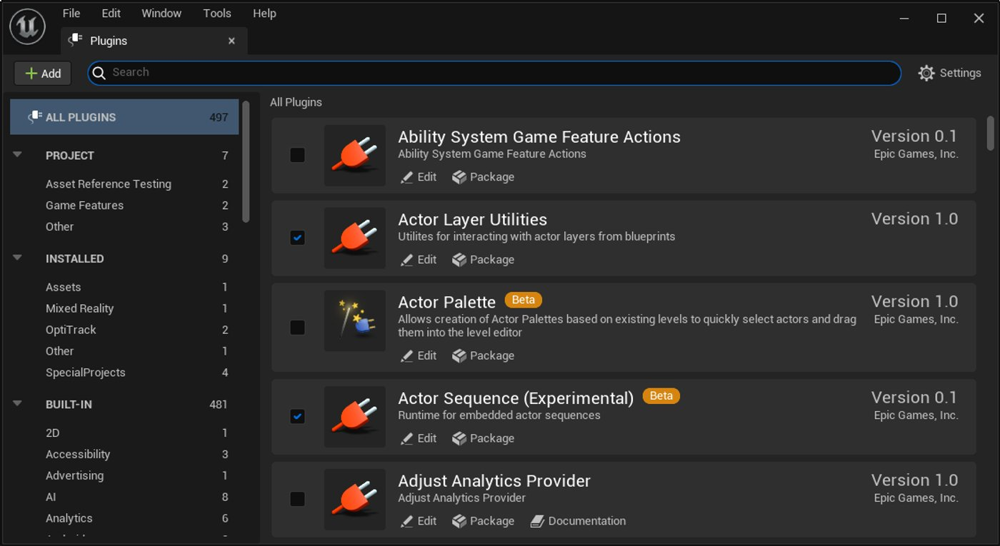
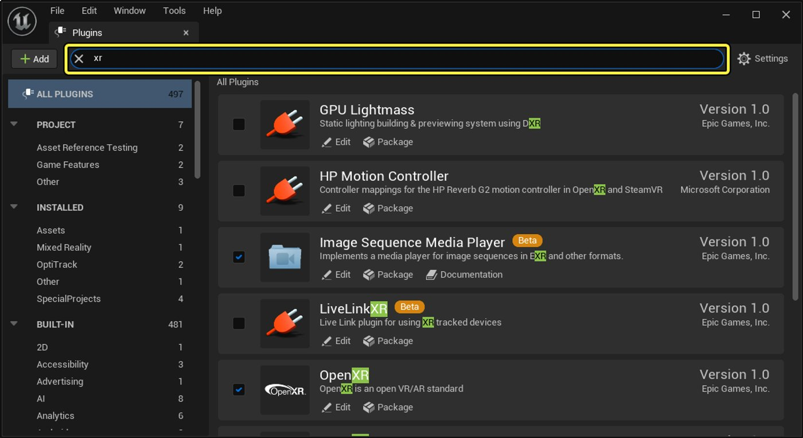
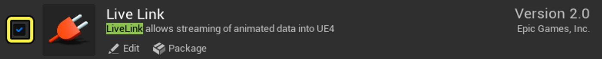
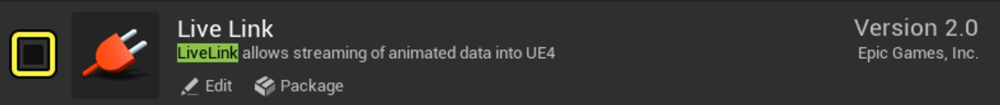
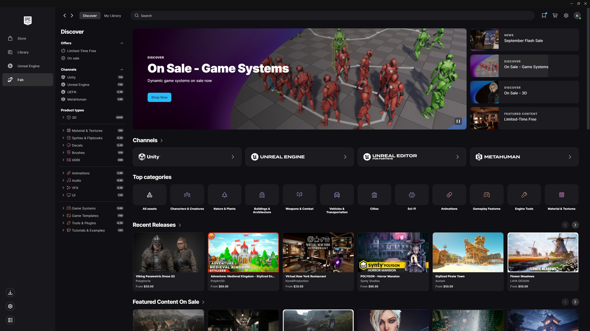
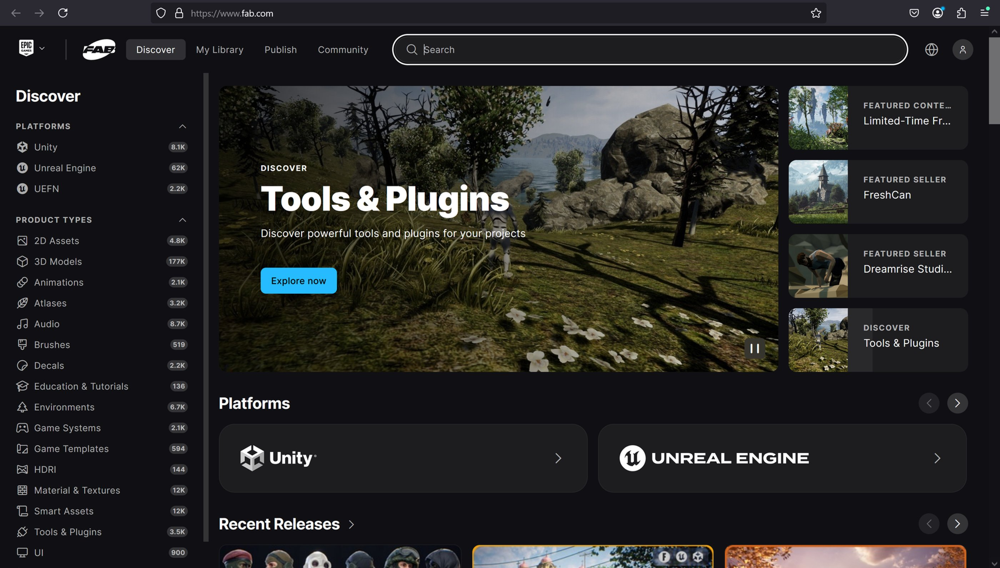

# 使用插件

> 路径：虚幻引擎5.7文档 / 理解基础知识 / 基础知识 / 使用插件

> 原始页面：https://dev.epicgames.com/documentation/unreal-engine/working-with-plugins-in-unreal-engine

**插件**是可选的软件组件，用于向**虚幻引擎**添加特定功能。 插件可以添加全新的功能以及修改内置功能，而不直接修改虚幻引擎代码。 例如，插件可以将新菜单项和工具栏命令添加到编辑器，甚至可以添加全新的功能和编辑器子模式。

你可以根据需要为每个项目独立启用或禁用插件。

虚幻引擎中提供了两种类型的插件：

- 虚幻引擎插件。
- 第三方插件。

## 启用插件

要启用虚幻引擎插件，请执行以下步骤：

1. 在主菜单中，转到**编辑（Edit） > 插件（Plugins）**。 这将打开**插件（Plugins）**窗口。

   

   虚幻引擎5中的"插件"窗口。
2. 使用屏幕左侧的列表查找你想启用的插件。 你也可以在**搜索**框中输入一个词，搜索包含该词的所有插件名称和说明。

   

   此示例显示"xr"一词的所有搜索结果。 请注意，搜索词在出现的所有地方都已高亮显示。
3. 要启用插件，请点击其旁边的复选框。

   

   启用插件。

   > [!NOTE]
   > 对于非生产就绪的插件（例如测试版插件），你可能会看到警告，要求你确认你想启用该插件。
4. 保存你的工作，然后重新启动虚幻引擎。

第三方插件可能要求执行额外步骤，你才能将其启用。 有关更多信息，请参阅你想安装的第三方插件的文档。 请注意，Epic Games对第三方插件的内容概不负责。

## 禁用插件

要禁用插件，请执行以下步骤：

1. 在主菜单中，转到**编辑（Edit） > 插件（Plugins）**。 这将打开**插件（Plugins）**窗口。

   

   虚幻引擎5中的"插件"窗口。
2. 使用屏幕左侧的列表查找你想禁用的插件。 你也可以在**搜索**框中输入一个词，搜索包含该词的所有插件名称和说明。

   

   此示例显示"xr"一词的所有搜索结果。 请注意，搜索词在出现的所有地方都已高亮显示。
3. 要禁用插件，请清除其旁边的复选框。

   

   禁用插件。

   > [!WARNING]
   > 如果你想禁用的插件是其他插件的*依赖项*（即其他插件需要该插件才能运行），你将看到通知，询问你是否也要禁用这些插件。 请注意，如果你使用了其中的插件来实现项目中的现有功能，禁用插件后可能会破坏该功能。
4. 保存你的工作，然后重新启动虚幻引擎。

## 从Fab安装插件

虚幻引擎自带能提供许多功能的插件，同时你也可以从[Fab](https://www.fab.com/)安装额外的插件，方法见下文。 此处的示例使用了Epic Games提供的免费"glTF导出器（glTF Exporter）"插件。

### 从Fab下载插件

你可以直接在Fab网站上浏览和下载虚幻引擎插件，也可以在Epic Games启动器的Fab选项卡中访问它们。

要从该网站下载插件，请按以下步骤操作：

1. 进行以下任一操作：

   1. 在**Epic Games启动器**中找到**Fab**选项卡。

      
   2. 前往[Fab网站](https://www.fab.com/)。

      
2. 搜索要安装的插件，并点击缩略图打开列表页面。

   > 图片已省略：在Fab上搜索插件

下一步取决于你选择的是[免费插件](index.md)还是[付费插件](index.md)。

> [!NOTE]
> 以下信息源自Fab文档[购买和下载素材的获取产品小节](https://dev.epicgames.com/documentation/zh-cn/fab/purchasing-and-downloading-assets-in-fab#acquire-products)。 详情请参阅原文档。

#### 免费插件

要下载免费插件，请按以下步骤操作：

1. 在插件的页面上，点击**添加到我的库（Add to My Library）**。

   > 图片已省略：将插件添加到库
2. 接受FabEULA。

   > 图片已省略：接受Fab的《最终用户授权协议》
3. 此时，你的免费插件就会出现在你位于Fab网站上的Fab库以及Epic Games启动器中。

   > 图片已省略：保存在我的库中的插件通知

#### 付费插件

要下载出售的插件，请按以下步骤操作：

1. 点击**选择许可**下拉菜单以查看可用的许可。 如适用，则选择一个许可证类型。 根据你所在的组织规模，许可证可能有所不同。

   > 图片已省略：选择许可
2. 选择**立即购买（Buy now）**或**加入购物车（Add to cart）**。

   1. 如果你选择了"立即购买"，将会看到结算页面，可以直接为所选的插件付费。 然后直接进入第4步。
   2. 若选择"加入购物车"，插件会被加入购物车。 请进入第3步。
3. 选完要购买的所有插件后，点击**查看购物车（View in cart）**，然后点击**结算（Checkout）**按钮为所选的所有插件（以及其他Fab产品）付费。

   > 图片已省略：结算
4. 完成结算流程，然后你会看到与免费插件一样的提示信息。

   > 图片已省略：保存在我的库中的插件通知

#### 安装插件

将新插件加入Fab库后，你需要将其安装到虚幻引擎。

1. 在启动程序中找到库（Library）选项卡，向下滚动到Fab库（Fab Library）分段。 搜索新插件，然后点击**安装到引擎（Install to Engine）**。

   > 图片已省略：插件的"安装到引擎"按钮

   > [!NOTE]
   > 如果找不到新插件，请刷新Fab库。
   >
   > > 图片已省略：刷新Fab库
2. 选择你想安装插件的引擎版本，然后点击**安装（Install）**。

   > 图片已省略：选择虚幻引擎版本

   > [!NOTE]
   > 在安装插件或其他资产时，只有受支持的虚幻引擎版本才会出现在选择列表中，即使你还安装了其他版本的虚幻引擎。
3. 安装完成后，打开安装了该插件的虚幻引擎版本，按照本文中的[启用插件](index.md)小节中的说明**启用**该插件。

### 通过虚幻引擎从Fab下载插件

你可以在虚幻引擎内工作的同事，使用Fab插件下载插件（和其他内容）。 安装来自Fab的其他插件前，你必须先[启用Fab插件](index.md)。

> 图片已省略：虚幻引擎中的Fab插件

安装完插件后，你可以在虚幻引擎内通过以下选项访问它：

- 转到**窗口（Windows）**菜单，向下滚动到**获取内容（Get Content）**分段并点击**Fab**。

  > 图片已省略：虚幻引擎窗口菜单中的Fab字段
- 在**内容侧滑菜单**中点击**+添加（+Add）**按钮右边的**Fab**按钮。

  > 图片已省略：内容侧滑菜单中的Fab按钮

在Fab窗口中，你可以像在Fab网站上那样搜索并获取插件（包括免费和付费的）。

> 图片已省略：虚幻引擎中的Fab窗口

> [!NOTE]
> 在虚幻引擎内，只有虚幻引擎可用的插件才会出现在Fab窗口中。 面向其他平台的内容不可用。

插件被添加到库后，还需要下载并安装才能使用。 要安装新插件，需退出虚幻引擎，在Fab库中找到插件。 点击**安装到引擎（Install to Engine）**，再按上文所述的方法操作。

> 图片已省略：插件的"安装到引擎"按钮

> 图片已省略：选择虚幻引擎版本

## 插件安装位置

虚幻引擎将所有插件存储在以下位置：

- Windows：`C:\Program Files\Epic Games\UE_[version]\Engine\Plugins`
- macOS：`/Users/Shared/Epic Games/UE_[version]/Engine/Plugins`
