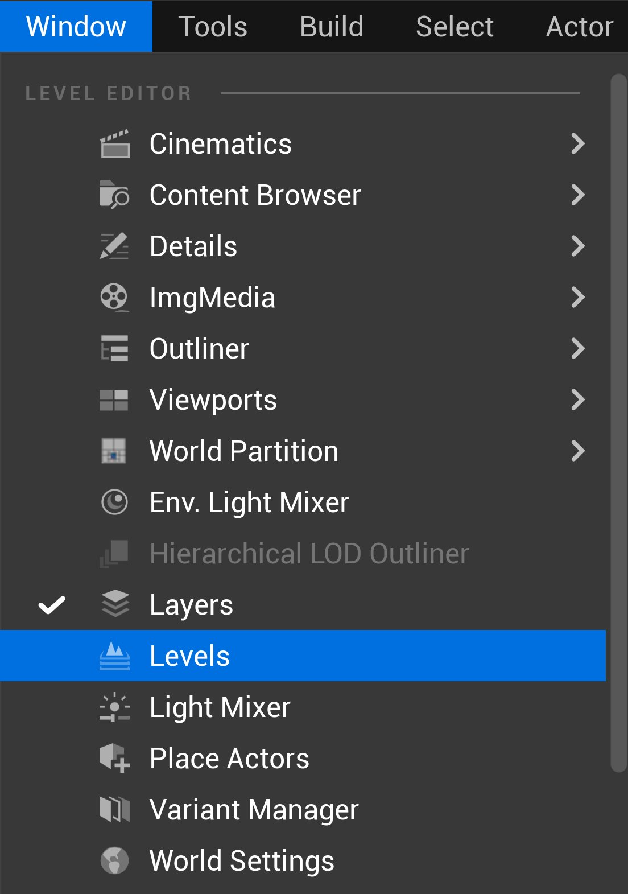
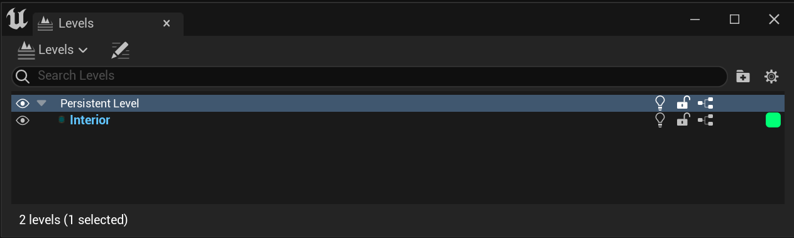
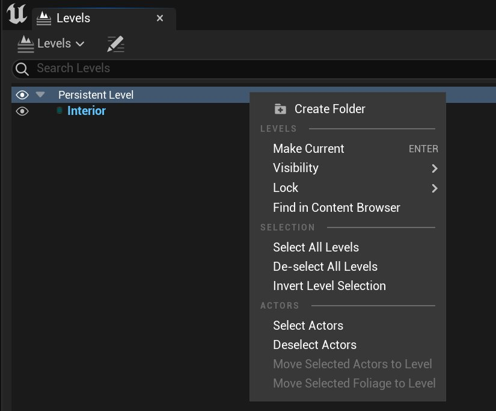
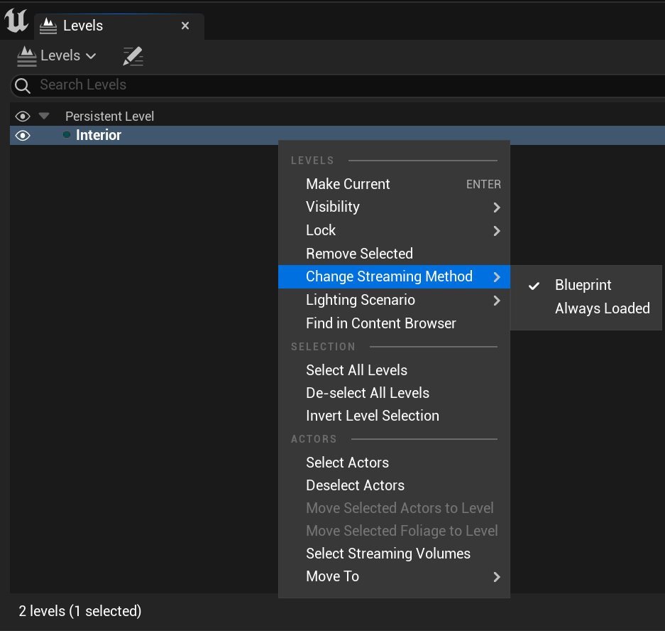
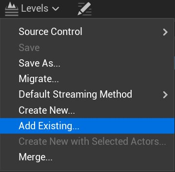
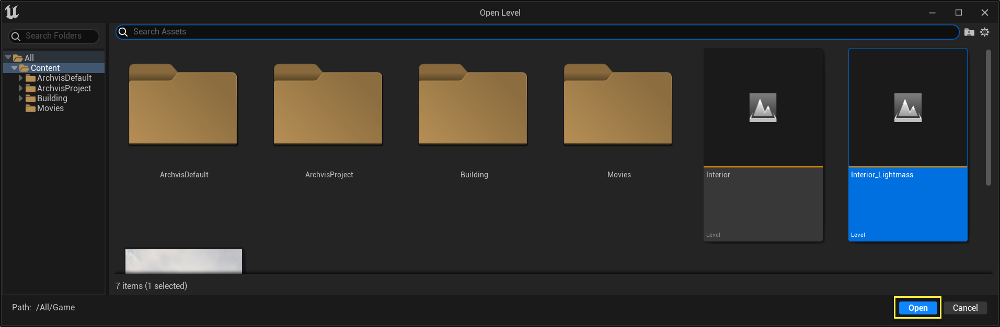
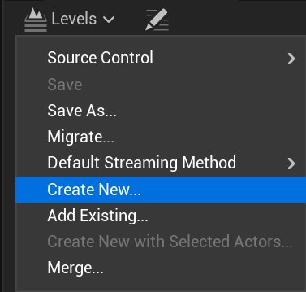
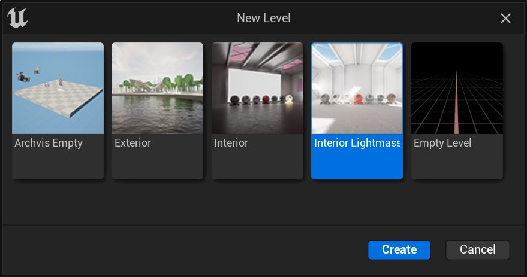

# 管理多个关卡

> 路径：虚幻引擎5.7文档 / 理解基础知识 / 关卡 / 管理多个关卡

> 原始页面：https://dev.epicgames.com/documentation/unreal-engine/managing-multiple-levels-in-unreal-engine

在 **虚幻引擎（Unreal Engine）** 4旧版项目或非游戏项目（例如建筑可视化）上工作时，你可以使用 **关卡（Levels）** 窗口进行关卡管理。对于虚幻引擎5.0及更高版本中的游戏开发， **关卡（Levels）** 窗口被[世界分区](../../../building-virtual-worlds/world-partition/index.md)废弃。本页面涵盖了如何通过 **关卡（Levels）** 窗口管理多个关卡。

> [!NOTE]
> 这些步骤使用[建筑模板](../../working-with-projects-and-templates/template-reference/index.md#%E5%BB%BA%E7%AD%91%E3%80%81%E5%B7%A5%E7%A8%8B%E5%92%8C%E6%96%BD%E5%B7%A5%E6%A8%A1%E6%9D%BF)作为参考。

你还可以从 **窗口（Windows）** 菜单访问 **关卡（Levels）** 窗口。

你将总是拥有一个 **持久关卡（Persistent Level）** ，并且你可以有一个或多个子关卡，子关卡总是通过 **关卡流送体积（Level Streaming Volumes）** 、 **蓝图（Blueprints）** 或 **C++代码（C++ code）** 加载或流送。 **关卡（Levels）** 窗口会显示所有这些关卡，使你能够更改哪个关卡是当前关卡（以粗体蓝色文本表示），保存一个或多个关卡，并访问关卡蓝图。如果在关卡编辑器的视口中做出了更改，你将修改当前关卡。你可以使用此窗口处理多个贴图，前提是贴图都可写。

右键点击 **持久关卡（Persistent Level）** 后，会显示多个操作选项，包括将该关卡设置为当前关卡、更改可视性和锁定状态、选中关卡中的所有Actor。

子关卡也有类似的选项，此外，还有一些用于移除子关卡和更改流送方法的额外选项。

更改关卡的可视性只会影响它的显示，不会对关卡能否加载进游戏产生影响。不过，当你重新生成关卡时，此处不可见的关卡将不参与构建过程；如果你的关卡很复杂，这样能大大节省时间。

## 添加新的子关卡

持久关卡或子关卡的一部分可以拆分出来，作为新的子关卡。你也可以新建关卡或添加现有关卡来创建子关卡。 添加新的子关卡后，该关卡会自动成为"当前关卡"。因此，如果你想继续使用之前的关卡，请记得右键单击之前的关卡，在菜单中 **设为当前（Make Current）** 。

### 添加已有关卡

1. 单击 **关卡（Levels）** 下拉菜单，然后选择 **添加现有（Add Existing）** ，添加一个新的子关卡。

   
2. 在 **打开关卡（Open Level）** 对话框中选择要添加的关卡，然后单击 **打开（Open）** 。

   

### 新建空白子关卡

1. 单击 **关卡（Levels）** 下拉菜单，然后选择 **新建（Create New）** ，新建一个空白子关卡。

   
2. 选择创建空白关卡或模板

   
3. 为关卡选择保存位置和名称，然后点击 **保存（Save）** 。

   > 图片已省略：保存新关卡

   新关卡将作为当前持久关卡的子关卡，同时也会变成当前关卡，供你在 **视口** 中操作。

### 拆分子关卡

如果你想把关卡的一部分拆分出来，以便单独加载它或与团队协作编辑），你可以选中要用的Actor，用它们新建一个关卡。

1. 在 **场景大纲视图（Scene Outliner）** 或 **视口（Viewport）** 中选中所有要移到新关卡的Actor。
2. 在 **关卡（Levels）** 窗口中，单击 **关卡（Levels）** 下拉菜单，然后选择 **使用选定Actor新建（Create New with Selected Actors）** 以创建一个新子关卡。

   > 图片已省略：使用所选Actor新建
3. 为关卡选择一个保存位置和名称，然后单击 **保存（Save）** 。

   > 图片已省略：保存关卡

   所有选中的Actor都会在原有关卡中被移除，并被添加到新关卡中。新关卡将作为当前持久关卡的一个子关卡，并被设置为当前关卡，供你在视口中处理。

   > [!NOTE]
   > 如果你移动的Actor被某个保留在持久关卡中的Actor所引用，引擎会弹出消息，询问你是否真的要将其从持久关卡中删除。

> 图片已省略：删除新关卡

## 在关卡间迁移Actor

你可以先在当前关卡中复制Actor，然后切换到目标关卡并粘贴Actor时。不过，有一种更简单的方法。

1. 在 **场景大纲视图（Scene Outliner）** 中或 **视口（Viewport）** 中选中要移至新关卡的Actor。
2. 在 **关卡（Levels）** 窗口中， **右键单击** 关卡，然后在右键菜单中选择 **移动所选Actor至关卡（Move Selected Actors to Level）** 。

   > 图片已省略：根据选择的Actor新建关卡
3. 按下 **Ctrl+S** ，保存所有关卡。

## 关卡细节

在 **关卡（Levels）** 窗口中，点击图中的的放大镜标识可以打开 **关卡细节（Level Details）** 窗口，它允许你访问当前关卡的更多信息。若要设置关卡流送体积（Level Streaming Volumes），你需要打开关卡的 **关卡细节（Level Details）** ；详细操作过程，请参阅[关卡流送体积参考](../../../building-virtual-worlds/level-streaming/level-streaming-using-volumes/index.md)。

> 图片已省略：关卡细节

持久关卡没有额外的细节信息，除了一个用于切换到其他关卡的菜单。

> 图片已省略：持久关卡细节

你可以设置子关卡的偏移 **位置（Position）** 和 **旋转（Rotation）** ，要使用的 **流送体积（Streaming Volumes）** 和调试用的 **关卡颜色（Level Color）** 。此处还有一些用于提升性能的高级设置，例如卸载请求之间的最小时间间隔。

> 图片已省略：关卡细节面板

## 子关卡可视化选项

你可以在主 **关卡（Levels）** 窗口中或 **关卡细节（Level Details）** 窗口中设置子关卡的颜色。

若要切换关卡颜色，请点击视口上的 **显示（Show）** 按钮，然后选择 **高级（Advanced）> 关卡颜色（Level Coloration）** 。

> 图片已省略：关卡颜色

持久关卡将用白色显示，而所有子关卡将用它们的选定颜色表示。 **关卡颜色（Level Coloration）** 只能在透视和正交视口下工作；在 **游戏模式（Game Mode）** 下会被关闭。

> 图片已省略：查看关卡颜色
