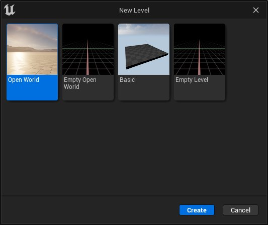
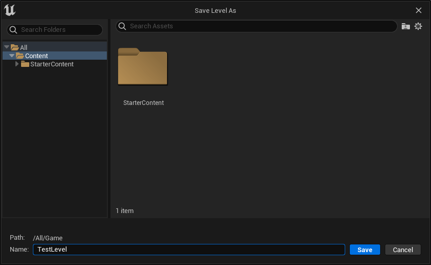

# 使用关卡

> 路径：虚幻引擎5.7文档 / 理解基础知识 / 关卡 / 使用关卡

> 原始页面：https://dev.epicgames.com/documentation/unreal-engine/working-with-levels-in-unreal-engine

和许多其他虚幻引擎数据类型一样，**关卡** 保存在单独的资产文件中。你可以对关卡资产执行许多常见操作。不过其中有一些特殊的注意事项，将在下面详细介绍。

本文介绍了以下工作流程：

- 创建关卡
- 保存关卡
- 打开关卡

## 创建关卡

虚幻引擎中新建关卡的方法有以下几种：

- 点击 **主菜单** 中的 **文件（File）**，然后点击 **新建关卡（New Level）**。
- 在 **内容浏览器** 中点击右键。然后，在 **创建基本资产（Create Basic Asset）** 下，选择 **关卡（Level）**。
- 使用 **Ctrl+N**（Windows）或 **Cmd+N**（Mac）快捷键。

以上操作都会打开一个 **新建关卡** 窗口，如下所示。

**新建关卡（New Level）** 窗口会显示所有可用关卡模板。你可以在以下模板中选择：

- **开放世界（Open World）**：一个包含示例内容的关卡，允许你使用[世界分区](https://docs.unrealengine.com/5.0/zh-CN/building-virtual-worlds/world-partition)来创建大型、可流送的开放世界。
- **空的开放世界（Empty Open World）**：一个使用世界分区的关卡，但不包含任何内容。
- **基本（Basic）**：一个包含地面、光照、大气和指数雾的关卡。
- **空关卡（Empty Level）**：一个没有任何内容的关卡。

在这个窗口中选择你想用的关卡，然后点击 **创建**。新关卡将自动打开。

> [!TIP]
> 如果启用了版本控制，在创建和保存新关卡时，将自动上传到版本控制软件。

## 保存关卡

和其他资产一样，在关闭引擎或切换到其他关卡前，你需要保存当前关卡才能保留你在虚幻引擎中所做的更改。

保存关卡有以下几种方法：

- 在 **主菜单** 中点击 **文件（File）**，然后选择 **保存当前关卡（Save Current Level）**。
- 使用 **Ctrl+S**（Windows）或 **Cmd+S**（Mac）快捷键。

首次保存关卡时的界面会略有不同。你需要指定关卡的保存位置以及名称。

关卡另存为（Save Level As） 窗口的使用方式类似其他文件的保存对话框。为关卡资产命名，选择保存路径，然后点击 保存。

如需将关卡保存为其他名字，你可以使用以下方法：

- 在 **主菜单** 中点击 **文件（File）**，然后选择 **将当前关卡保存为（Save Current Level As）**：
- 使用 **Ctrl + Alt + S**（Windows）或 **Cmd + Option + S**（Mac）快捷键。

改变关卡时，系统会显示 **保存内容（Save Content）** 对话框，提示你保存当前关卡。

## 打开关卡

打开关卡的方法如下：

- 在 **主菜单** 中点击 **文件（File）**，然后选择 **打开关卡（Open Level）**，选择要打开的关卡。
- 使用 **Ctrl+O**（Windows）或 **Cmd+O**（Mac）快捷键。
