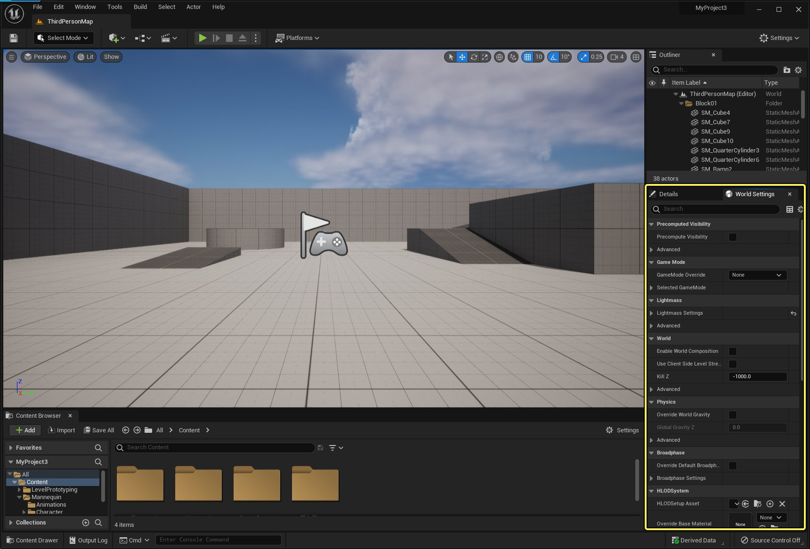

# World Settings

> 路径：虚幻引擎5.7文档 / 理解基础知识 / 关卡 / World Settings

> 原始页面：https://dev.epicgames.com/documentation/unreal-engine/world-settings-in-unreal-engine

该页面没有可用的官方中文版本；以下内容保留原文，并按本项目人工译文规则逐步回译。

每个关卡都可以从 **World Settings** 面板应用独有设置。可以使用此面板执行多种操作，从确保正确的 **Game Mode** 在播放关卡时激活，到调整该关卡中的全局光照工作方式。

要打开 World Settings 面板，请从主菜单前往 **Window**，然后选择 **World Settings**.

World Settings 面板的默认位置。点击图像查看完整尺寸。

该 **World Settings** 面板默认停靠在编辑器 UI 的 **Details** 面板旁。从这里可以为当前关卡指定设置。

使用 **Search** 框快速查找设置。

World 设置会根据影响关卡的不同方面分组。其中一些设置是通用设置，例如影响 Game Mode 和导航的设置；其他更专门的设置组用于配置游戏的光照、音频、物理等。

可以调整以下设置组：

## 预计算可见性

预计算可见性体积会以运行时内存为代价减少渲染线程时间。当处理较小关卡，或面向动态遮挡剔除可能受硬件限制的平台（例如移动端）时，这有助于优化游戏性能。它不太适合更大、更复杂的环境。

更多信息请参阅 [预计算可见性体积](../../../designing-visuals-rendering-and-graphics/optimizing-and-debugging-projects-for-rea-ea5cf1b9/visibility-and-occlusion-culling/precomputed-visibility-volumes/index.md).

## Game Mode

在这里可以为当前关卡选择并配置 Game Mode。Game Mode 定义游戏规则，例如玩家数量、分数或胜利条件。可以从所用项目模板附带的既有 Game Mode 中选择，也可以创建自定义 Game Mode。

从 **GameMode Override** 下拉菜单选择游戏模式后，可以配置其专用设置。

更多信息请参阅 [设置 Game Mode](../../../gameplay-tutorials/setting-up-a-game-mode/index.md).

## Lightmass

在此部分中，可以指定 Lightmass 设置，例如间接光照的细节和质量，以及是否使用环境光遮蔽（即模拟来自间接光照的柔和阴影，可为场景增加深度）。

要了解 Lightmass 以及可配置的不同设置，请参阅 [全局光照](../../../building-virtual-worlds/lighting-the-environment/global-illumination/index.md).

## World

这些设置会影响游戏世界的核心方面，例如关卡边界、导航系统，以及 Actor 在被销毁前可下落的深度。

关于此部分中不同区域的更多信息，请参阅：

- [World Composition](../../../building-virtual-worlds/level-streaming/world-composition/index.md)
- [Level Streaming Volumes 参考](../../../building-virtual-worlds/level-streaming/level-streaming-volumes-reference/index.md)

## 物理

使用此部分覆盖 World Gravity，它会影响某些 Z 轴行为，例如角色可跳多高或物体下落速度。

还可以在这里指定更高级设置，例如默认物理体积类和物理碰撞处理器类。

要了解 Unreal Engine 5 中的物理，请参阅 [物理](../../../gameplay-systems/physics/index.md).

## Broadphase

此部分包含 Broadphase 碰撞设置，这是 NVIDIA PhysX 系统的一项功能。可以指定在客户端还是服务器端使用 Broadphase。

Unreal Engine 实现了 Multi-Box Pruning，它会将 Broadphase 划分为由多个盒体组成的网格，这些盒体设置可控。 **MBPBounds** and **MBPOuter Bounds** 部分控制 multibox 的边界。

内部空间 **MBPBounds** 会按 **MBPNumSubDivs** 值划分以创建网格。例如：

- 如果 MBPNumSubDivs = 2，会创建 4 个单元格（2 x 2）的网格。
- 如果 MBPNumSubDivs = 3，会创建 9 个单元格（3 x 3）的网格。

如果物理活动对象落到 **MBPOuterBounds**指定的边界之外，它将不再参与碰撞。启用 **Use MBPOuter Bounds** 选项会在 multibox 网格边缘创建四个专用单元格。

要了解此系统的更多信息，请参阅 NVIDIA 文档： [刚体碰撞](https://docs.nvidia.com/gameworks/content/gameworkslibrary/physx/guide/Manual/RigidBodyCollision.html).

## HLOD 系统

在此部分中，可以启用 Hierarchical Levels of Detail（HLOD）。

HLOD 可以在较远视距用单个合并后的 Static Mesh Actor 替换多个 Static Mesh Actor。这有助于减少场景需要渲染的 Actor 数量，通过降低每帧 draw call 数量提升性能。

要了解使用 HLOD 的更多信息，请参阅 [Hierarchical Level of Detail](../../../building-virtual-worlds/hierarchical-level-of-detail/index.md).

## World Partition 设置和 World Partition

**World Partition** 是一种新的数据管理和基于距离的关卡流送系统，为大型世界管理提供完整解决方案。该系统通过将 World 存储在一个单一持久关卡中并划分为网格单元，消除了过去将大型关卡拆分为子关卡的需求，并提供自动流送系统，可根据距离流送源的距离加载和卸载这些单元格。

要了解 World Partition 以及如何配置其设置，请参阅 [World Partition](https://docs.unrealengine.com/5.0/en-US/building-virtual-worlds/world-partition/) 章节，该章节位于 Unreal Engine 5 Early Access 文档。

## 导航

配置关卡中使用的导航网格。

## VR

使用 **World to Meters** 变量调整虚拟世界比例。增大或减小此数值会让用户相对于周围世界感觉更大或更小。此设置以 Unreal Unit（UU）表示。在 UE4 中，1 Unreal Unit（UU）等于 1 厘米（cm）。

假设内容按 1 Unreal Unit = 1 cm 构建，将 **World To Meters** 设置为 **10** 会让世界显得非常大，而将 World To Meters 设置为 **1000** 会让世界显得非常小。

要了解缩放 VR 体验的更多信息，请参阅 [VR World Scale](../../../sharing-and-releasing-projects/developing-for-xr-experiences/getting-started-with-xr-development/xr-best-practices/index.md#vrwordscale).

关于 UE5 中 XR 开发的一般介绍，请参阅 [XR Development](../../../sharing-and-releasing-projects/developing-for-xr-experiences/index.md).

## 渲染

在此部分中，可以配置与距离场环境光遮蔽以及动态间接阴影相关的多个设置。

更多信息请参阅 [Distance Field Ambient Occlusion](../../../building-virtual-worlds/lighting-the-environment/mesh-distance-fields/distance-field-ambient-occlusion/index.md).

## 音频

使用此部分中的设置配置项目默认声音行为，例如音量、混响和淡化时间。

要了解 Unreal Engine 5 中音频和声音的更多信息，请参阅 [使用音频](../../../working-with-audio/index.md).

## Tick

**Ticking** 指按固定间隔在 Actor 或 Component 上运行一段代码或蓝图脚本，通常每帧一次。Ticking 通常按每个 Actor 或 Component 单独启用。

> [!NOTE]
> 除非游戏正在运行明确要求每帧 `Tick()` 更新函数先于一次性初始化 `BeginPlay()` 函数运行的旧代码，否则应禁用此选项，以确保对象正确 tick。

要了解 Ticking 和 Actor 行为的更多信息，请参阅 [Actor Ticking](../../../gameplay-systems/gameplay-framework/actors/actor-ticking/index.md).

## AI

在此部分中，可以启用 Unreal Engine 4 的 Artificial Intelligence（AI）系统。

要了解此系统的更多信息，请参阅 [人工智能](../../../gameplay-systems/artificial-intelligence/index.md).

## Cooking

**Cooking** 是构建游戏并将其部署到 PC 或移动端等平台过程的一部分。这些设置会影响场景中的内容如何包含在构建后的游戏中。

要了解此流程的更多信息，请参阅 [打包和 Cooking 游戏](../../../sharing-and-releasing-projects/packaging-and-cooking/index.md).
