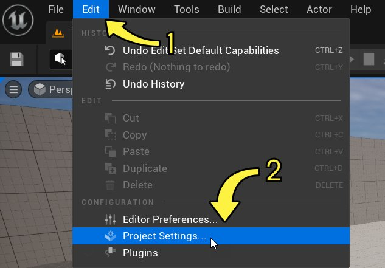

# 项目设置

> 路径：虚幻引擎5.7文档 / 理解基础知识 / 项目设置

> 原始页面：https://dev.epicgames.com/documentation/unreal-engine/project-settings-in-unreal-engine

通过 **项目设置（Project Settings）** 窗口，你可以配置影响以下内容的选项：

- 你的虚幻引擎项目。
- 引擎在运行项目时的行为。
- 项目如何在特定平台上运行。

启用某些插件后，"项目设置（Project Settings）"窗口中还会出现该插件的相关配置选项。

> [!NOTE]
> 该窗口中的所有设置都保存在项目的默认引擎配置文件（ `Engine.ini` ）中。"项目设置（Project Settings）"窗口提供了一个可视、直观以及可搜索的用户界面，帮助你来编辑这些设置。不过，你也可以手动编辑 `Engine.ini` 文件，来更改各项设置。

## 访问项目设置

要打开"项目设置（Project Settings）"窗口，请在虚幻引擎的主菜单中找到 **编辑（Edit）> 项目设置（Project Settings）** 。

## 类别和分段

在"项目设置（Project Settings）"窗口中，不同设置和选项会被按照其类型被分门别类地放置。在左侧导航区域中点击某个大类，右侧面板便会显示相关的设置选项。你也可以直接按名称搜索某个选项。

你可以将项目设置导出为备份文件，存放在你的计算机中，也可以通过文件导入项目设置，方法是点击"项目设置（Project Settings）"窗口右上角的 **导出（Export）** 或 **导入（Import）** 。

> [!NOTE]
> 每次更改"项目设置（Project Settings）"中的某个设置时，编辑器的 `.ini` 文件都会更新，其中的值会被应用到所有平台。编辑器的 `.ini` 文件位于 `<ProjectDirectory>\Config\DefaultEngine.ini` 。
>
> 平台 `.ini` 文件必须在文本编辑器中手动编辑，并且仅影响对应的平台。平台 `.ini` 文件的示例路径： `<ProjectDirectory>\Config\Windows\WindowsEngine.ini`

"项目设置（Project Settings）"窗口包含以下分段和类别：

- [项目](project-section-of-the-unreal-engine-project-settings/index.md) - 虚幻引擎项目设置的项目分段的参考。

- [游戏](game-section-of-the-unreal-engine-project-settings/index.md) - 虚幻引擎项目设置

- [引擎](engine-settings-in-the-unreal-engine-project-settings/index.md) - 虚幻引擎项目设置的

- [编辑器](editor/index.md) - 虚幻引擎项目设置的

- [平台](platforms-section-of-the-unreal-engine-project-settings/index.md) - 虚幻引擎项目设置的平台分段的参考。

- [插件设置](plugins-section-of-the-unreal-engine-project-settings/index.md) - 虚幻引擎项目设置的插件分段的参考。
