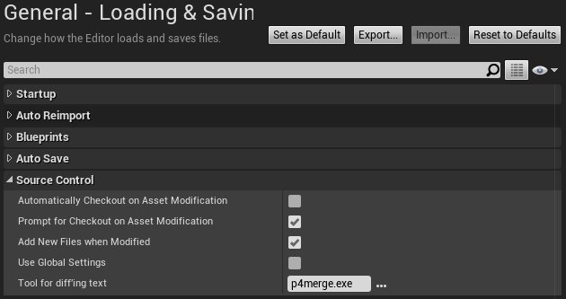
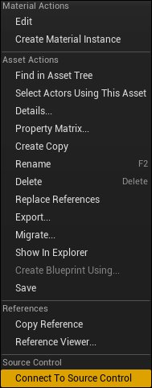
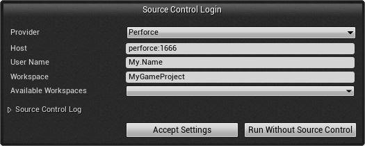
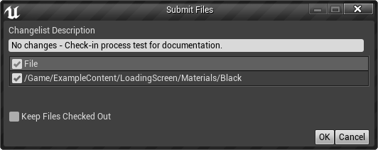
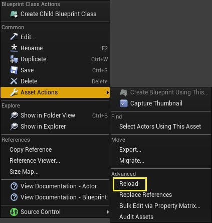

# 源码管理

> 路径：虚幻引擎5.7文档 / 理解基础知识 / 源码管理

> 原始页面：https://dev.epicgames.com/documentation/unreal-engine/source-control-in-unreal-engine

虚幻编辑器内置了对源码管理软件的支持。源码管理（Source Control）软件用来管理代码、数据在一段时间内的状态。它能让团队更加方便地协同开发游戏。

> [!NOTE]
> 虚幻引擎默认支持Perforce和SVN。

## 启用源码管理

你可以用两种方式来启用源码管理：

- 通过关卡编辑器的

  偏好设置（Preferences）

  窗口。
- 通过

  内容浏览器（Content Browser）

  。

### 通过编辑器偏好设置启用源码管理

你可以通过编辑器偏好设置窗口（**编辑（Edit）> 编辑器偏好设置（Editor Preferences）> 加载和保存（Loading & Saving）**）启用源码管理。

| 项目 | 说明 |
| --- | --- |
| **资产修改时是否自动检出（Automatically Checkout on Asset Modification）** | 选中后，它将自动检出所有发生过修改的资产。 |
| **修改包时提示检出（Prompt for Checkout on Package Modification）** | 选中后，当你改动某个由源码管理控制的安装包时，将出现一条提示，询问你是否希望检出（锁定）该包。 |
| **修改时添加新文件（Add New Files when Modified）** | 在发生改动时向源码管理添加新的文件。 |
| **使用全局设置（Use Global Settings）** | 使用全局性的源码管理登录设置，而非单独设置每个项目。修改后需重新登录。 |
| **文本比对工具（Tool for diffing text）** | 指定文本比对工具的路径。 |

### 通过内容浏览器启用源码管理

你还可以在 **内容浏览器（Content Browser）** 中启用源码管理。为此，右键点击资产或文件夹。在上下文菜单底部的 **源码管理（Source Control）** 部分，点击 **连接到源码管理（Connect to Source Control）**。

这将打开一个登录界面，你可以在其中选择源码管理系统并输入任何适当的设置和其他信息。

输入适当的信息，然后点击 **接受设置（Accept Settings）**。启用源码管理后，**内容浏览器（Content Browser）** 中资产的显示将发生变化，以反映其源码管理状态，右键点击上下文菜单中将包含一些源码管理选项。

## 状态图标

*内容浏览器（Content Browser）** 会在资产的右上角显示特殊图标，以提供源码管理的状态。下面是可用的图标以及它们的含义：

| CheckedOutByYou.png | CheckedOut.png | MarkedForAdd.png | NotInTheDepot.png | NotHeadRevision.png |
| --- | --- | --- | --- | --- |
| 已被你检出 | 已被另一用户检出 | 已标记进行添加 | 不在Depot库中 | 源码管理中存在新版本的文件 |

## 源码管理操作

启用源码管理后，如果你右键点击一个资产，将有以下上下文菜单可用：

| 项目 | 说明 |
| --- | --- |
| **检出（Check Out）** | 检出（锁定）此资产进行编辑。它将防止其他用户同时编辑此资产。 |
| **刷新（Refresh）** | 刷新资产的源码管理状态。 |
| **历史记录（History）** | 提供所选资产的修改历史列表，允许你查看之前的编辑。 |
| **和Depot中文件进行比较（Diff Against Depot）** | 它允许你根据当前存储在源码管理Depot的版本检查资产。 |

## 检出和检入

要检出资产进行编辑，只需右键点击它并选择 **检出（Check Out）**。在迁回资产时，请遵守以下方案：

- 右键点击资产并选择

  检入（Check In）

  。将出现一个对话框，其中包含检入所需的变更列表描述。
- 输入描述，它将被添加到资产的修改历史记录。
- 完成后，点击

  确定（OK）

  。

> [!NOTE]
> 需要变更列表描述，因此在输入描述之后方才启用 **确定（OK）** 按钮。

## 内容热重载

**内容热重载（Content Hot Reloading）** 是一项新功能，当内容被源码管理操作修改时，编辑器内的源码管理使用该功能来自动重载内容。目前，自动重载仅在通过编辑器内的源码管理集成执行源码管理操作时有效，任何外部更改都不会触发重载。我们打算在以后的引擎版本中删除这一需求，这样外部更改也会触发热重载。

内容热重载还提供了从命令中的前一保存状态重载资产的能力。可以通过在 **内容浏览器（Content Browser）** 中右键点击资产并在 **资产操作（Asset Actions）** 组下选择 **重载（Reload）** 选项来实现该功能。如果你对资产进行了未保存的更改并且想要放弃这些修改以恢复到磁盘上的版本，该功能非常有用。

> [!NOTE]
> 目前，该功能要求你为你的项目启用源码管理。

## 停用源码管理

你有时需要在启用源码管理后停用它。

> [!WARNING]
> 只有在绝对确定不想要使用源码管理时，才使用此选项。停用源码管理将导致你的本地内容无法与源码管理系统同步，并且将无法检入更改。

**停用源码管理**：

1. 在关卡编辑器窗口的右上角，点击绿色双箭头图标(

   )。这将打开

   源码管理登录（Source Control Login）

   界面。
2. 点击

   脱离源码管理运行（Run Without Source Control）

   按钮。关卡编辑器窗口中的绿色图标将变成一个带斜杠的红色圆圈(

   )，指示没有使用源码管理。
