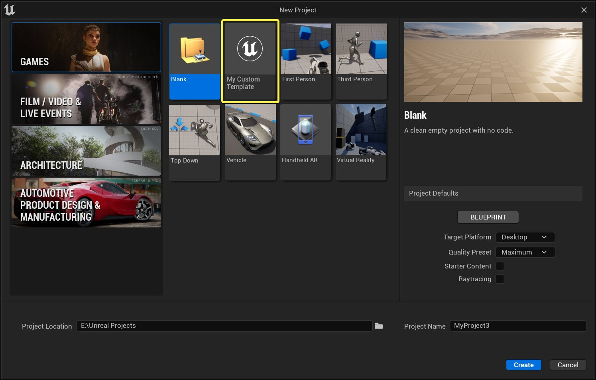

# 创建自定义模板

> 路径：虚幻引擎5.7文档 / 理解基础知识 / 使用项目和模板 / 创建自定义模板

> 原始页面：https://dev.epicgames.com/documentation/unreal-engine/converting-a-project-to-an-unreal-engine-template

虚幻引擎的模板可以提供一个制作项目更好的起始点。你可以使用它们来快速地针对某个平台开始开发或者创建特别项目，比如多屏幕体验。

使用虚幻引擎时，你可以使用已有的项目创建 **自定义模板（custom templates）** 来达到你的各种需求。

自定义模板是一个虚幻引擎项目，设置为在创建新项目时作为模板和其它的模板一起在引擎中显示。

自定义模板可以包含内容、设置和代码，并且可以设置默认启用或禁用指定的插件。

## 步骤

> [!NOTE]
> 在以下教程中，[ProjectName] 代表你的虚幻引擎项目名（比如 `MyProjectName.uproject` ）。这与 `DefaultGame.ini` 文件中的变量 **ProjectName** 不同（没有方括号）。

要将已有的项目转换为模板：

1. 将 **整个** 项目文件夹复制到你的引擎安装目录的 `Templates` 文件夹啊。如果你从Epic Games启动器安装了虚幻引擎，那么 `Templates` 文件夹会位于：

   - Windows系统： `C:\Program Files\Epic Games\UE_[version]\Templates`
   - Mac： `/Users/Shared/Epic Games/UE_[version]/Templates`

   如果你从源代码编译了虚幻引擎，那么 `Templates` 文件夹会位于 `[ForkLocation]\UE4\Templates` 。
2. 打开 `[ProjectName]\Config\DefaultGame.ini 文件` 。然后添加或更新 **ProjectName** 变量。这是在创建新项目时显示在模板选择区域内的名称。

   示例：

   ```
        [/Script/EngineSettings.GeneralProjectSettings]     ProjectID=E6468D0243A591234122E38F92DB28F4     ProjectName=MyTestTemplate 
   ```

   注意 **ProjectID** 变量是为每一个项目生成的一个独特的ID。
3. 在你的虚幻引擎安装目录中，找到 `Templates\TP_FirstPerson\Config\` 。将 `TemplateDefs.ini` 文件复制到 `[ProjectName]\Config` 文件夹。

   > [!TIP]
   > 除了 `TP_FirstPerson` 以外，你还可以使用任何已有的模板文件夹，只要其中包含一个 `TemplateDefs.ini` 文件即可。
4. 打开上一步复制的 `TemplateDefs.ini` 文件并且更新 **LocalizedDisplayNames** 和 **LocalizedDescriptions** 变量。一共有四组变量，每组对应一个虚幻引擎支持的语言：英文 (en)、韩文 (ko)、日文 (ja) 以及简体中文 (zh-Hans)。

   示例：

   ```
            [/Script/GameProjectGeneration.TemplateProjectDefs]         LocalizedDisplayNames=(Language="en",Text="My Test Template")         LocalizedDescriptions=(Language="en",Text="This is a custom template that includes a first-person character and uses Blueprint.") 
   ```
5. 当你创建新项目时，你的模板会在 `TemplateDefs.ini` 文件中定义的类别里出现。这由 **Categories** 变量所控制。不管变量名称是什么，一个模板只能分配 **一个** 类别。

   可以使用的类别有：

   - Games

     - 游戏
   - ME

     - 电影、电视和现场活动
   - AEC

     - 建筑、工程和建造
   - MFG

     - 汽车、产品设计和生产

   更多信息可以参考 `[虚幻引擎安装目录]\UE_[版本]\Templates` 文件夹下的 `TemplateCategories.ini` 文件。
6. 你可以在 `[ProjectName]\Media` 文件夹中添加一个图标和预览图。这些图片必须为PNG格式并且满足以下命名要求：

   - 图标：

     [ProjectName].png

     .
   - 预览图：

     [ProjectName]_Preview.png

     .

## 最终结果

现在你应该可以在新项目对话框中看到新的模板。



*示例中虚幻项目浏览器中有一个名为My Test Template的新的自定义模板。*

> [!NOTE]
> 要查看新的模板，仅需关闭并重新打开新项目窗口。然而，如果对已有的模板进行了任何更改（更改名称或描述），就必须重启虚幻引擎来让窗口中显示这些变动。
