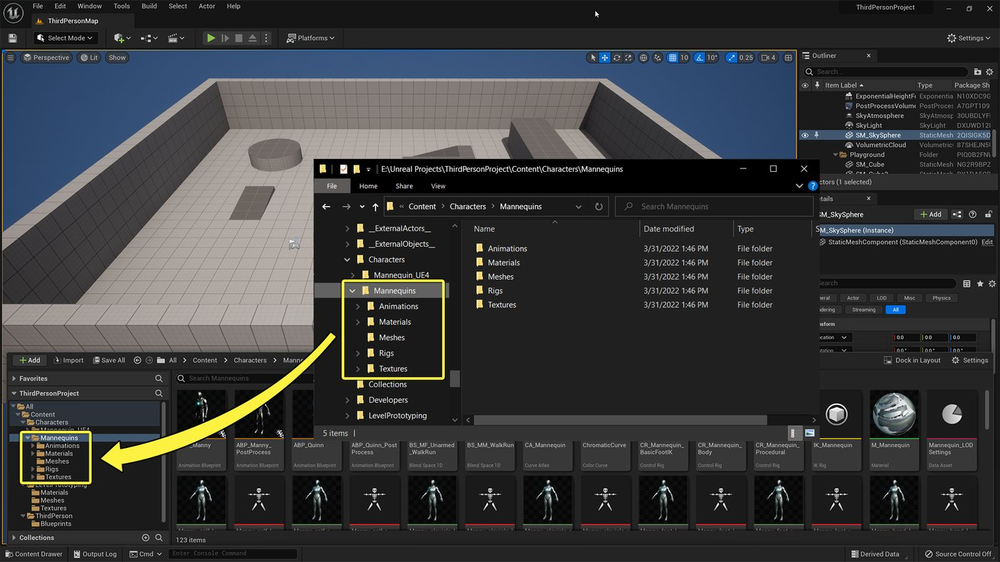

# 使用项目和模板

> 路径：虚幻引擎5.7文档 / 理解基础知识 / 使用项目和模板

> 原始页面：https://dev.epicgames.com/documentation/unreal-engine/working-with-projects-and-templates-in-unreal-engine

虚幻引擎项目包含游戏和应用程序的所有内容，并将所有内容联系在一起。 它包含磁盘上的许多文件夹和资产，例如蓝图、材质、纹理、3D资产、动画等。

虚幻编辑器中的[内容浏览器](../content-browser/index.md)采用的文件和文件夹结构与磁盘中的`Project`文件夹相同。

"内容浏览器（Content Browser）"采用与磁盘上的虚幻引擎项目相同的文件和文件夹结构。 点击图像查看大图。

每个虚幻引擎项目都有一个关联的`.uproject`文件。 `.uproject`文件定义了项目的创建、打开或保存方式。 你可以创建任意数量的不同项目，然后并行处理它们。

## 处理项目

要了解有关虚幻引擎项目的更多信息，请参阅以下页面。

- [新建项目](creating-a-new-project/index.md) - 介绍如何在虚幻引擎中创建并配置新项目。

- [打开现有项目](opening-an-existing-unreal-engine-project/index.md) - 介绍如何访问和打开虚幻引擎中的现有项目。

- [创建自定义模板](converting-a-project-to-an-unreal-engine-template/index.md) - 将已有的项目转换为模板所需的步骤

- [游戏模板变体](template-reference/variants-in-game-templates/index.md) - 不同类型游戏模板项目的可用变体。

- [为模板角色配置输入](template-reference/configuring-input-for-your-template-pawns/index.md) - 如何更改模板角色的功能按钮。

## 将项目升级到虚幻引擎5

如需了解如何将虚幻引擎4.2x升级到虚幻引擎5，请参阅下述指南。

- [虚幻引擎5迁移指南](../../whats-new/unreal-engine-5-migration-guide/index.md) - 关于将虚幻引擎4项目迁移到虚幻引擎5的步骤和要求。

## 项目模板

虚幻引擎**模板**是不同类型项目的起始点。 模板中包含一些预制资产，例如已包含输入模块和动画的人形角色，或者用于光照研究和风格化渲染的示例场景。

除了虚幻引擎的现有模板之外，你还可以将任何项目转换为自定义模板，以便在你创建的其他项目中重复使用其资产和配置。

- [模板参考](template-reference/index.md) - 虚幻引擎中的模板与模板的用法

- [第一人称模板](template-reference/first-person-template/index.md) - 虚幻引擎中第一人称模板介绍

- [第三人称模板](template-reference/third-person-template/index.md) - 介绍虚幻引擎中的第三人称游戏模板。

- [俯视角模板](template-reference/top-down-template/index.md) - 虚幻引擎俯视角模板介绍。

- [载具模板](template-reference/vehicle-template/index.md) - 载具游戏模板介绍。
