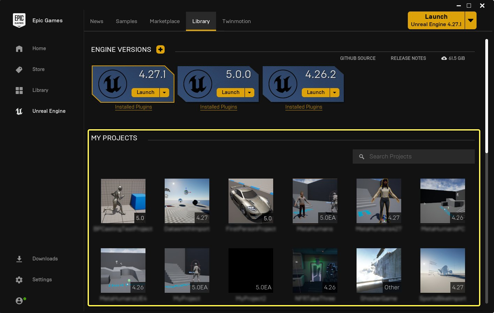
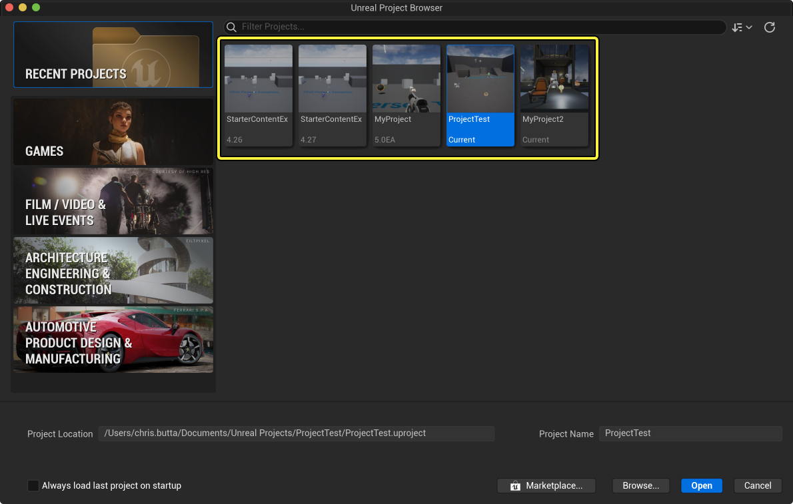
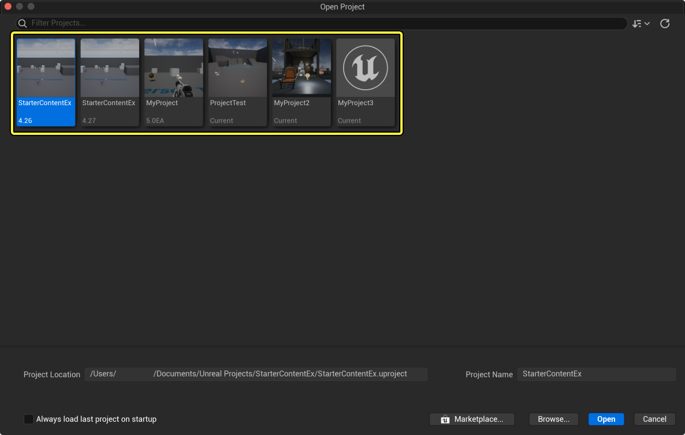
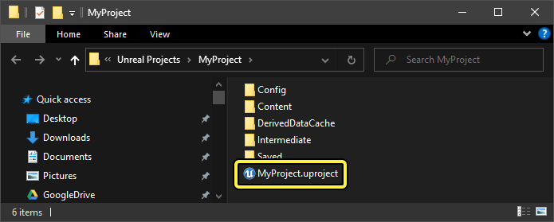
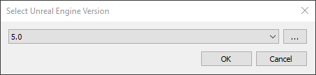

# 打开现有项目

> 路径：虚幻引擎5.7文档 / 理解基础知识 / 使用项目和模板 / 打开现有项目

> 原始页面：https://dev.epicgames.com/documentation/unreal-engine/opening-an-existing-unreal-engine-project

可通过多种方式打开现有虚幻引擎项目，具体取决于该项目所在位置以及创建该项目所使用的虚幻引擎版本。

## 从Epic Games启动程序打开项目

在Epic Games启动程序中，点击左侧导航中的 **虚幻引擎（Unreal Engine）** ，然后点击启动程序顶部的 **库（Library）** 。你将在本地计算机上看到所有虚幻引擎项目的列表。

> [!NOTE]
> 如果你从其他计算机或从互联网复制了项目，该项目仅当你在本地将其打开至少一次之后才会显示在此列表中。请参阅此页面上的 **从磁盘打开项目（Opening Projects From Disk）** 分段，了解更多信息。

Epic Games启动程序的"我的项目（My Projects）"分段。点击查看大图。

双击某个项目缩略图以打开该项目。

启动程序会为每个项目显示以下信息：

- 项目名称
- 项目缩略图
- 项目兼容的虚幻引擎版本

右键点击启动程序中的项目缩略图会显示上下文菜单，其中包含以下选项：

| **选项** | **说明** |
| --- | --- |
| **打开（Open）** | 在项目兼容的虚幻引擎版本中打开项目。 |
| **在文件夹中显示（Show in folder）** | 在新的Windows资源管理器(Windows)或访达(macOS)窗口中打开项目文件夹。 |
| **创建快捷方式（Create shortcut）** | 在桌面上创建项目的快捷方式。 |
| **克隆（Clone）** | 创建项目的精确副本。你可以指定新项目的名称和位置。 |
| **删除（Delete）** | 永久删除项目。 项目文件 **不会** 像你从Windows资源管理器或访达中删除项目文件夹时那样移入回收站。如果你使用此选项意外删除了项目，将无法恢复该项目。 |

## 从项目浏览器打开项目

当你启动某个 **虚幻引擎（Unreal Engine）** 版本时，**项目浏览器（Project Browser）** 会显示，并默认打开 **最近项目（Recent Projects）** 面板。此分段会显示磁盘上的所有虚幻引擎项目，这与Epic Games启动程序中的项目列表非常类似。

> [!NOTE]
> 如果你从其他计算机或从互联网复制了项目，该项目仅当你在本地将其打开至少一次之后才会显示在此列表中。请参阅此页面上的 **从磁盘打开项目（Opening Projects From Disk）** 分段，了解更多信息。

虚幻引擎5中的项目浏览器。点击查看大图。

双击某个项目缩略图以打开该项目。或者，点击选中该项目，然后点击 **打开（Open）** 。

启动程序会为每个项目显示以下信息：

- 项目名称
- 项目缩略图
- 项目兼容的虚幻引擎版本

右键点击项目浏览器中的项目缩略图会显示上下文菜单，其中包含用于在Windows资源管理器或访达窗口中打开项目文件夹的选项。

> [!TIP]
> 启用项目浏览器左下方的 **启动时始终加载最后一个项目（Always load last project on startup）** 复选框，以使虚幻引擎5在你启动引擎时始终打开你工作过的最后一个项目。

## 从虚幻引擎打开项目

在 **虚幻引擎（Unreal Engine）** 的主菜单中，转到 **文件（File）> 打开项目（Open Project）** 。这将打开一个窗口，其中显示本地项目的列表，类似于 **项目浏览器（Project Browser）** 。

从虚幻引擎打开项目。点击查看大图。

要打开项目，请执行以下一项操作：

- 从列表选择项目，然后点击

  打开（Open）

  。
- 双击项目缩略图。

如果你要打开的项目不在列表中，请点击 **浏览（Browse）** ，然后浏览到项目文件夹，并打开 `(ProjectName).uproject` 文件。

> [!WARNING]
> 如果打开项目所用虚幻引擎版本不同于创建该项目所用版本，这可能导致数据损坏和数据丢失。推荐打开项目的副本，保留原始项目。

## 从磁盘打开项目

如果你从其他计算机或从互联网复制了项目，该项目仅当你在本地将其打开至少一次之后才会显示在此列表中。

要从磁盘打开项目，请执行以下步骤：

1. 确保你已安装创建项目所用的虚幻引擎版本。
2. 导航至磁盘上的项目文件夹。
3. 双击 `(ProjectName).uproject` 文件。此文件就位于项目所在的文件夹中。

在此示例中，你将双击 MyProject.uproject 文件。

如果你没有创建项目所用的虚幻引擎版本，系统将显示一个弹出窗口，要求你选择使用哪个虚幻引擎版本打开项目。

从下拉菜单选择虚幻引擎版本，或点击 **省略号** (**...**)按钮以浏览到磁盘上的虚幻引擎可执行文件，然后点击 **确定（OK）** 。

> [!WARNING]
> 如果打开项目所用虚幻引擎版本不同于创建该项目所用版本，这可能导致数据损坏和数据丢失。推荐打开项目的副本，保留原始项目。
