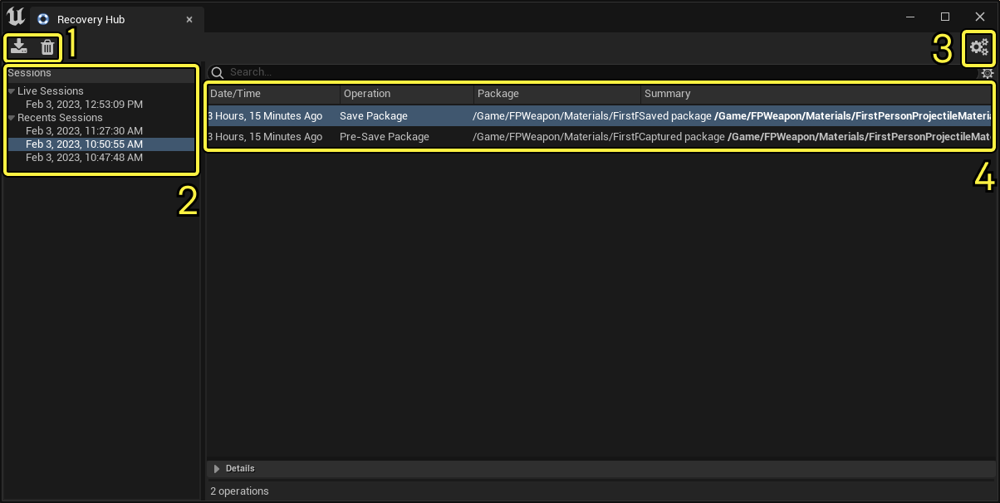

# 恢复中心

> 路径：虚幻引擎5.7文档 / 理解基础知识 / 使用项目和模板 / 恢复中心

> 原始页面：https://dev.epicgames.com/documentation/unreal-engine/recovery-hub-in-unreal-engine

**恢复中心（Recovery Hub）** 是一个虚幻引擎插件，可在编辑器崩溃或异常退出后帮助恢复引擎会话。在虚幻引擎4中，此插件名为"灾难恢复（Disaster Recovery）"。

> [!NOTE]
> 默认情况下不启用恢复中心插件。必须先[启用该插件](../../foundational-knowledge-in/working-with-plugins/index.md)后才能使用。

如果使用的资产大于2GB，恢复中心在记录每个操作时将占用大量磁盘空间。如果磁盘空间开始变得不足，应暂时禁用该系统。为此，请在[项目设置（Project Settings）](../../project-settings/index.md)窗口的 **插件（Plugins）> 恢复中心（Recovery Hub）** 分段中禁用 **启用（Is Enabled）** 选项。

## 恢复中心的工作原理

当编辑器启动时，灾难恢复会自动检查上次会话是否异常结束。如果是，编辑器将检索以前记录的操作列表，并提供重新运行这些操作的选项。可选择重新运行部分或全部的操作，以帮助恢复上次编辑器会话崩溃时可能丢失的工作。

恢复中心将对Actor或资产的每项更改作为 **操作** 进行读取，并维护近期操作的列表。如果编辑器崩溃，可将项目回滚到上一个操作以恢复所有丢失的工作。

由于恢复中心仅支持关卡编辑和Sequencer，因此它与自动保存文件配合使用的效果最佳，且其初衷并非替代自动保存功能。每次保存和自动保存都计为恢复中心内的一个操作。

> [!TIP]
> 请在[编辑器偏好设置（Editor Preferences）](../../foundational-knowledge-in/unreal-editor-preferences/index.md)的 **通用（General）> 加载和保存（Saving & Loading）** 分段中启用 **自动保存（Autosave）**。

## 恢复中心界面

点击图片以查看大图。

"恢复中心（Recovery Hub）"窗口包含以下区域：

| **编号** | **名称** | **描述** |
| --- | --- | --- |
| 1 | **主工具栏** | 包含两个按钮： **导入（Import）**：导入 `.json` 格式的崩溃数据转储。 **删除（Delete）**：删除当前选定会话。 |
| 2 | **会话（Sessions）** 面板 | 显示已保存会话的列表。 |
| 3 | **配置（Configurations）** 按钮 | 单击此按钮可在"项目设置（Project Settings）"中打开恢复中心插件设置。 |
| 4 | 会话细节 | 显示当前选定会话的操作列表。 |

## 恢复会话

要在崩溃后恢复虚幻编辑器会话，请执行以下步骤：

1. 打开恢复中心。从主菜单转到 **工具（Tools）> 恢复中心（Recovery Hub）**。
2. 在 **会话（Sessions）** 面板中，选择要恢复的会话。
3. 单击 **全部恢复（Recover All）**。在编辑器崩溃后会出现此按钮。

## 删除会话

如果要释放磁盘空间，可删除不再需要的早期恢复中心会话。请按照以下步骤执行此操作：

1. 打开恢复中心。从主菜单转到 **工具（Tools）> 恢复中心（Recovery Hub）**。
2. 在 **会话（Sessions）** 面板中，选择要删除的会话。
3. 单击 **删除（Delete）** 按钮。
