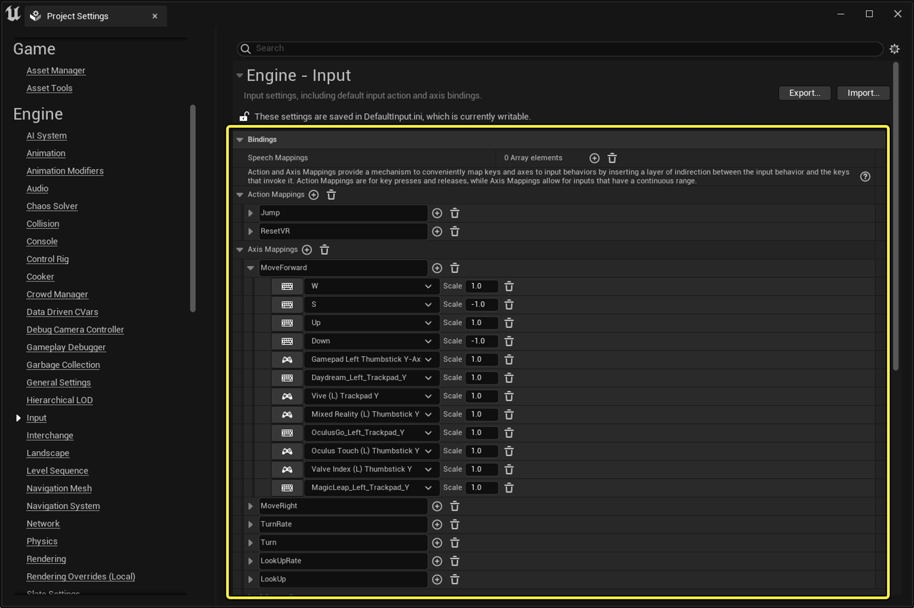

# 为模板角色配置输入

> 路径：虚幻引擎5.7文档 / 理解基础知识 / 使用项目和模板 / 模板参考 / 为模板角色配置输入

> 原始页面：https://dev.epicgames.com/documentation/unreal-engine/configuring-input-for-your-template-pawns

很多模板中都包含一个可以使用键盘、鼠标或控制器来控制的角色。 在虚幻引擎术语中，这种角色称为**Pawn**。

你可以在 **项目设置（Project Settings）** 的 **输入（Input）** 分段中查看Pawn的现有功能按钮，并配置新的功能按钮。 要打开项目设置，请执行以下操作：

1. 转到主菜单，前往**编辑（Edit） > 项目设置（Project Settings）**。
2. 转到左边侧边栏，向下滚动到**引擎（Engine）**分段，然后点击**输入（Input）**。

展开**绑定（Bindings）**分段并编辑以下选项：

- **动作映射（Action Mappings）**：定义用于控制动作（例如跳跃）的按键。
- **轴映射（Axis Mappings）**：控制移动。 根据模板的不同，可以将角色移动限制到一个或几个轴上。 例如，在"横版过关游戏"模板中，Pawn只能左右移动和跳跃。

