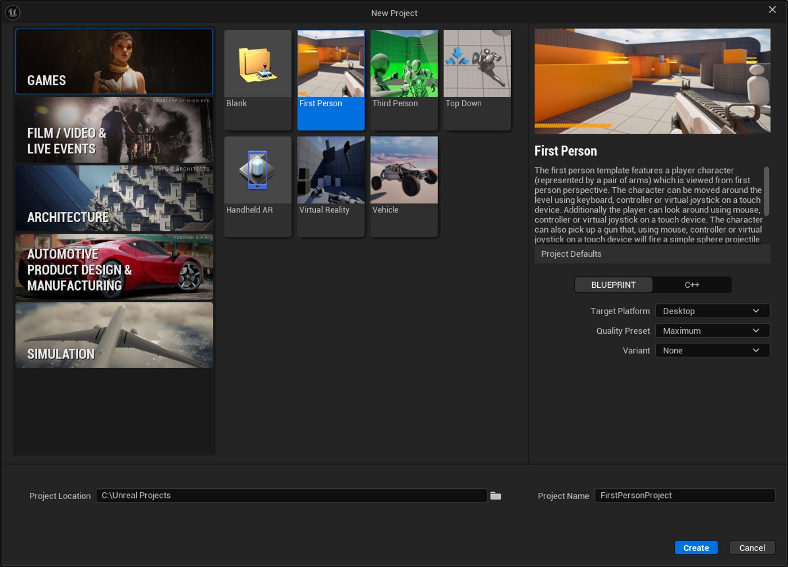
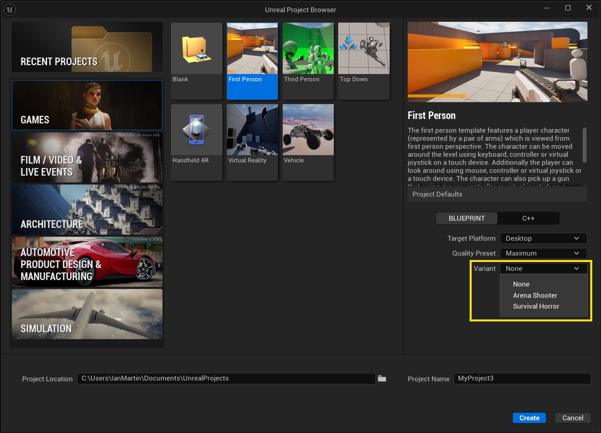
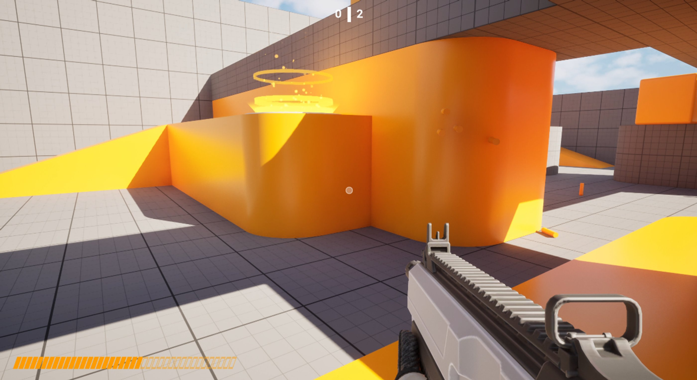
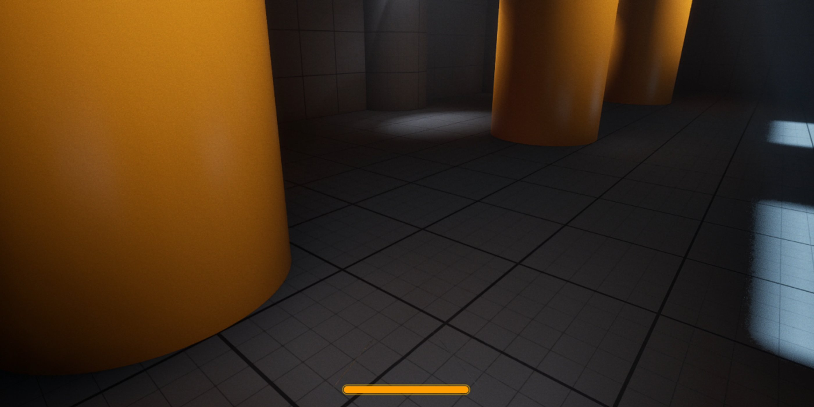

# 第一人称模板

> 路径：第一人称模板

> 原始页面：https://dev.epicgames.com/documentation/unreal-engine/first-person-template-in-unreal-engine

当你新建项目时，虚幻引擎会向你提供模板列表供你选择。 这些模板包含一些可立即使用的资产，例如关卡几何体、可控的角色以及简单的角色动画等。 许多教程将其中一款模板用作起始点。

**在第一人称**游戏中，玩家从其所扮演角色的视点来查看游戏。 一些第一人称游戏会显示角色模型的某部分，例如角色的手臂或武器。 这与[第三人称游戏](../third-person-template/index.md)不同，在后者中，你可以从角色背后略上方的位置看到角色动作。

## 创建第一人称游戏项目

启动虚幻引擎会打开**项目浏览器（Project Browser）**窗口，你可以在其中选择打开现有的虚幻项目，或创建新项目。 要创建第一人称游戏项目，请选择左侧的**游戏（Games）**类别，然后选择**第一人称游戏（First Person）**模板。

在虚幻引擎5中创建新的第一人称项目。

你还可以为**第一人称游戏**项目配置额外的设置。 你可以配置以下设置：

| 设置 | 说明 |
| --- | --- |
| **目标平台** | 选择你的项目适用的平台类型：**台式机（Desktop）****移动端（Mobile）** |
| **质量预设（Quality Preset）** | 根据你的项目目标平台，选择最高质量级别。 我们建议你选择：**最大值（Maximum）**，如果你在为计算机或游戏主机开发项目。**可伸缩（Scalable）**，如果你在为移动设备开发项目。 |
| **变体（Variant）** | 要使用的模板的变体。 变体会为项目添加额外的资产。 如需详细了解变体，请参阅此页面的模板变体小节。 |

完成这些步骤后，你的项目会包含一个基本关卡和一个可以使用键鼠控制的第一人称角色。

要试用关卡，请点击主工具栏上的**运行**图标。 使用**WASD**键来移动角色，移动鼠标来观察四周。

## 模板变体

第一人称游戏模板的**变体（Variants）**下拉菜单提供了一系列的可选变体。 变体可帮助你更快地编译特定的Gameplay风格。 第一人称游戏模板包含的变体为：**无（None）**，即无额外内容、**竞技场射击游戏（Arena Shooter）**以及**生存恐怖游戏（Survival Horror）**。

| 变体名称 | 说明 |
| --- | --- |
| **无（None）** | 基础模板，包含内容如下：一个可移动、可操作的第一人称角色。一个包含基础几何体（如斜坡和平台等）的关卡。 |
| **竞技场射击游戏（Arena Shooter）** | 第一人称射击游戏的模板，包含内容如下：一个可移动、可操作的第一人称角色。一个包含基础几何体（如斜坡和平台等）的关卡。多把枪支，可供玩家拾取并射出子弹。在关卡中移动的敌人，可被玩家射击。使角色跳跃的踏板。显示十字准星、得分和武器弹药量的UI。 |
| **生存恐怖游戏（Survival Horror）** | 第一人称生存恐怖游戏的模板，包含内容如下：一个可移动、可操作的第一人称角色。昏暗的关卡，包含光源、斜坡、平台和自动门。角色的冲刺功能和体力条。 |

如需详细了解这些变体的特色，请参阅[游戏模板变体](../variants-in-game-templates/index.md)。

### 竞技场射击游戏变体

**竞技场射击游戏**变体包含了封闭的关卡，内有多个关卡、可拾取的武器以及AI敌人。

#### 武器

在竞技场射击游戏变体，玩家角色可以走到可拾取武器处以拾取不同的武器，包括榴弹发射器、手枪和步枪等。

`Content/Weapons`文件夹包含了不同枪械类型的资产。

武器和武器拾取物的蓝图位于`Content/Variant_Shooter/Blueprints/Pickups`文件夹。 存在一个武器的基类（**BPWeaponBase**），我们用它创建了榴弹发射器、手枪和步枪的类。

子弹会随鼠标左键点击而生成，会对关卡中碰撞到的任何启用了物理效果的Actor施加物理冲击。 你可以在`Content/Variant_Shooter/Blueprints/Pickups/Projectiles`文件夹的**BP_FirstPersonProjectile**蓝图中看到该逻辑的实现方式。

`Content/Variant_Shooter/Anims`文件夹中是对应各武器的角色网格体的动画。

#### 敌人

竞技场射击游戏变体包含了在关卡中走动的敌人，它们会寻找并射击玩家。 玩家和敌人都可以被射击并杀死。 敌人的蓝图位于`Content/Variant_Shooter/Blueprints/AI`文件夹，与[状态树](../../../../gameplay-systems/artificial-intelligence/statetree/overview-of-state-tree/index.md)、[环境查询](../../../../gameplay-systems/artificial-intelligence/environment-query-system/environment-query-system-overview/index.md)和[行为树](../../../../gameplay-systems/artificial-intelligence/behavior-trees/behavior-tree-in-unreal-engine---user-guide/index.md)黑板资产的位置相同。

#### UI

竞技场射击游戏变体的UI包括十字准星、玩家的击杀数和死亡数，以及玩家当前武器的弹药数量。 该UI的蓝图和资产位于`Content/Variant_Shooter/UI`文件夹中。

### 生存恐怖游戏变体

**生存恐怖游戏**变体配备了预配置的光照和氛围设置，营造了低亮度、高对比度的环境。

#### 光源

生存恐怖游戏变体的关卡环境黑暗，包含一系列不同颜色的光源，营造了游戏的基调，还能帮助玩家寻路。 光源的蓝图和资产位于`Content/Variant_Shooter/Blueprints/Light`文件夹中。

#### 冲刺机制

生存恐怖游戏变体中，角色能在玩家按住冲刺按钮（键盘的**Shift**键或手柄的**左肩**或**左摇杆**键）时冲刺。 玩家角色拥有体力条，冲刺时消耗体力条。体力条耗尽时角色会停止冲刺。

冲刺机制的逻辑被包含在游戏玩家角色的蓝图中（**BP_FP_Horror**），位置为`Content/Variant_Horror/Blueprints`文件夹，以及`Content/Variant_Horror/Input`文件夹。

#### UI

体力条的UI资产位于`Content/Variant_Horror/UI`文件夹中。

## 模板内容

第一人称游戏模板的所有变体都包含了一些第一人称游戏体验的基本元素。 以下小节详细介绍了这些元素，并指出了其在**内容浏览器**中的位置。

### 蓝图

第一人称游戏模板的**无（None）**变体包含以下资产的蓝图：

- 玩家角色
- 游戏模式
- 玩家控制器
- 摄像机管理器

这些蓝图位于`Content/FirstPerson/Blueprints`文件夹中。 各个蓝图中的事件图表包含了评论和注解，用于说明各节点群组的作用以及实现方案背后的逻辑。

**竞技场射击游戏**变体使用的玩家角色、玩家控制器和游戏模式位于`Content/Variant_Shooter/Blueprints/FirstPerson`文件夹中。

**生存恐怖游戏**变体使用的玩家角色和游戏模式位于`Content/Variant_Horror/Blueprints`文件夹中。

### 第一人称角色

第一人称角色包含了完整的身体网格体，使用[第一人称渲染](../../../../designing-visuals-rendering-and-graphics/general-features-of-rendering/first-person-rendering/index.md)在第一人称摄像机的视图中渲染。 当玩家将摄像机朝下，以及当角色移动或持枪时，该网格体对玩家可见。 该网格体不会在其他摄像机视图中被渲染。

玩家角色的资产位于`Content/Characters/Mannequins`文件夹中。 你可以在这里找到骨架网格体、材质、纹理、动画以及角色的绑定。

### 级别

组成所有变体的关卡几何体的资产（静态网格体、材质和纹理）位于`Content/LevelPrototyping`文件夹中。

第一人称游戏模板的**无（None）**变体的关卡（即**Lvl_FirstPerson**）位于`Content/FirstPerson`文件夹中。

**竞技场射击游戏**变体的关卡（即**Lvl_Shooter**）位于`Content/Variant_Shooter`文件夹中。 该关卡包括斜坡、平台、跳跃板、敌人和可拾取武器。

**生存恐怖游戏**变体的关卡（即**Lvl_Horror**）位于`Content/Variant_Horror`文件夹中。 该关卡包括斜坡、平台、自动门和光源。

## 改进你的项目

现在你有了一个可游玩的关卡，可以开始导入内容并调整游戏了。 要为关卡添加内容，最简单的方法是从**内容浏览器**中拖放内容。

如需详细了解如何填充关卡，请参阅[关卡设计师快速入门](https://dev.epicgames.com/documentation/unreal-engine/level-designer-quick-start-in-unreal-engine?application_version=5.7)。

## 接下来呢？

你已经了解创建第一人称体验的基础知识，以下是你可以尝试的其他一些内容：

- 使用来自[Quixel Bridge](../../../../samples-and-tutorials/free-epic-games-content/quixel-bridge-plugin/index.md)的内容和道具填充关卡。 你可以编译一系列的室内和室外环境。
- 使用[后期处理](../../../../designing-visuals-rendering-and-graphics/post-process-effects/index.md)为游戏添加视觉效果，如动态模糊或渐晕等。
- 针对竞技场射击游戏变体，为你的枪械[导入并配置](../../../../working-with-content/fbx-content-pipeline/fbx-skeletal-mesh-pipeline/index.md)不同的模型，或选择完全不同的武器。 你可以从[Fab](https://www.fab.com/)下载预制资产，或创建自己的资产。
- 使用[虚幻示意图形（UMG）](../../../../user-interfaces/umg-editor-reference/index.md)创建或修改游戏内的抬头显示器（HUD），以显示玩家生命值和弹药数量等信息。
- 添加现存AI角色，或使用[状态树](../../../../gameplay-systems/artificial-intelligence/statetree/overview-of-state-tree/index.md)和[行为树](../../../../gameplay-systems/artificial-intelligence/behavior-trees/index.md)在其基础上编译。

**竞技场射击游戏** ：第一人称射击游戏的模板，内容如下：
