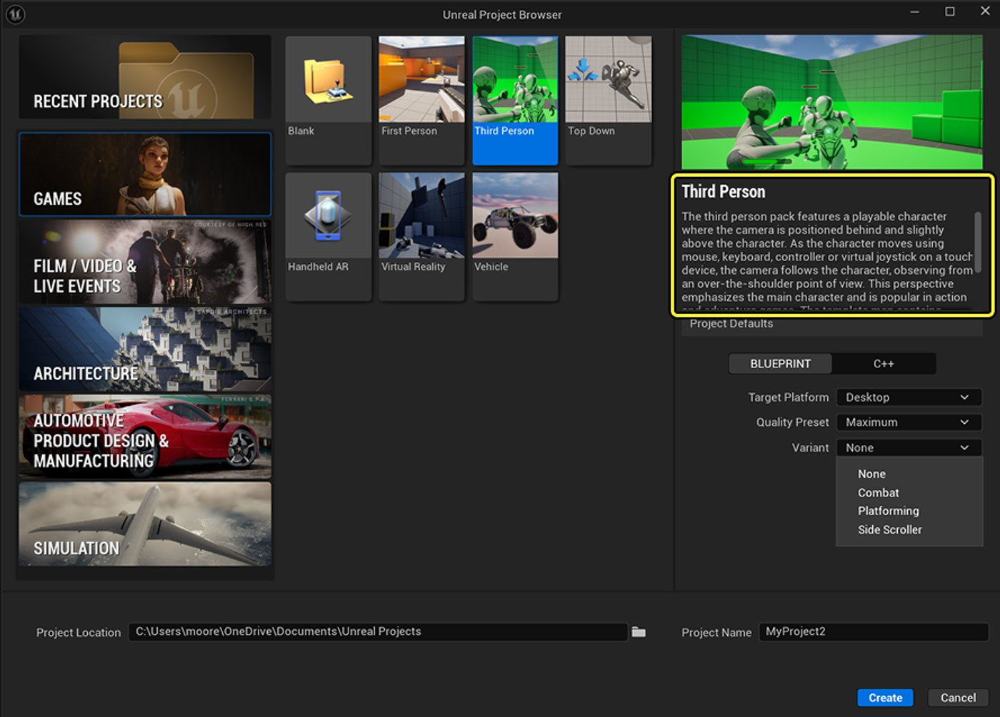
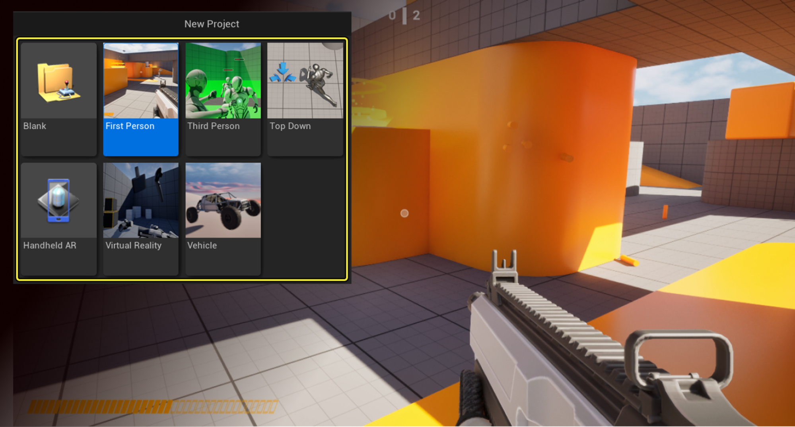
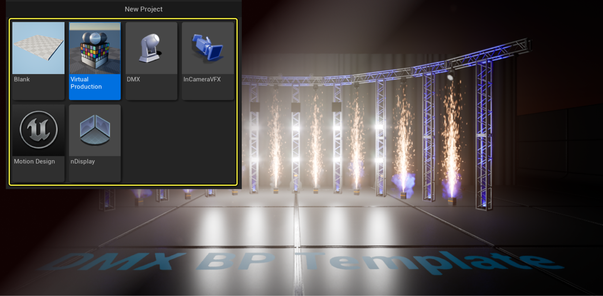
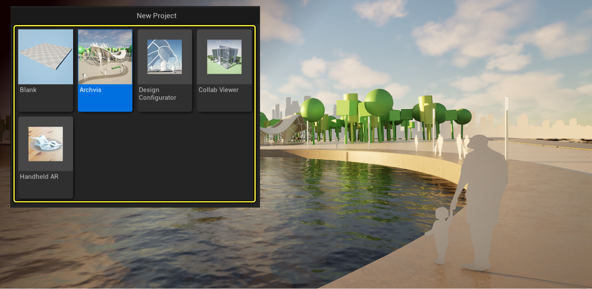
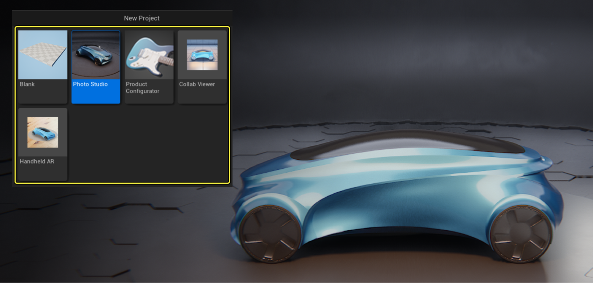
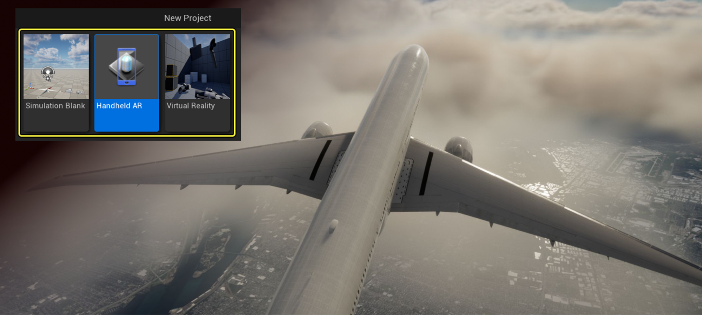

# 模板参考

> 路径：虚幻引擎5.7文档 / 理解基础知识 / 使用项目和模板 / 模板参考

> 原始页面：https://dev.epicgames.com/documentation/unreal-engine/unreal-engine-templates-reference

在创建新的虚幻引擎项目时，你可以使用现有模板之一来作为游戏或应用程序的基础。 虚幻引擎模板中包含角色控制器、蓝图和其他不需要额外配置即可运行的功能。

如需有关如何根据模板创建新项目的说明，请参阅[新建项目](../creating-a-new-project/index.md)页面。

在选择模板时，你将会看到一则说明，详细介绍模板以及模板中包含的内容。 滚动查看完整说明。

第三人称模板的模板说明示例。

此外，你还可以根据任何现有项目来创建自定义模板。 了解更多信息，请参阅[创建自定义模板](../converting-a-project-to-an-unreal-engine-template/index.md)页面。

## 为可以操控的角色配置输入

很多模板中都包含一个可以使用键盘、鼠标或控制器来控制的角色。 在虚幻引擎术语中，这种角色称为Pawn。

你可以通过查看[在模板中为可操控角色配置输入](configuring-input-for-your-template-pawns/index.md)来了解如何在模板项目中配置和使用这些内容。

## 虚幻引擎中的可用模板

虚幻引擎中的模板分为以下几类：

- 游戏
- 电影、电视和直播活动
- 建筑、工程和施工
- 汽车、产品设计和制造业
- 模拟

每种类别中都包含一个**空白（Blank）**模板，该模板包含一个空项目，没有任何其他内容和设置。 这是最基础的模板。

### 游戏模板

虚幻引擎游戏模板。

虚幻引擎的**游戏（Games）**模板是构建各种游戏的快速起点，例如第一人称或第三人称游戏、横版过关游戏、俯视角游戏、虚拟现实游戏和赛车游戏。

> [!NOTE]
> 虽然这些模板都标记为"游戏"模板，其实可以用作任何类型项目的起点。 例如，可以使用VR模板来创建三维空间的虚拟现实指南。 第三人称模板通常是许多不同类型项目的良好起点，例如平台跳跃游戏或步行模拟器。

| 模板名称 | 模板内容 | 其他文档 |
| --- | --- | --- |
| **第一人称（First Person）** | 具有第一人称摄像机视角的角色，你将从角色的视角体验关卡内容。 此模板包含各种变体，包括步行模拟器、带有不同武器类型的射击竞技场，以及类似恐怖的步行/平台游戏风格游戏。 | [第一人称模板概述](first-person-template/index.md) |
| **第三人称（Third Person）** | 具有第三人称摄像机视角的角色和基本场景几何体。 摄像机位于角色后上方。 | 第三人称模板概述 |
| **俯视角** | 点按新位置后可移动的角色。 摄像机位于角色上方的固定位置，并随着角色的移动而移动。 |  |
| **手持式AR应用（Handheld AR）** | 用来创建AR应用程序的起点，以便部署到Android或iOS。 包括用于扫描环境的运行时逻辑，可以收集数据并在虚拟场景中创建交互式平面，以及收集光照和场景深度信息。 | [手持类AR项目模板快速入门](../../../sharing-and-releasing-projects/developing-for-xr-experiences/developing-for-handheld-augmented-reality-experiences/handheld-ar-template-quickstart/index.md)[手持类AR模板技术参考](../../../sharing-and-releasing-projects/developing-for-xr-experiences/developing-for-handheld-augmented-reality-experiences/handheld-ar-template-technical-reference/index.md) |
| **虚拟现实** | 虚幻引擎5中的所有虚拟现实(VR)项目的起点。 该模板封装了传送移位以及常见输入操作的逻辑，例如抓取物品和将物品附着到手上。 | [VR模板](../../../sharing-and-releasing-projects/developing-for-xr-experiences/getting-started-with-xr-development/vr-template/index.md)[在虚幻引擎中开发](../../../sharing-and-releasing-projects/developing-for-xr-experiences/index.md) |
| **载具** | 符合物理特性的载具，具有两个不同的摄像机视角——一个在载具内部，另一个在载具后上方——还有HUD。 |  |

### 电影、视频和直播活动模板

电影、视频和直播活动模板

**电影、电视和直播活动（Film, Television, and Live Events）**模板为直播制片工作提供了一个良好的起点。

| 模板名称 | 模板内容 | 其他文档 |
| --- | --- | --- |
| **虚拟制片（Virtual Production）** | 具有适用于VR探查、虚拟摄像机、SDI视频、Composure和nDisplay的功能。 | [虚拟堪景介绍](../../../building-virtual-worlds/virtual-scouting/index.md)[控制虚拟摄像机Actor](../../../animating-characters-and-objects/cinematics-and-movie-making/movie-and-cinematic-cameras/virtual-cameras/controlling-a-virtual-camera-actor-using-live-link/index.md) |
| **DMX** | 其中包括用于寻址、修补和控制代理光照灯具，以及进出虚幻引擎的实时DMX数据流送的录制和播放示例。 | [DMX](../../../working-with-media/communicating-with-media-components-from/dmx/index.md) |
| **InCamera VFX** | 适用于摄像机内视觉特效处理工作流的蓝图、插件和示例舞台。 将此模板用作使用LED体积来实现虚拟制片拍摄时的基础。 | [ICVFX模板](../../../working-with-media/integrating-media/icvfx/in-camera-vfx-template/index.md)[镜头内视效概述](../../../working-with-media/integrating-media/icvfx/index.md) |
| **nDisplay** | 通过计算机集群实现的显示功能。 将此模板作为起点，在复杂排列的物理显示器上进行渲染，以获得直播效果。 | [nDisplay模板](../../../working-with-media/integrating-media/rendering-to-multiple-displays-with-ndisplay/ndisplay-template/index.md)[使用nDisplay在多显示屏上进行渲染](../../../working-with-media/integrating-media/rendering-to-multiple-displays-with-ndisplay/index.md) |

### 建筑、工程和施工模板

建筑模板。

**建筑模板**（包括工程和施工）使用[Datasmith](../../../working-with-content/datasmith/index.md)将各种3D程序中的内容导入到虚幻引擎，而你可以在虚幻引擎中对这些内容进行进一步优化，以便于在桌面应用程序和XR应用程序中使用。

| 模板名称 | 模板内容 | 其他文档 |
| --- | --- | --- |
| **建筑可视化（Archvis）** | 样板建筑可视化工作流，其中带有可以用于阳光研究、内部渲染和非真实感风格渲染的示例场景。 | [建筑可视化设计策略（视频）](https://dev.epicgames.com/community/learning/talks-and-demos/bZdy/unreal-engine-architectural-visualization-for-design-strategies-on-a-120-year-old-building-unreal-fest-2024)[在虚幻引擎中设计室内空间（视频）](https://dev.epicgames.com/community/learning/tutorials/q39K/designing-a-interior-space-in-unreal-engine-5)[Epic Games建筑可视化生态系统：第1部分（教程）](https://dev.epicgames.com/community/learning/tutorials/nwML/unreal-engine-realityscan-the-epic-games-ecosystem-for-arch-viz-part-1) |
| **设计配置器（Design Configurator）** | 可使用Variant Manager、UMG和蓝图功能来构建项目，在项目中可以切换不同的对象状态，例如可见性、启动动画序列、切换视图、切换不同设计选项。 |  |
| **协作查看器（Collab Viewer）** | 适用于协作式会话中的台式机和VR的导航和交互功能。 此模板包含一些专门用于建筑领域的初学者内容包，默认启用了一些其他组件，包括OpenXR和LiveLink。 | [协作查看器（Collab Viewer）模板](../../../sharing-and-releasing-projects/developing-for-xr-experiences/getting-started-with-xr-development/collab-viewer-templates/index.md) |
| **手持式AR应用（Handheld AR）** | 用来创建AR应用程序的起点，以便部署到Android或iOS。 包括用于扫描环境的运行时逻辑，可以收集数据并在虚拟场景中创建交互式平面，以及收集光照和场景深度信息。 | [手持类AR项目模板快速入门](../../../sharing-and-releasing-projects/developing-for-xr-experiences/developing-for-handheld-augmented-reality-experiences/handheld-ar-template-quickstart/index.md)[手持类AR模板技术参考](../../../sharing-and-releasing-projects/developing-for-xr-experiences/developing-for-handheld-augmented-reality-experiences/handheld-ar-template-technical-reference/index.md) |

### 汽车、产品设计和制造模板

汽车、产品设计和制造模板

**汽车、产品设计和制造（Automotive, Product Design, and Manufacturing）**模板使用Datasmith将各种3D程序中的内容导入到虚幻引擎，而你可以在虚幻引擎中对这些内容进行进一步优化，以便于在桌面应用程序和XR应用程序中使用。

| 模板名称 | 模板内容 | 其他文档 |
| --- | --- | --- |
| **影棚（Photo Studio）** | 这是一个预制的摄影工作室场景，可以用于过场动画或产品展示。 |  |
| **产品配置器（Product Configurator）** | 可使用Variant Manager、UMG和蓝图功能来构建常规产品配置器，这是一种程序，在程序中可以切换不同的零部件来测试产品的新外观，例如汽车的不同颜色。 | [产品配置器（Product Configurator）](../../../working-with-content/working-with-scene-variants/product-configurator-template/index.md) |
| **协作查看器（Collab Viewer）** | 适用于协作式会话中的台式机和VR的导航和交互功能。 此模板还包含可以在VR中探索的样板模型汽车。 | [协作查看器（Collab Viewer）模板](../../../sharing-and-releasing-projects/developing-for-xr-experiences/getting-started-with-xr-development/collab-viewer-templates/index.md) |
| **手持式AR应用（Handheld AR）** | 用来创建AR应用程序的起点，以便部署到Android或iOS。 包括用于扫描环境的运行时逻辑，可以收集数据并在虚拟场景中创建交互式平面，以及收集光照和场景深度信息。 | [手持类AR项目模板快速入门](../../../sharing-and-releasing-projects/developing-for-xr-experiences/developing-for-handheld-augmented-reality-experiences/handheld-ar-template-quickstart/index.md)[手持类AR模板技术参考](../../../sharing-and-releasing-projects/developing-for-xr-experiences/developing-for-handheld-augmented-reality-experiences/handheld-ar-template-technical-reference/index.md) |

### 模拟模板

模拟模板

**模拟**模板为各种企业模拟应用程序提供了范围广泛的起始点。 这些模板包含以下功能：

- 户外环境的特定设置。
- 逼真的天空和光照。
- 地理配准工具。

| 模板名称 | 模板内容 | 其他文档 |
| --- | --- | --- |
| **模拟空白（Simulation Blank）** | 该模板由带有必需设置并启用了插件的空白项目组成。 此模板适合作为大部分模拟应用程序的起始点，并包含以下功能：地球大气大气光照体积云地理坐标[世界大地测量系统（WGS84）](https://en.wikipedia.org/wiki/World_Geodetic_System) |  |
| **手持式AR应用（Handheld AR）** | 用来创建AR应用程序的起点，以便部署到Android或iOS。 包括用于扫描环境的运行时逻辑，可以收集数据并在虚拟场景中创建交互式平面，以及收集光照和场景深度信息。 | [手持类AR项目模板快速入门](../../../sharing-and-releasing-projects/developing-for-xr-experiences/developing-for-handheld-augmented-reality-experiences/handheld-ar-template-quickstart/index.md)[手持类AR模板技术参考](../../../sharing-and-releasing-projects/developing-for-xr-experiences/developing-for-handheld-augmented-reality-experiences/handheld-ar-template-technical-reference/index.md) |
| **虚拟现实** | 虚幻引擎5中的所有虚拟现实(VR)项目的起点。 该模板封装了传送移位以及常见输入操作的逻辑，例如抓取物品和将物品附着到手上。 | [VR模板](../../../sharing-and-releasing-projects/developing-for-xr-experiences/getting-started-with-xr-development/vr-template/index.md)[在虚幻引擎中开发](../../../sharing-and-releasing-projects/developing-for-xr-experiences/index.md) |
