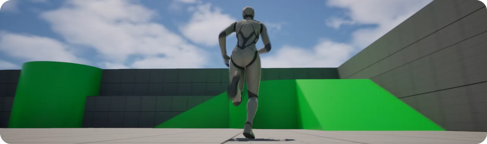
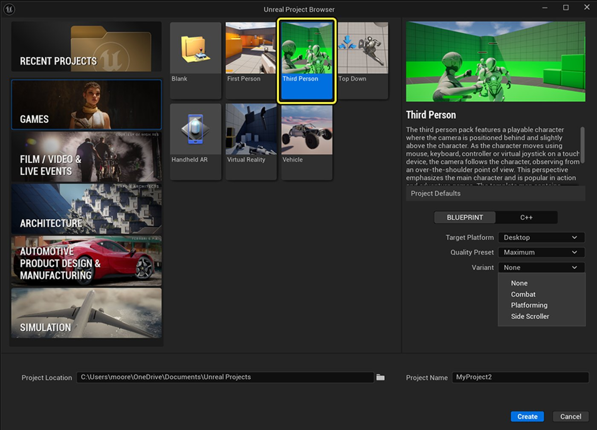
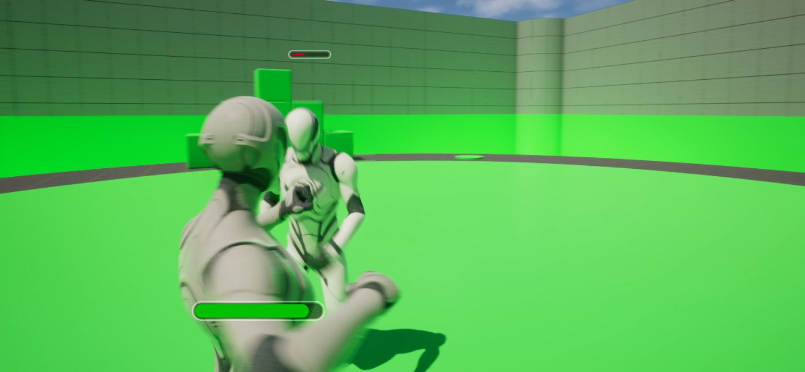
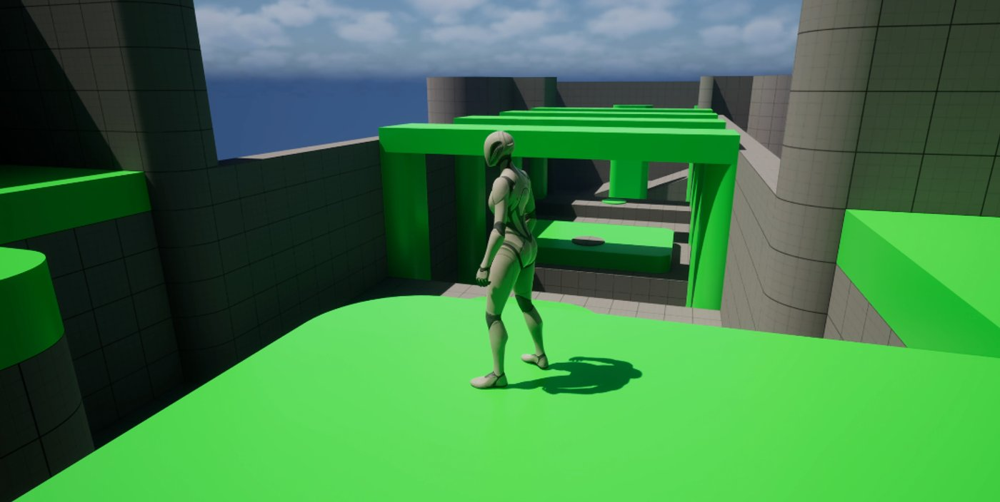
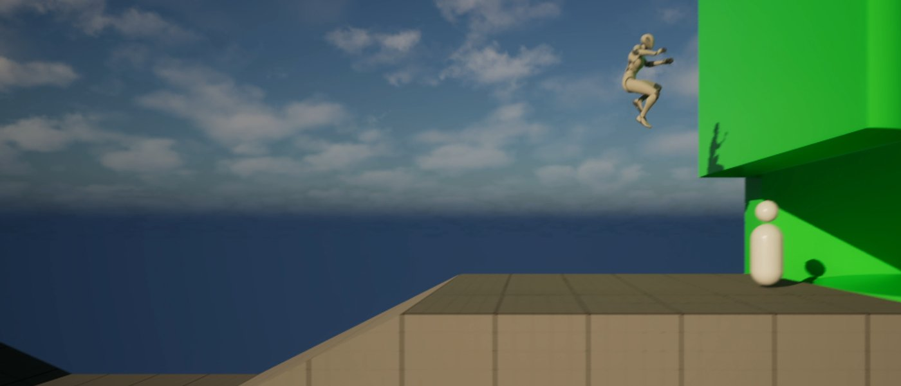
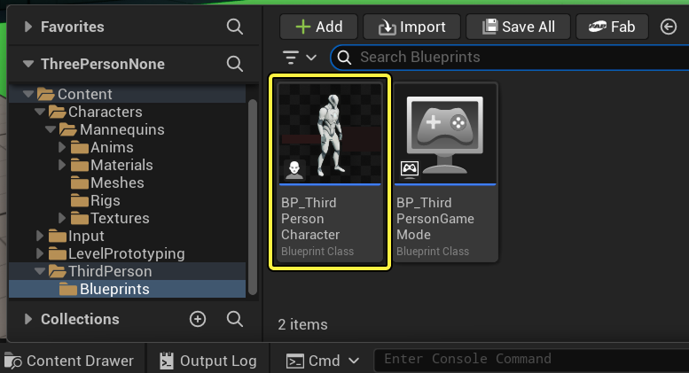
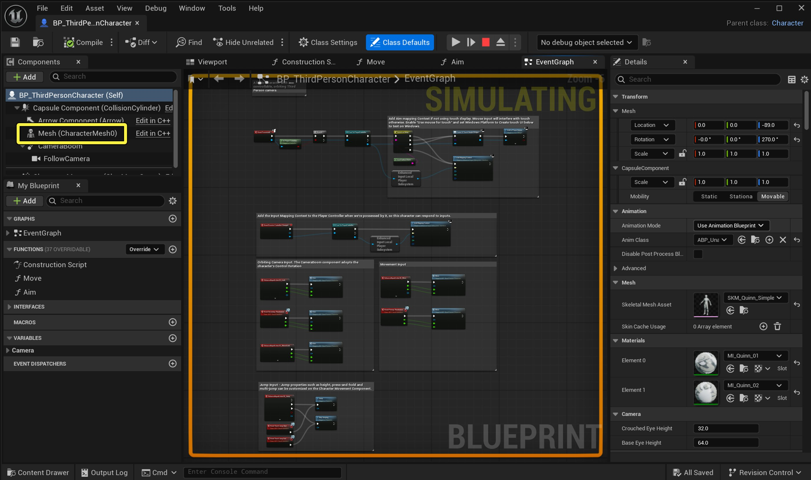

# 第三人称模板

> 路径：虚幻引擎5.7文档 / 理解基础知识 / 使用项目和模板 / 模板参考 / 第三人称模板

> 原始页面：https://dev.epicgames.com/documentation/unreal-engine/third-person-template-in-unreal-engine

当你创建新项目时，**虚幻引擎** 会向你提供模板列表供你选择。 这些模板包含一些可立即使用的资产，例如关卡几何体、可控的角色以及简单的角色动画等。 许多教程将其中一款模板用作起始点。

在 第三人称 游戏中，默认情况下，玩家会从位于固定距离以外、稍高于其角色的摄像机处查看游戏世界。 在虚幻引擎中，你可以控制摄像机距离和位置，并根据需要进行调整。

虚幻引擎5中的**第三人称游戏**模板包含以下元素：

- 可以移动和跳跃的可操作第三人称角色。
- 角色的额外网格体。
- 一个使用基础几何体（斜坡、平台等）的关卡。
- 启用了物理效果的立方体，它会对角色的碰撞做出反应。

该模板还包含了经过重新设计的人体模特。

### 创建第三人称项目

启动虚幻引擎会打开**项目浏览器（Project Browser）**窗口，你可以在其中选择打开现有的虚幻引擎项目，或创建新项目。

要创建第三人称游戏项目，请选择左侧的**游戏（Games）**类别，然后选择**第三人称游戏（Third Person）**模板。

### 变体

创建项目时的下一组选项位于**变体（Variants）**下拉菜单中。 变体可帮助你更快地编译特定的Gameplay风格。 第三人称游戏给出了三种特化的变体：战斗（Combat）、平台跳跃（Platforming）和横版过关游戏（Side Scroller）。

请选择无（None）选项以使用标准模板。

如需详细了解这些变体的功能，请参阅[游戏模板中的变体](../variants-in-game-templates/index.md)。

#### 战斗游戏变体

**战斗游戏（Combat）**变体提供了战斗机制、敌人锁定功能以及内置的生命值管理系统，有助于高效编译动作导向型游戏。

#### 平台跳跃游戏变体

**平台跳跃游戏（Platforming）**变体提供了具有精确控制的高级跳跃、攀爬和动态移动机制。

#### 横版过关游戏变体

**横版过关游戏（Side Scroller）**变体将第三人称视角调整为横版卷轴形式，并配备了预配置的摄像机系统和移动系统。

你可以为第三人称项目配置几个额外的设置。 如需了解这些变体，请参阅 [新建项目](https://dev.epicgames.com/documentation/zh-cn/unreal-engine/creating-a-new-project-in-unreal-engine?application_version=5.6) 页面。

执行这些步骤后，你应该有一个基本关卡，其中有一个你可以控制的第三人称角色。

> [!TIP]
> 何不试试你的新关卡？ 点击编辑器顶端主工具栏中的 **运行** 按钮。 使用**WASD**键移动角色，按下**空格**键跳起，移动鼠标查看周围环境。

## 模板内容

第三人称模板包含了简易第三人称体验的所有元素。 可以以此为起点制作一个传统的角色扮演游戏（RPG）、第三人称射击游戏或者其它任何应用。 以下小节将详细介绍主要的模板元素以及如何在**内容浏览器（Content Browser）**中找到它们。

### 第三人称角色

玩家角色使用的资产位于 `Content/Characters` 文件夹。 默认情况下，第三人称游戏模板初始带有一个虚幻引擎5的女性人体模特。 该文件夹还包含了玩家角色的额外**骨架网格体**，包括虚幻引擎5和旧版虚幻引擎人体模特的风格。

| 女性人体模特：Quinn（默认） | 男性人体模特：Manny |
| --- | --- |
| [女性人体模特的图片。](https://dev.epicgames.com/community/api/documentation/image/527419ad-8ea8-4840-adc9-877c01e75f80?resizing_type=fit) | [男性人体模特的图片。](https://dev.epicgames.com/community/api/documentation/image/d29b93e5-4188-42d9-bdfc-f75960ae28c8?resizing_type=fit) |

虚幻引擎的人体模特还自带可调整的 细节级别（LOD） 设置。 LOD可以帮助针对不同平台优化你的应用。

例如，针对移动平台（安卓、iOS）的应用应该使用细节较少的角色模型。 这能帮你针对这些平台优化应用性能。 控制人体模特LOD的**数据资产**位于 `Content/Characters/Mannequins/Meshes` 文件夹内。

### 动画

虚幻引擎人体模特的动画位于`Content/Characters/Mannequins/Animations`文件夹内。 针对两个人体模特有两组动画。

**动画蓝图**充分利用了虚幻引擎全新的 [IK绑定](https://dev.epicgames.com/documentation/zh-cn/unreal-engine/unreal-engine-ik-rig?application_version=5.6) 系统。 与旧版动画不同，你可以使用IK绑定动态修改基于姿势的解算器参数。 以下截图便是一个例子：Quinn的脚部位置会根据她所处的地形动态调整。

|  |  |  |
| --- | --- | --- |
| [处于阶梯位置的Quinn。](https://dev.epicgames.com/community/api/documentation/image/af221818-7f3f-4de6-8c67-d3b3147c6c34?resizing_type=fit) | [斜坡上的Quinn。](https://dev.epicgames.com/community/api/documentation/image/557a4cf9-25ab-4cf9-b0d2-8ae66394bac3?resizing_type=fit) | [脚踏平地，朝向前方的Quinn。](https://dev.epicgames.com/community/api/documentation/image/8810b613-100d-4a5c-aedf-dd01f754b451?resizing_type=fit) |

要了解其实现方式，请查看 `Content/Mannequins/Rigs` 文件夹中的**CR_Mannequin_BasicFootIK**绑定。

同样位于 `Rigs` 文件夹中的 **CR_Mannequin_Body** 控制绑定资产可以让你直接在编辑器中轻松地为人体模特调整姿势并制作动画。 如需了解如何使用控制绑定调整姿势和制作动画，请参阅 [控制绑定](https://dev.epicgames.com/documentation/zh-cn/unreal-engine/control-rig-in-unreal-engine?application_version=5.6) 文档。

### 级别

组成关卡几何体的资产（静态网格体、材质和纹理）位于 `Content/LevelPrototyping` 文件夹中。

## 改进你的项目

现在你有了一个可游玩的关卡，可以开始导入内容并做出调整，从而让你的游戏更加有趣且独特了。

### 角色（Character）

你可以通过修改角色的 **静态网格体（Static Mesh）** 来改变角色的外观。 举个例子，让我们来改变默认人体模特的网格体。 为此，请按照下列步骤操作：

1. 转到**内容浏览器**，找到 `Content/ThirdPerson/Blueprints`，然后双击 `BP_ThirdPersonCharacter` 蓝图，将其在蓝图编辑器中打开。

   
2. 打开蓝图编辑器，转到 组件（Components） 面板，点击 Mesh(CharacterMesh) 组件以将其选中。

   
3. 选中 Mesh(CharacterMesh) 组件后，找到蓝图编辑器右侧的 细节（Details） 面板。 然后转到 网格体（Mesh） 分段，点击 骨架网格体（Skeletal Mesh） 参数旁的下拉菜单，并从列表中选择 `SKM_Manny`。

   > 图片已省略：打开细节菜单，选择网格体，然后选择Manny网格体。
4. 仍然是在**细节（Details）**面板中，找到**动画（Animation）**分段，设置以下选项：

   1. 动画模式（Animation Mode）：**使用动画蓝图（Use Animation Blueprint）**
   2. 动画类（Anim Class）：**ABP_Manny**

      > 图片已省略：更改动画类所用的菜单的图片。
   3. 编译 并 保存 蓝图。

      > 图片已省略：菜单中的编译和保存图标的图片。
   4. 点击视口（Viewport） 选项卡，确认网格体是否已更新。

      > 图片已省略：显示人体模特的视口选项卡的图片。

你的角色已经可以跑和跳，而你还可以为其添加其他类型的角色运动，如行走或蹲伏等。 如需了解详细教程，请参阅 [设置角色运动](https://dev.epicgames.com/documentation/zh-cn/unreal-engine/setting-up-character-movement?application_version=5.6)。

### 级别

你的关卡中已经存在一些简单的几何体，如楼梯和平台等。 要往里面添加更多内容，最简单的方法是从**内容浏览器**中拖放内容。

如果你在创建项目时选择包括**初学者内容包**，内容浏览器中应该就有东西可以被拖放到关卡中。

如需了解关卡设计的入门教程，请参阅 [关卡设计教程](https://dev.epicgames.com/community/learning/tutorials/GjpX/unreal-engine-ue-5-6-preview-level-design-tutorial-for-beginners-p1-ue5-unrealengine-leveldesign)。

## 接下来呢？

现在你已掌握了创建第三人称体验的基础知识，可以尝试下面的其他一些内容：

- 深度教程：

  - 将[动画重定向](https://dev.epicgames.com/documentation/zh-cn/metahuman/retargeting-animations-to-a-metahuman-at-runtime)到MetaHuman
  - 为你的玩家角色[导入并配置](https://dev.epicgames.com/documentation/zh-cn/unreal-engine/fbx-skeletal-mesh-pipeline-in-unreal-engine?application_version=5.6)不同的FBX模型
- 从 [Fab](https://www.fab.com/) 下载预制角色
- 使用来自[Quixel Bridge](https://dev.epicgames.com/documentation/zh-cn/unreal-engine/quixel-bridge-plugin-for-unreal-engine?application_version=5.6)的免费内容和道具填充关卡。 你可以用它们来搭建各种室内外场景，并且素材库中的资产会不断丰富。
- 使用 [后期处理特效](https://dev.epicgames.com/documentation/zh-cn/unreal-engine/post-process-effects-in-unreal-engine?application_version=5.6) 为游戏添加精美的视觉效果，如动态模糊或渐晕等。
- 优化 [骨架网格体](https://dev.epicgames.com/documentation/zh-cn/unreal-engine/skeletal-mesh-rendering-paths-in-unreal-engine) 的渲染方式，或阅读[Datasmith教程](https://dev.epicgames.com/documentation/zh-cn/unreal-engine/datasmith-tutorials-in-unreal-engine)，学习如何更新3D导入数据。
- 使用 [行为树](https://dev.epicgames.com/documentation/zh-cn/unreal-engine/behavior-trees-in-unreal-engine?application_version=5.6) 添加AI角色。 你可以将其设置为追逐、逃跑、帮助或伤害玩家。
