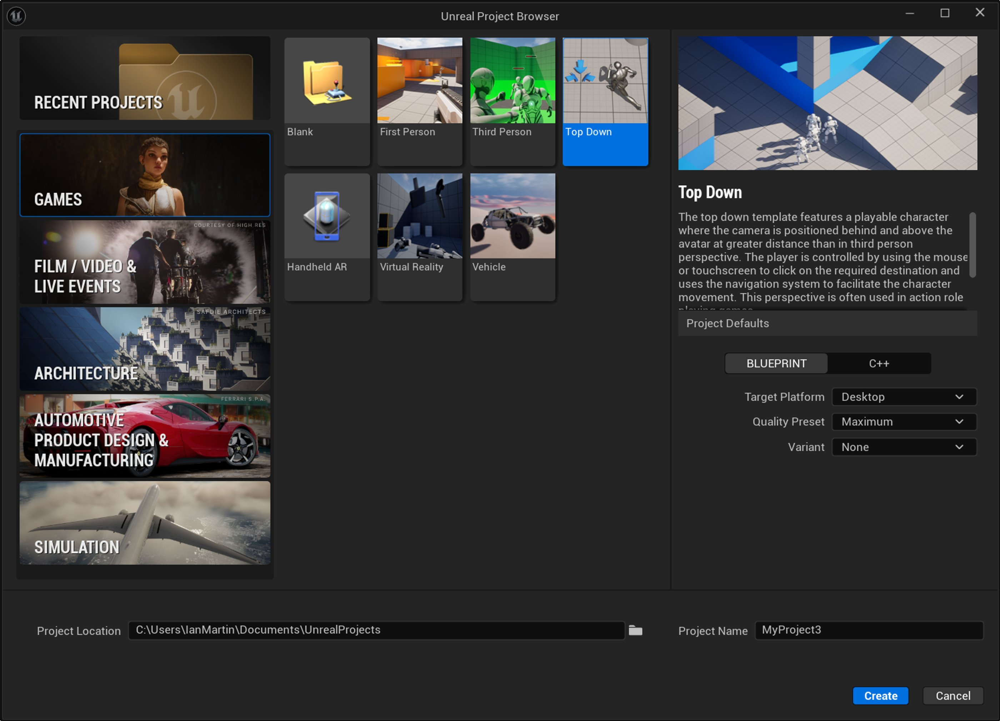
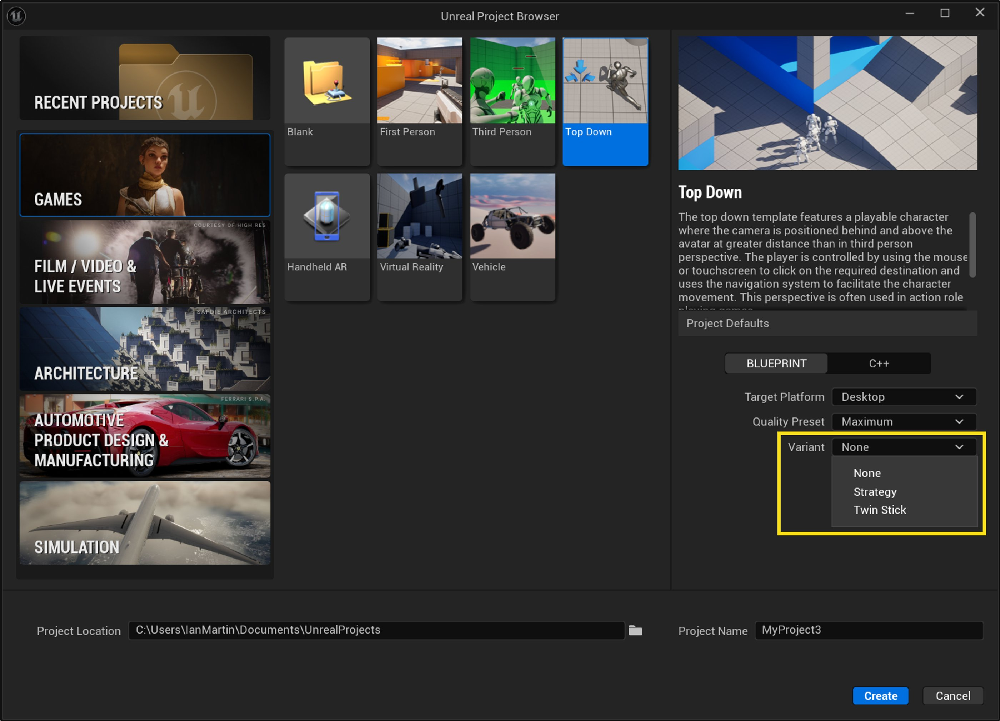
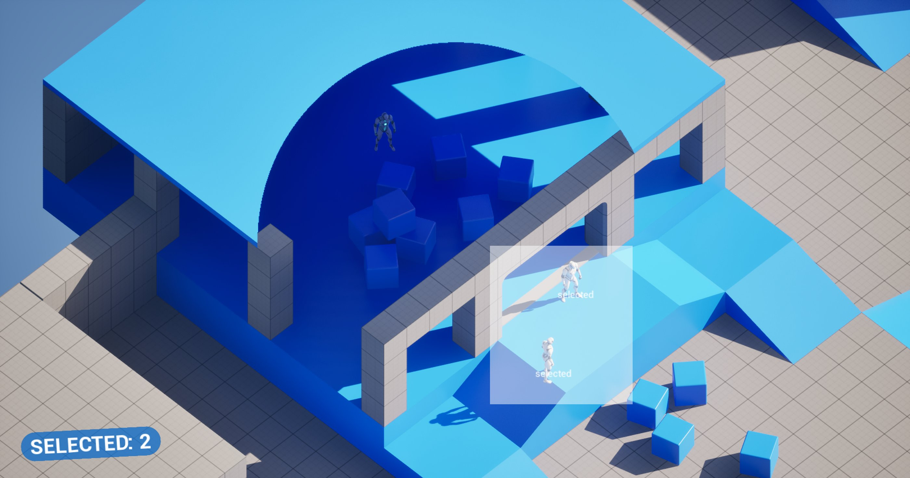
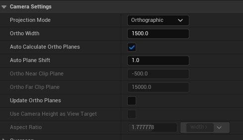
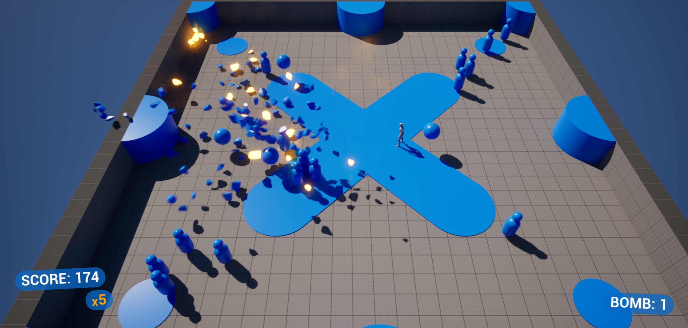

# 俯视角模板

> 路径：虚幻引擎5.7文档 / 理解基础知识 / 使用项目和模板 / 模板参考 / 俯视角模板

> 原始页面：https://dev.epicgames.com/documentation/unreal-engine/top-down-template-in-unreal-engine

当你新建项目时，虚幻引擎会向你提供模板列表供你选择。 这些模板包含一些可立即使用的资产，例如关卡几何体、可控的角色以及简单的角色动画等。 许多教程将其中一款模板用作起始点。

在俯视角游戏中，玩家通过位于角色后上方的摄像机查看游戏，该摄像机距离角色的位置比[第三人称游戏](../third-person-template/index.md)更远。在某些俯视角游戏中，玩家通过鼠标或触摸屏控制角色移动。 在另一些俯视角游戏中，玩家通过键盘或游戏手柄控制角色移动。 在这个模板中，你只需要点击并按住鼠标，就可以控制角色朝特定方向移动，这一操控模式适用于基础（非变体）项目。

## 创建俯视角项目

启动虚幻引擎会打开项目浏览器（Project Browser）窗口，你可以在其中选择打开现有的虚幻项目，或创建新项目。 要创建俯视角游戏项目，请选择左侧的**游戏（Games）**类别，然后选择**俯视角（Top Down）**模板。

选择**俯视角**模板后，你还可以在项目浏览器窗口右侧的面板中，为俯视角项目配置其他设置。 你可以配置以下设置：

| 设置 | 说明 |
| --- | --- |
| **目标平台** | 选择你的项目适用的平台类型：**台式机（Desktop）****移动端（Mobile）** |
| **质量预设（Quality Preset）** | 根据你的项目目标平台，选择最高质量级别：**最大值（Maximum）**，如果你在为计算机或游戏主机开发项目。**可伸缩（Scalable）**，如果你在为移动设备开发项目。 |
| **变体（Variant）** | 要打开的模板的变体。 变体会为项目添加额外的资产。 如需详细了解变体，请参阅此页面的模板变体小节。 |

执行完这些步骤后，项目中将包含一个基本关卡、一台俯视角摄像机，一个可操控的角色。

要测试关卡，请点击**主工具栏**上的**运行**图标。 在基础模板中，可以通过点击/按住**鼠标**，或使用**触摸屏**控制角色在关卡中移动。 不同变体采用不同方式控制Gameplay。

## 模板变体

俯视角模板的**变体（Variants）**下拉菜单提供了一系列的可选变体。 变体可帮助你构建不同的Gameplay风格。 俯视角模板包含**策略**游戏和**双摇杆**游戏的变体。

|  |  |
| --- | --- |
| 变体名称 | 说明 |
| **无（None）** | 基础模板，包含内容如下：一个可移动、可操控的角色。一个包含基础几何体（如斜坡和平台等）的关卡。一种光标特效，可在玩家点击关卡中某个位置时触发。 |
| **策略游戏（Strategy）** | 俯视角策略游戏模板，包含以下内容：多个可选且可在关卡中移动的角色（单位）。一个包含基础几何体（如斜坡、平台和带屋顶的房间等）的关卡。一种光标特效，可在玩家点击关卡中某个位置时触发。一种屋顶材质，允许玩家透视带屋顶的房间。可与单位进行物理交互的立方体。可平移、可缩放的摄像机。显示已选单位数量的用户界面。 |
| **双摇杆游戏（Twin Stick）** | 俯视角双摇杆射击游戏模板，包含以下内容：一个可操控的角色，该角色可移动、发射子弹、使用炸弹。一个包含基础几何体的关卡。可接近玩家的AI敌人，消灭后可得分。随着玩家消灭敌人而增加的倍率。显示玩家分数、倍率和炸弹数量的用户界面。 |

如需详细了解这些变体的特色，请参阅[游戏模板变体](../variants-in-game-templates/index.md)。

### 策略游戏变体

**策略游戏**变体包含一台正交摄像机、多个可被选中并集体移动的角色（或单位）。 单位可在移动时与立方体交互，靠近自动门即可开门。 部分对象，例如建筑顶部的屋顶（蓝色部分），使用特殊材质，允许摄像机透视并看到内部区域。

#### 摄像机

策略游戏变体使用**正交**投影摄像机创建关卡的等距视图。 摄像机可通过鼠标或键盘实现缩放和移动。

摄像机的逻辑位于**Content/Variant_Strategy/Blueprints**目录下的**BP_StrategyPlayerController**和`BP_StrategyPawn`中。

在这个蓝图中，你可以选择**摄像机**组件，通过**细节（Details）**面板中的**摄像机设置（Camera Settings）**修改摄像机正交投影的设置。

如需详细了解该投影模式及其设置，请参阅[正交摄像机](../../../../gameplay-systems/gameplay-framework/cameras/orthographic-camera/index.md)。

#### 单位

策略游戏变体包含多个可供玩家选中并在关卡中移动的角色或单位。 选中一个或多个单位后，玩家可点击关卡中的某一位置，指示所选的单位移动至该位置。

单位与单位之间可以交互，单位与关卡之间也可以交互。 当两个单位彼此靠近时，它们都将播放动画。 当单位靠近自动门时，门将开启。 单位在移动过程中与立方体碰撞，将发生物理交互并产生反弹效果。

单位移动和交互的逻辑位于**Content/Variant_Strategy/Blueprints**文件夹的**BP_StrategyPlayerController**和`BP_StrategyPawn`中。

#### 屋顶摄像机剪切效果

策略游戏变体使用遮罩材质实现摄像机透视不透明表面的效果。 虽然这个效果会影响摄像机视图，但材质本身会根据屏幕位置和摄像机位置，控制这一效果的实现方式，因为它始终与任何物体表面保持相同距离。这是使用**Content/Variant_Strategy**文件夹中的`M_Cutout`材质实现的。

因为材质是用参数和变量设置的，你可以创建M_Cutout的材质实例，通过调整参数和变量，根据游戏需求调整遮罩裁剪区域的大小。 你还可以在这个材质的基础上自定义，根据你的项目创建你自己的版本。 将这个材质作为材质实例时，调整**强度（Strength）**变量可以改变剪切区域的大小。

调整强度变量

如需详细了解材质及材质实例，以及如何使用其参数和变量，请参阅[实例化材质](../../../../designing-visuals-rendering-and-graphics/unreal-engine-materials/instanced-materials/index.md)。

#### 用户界面

策略游戏变体包含一个UI，可以显示玩家选中的单位数量。 UI的控件蓝图位于`Content/Variant_Strategy/UI`文件夹。

### 双摇杆游戏变体

**双摇杆游戏**变体包含一个支持全向射击和投掷炸弹的玩家角色，以及简单的AI敌人，它们可以跟随玩家移动，并且可以被消灭。 玩家消灭敌人可以获得分数，连续消灭敌人可获得得分倍率加成。 停止消灭敌人时，倍数会逐渐减小。

#### 子弹和炸弹

在双摇杆游戏变体中，玩家角色可以通过发射子弹和投掷炸弹，消灭关卡中出现的敌人。 按键盘**F键**、点击**鼠标左键**或按手柄**右扳机键**可以发射子弹。 子弹可通过**鼠标**或手柄**右摇杆**瞄准。 炸弹在关卡中以球体形态显示，玩家角色触碰炸弹后即可收集炸弹。 按键盘**G键**、点击**鼠标右键**或按手柄**左扳机键**可以使用炸弹。

子弹击中敌人将生成粒子效果。 该粒子效果由[Niagara](../../../../visual-effects/index.md)系统实现。

子弹与炸弹的蓝图位于`Content/Variant_TwinStick/Blueprints`文件夹。 子弹与炸弹的网格体位于`Content/Variant_TwinStick`文件夹。

#### 敌人

双摇杆游戏变体中的敌人在游戏区域的角落生成并向玩家移动。 玩家角色触碰到敌人时会被击退一定距离。 玩家可以通过子弹或炸弹消灭敌人。 敌人被子弹或炸弹击中会发生爆炸，这种效果是通过[Chaos物理系统](../../../../gameplay-systems/physics/index.md)几何体集合实现的。

敌人的蓝图位于`Content/Variant_TwinStick/Blueprints/AI`文件夹，网格体位于`Content/Variant_TwinStick/Meshes`文件夹。

#### 用户界面

双摇杆游戏变体中的UI可以显示玩家得分，玩家当前的得分倍率，以及玩家拥有的炸弹数量。 UI资产位于`Content/Variant_TwinStick/UI`文件夹。

## 模板内容

以下小节详细介绍了这些内容，并指出了其在**内容浏览器**中的位置。

### 蓝图

俯视角游戏模板的无（None）变体包含以下资产的蓝图：

- 玩家角色
- 游戏模式
- 玩家控制器

这些蓝图位于`Content/TopDown/Blueprint`文件夹。

各个蓝图中的事件图表包含评论和注解，用于说明各节点群组的作用以及实现方案背后的逻辑。

策略游戏变体使用的玩家角色、玩家控制器和游戏模式位于`Content/Variant_Strategy/Blueprints`文件夹中。

双摇杆游戏变体使用的玩家角色、玩家控制器和游戏模式位于`Content/Variant_TwinStick/Blueprints`文件夹中。

### 光标

无变体和策略游戏变体包含一个光标动画，每当玩家点击关卡中的某个位置，就会播放光标动画。 光标动画资产位于`Content/Variant_TwinStick/Cursor`和`Content/Variant_TwinStick/TopDown/Cursor`文件夹。

### 级别

在俯视角模板的无变体中，关卡**Lvl_TopDown**位于`Content/TopDown`文件夹。 组成关卡几何体的资产（静态网格体、材质和纹理）位于`Content/LevelPrototyping`文件夹。

在策略游戏变体中，关卡**Lvl_Strategy**位于`Content/Variant_Strategy`文件夹。 该关卡包含斜坡、平台、带屋顶的房间、启动物理的立方体以及多个可控角色。

在双摇杆游戏变体中，关卡**Lvl_TwinStick**位于`Content/Variant_TwinStick`文件夹。 此关卡包含敌人生成点。

## 改进你的项目

你已经有一个可游玩的关卡，接下来就可以开始导入内容并调整游戏。 或者使用这个项目的内容浏览器中提供的资产构建游戏，将这些资产拖放到关卡中的任意位置。

如需详细了解如何填充关卡，请参阅[关卡设计师快速入门](https://dev.epicgames.com/documentation/unreal-engine/level-designer-quick-start-in-unreal-engine?application_version=5.7)。

## 接下来呢？

现在你已经了解创建俯视角体验的基础知识，以下是你可以尝试的其他内容：

- 使用来自[Fab](../../../assets-and-content-packs/fab-window/index.md)的内容和道具填充关卡。 你可以编译一系列的室内和室外环境。
- 通过[虚幻示意图形（UMG）](../../../../user-interfaces/umg-editor-reference/index.md)创建或修改游戏中的平视显示器（HUD）界面。
- 使用[Niagara](../../../../visual-effects/index.md)添加或改变游戏中的视觉效果。
- 使用[StateTrees](../../../../gameplay-systems/artificial-intelligence/statetree/overview-of-state-tree/index.md)或[行为树](../../../../gameplay-systems/artificial-intelligence/behavior-trees/index.md)添加AI角色，或在现有的AI角色上构建。
