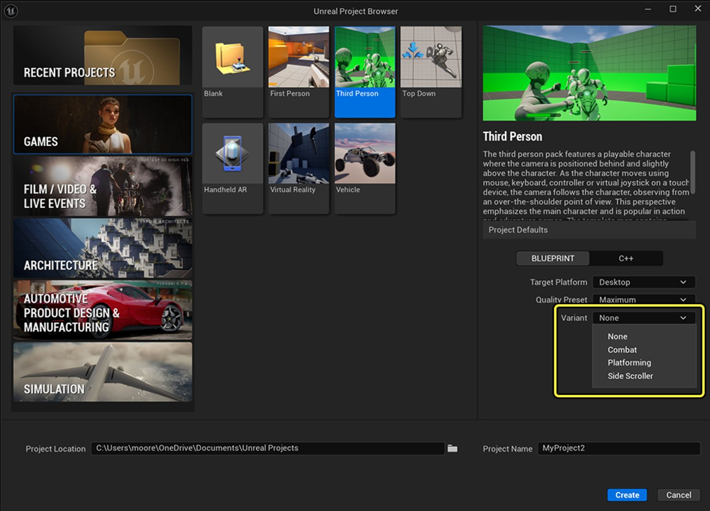
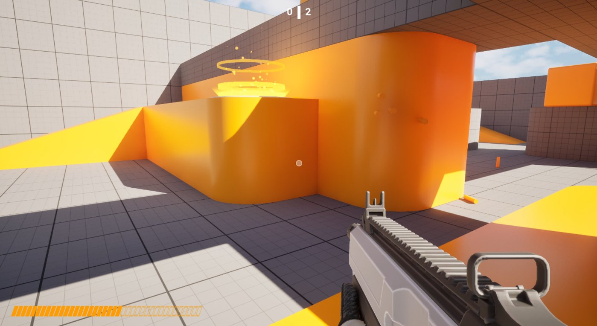
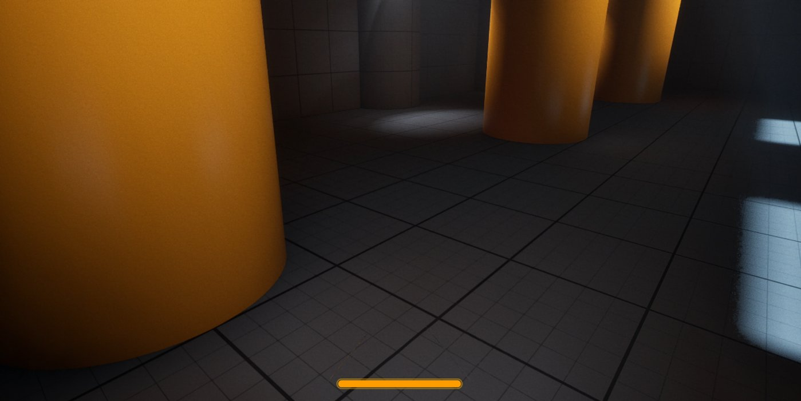
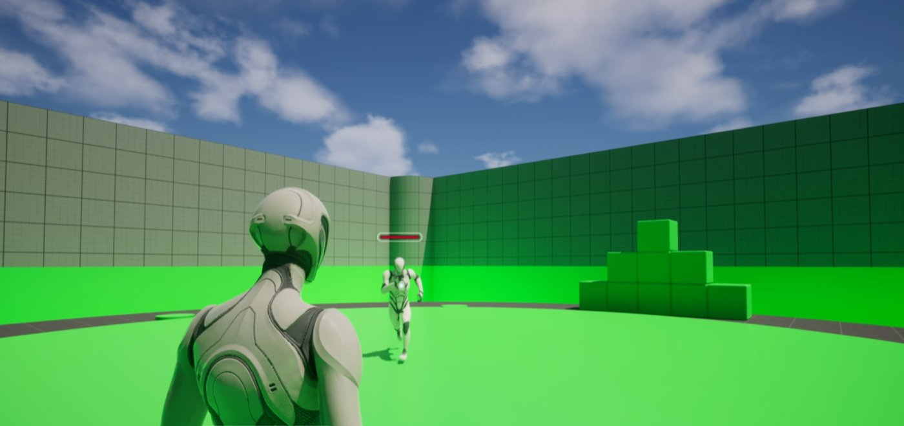
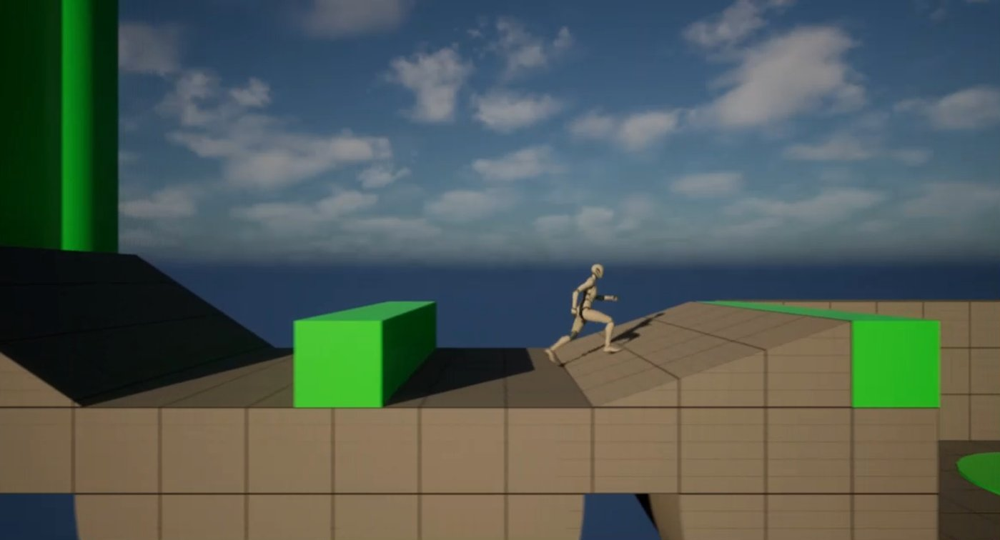
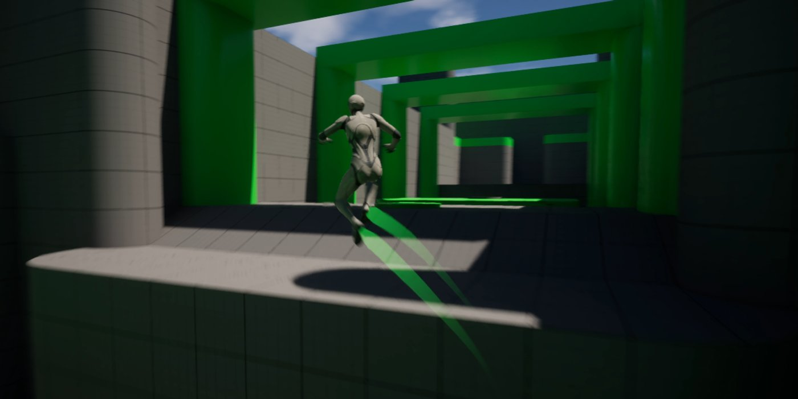
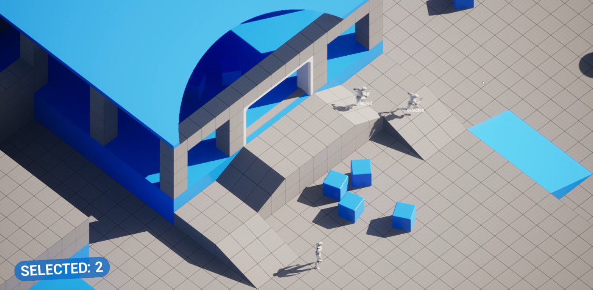
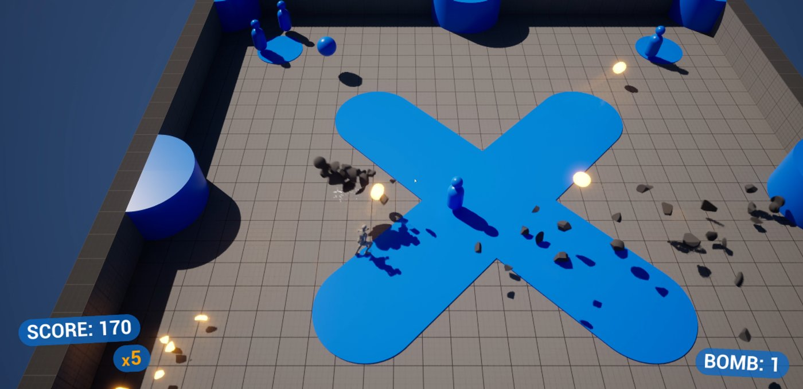

# 游戏模板变体

> 路径：虚幻引擎5.7文档 / 理解基础知识 / 使用项目和模板 / 模板参考 / 游戏模板变体

> 原始页面：https://dev.epicgames.com/documentation/unreal-engine/variants-in-game-templates

新建项目时，你可以选择新建模板的**变体**。 并非所有模板都存在可选的变体，但存在变体的模板能提供不同于基础模板项目的Gameplay和内容。

例如，在创建第三人称游戏模板项目时，你可以选择标准模板，或标准模板的战斗游戏（Combat）、平台跳跃游戏（Platforming）和横版过关游戏（Side Scroller）的变体。

如果你更喜欢使用标准模板，请在创建项目时在"变体（Variant）"下拉菜单中选择**无（None）**选项。

## 第一人称游戏变体

**第****一人称游戏**变体侧重于采用第一人称视野（FOV）的Gameplay。

其包括的变体如下：

- 竞技场射击游戏（Arena Shooter）
- 生存恐怖游戏（Survival Horror）

### 竞技场射击游戏（Arena Shooter）

**竞技场射击游戏**变体以竞技射击环境为特色，配备了多种武器和战斗移动机制。

竞技场射击游戏变体。

其特色包括：

- 多种可拾取武器
- 多种子弹类型
- AI对手
- 弹药UI
- 示例竞技场地图

### 生存恐怖游戏（Survival Horror）

**生存恐怖游戏**变体配备了预配置的光照和氛围设置，营造了低亮度、高对比度的环境。

生存恐怖游戏变体。

其特色包括：

- 玩家Pawn手电筒
- 展示简单光照和黑暗环境的示例地图
- 冲刺机制及配套用户界面
- 闪烁的光源

## 第三人称游戏变体

**第三人称游戏**变体在设计上支持更丰富的游戏风格，侧重于角色动作的发展。

其包括的变体如下：

- 战斗游戏（Combat）
- 横版过关游戏（Side Scroller）
- 平台跳跃游戏（Platformer）

### 战斗游戏（Combat）

**战****斗游戏（Combat）**变体侧重于战斗机制、瞄准敌人和内置的生命值管理系统。

战斗游戏变体。

其特色包括：

- 简单徒手战斗
- 连招攻击
- AI敌人
- 场景内的生命条用户界面
- 示例战斗地图

### 横版过关游戏（Side Scroller）

**横版过关游戏（Side Scroller）**变体将第三人称视角调整为固定的横向滑移形式，并配备了预配置的摄像机系统和移动系统。

横版过关游戏变体。

其特色包括：

- 固定摄像机示例
- 约束平面设置
- 拾取物
- 单面碰撞和穿透碰撞交互
- 贴地固定与锁定摄像机示例
- 示例横版卷轴地图

### 平台跳跃游戏

**平台跳跃游戏（Platforming）**变体侧重于高级跳跃、攀爬和精密控制的移动机制。

平台跳跃游戏变体。

其特色包括：

- 冲刺机制
- 墙壁跳跃
- 示例平台跳跃地图

## 俯视角游戏变体

**俯视角游戏（Top Down）**变体为采用俯瞰视角的游戏提供了基础，该变体目前包括网格基础和双轴基础。

其包括的变体如下：

- 策略游戏（Strategy）
- 双摇杆游戏（Twin Stick）

### 策略游戏（Strategy）

**策略游戏（Strategy）**变体利用了基于网格的移动系统来辅助策略类游戏的开发。

策略游戏变体。

其特色包括：

- 拖动选择AI角色
- 简单的角色交互
- 屋顶过渡效果
- 简单AI移动示例
- 正交摄像机设置

### 双摇杆游戏（Twin Stick）

**双摇杆游戏（Twin Stick）**变体提供了针对双摇杆射击游戏的机制，支持双轴瞄准和移动，同时还具备角色系统。

双摇杆游戏变体。

其特色包括：

- 简单AI对手
- 炸弹和射击机制
- 简单竞技场地图
- 得分和乘数的用户界面

## 载具变体

**载具（Vehicle）**变体是制作驾驶和赛车游戏的起始点。 为简化自定义流程，载具模型已被模块化为连接着空骨架的静态网格体部件。 此外，还为所有地图启用并设置了[运行时虚拟纹理（RVT）](../../../../designing-visuals-rendering-and-graphics/optimizing-and-debugging-projects-for-realtime-rendering/virtual-texturing/runtime-virtual-texturing/index.md)。

其包括的变体如下：

- 越野游戏（Offroad）
- 计时赛（Timetrial）

### 越野游戏（Offroad）

**越野游戏（Offroad）**变体提供了模块化组件和简化的资产，以支持越野风格的Gameplay，还包括了一张示例地图。

> 图片已省略：越野游戏变体的图片，显示了一辆沙丘越野车在沙漠道路上行驶。

越野游戏变体。

其特色包括：

- 开放世界探索地图
- 越野全轮驱动载具示例
- 样条线道路
- 运行时虚拟纹理的地图设置
- 分层细节级别（HLOD）结构

### 计时赛（Timetrial）

**计时赛（Timetrial）**变体利用圈速计时系统、检查点逻辑以及特定的UI元素，加快了计时竞速游戏体验的创建过程。 其特色包括：

- 简易的赛道地图
- 用于标记完成一圈的门结构
- 时间和最佳时间用户界面

> 图片已省略：计时赛变体的图片，显示了一辆桔色汽车在竞技场内的赛道上行驶。

计时赛变体。
