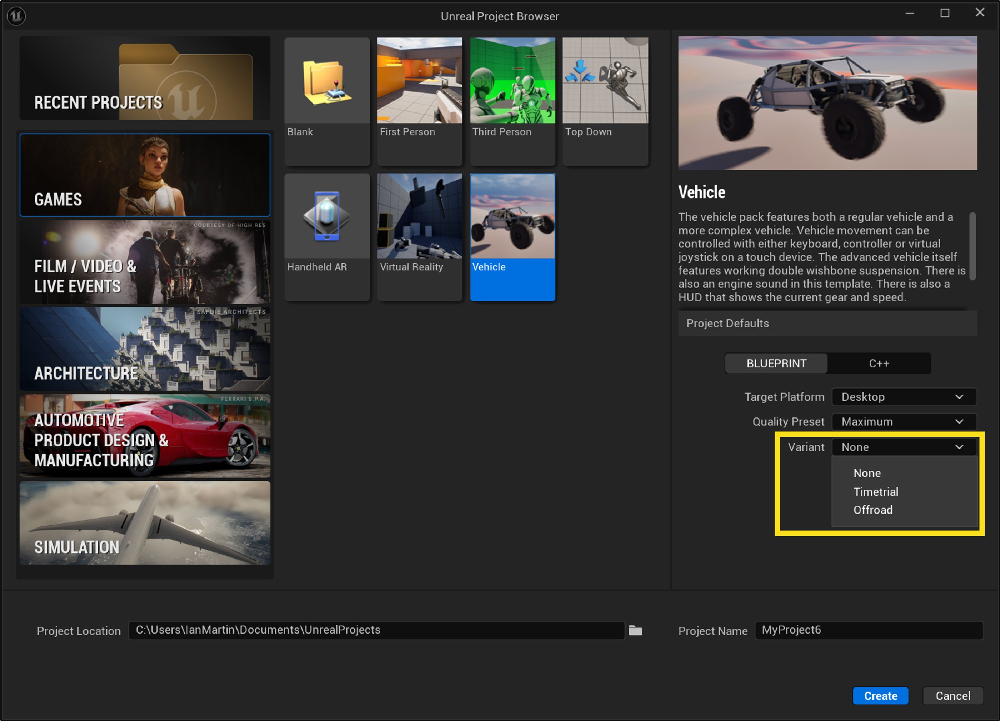
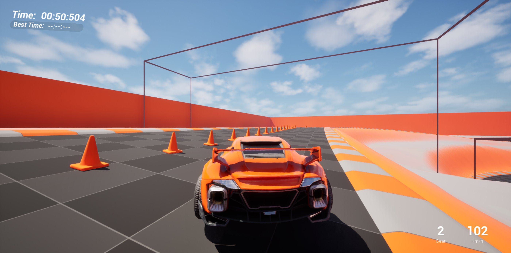
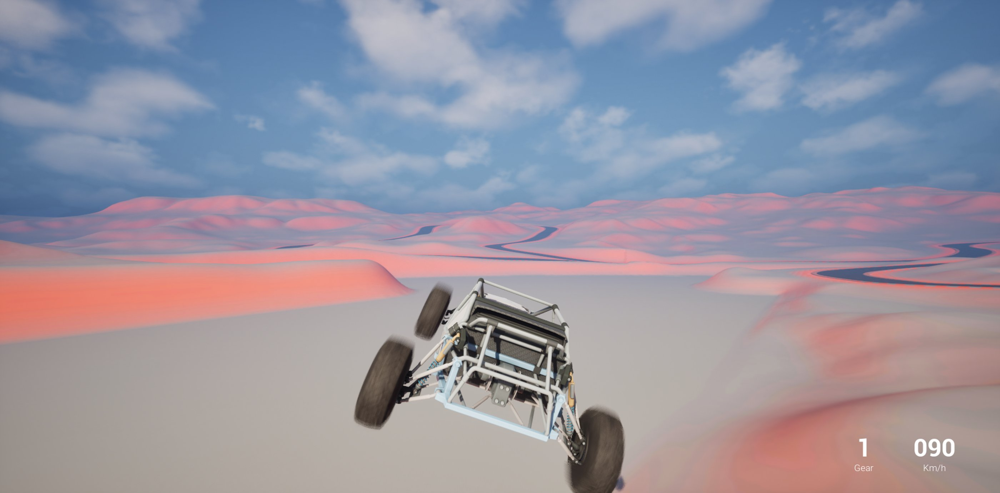

# 载具模板

> 路径：虚幻引擎5.7文档 / 理解基础知识 / 使用项目和模板 / 模板参考 / 载具模板

> 原始页面：https://dev.epicgames.com/documentation/unreal-engine/vehicle-template-in-unreal-engine

当你新建项目时，虚幻引擎会向你提供模板列表供你选择。 这些模板包含一些可立即使用的资产，例如关卡几何体、可控的角色以及简单的角色动画等。 许多教程将其中一款模板用作起始点。

在**载具（Vehicle）**游戏模板中，玩家通过载具后方或载具内部的摄像机视角察看游戏。 载具可在游戏区域内驾驶。

## 创建载具项目

启动虚幻引擎会打开项目浏览器（Project Browser）窗口，你可以在其中选择打开现有的项目，或创建新项目。

要创建载具游戏项目，请选择左侧的**游戏（Games）**类别，然后选择**载具（Vehicle）**模板。

在虚幻引擎中创建新的载具项目。

选择**载具**模板后，你还可以在项目浏览器窗口右侧的面板中，为载具项目配置其他设置。 你可以配置以下设置：

|  |  |
| --- | --- |
| 目标平台 | 选择你的项目适用的平台类型：**台式机（Desktop）****移动端（Mobile）** |
| 质量预设 | 根据你的项目目标平台，选择最高质量级别：**最大值（Maximum）**，如果你在为计算机或游戏主机开发项目。**可伸缩（Scalable）**，如果你在为移动设备开发项目。 |
| 变体 | 要打开的模板的变体。 变体会为项目添加额外的资产。 如需详细了解变体，请参阅此页面的模板变体小节。 |

执行完这些步骤后，项目中将包含一个基本关卡、一台可操控的载具。

要测试关卡，请点击主工具栏上的运行图标。 你将使用键盘上的WASD键操控载具。 但是载具模板也支持手柄、触摸屏和VR操控。

- 按**W**和**S**键加速和刹车。
- 按**A**和**D**键左右转向。
- 使用**鼠标**控制摄像机移动。
- 使用**空格键**操控手刹。
- 按**L**键切换前灯开关。
- 按**退格键**重置载具。

## 模板变体

载具模板的**变体（Variants）**下拉菜单提供了一系列的可选变体。 变体可帮助你构建不同的Gameplay风格。 载具模板包含**计时赛（Timetrial）**和**越野赛（Offroad）**两种变体。

|  |  |
| --- | --- |
| 变体名称 | 说明 |
| **无（None）** | 基础模板，包含内容如下：一台玩家可操控的载具。一个包含基础几何体（如道路和路障等）的关卡。 |
| **计时赛（Timetrial）** | 计时赛赛车游戏模板，包含以下内容：一台玩家可操控的载具。一个赛道含坡道和隧道的关卡。玩家可驾驶通过的检查点，用于记录圈速。一个显示圈速、当前档位和载具速度的用户界面。 |
| **越野赛** | 越野驾驶游戏模板，包含以下内容：一台玩家可操控的载具。一个包含程序化生成几何体的关卡。 |

如需详细了解这些变体的特色，请参阅[游戏模板变体](../variants-in-game-templates/index.md)。

### 计时赛变体

**计时赛**变体包含设有道闸的赛道，玩家可驶过这些道闸。 当载具按顺序通过所有道闸时，将记录玩家圈速。 用户界面（UI）显示当前一圈的时间、玩家最高圈速记录，以及载具的档位和速度（公里/小时）。

#### 载具

计时赛变体包含一台跑车。 跑车资产位于`Content/Vehicles/SportsCar`文件夹。

#### 道闸

当载具按顺序通过所有赛道检查点时，圈数加1，并记录圈速。 赛道游戏蓝图位于`Content/Variant_Timetrial/Blueprints`文件夹。

#### 用户界面

计时赛变体的UI显示起步倒计时、当前圈速、玩家最高圈速记录，以及载具当前的档位与速度。 UI资产位于`Content/Variant_Timetrial/UI`文件夹和`Content/VehicleTemplate/UI`文件夹。

### 越野赛变体

**越野赛**变体包含一台越野风格的巴吉赛车，一片道路崎岖不平的地形。 这种载具采用较为松散的悬挂系统。

#### 载具

越野赛变体包含一台越野车。 越野车资产位于`Content/Vehicles/OffroadCar`文件夹。

#### 地形地貌

越野赛地形使用[地形（Landscape）](../../../../building-virtual-worlds/landscape-outdoor-terrain/landscape-overview/index.md)工具和[运行时虚拟纹理（Runtime Virtual Texturing）](../../../../designing-visuals-rendering-and-graphics/optimizing-and-debugging-projects-for-realtime-rendering/virtual-texturing/runtime-virtual-texturing/index.md)构建。 地形资产位于`Content/VehicleTemplate/Maps/LandscapeInfo`文件夹。 为降低渲染关卡占用的内存，地形还使用了[HLOD层](../../../../building-virtual-worlds/world-partition/world-partition---hierarchical-level-of-detail/index.md)（位于`Content/Variant_Offroad/Maps`文件夹）。

#### 用户界面

越野赛变体的UI显示载具当前档位和速度。 UI蓝图位于`Content/VehicleTemplate/UI`文件夹。

## 模板内容

以下小节详细介绍了这些内容，并指出了其在**内容浏览器**中的位置。

### 蓝图

载具模板的无（None）变体包含以下资产的蓝图：

- 载具
- 游戏模式
- 玩家控制器

这些蓝图位于Content/VehicleTemplate/Blueprints文件夹。

各个蓝图中的**事件图表**包含评论和注解，用于说明各节点群组的作用以及实现方案背后的逻辑。

计时赛变体使用的玩家控制器和游戏模式位于`Content/Variant_Timetrial/Blueprints`文件夹。

越野赛变体使用的玩家控制器和游戏模式位于`Content/Variant_Offroad/Blueprints`文件夹中。

### 级别

在载具模板的无变体中，关卡**Lvl_VehicleBasic**位于`Content/VehicleTemplate/Maps`文件夹。

在计时赛变体中，关卡**Lvl_Timetrial**位于`Content/Variant_Timetrial/Maps`文件夹。 该关卡包含设有道闸的赛道。

在越野赛变体中，关卡**Lvl_Offroad**位于`Content/Variant_Offroad/Maps`文件夹。 该关卡包含道路和越野地形。

## 改进你的项目

现在你已经有一个可游玩的关卡，接下来就可以开始导入内容并调整游戏。 或者使用这个项目的内容浏览器中提供的资产构建游戏，将这些资产拖放到关卡中的任意位置。

如需详细了解如何填充关卡，请参阅[关卡设计师快速入门](https://dev.epicgames.com/documentation/unreal-engine/level-designer-quick-start-in-unreal-engine?application_version=5.7)。

## 接下来呢？

现在你已经了解创建载具游戏的基础知识，以下是你可以尝试的其他内容：

- 使用来自[Fab](../../../assets-and-content-packs/fab-window/index.md)的内容和道具填充关卡。 你可以编译一系列的室内和室外环境。
- 通过[虚幻示意图形（UMG）](../../../../user-interfaces/umg-editor-reference/index.md)创建或修改游戏中的平视显示器（HUD）界面。
- 使用[Niagara](../../../../visual-effects/index.md)添加或改变游戏中的视觉效果。
- 使用[StateTrees](../../../../gameplay-systems/artificial-intelligence/statetree/overview-of-state-tree/index.md)或[行为树](../../../../gameplay-systems/artificial-intelligence/behavior-trees/behavior-tree-in-unreal-engine---overview/index.md)添加AI载具，作为玩家的竞争对手。
- 尝试构建[模块化载具](../../../../gameplay-systems/physics/vehicles/chaos-modular-vehicles/chaos-modular-vehicles-overview/index.md)并添加到游戏中。
