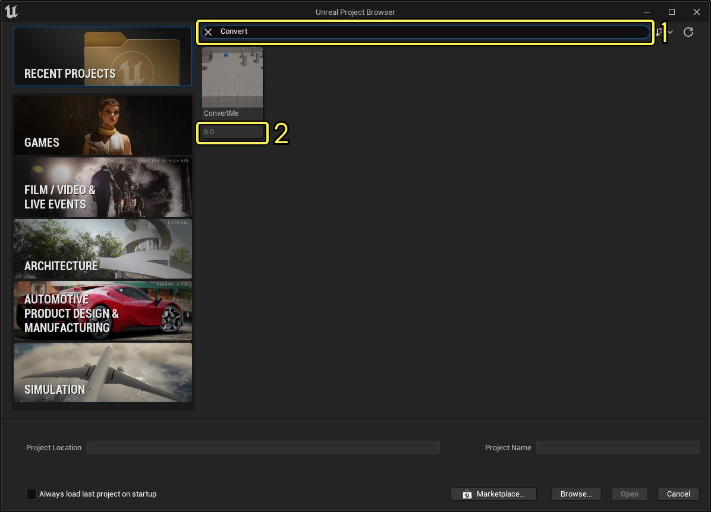

# 升级项目以兼容新版虚幻引擎

> 路径：虚幻引擎5.7文档 / 理解基础知识 / 使用项目和模板 / 升级项目以兼容新版虚幻引擎

> 原始页面：https://dev.epicgames.com/documentation/unreal-engine/updating-projects-to-newer-versions-of-unreal-engine

本文介绍了如何使用虚幻引擎内置的项目升级功能转换你的虚幻引擎项目，使其兼容新版引擎。

> [!WARNING]
> 在升级项目以兼容新版虚幻引擎后，你将 *不能** 在旧版虚幻引擎中打开它。因此我们建议按照下文所述的步骤，转换一个项目副本。在确认转换的项目可正常运行后，再手动删除旧版本。

## 先决条件

此工作流程需要你的计算机安装了 **Visual Studio 2019**。

## 转换项目

请按照以下步骤转换项目：

1. 启动你想要用于转换项目的虚幻引擎版本。例如，如果你有一个虚幻引擎5项目，现在将要将其转换成虚幻引擎5.1项目，那就启动虚幻引擎5.1。
2. 在打开的 **虚幻项目浏览器** 窗口中，找到要转换的项目。

   使用搜索栏（1）按名称查找项目。注意，项目创建时使用的虚幻引擎版本会显示在项目图块（2）中。

   

   点击查看大图
3. 点击项目图块将其选中，然后点击 **打开（Open）**。
4. 在出现的对话框中，点击 **打开副本（Open a Copy）**，让虚幻引擎为你的项目创建一个副本，并尝试升级它，并在当前版本中将其打开。

   如果点击 **更多选项（More Options）**，你还将看到以下选项：

   | **选项** | **说明** |
   | --- | --- |
   | **原地转换（Convert in-place）** | 如果选择此项，虚幻引擎将尝试转换原始项目，而不会先为其生成副本。 如果转换失败，这会导致不可逆的数据损坏和数据丢失。 |
   | **跳过转换（Skip conversion）** | 如果选择此项，虚幻引擎会尝试直接打开项目，而不会先为其生成副本。 如果打开项目失败，这会导致不可逆的数据损坏和数据丢失。 |

## 转换结果

无论你选择哪个选项，虚幻引擎都会尝试为你的项目文件自动生成代码。

如果转换成功，你的项目将在虚幻编辑器中打开。

如果转换失败，虚幻引擎会显示错误日志，提供关于失败及失败原因的详细信息。你需要手动解决造成失败的原因，然后再次尝试升级项目。
