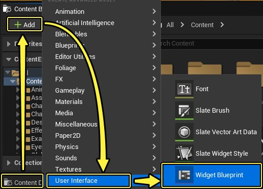
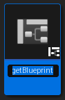
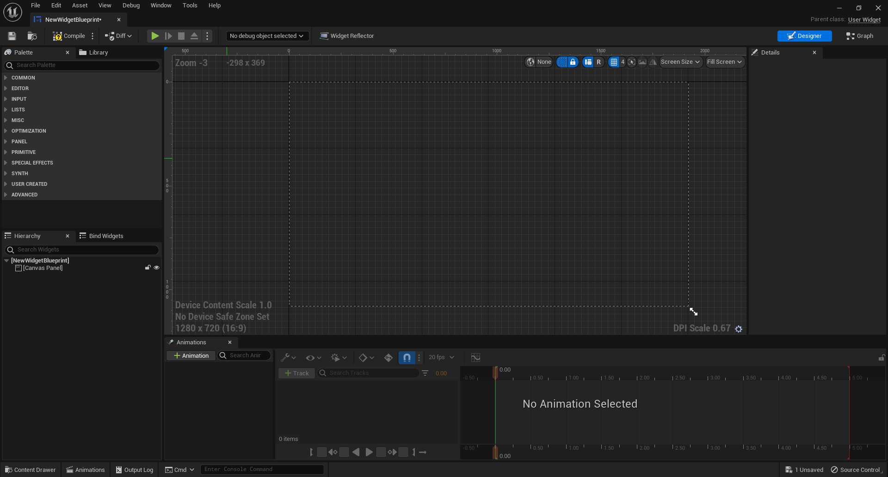
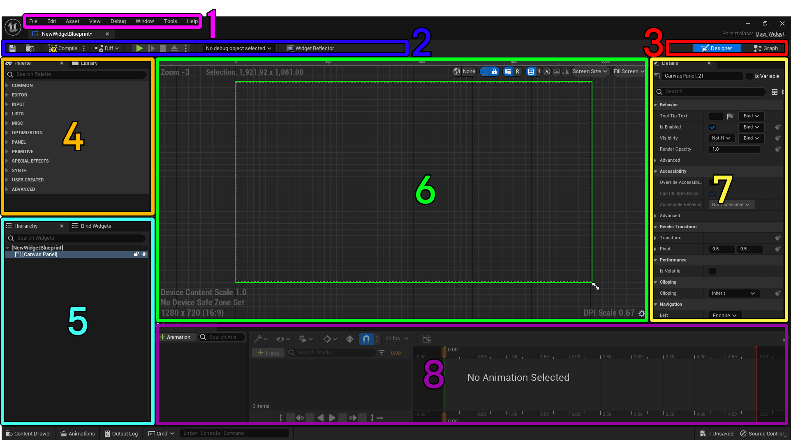
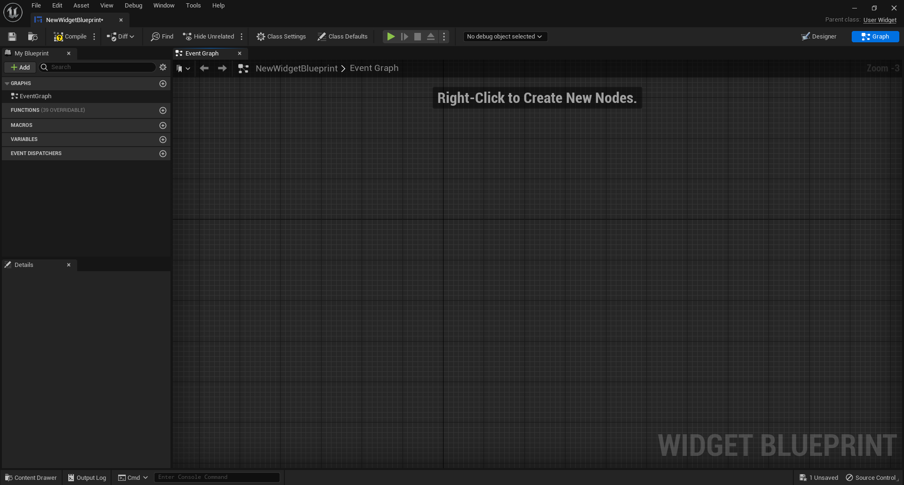

# 控件蓝图

> 路径：虚幻引擎5.7文档 / 创建用户界面 / 构建用户界面 / 构建你的UI / 控件蓝图

> 原始页面：https://dev.epicgames.com/documentation/unreal-engine/widget-blueprints-in-umg-for-unreal-engine

首先，你应该创建一个 **控件蓝图（Widget Blueprint）**，如下所示。有了它之后，你便可以开始使用 **虚幻示意图形（Unreal Motion Graphics (UMG)）**.

1. 创建 **控件蓝图（Widget Blueprint）**。在 **内容浏览器（Content Browser）** 中点击 **添加（Add）**，然后选择 **用户界面（User Interface） > 控件蓝图（Widget Blueprint）**。

   

   > [!NOTE]
   > 除了点击 **添加（Add）** 按钮以外，你还可以在 **内容浏览器（Content Browser）** 中右键点击。
2. 你可以重命名在内容浏览器中创建的控件蓝图，也可以使用默认名称。

   
3. **双击** 创建的 **控件蓝图（Widget Blueprint）** 来将其在 **控件蓝图编辑器（Widget Blueprint Editor）** 中打开。

   

   *点击查看大图。*

## 控件蓝图编辑器

**设计器（Designer）** 选项卡是在 **控件蓝图编辑器（Widget Blueprint Editor）** 中默认打开。利用这些编辑器工具，你可以自定义UI的外观。另外，你可以根据你调整的布局来预览游戏内画面。

*点击查看大图。*

| 数字 | 窗口 | 描述 |
| --- | --- | --- |
| **1** | **菜单栏（Menu Bar）** | 包含常用的菜单选项。 |
| **2** | **工具栏（Tool Bar）** | 包含蓝图编辑器一些常用的功能，比如 **编译（Compile）**、**保存（Save）**、**浏览（Browse）**、**播放（Play）** 等等。 |
| **3** | **编辑器模式（Editor Mode）** | 切换蓝图编辑器的 **设计器（Designer)** 和 **图形（Graph）** 模式。 |
| **4** | **调色板（Palette）** | 包含一个控件列表，可以将其中的控件拖放到 **视觉设计器（Visual Designer）** 中。显示继承自UWidget的所有类。 |
| **5** | **层级（Hierarchy）** | 显示用户控件的层级结构。可以将控件从 **调色板（Palette）** 拖动到此面板。 |
| **6** | **视觉设计器（Visual Designer）** | 这里显示布局的视觉呈现。在此窗口中可以操纵已拖动到视觉设计器中的控件。 |
| **7** | **详情（Details）** | 显示当前所选控件的属性。也可以在该面板调整属性。 |
| **8** | **动画（Animations）** | UMG的动画轨道，用于设置控件的关键帧动画。 |

> [!NOTE]
> **视觉设计器（Visual Designer）** 窗口默认按 1:1 比例显示，但是可以按住 **Ctrl** 键并使用 **鼠标滚轮** 来更改比例大小。

下图为 **控件蓝图编辑器（Widget Blueprint Editor）** 的 **图形（Graph）** 选项卡。

*点击查看大图。*

图形选项卡的功能与蓝图编辑器的设计器选项卡类似。有关图形选项卡基本功能的信息，请参阅 [蓝图编辑器图表编辑器](../../../../blueprints-visual-scripting/user-interface-reference-for-the-blu-73593f79/user-interface-components/graph-editor-for-the-blueprints-visual-scripting-editor/index.md) 文档。
