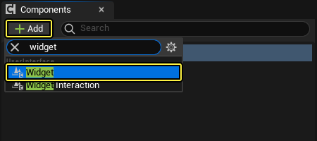

# 控件组件

> 路径：虚幻引擎5.7文档 / 创建用户界面 / 构建用户界面 / 构建你的UI / 控件组件

> 原始页面：https://dev.epicgames.com/documentation/unreal-engine/widget-components-in-unreal-engine

控件组件（Widget Component）允许你在游戏场景中用[虚幻示意图形（UMG）](../../../../blueprints-visual-scripting/specialized-blueprint-visual-scripting-node-groups/index.md)来创建3D UI元素。 **控件（Widget）** 组件是控件蓝图的3D实例，可以在游戏场景中与之交互。将包含控件组件的Actor放置到关卡中，控件类蓝图就会显示在游戏中。

## 控件组件属性参考

下面控件组件 **细节（Details）** 面板中的属性。

| 选项 | 说明 |
| --- | --- |
| **空间（Space）** | 用于渲染控件（世界场景（World）或屏幕（Screen））的坐标空间。使用世界场景（World）时，控件以网格体的形式在世界场景中进行渲染，并且可被遮挡，而屏幕（Screen）将在完全处于世界场景之外的屏幕上渲染控件，并且控件永远不会被遮挡。 |
| **控件类（Widget Class）** | 用于创建和显示用户控件实例的用户控件类。 |
| **绘制大小（Draw Size）** | 显示的四边形的大小。 |
| **手动重绘（Manually Redraw）** | 控件是否应等待被告知重绘方可实际绘制。 |
| **重绘时间（Redraw Time）** | 绘制时间间隔，如果为0，则重绘每一帧。如果为1，我们将每秒重绘。这也可以与手动重绘（Manually Redraw）配合使用。你可以说，手动重绘，但只能以这个最大速率重绘。 |
| **窗口可聚焦（Window Focusable）** | 创建用于托管控件的虚拟窗口是否可聚焦。此窗口是否应得到用户的关注。 |
| **按要求大小绘制（Draw at Desired Size）** | 使渲染目标自动匹配控件类指定的所需大小。如果每一帧都绘制，那么成本会很高昂。 |
| **枢轴（Pivot）** | 控件相对于该位置放置的对齐点/枢轴点。 |
