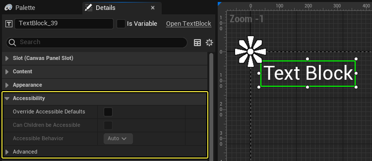

# 屏幕朗读器支持

> 路径：虚幻引擎5.7文档 / 创建用户界面 / 无障碍功能 / 屏幕朗读器支持

> 原始页面：https://dev.epicgames.com/documentation/unreal-engine/supporting-screen-readers-in-unreal-engine

UE现在支持Windows版第三方屏幕朗读器或iOS版VoiceOver。这能方便残疾人访问游戏UI，有助于遵循CVAA标准。 NVDA和JAWS之类的屏幕朗读器可以向用户朗读软件应用程序的UI。这是一个十分重要的功能，能帮助视力残疾者使用和浏览软件应用程序。

现在，UE中加入了一些API，允许使用第三方屏幕朗读器来朗读UI文本。它支持多种常用的UMG控件，例如文本块、可编辑的文本框、滑条、按钮和复选框。 借助这种内置功能，无需实现定制文本转语音技术即可轻松支持屏幕朗读器。

## 启用屏幕朗读器支持

要启用屏幕朗读器支持，转至项目或引擎的 **控制台变量** 配置文件。打开文件后，添加变量 `Accessibility.Enable=1`。

## 使用UMG中的访问

要使用屏幕朗读器访问UMG控件，请前往任意控件的 **细节（Details）** 面板。将看到 **访问（Accessibility）** 部分。访问设置是默认启用的。如果需要调整默认设置，请勾选 **覆盖可访问默认值（Override Accessible Defaults）** 选项。 勾选后就能调整 **是否能访问子项（Can Children Be Accessible）**、**访问行为（Accessible Behavior）** 和 **访问摘要行为（Accessible Summary Behavior）** 选项了。

其中 **是否能访问子项（Can Children Be Accessible）** 指定子控件是否继承访问行为设置。

在 **访问行为（Accessible Behavior）** 中可以指定希望屏幕朗读器API朗读控件文本的方式。可以在下列选项中选择：

- 自动（Auto）

  ：自动朗读指定给控件的文本。
- 摘要（Summary）

  ：屏幕朗读器串联所有子控件的文本。
- 自定义（Custom）

  ：屏幕朗读器使用开发者预编码的自定义文本。
- 提示文本（Tool Tip）

  ：屏幕朗读器仅阅读

  提示文本

  。
- 不访问（Not Accessible）

  ：忽略屏幕朗读器API。

如在"访问行为（Accessible Behaviors）"中选择"摘要（Summary）"，**访问摘要行为（Accessible Summary Behavior）** 会显示串联父控件和所有后续子控件的文本时将朗读哪些文本。

## 自定义控件支持（C++）

创建针对自定义Slate控件的新C++类即可添加附加支持。要向新的控件添加专门支持，必须覆盖 `SWidget::CreateAccessibleWidget()` 并返回新 `FSlateAccessibleWidget` 的实例。在FSlateAccessibleButton下的文件SlateAccessibleWidgets.h中可找到相应范例。此范例显示屏幕朗读器如何帮助用户点击按钮。

> [!NOTE]
> 如 `bCompileWithAccessibilitySupport` 设为false，可从Slate和平台层编译出屏幕朗读器代码。
