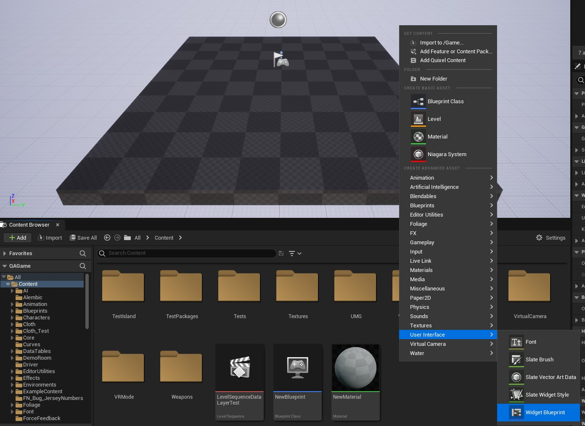
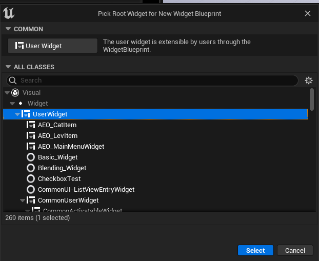
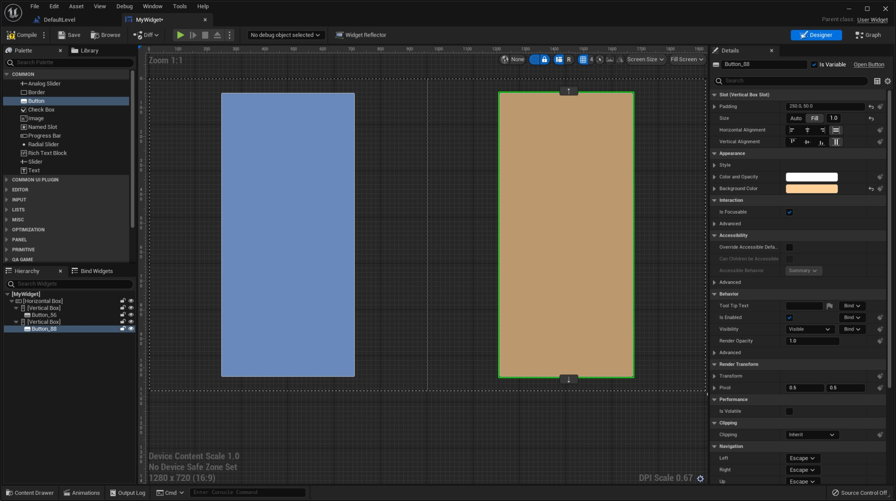
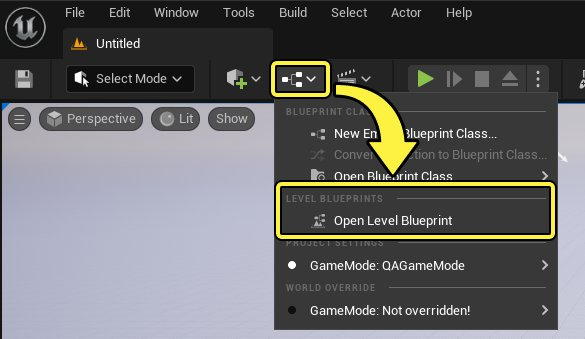
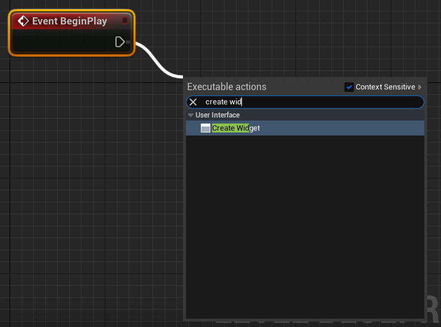
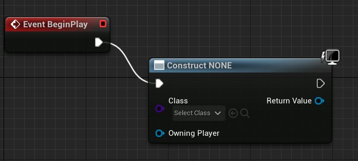
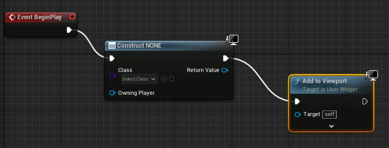
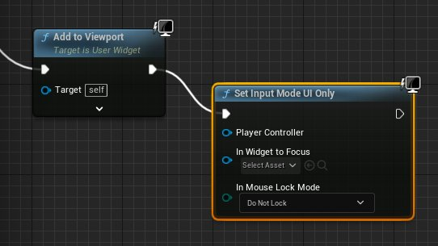

# 文本转语音快速入门

> 路径：虚幻引擎5.7文档 / 创建用户界面 / 无障碍功能 / 文本转语音快速入门

> 原始页面：https://dev.epicgames.com/documentation/unreal-engine/text-to-speech-quickstart-in-unreal-engine

本指南介绍了如何使用两个按钮创建和启用简单的 **文本转语音（Text To Speech）** 控件。每个按钮在用户点击时念出文本字符串。

## 需要的知识和设置

若要完成本页概括的步骤，请先执行以下操作：

1. 确保你熟悉虚幻示意图形（UMG）界面编辑器的基本原则。
2. 创建新的虚幻引擎项目。你可以根据自己的喜爱使用任意模板。
3. 为你的项目启用文本转语音插件。如果需要更多帮助来完成该步骤，请参阅[使用插件](../../../understanding-the-basics/foundational-knowledge-in/working-with-plugins/index.md)页面。

## 创建新控件蓝图

在该步骤中，你将创建在屏幕上显示的控件。

1. 在 **内容浏览器（Content Browser）** 或 **内容侧滑菜单（Content Drawer）** 中，右键点击空白区域。在 **上下文菜单** 中，选择 **用户界面（User Interface） > 控件蓝图（Widget Blueprint）** 。

   
2. 选择 **用户控件（User Widget）** 类，然后点击 **选择（Select）** ，创建你的控件。

   
3. 将新控件命名为 **MyWidget** 。
4. 双击 **控件蓝图（Widget Blueprint）** ，在 **控件编辑器（Widget Editor）** 中打开，然后使用两个按钮创建简单的布局，如下所示。对本教程而言，按钮的大小和位置不重要，只要你可以轻松点击按钮即可。

   
5. **编译（Compile）** 和 **保存（Save）** 控件，然后最小化控件编辑器。

## 将控件添加到关卡蓝图

接下来，将控件添加到关卡蓝图，这样当游戏开始时，它将在屏幕上绘制。

1. 从 **主工具栏（Main Toolbar）** 打开 **关卡蓝图（Level Blueprint）** 。

   
2. 在 **关卡蓝图（Level Blueprint）** 中，从 **Event BeginPlay** 节点的执行引脚拖出。搜索并选择 **Create Widget** ，然后按 **Enter** 键，创建节点。

   

   
3. 从 **Create Widget** 节点的引脚拖出，并创建 **Add to Viewport** 节点。

   
4. 从 **Add to Viewport** 节点的执行引脚拖出，并创建 **Set Input Mode UI Only** 节点。

   

   > [!TIP]
   > 该节点将向你的控件表明，响应玩家输入的唯一游戏元素是UI。用户的所有其他输入都不会转化为Gameplay操作，即使有操作绑定到该功能按钮也不例外。
5. 右键点击 **蓝图编辑器（Blueprint Editor）** 的空闲区域，并创建 **Get Player Controller** 节点。

   > 图片已省略：创建Get Player Controller节点
6. 将你在步骤2中创建的 **Construct Widget** 节点的 **返回值（Return Value）** 引脚连接到以下引脚：

   - Add to Viewport

     节点上的

     目标（Target）

     。
   - Set Input Mode UI Only

     节点上的

     在要聚焦的控件中（In Widget to Focus）

     。
7. 将你在步骤5中创建的 **Get Player Controller** 节点的 **返回值（Return Value）** 引脚连接到 **Set Input Mode UI Only** 节点的 **玩家控制器（Player Controller）** 引脚。

   在该阶段，你的关卡蓝图看起来应该类似于下图。

   > 图片已省略：部分关卡蓝图
8. 从 **Get Player Controller** 节点的 **返回值（Return Value）** 引脚拖出，并创建 **Set Show Mouse Cursor** 节点。启用该节点的 **显示鼠标光标（Show Mouse Cursor）** 复选框。
9. 将 **Set Input Mode UI Only** 节点输出引脚连接到 **Set Show Mouse Cursor** 节点输入引脚。

   > 图片已省略：连接Set Show Mouse Cursor节点
10. 将 **Create Widget** 节点的 **类（Class）** 值设置为你在之前分段中创建的 **MyWidget** 控件。

    > 图片已省略：将控件类设置为MyWidget
11. **编译（Compile）** 并 **保存（Save）** 你的蓝图。

完成的关卡蓝图应如下所示：

> 图片已省略：undefined

点击查看大图。

现在你可以关闭关卡蓝图。

## 添加文本转语音字符串

接下来，为每个按钮创建用于"说话"的通道，并输入将念出的文本字符串。

1. 返回到控件的 **控件编辑器（Widget Editor）** 。如果你已将其关闭，请在 **内容浏览器（Content Browser）** 中双击 **MyWidget** 控件，将其再次打开。
2. 点击你创建的某个按钮。然后，在右侧的 **细节（Details）** 面板中，向下滚动到 **事件（Events）** ，并点击 **（+）加号**，添加新的 **点击时（On Clicked）** 事件。

   > 图片已省略：添加点击时事件

   该操作将打开控件的 **图表（Graph）** ，并为该按钮创建新的 **On Clicked** 节点。
3. 在图表中点击右键并创建新的 **Get TextToSpeechEngineSubsystem** 节点。

   > 图片已省略：创建Get Text To Speech Engine Subsystem节点

   > [!TIP]
   > 如果你看不到该节点，请确保已为你的项目启用 **文本转语音** 插件。
4. 从**Text to Speech Engine Subsystem** 节点拖出，并创建新的 **Add Default Channel** 节点。将 **点击时（On Clicked）** 事件连接到 **Add Default Channel** 节点的 **输入（input）** 引脚。

   > 图片已省略：创建Add Default Channel节点
5. 在 **Add Default Channel** 节点中，右键点击 **新通道ID（New Channel ID）** 属性并选择上下文菜单中的 **提升到变量（Promote to Variable）** 。

   > 图片已省略：将新通道ID属性提升到变量
6. 在右侧的 **细节（Details）** 面板中，使用 **变量名称（Variable Name）** 属性将变量命名为 **Channel One** 。

   > 图片已省略：重命名变量
7. 从**Text to Speech Engine Subsystem** 节点再次拖出，并创建新的 **Activate Channel** 节点。将 **Add Default Channel** 节点输出引脚连接到 **Activate Channel** 节点输入引脚。

   > 图片已省略：创建Activate Channel节点
8. 将你在步骤4中创建的 **Channel One** 变量连接到 **Activate Channel** 节点上的 **通道ID（Channel ID）** 引脚。

   在该阶段，你的蓝图看起来应该如下所示：

   > 图片已省略：undefined

   点击查看大图。
9. 从**Text to Speech Engine Subsystem** 节点再次拖出，并创建新的 **Speak on Channel** 节点。将 **Activate Channel** 节点输出引脚连接到 **Speak on Channel** 节点输入引脚。

   > 图片已省略：创建Speak on Channel节点
10. 将你在步骤4中创建的 **Channel One** 变量连接到 **Activate Channel** 节点上的 **通道ID（Channel ID）** 引脚。
11. 从 **Speak on Channel** 节点上的 **要说出的字符串（String to Speak）** 引脚拖出，并创建新的 **To String (Text)** 节点。

    > 图片已省略：创建String to Speak节点
12. 从你在之前步骤中创建的 **to String (Text)** 节点的输入引脚拖出，并创建新的 **Format Text** 节点。

    > 图片已省略：创建Format Text节点
13. 在 **Format Text** 节点的 **格式（Format）** 框中，输入你希望说出的文本。

    > 图片已省略：输入要说出的字符串
14. 为你创建的第二个按钮重复步骤1-12，根据情况将Channel One更改为Channel Two。

    > [!TIP]
    > 你可以点击并拖移来选择多个蓝图节点，然后进行复制和粘贴。这样可减少手动重复步骤的需要。
15. **编译（Compile）** 并 **保存（Save）** 蓝图。

完成的控件蓝图现在应如下所示：

> 图片已省略：undefined

点击查看大图。

## 测试控件

现在可以测试你的控件。

在 **关卡视口（Level Viewport）** 中的 **主工具栏（Main toolbar）** 上，点击 **播放（Play）** 按钮，进入 **在编辑器中播放（Play in Editor）** 模式。

> 图片已省略：主工具栏上的播放按钮

现在你应该会看到你的控件在视口中绘制。点击一个按钮，听其字符串被念出。

> 图片已省略：关卡视口中完成的控件
