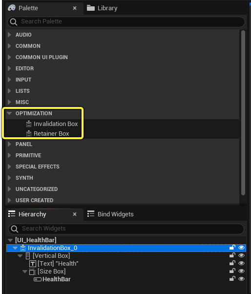
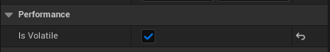

# UI无效化

> 路径：虚幻引擎5.7文档 / 创建用户界面 / 优化用户界面 / UI无效化

> 原始页面：https://dev.epicgames.com/documentation/unreal-engine/invalidation-in-slate-and-umg-for-unreal-engine

**无效化（Invalidation）** 是一种通过限制UI重新绘制控件的频率来减少CPU开销的优化措施。无效系统中的控件，如果其UI布局发生变化，会被标记为 **无效的（invalidated）** 。然后，只有被标记为无效的控件极其子控件会被重新绘制。

在项目中使用无效的方式有两种：

- 使用 **无效框（Invalidation Box）** 和 **限位面板（Retainer Panel）** 控件，逐个控件实现无效。
- 使用 **全局无效（Global Invalidation）** 在整个UI中实现无效。

下面的小节介绍了如何在项目中实现无效，以及它的工作方式，以便你可以就何处应用它做出决定。

## 如何实现无效

### 无效框

无效框控件会缓存其子控件的几何体，然后监控这些控件是否有更改。只要无效框中的控件没有更改，Slate就回退到缓存的几何体，而不是重新绘制，从而显著减少这些控件的CPU使用量。

你可以在UMG编辑器的 **控制板（Palette）** 中的 **优化（Optimization）** 分段中找到无效框控件。

无效框会处理它封装的控件，以及它在层级中的所有子控件。

如需详细了解无效框及其设置，请参阅[无效框控件参考](https://dev.epicgames.com/documentation/404)。

## 全局无效

全局无效会启用 `SWindow` 中的无效功能，实际上会将你的整个UI封装在无效框中。该窗口中包含的所有无效框都将停用，只有 `SWindow` 会缓存信息。

你可以将 `Slate.EnableGlobalInvalidation` 设置为true来启用全局无效。

### 限位面板

限位面板会将所有子控件扁平化为单个纹理，然后在用户的屏幕上渲染。此外，你还可以使用以下选项配置限位器的渲染方式：

- 使用基于阶段或限制帧率的渲染，将每个限位器配置为在单独的帧上绘制，这样Slate就不会同时绘制整个UI。
- 将不同的限位面板配置为使用不同的帧率。例如，UI的一些部分可以按30 FPS运行，而其他部分可以按60 FPS运行。

所有这些功能都旨在减少或管控UI在单个帧中发出的绘制调用数量。

限位面板在重新绘制时有很高的开销，它们使用的内存比单独控件通过无效框使用的内存更多。这是因为，每个限位面板不仅使用单独控件的无效数据，还有自己的渲染目标。寻找机会减少UI的CPU使用量时，你应该尝试首先使用无效框。如果你仍需要减少绘制调用，那么实现限位器可以进一步压缩调用数量。这在性能预算特别紧张的环境中（例如低端移动设备）可能很有用。

## 无效的工作方式

控件在屏幕上绘制时，会按以下顺序执行多项计算：

1. **层级（Hierarchy）：** Slate构建层级中控件的树状结构，包括根控件及其所有子控件。
2. **布局（Layout）：** Slate基于其渲染变换计算控件大小和屏幕上的位置。
3. **绘制Paint）：** Slate计算单独控件的几何体。

此过程中的每个步骤都需要遍历其后面的所有步骤。例如，布局计算需要运行绘制步骤，而重新构建层级需要运行绘制和布局步骤。

无效系统会将上述每种类型的数据缓存在内存中，要么缓存在控件的父无效框中，要么当你使用全局无效时缓存在它们绘制所在的SWindow中。只要缓存的信息不更改，Slate就回退到该信息，而不是重新执行计算。每当有控件更改时，它会添加到脏列表。在渲染的下一帧上，所有脏控件将根据更改的数据类型重新计算。

有多种类型的无效对应于重新计算和绘制过程中它们跳过的部分。

| **无效类型** | **CPU成本** | **说明** |
| --- | --- | --- |
| **易变/可视性（Volatile/Visibility）** | 非常低 | **易变（Is Volatile）** 或 **可视性（Visibility）** 标记在该控件及其子控件上发生更改。 |
| **绘制（Paint）** | 低 | 将重新计算控件的几何体。如果你更改非布局参数，例如颜色或材质，会发生此情况。 |
| **布局（Layout）** | 中度 | 因为绘制无效，加上控件的大小和在屏幕上的位置已更改。如果你更改控件的渲染变换，会发生此情况。 |
| **子控件（Child）** | 高 | 因为布局无效，加上Slate会重新构建子控件的列表。这样会导致完全重新计算控件及其子控件，如果你在控件中添加或删除子控件，就会发生此情况。 |

举个例子来说明一下此情况对项目的影响，如果你只更改控件的颜色，它会在该控件上触发 **绘制无效（Paint Invalidation）** 。Slate将跳过其子控件列表及其布局的重新构建，并且只需要重新计算其几何体。缓存的布局数据保持有效，因此不需要更新。

如果你在代码中或使用Sequencer动画来移动控件或调整其大小，将触发 **布局无效（Layout Invalidation）** 。控件的所有缓存信息将需要在每次发生此情况时重新计算，包括布局数据（位置和大小）与绘制数据（控件几何体）。这相较于子无效仍然相当快。

如果你在控件的子控件中添加或删除子控件，将触发 **子无效（Child Invalidation）** 。重新构建其子控件列表后，布局和绘制计算需要在控件及其所有子控件上更新。在大部分用例中，这是值得付出的单帧成本，但如果你的UI每帧都这样做，就可能带来重大性能瓶颈。

**易变/可视性无效（Volatile/Visibility Invalidation）** 仅当"易变（Is Volatile）"或"可视性（Visibility）"标记更改时应用。其中每种情况都需要在下一帧重新绘制该控件，但不一定表示其他数据无效。请参考下面的"易变控件"小节，了解详细信息。

无效尤其非常适合不常更改的控件，因为Slate可以长时间回退到缓存数据，为你的UI减轻大量CPU负载。这在创建大型或复杂UI时尤其很重要，例如MMORPG或带有深度菜单的实时服务游戏中的UI。

### 易变控件

有时，你需要实现的控件可能需要非常频繁地更新，也许是逐帧更新。在这种情况下，控件将在它更改的每次更新时失效，有可能使用的CPU负载与控件根本不使用无效时相同，但仍会消耗缓存控件的几何体所需的内存。

为解决该问题，你可以将经常更新的控件标记为易变控件。控件标记为易变时，无效系统不会缓存其绘制数据或其子控件的绘制数据。其几何体会将每帧重新计算并重新绘制，但Slate仍将跳过不需要的布局计算。如果你想在整个UI中广泛应用无效，但想定制几个控件，可这些控件由于频繁更新而致使缓存的助益不大，这样做就很有用。

要将控件标记为易变，请在该控件的细节面板中切换该控件的 **性能（Performance）** > **易变（Is Volatile）** 设置。

或者，在C++中，你可以通过将 `Volatile` 参数设置为 `true` ，将控件标记为可能发生变化。
