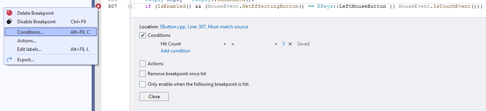

# 输入调试和故障排除

> 路径：虚幻引擎5.7文档 / 创建用户界面 / UI开发插件 / Common UI / 输入调试和故障排除

> 原始页面：https://dev.epicgames.com/documentation/unreal-engine/input-debugging-and-troubleshooting-for-commonui-in-unreal-engine

使用断点调试时，可能会触发窗口焦点更改，进而可能影响你的应用程序的控件焦点。这样一来就很难调试输入，因为断点可能会导致你的UI进入的状态不是你打算调试的状态。要解决此限制，请尝试使用 **条件断点** 。

## 带有击中计数的条件断点

要创建条件断点，最简单方法是将 **击中计数** 添加到你的断点，这样断点会在几次点击之后触发。

使用Visual Studio中的击中计数条件的条件断点示例。

添加击中计数后，确保你的相关控件是在最后一次点击时点击的。

> [!NOTE]
> 请参阅你的IDE的文档，详细了解如何设置击中计数等条件。

## 带有控件反射器的条件断点

你可以使用[控件反射器](../../../testing-and-debugging-user-interfaces/using-the-slate-widget-reflector/index.md)获取特定控件的条件断点。为此，请在找到控件后点击 **[CBP]** 。这会将断点限制为仅针对该控件激活。例如，你可以向 `SButton::OnMouseButtonDown` 添加仅针对特定按钮触发的断点。

## CommonUI输入故障排除常见问题解答

下面是使用CommonUI的开发人员经常遇到的一些问题或疑问：

### 如何解决影响UI的更新/游戏暂停？

CommonUI当前适用于 **LocalPlayerSubsystems** 。如果游戏暂停，这些子系统不会更新。如果子系统不更新，则CommonUI（包括CommonBoundActionBar）将无法正常运行。为解决这个问题，在与UI的所需功能或性能不相抵触的情况下，我们推荐将相关Actor和控件设置为 **暂停时可更新** 。必要时可派生自定义子类来执行此操作。

### 为什么我会在关键帧处理程序方法中获得模拟输入？

在UE5中， *InputKey* 和 *InputAxis* 行为会在 **PlayerController** 级别合并到一起。这样做是为了更轻松地执行伪输入注入并捆绑输入参数，以便未来更轻松地更新。

如果你有UE 5.0之前的代码，模拟输入现在可能会触发关键帧处理程序回调，反之亦然。CommonUI应该得到正确保护，防止这种情况造成显著影响。但是，如果你要在输入管线早期调试，你可能会注意到这种交叉触发的一些情况。例如，由于 `FCommonAnalogCursor` 是输入处理器，它会与输入管线的更早部分交互。由于此交互，你可能会在 `FCommonAnalogCursor::HandleKeyDownEvent` 中看到交叉触发。

### 为什么我会在输入模式为菜单时获得游戏输入？

按照 `UCommonUIActionRouterBase::CanProcessNormalGameInput` ，如果游戏视口有鼠标捕获，UE5在菜单模式中允许游戏输入。这有助于支持处于菜单中时操控世界中的预览物品和角色。如果你不想要此行为，请在所需输入配置中禁用视口鼠标捕获。
