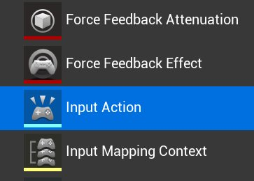
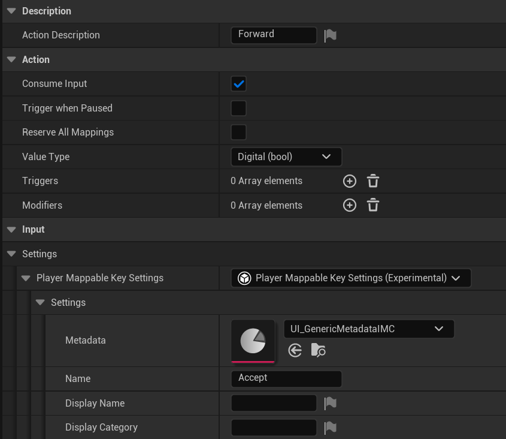
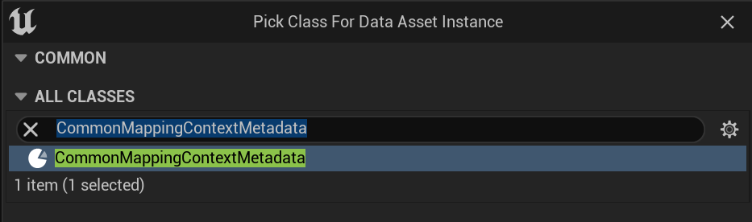
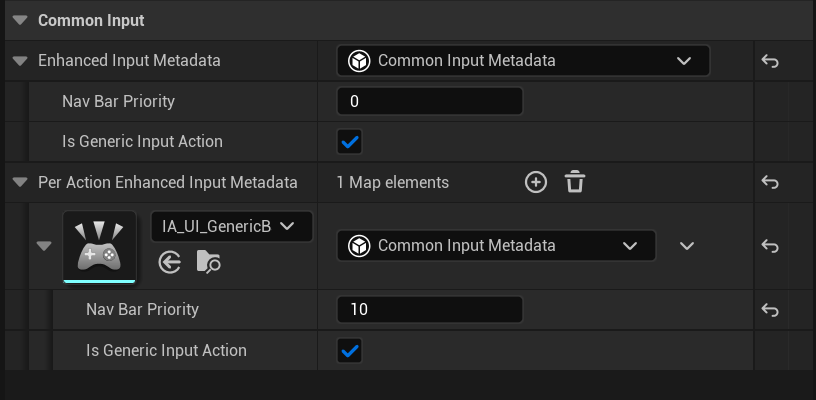
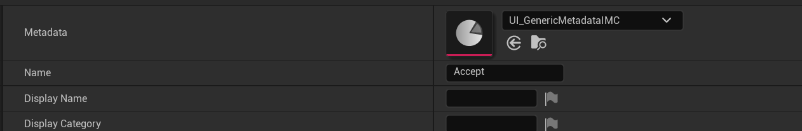
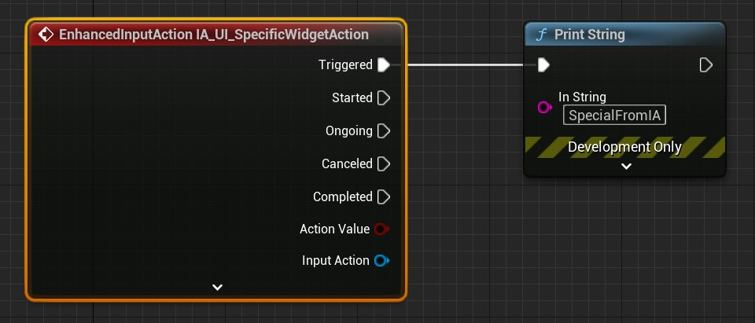
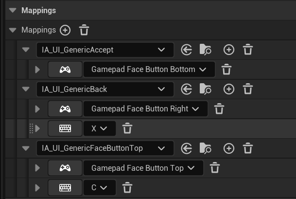

# 将CommonUI与增强输入结合使用

> 路径：虚幻引擎5.7文档 / 创建用户界面 / UI开发插件 / Common UI / 将CommonUI与增强输入结合使用

> 原始页面：https://dev.epicgames.com/documentation/unreal-engine/using-commonui-with-enhnaced-input-in-unreal-engine

**CommonUI插件** 为[增强输入](../../../../gameplay-systems/input/enhanced-input/index.md)操作提供的支持有限。

> [!NOTE]
> 从UE 5.2开始，对增强输入（Enhanced Input）支持的测试不如CommonUI中其他功能那样全面。我们不建议你尝试在此时发布具有此功能的作品。

## 1. 必要设置

本页面假定你已对CommonUI执行了以下设置步骤：

- 将CommonUI和增强输入（Enhanced Input）插件均启用。
- 将视口类设置为CommonGameViewportClient。
- 设置你的接受（Accept）/返回（Back）操作的InputData。

## 2. 在CommonUI中启用增强输入（Enhanced Input）

启用CommonUI和增强输入（Enhanced Input）插件后，打开 **项目设置（Project Settings）** 。 找到 **游戏（Game）** > **常见输入设置（Common Input Settings）** ，将 **启用增强输入支持（Enable Enhanced Input Support）** 设置为 **true** 。这样就可以支持这两个插件进行通信。

## 3. 为CommonUI设置增强输入操作

增强输入操作可以在任意位置绑定输入事件，包括 *进行中* 和 *已触发* 事件等专门变体。但全局绑定大多数UI操作绑定（诸如 *FaceButtonTop* 、 *Accept* 或 *Back* ）是不可取的做法，会引发混乱，因为如果这样做，可能会因用户在意外的时间输入而导致意想不到的事件。CommonUI通过 *泛型操作* 解决这个问题。 泛型操作绑定到UI元素，但不会在CommonUI中触发增强输入事件。

如需在CommonUI内设置增强输入操作，请执行以下步骤：

1. 在内容浏览器中创建泛型 **输入操作（Input Action）** 。将其命名为 `IA_UI_GenericAccept` 。

   
2. 为你的输入操作（Input Action）添加 **PlayerMappableKeySettings** 。
3. 在 **PlayerMappableKeySettings** 的 **设置（Settings）** 中，将 **Metadata（元数据）** 字段设置为实现IComonMappingContextMetadataInterface的对象。

   

   > [!TIP]
   > 你可能需要将输入操作元数据用于CommonUI以外的其他内容。因此，我们建议使用实现 `IComonMappingContextMetadataInterface` 的类来确保灵活性。
4. 在内容浏览器中右键点击，然后点击 **杂项（Miscellaneous）** > **数据资产（Data Asset）** 以创建数据资产。
5. 选择实现 `IComonMappingContextMetadataInterface` 的元数据类作为你的数据资产类。将你的元数据命名为UI_IA_GenericMetadata。你可以使用UCommonMappingContextMetadata作为默认值，也可以使用自定义资产类。

   
6. 打开UI_IA_GenericMetadata，然后按如下步骤编辑其设置：

   - **是泛型输入操作（Is Generic Input Action）：**True
   - **每个操作的增强输入元数据（Per Action Enhanced Input Metadata）：** IA_UI_GenericAccept
   - **导航栏优先级（Nav Bar Priority）：**10

   

   选中 **是泛型输入操作（Is Generic Input Action）** 以防止CommonUI广播输入操作。

   此数据资产提供一个元数据对象，你可以在其中设置CommonUI操作数据。如果你已熟悉CommonUI，或许你能在CommonUI的数据表中发现导航栏优先级（Nav Bar Priority）设置。你还可以通过从 *UCommonInputMetadata* 继承来使用其他元数据扩展输入操作。

   > [!TIP]
   > 你可以使用 **每个操作的增强输入元数据（Per Action Enhanced Input Metadata）** 在单个资产中处理多个操作的元数据，而不是为每个操作创建一个资产。
7. 重复第5步至第6步，但这次不选中"是泛型输入操作（Is Generic Input Action）"。将此元数据命名为 `UI_IA_SpecificMetadata` 。这会产生一个元数据类，你可以在非泛型输入操作上使用它。
8. 打开你的输入操作。将元数据（Metadata）设置为UI_IA_GenericMetadata。输入操作现已获得搭配CommonUI使用所需的全部信息。

   
9. 若输入操作的元数据未启用"是泛型输入操作（Is Generic Input Action）"，你可以像其他输入操作那样将输入绑定到事件。

   

## 4. 为CommonUI创建输入映射上下文（IMC）

CommonUI的输入映射上下文（IMC）的行为与其他IMC相同。 要创建输入映射上下文，请在内容浏览器中右键点击，然后点击 **输入（Input）** > **输入映射上下文（Input Mapping Context）** 。下图举例说明了与CommonUI结合使用的IMC的可能外观：

为了明确你的IMC用于你的UI，我们建议将其命名为 `IMC_UI_GenericActions` 或类似的名称。

## 5.在CommonUI中使用输入操作和输入映射上下文

你可以在以前使用的 **DataTableRows**中的任意位置使用输入操作来指定输入信息。以下是典型示例：

- CommonButtonBase。

  > 图片已省略：通用按钮基础
- CommonActionWidget。这可以显示非UI输入操作的键。

  > 图片已省略：通用操作控件
- 通用UI输入数据（Common UI Input Data）。此处定义默认导航操作。

  > 图片已省略：通用UI输入数据

> [!NOTE]
> 如果未出现这些设置，请检查确认[在CommonUI中启用增强输入](#enableenhanced)设置设为true。

在可激活控件（Activatable Widgets）中，你可以指定在激活和停用时要应用和移除的IMC。为改善条理性，我们建议在你应用其他顶层游戏IMC的位置应用泛型UI IMC。

> 图片已省略：在可激活控件中指定的IMC
