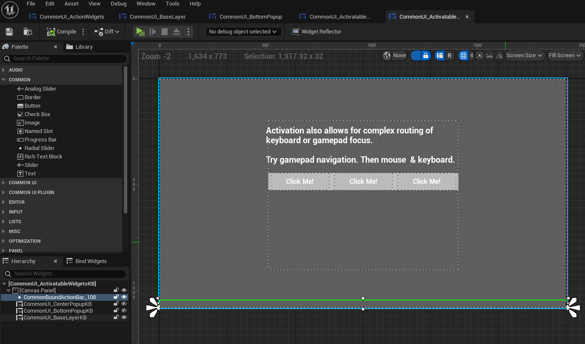
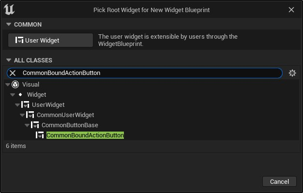
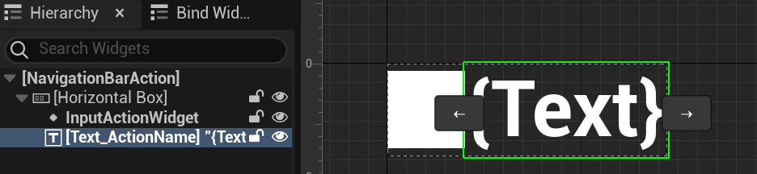
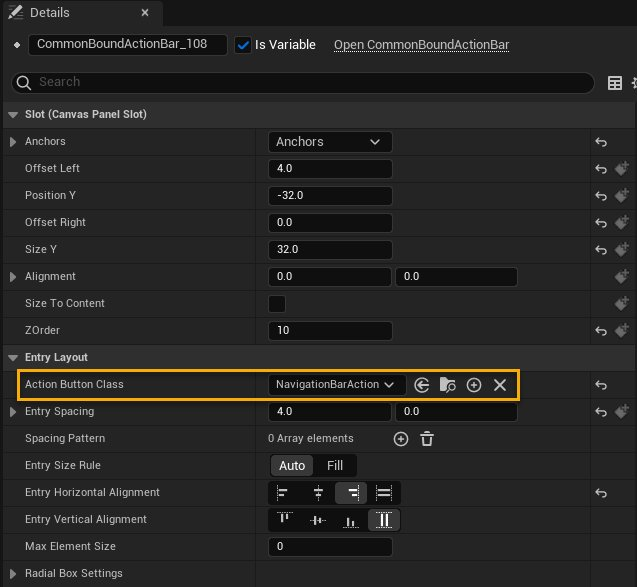
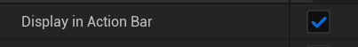

# 通用绑定操作栏

> 路径：虚幻引擎5.7文档 / 创建用户界面 / UI开发插件 / Common UI / 通用绑定操作栏

> 原始页面：https://dev.epicgames.com/documentation/unreal-engine/using-the-common-bound-action-bar-in-unreal-engine

用户界面可以将输入操作映射到屏幕上的按钮。例如，带有多个选项卡的选项菜单可以使用游戏手柄上的左右肩按钮在多个选项卡之间切换。此类交互与上下文高度相关，因此，CommonUI包含一个称为 **通用绑定操作栏（Common Bound Action Bar）** 的控件，它在可轻松引用的单个位置中显示当前活动的UI中的所有输入操作。通常，此控件放置在屏幕底部。

### CommonBoundActionBar/NavBar的工作方式

`UCommonBoundActionBar` 在每次更新函数时更新。最终栏更新在函数 *UCommonBoundActionBar::HandleDeferredDisplayUpdate* 中实现。 将 `bDisplayInActionBar` 属性设置为 `true` 的所有输入操作都会收集、排序，然后添加到列表中供显示。

此更新会绑定到 **操作路由器（Action Router）** 委托 `UCommonUIActionRouterBase::OnBoundActionsUpdated_`_ ，它在CommonUI中的各个节点更改点期间触发。每当控件激活或停用时会发生节点更改，因此这非常适合用于跟踪可用的操作更改。

但是， `UCommonUIActionRouterBase` 是一个本地玩家子系统，这意味着它依赖本地玩家来更新。这意味着，当游戏暂停更新以显示菜单时， `UICommonBoundActionBar` 不会随着可用CommonUI操作更改而动态更新，因为它依赖玩家的更新过程。

并非所有操作都会添加到操作栏，也不是必须添加。`FBindUIActionArgs::bDisplayInActionBar` 可确定输入操作是否会添加到操作栏。这会在蓝图中通过 **在操作栏中显示（Display In Action Bar）** 设置公开，你还可以在C++中使用 `UCommonUserWidget::bDisplayInActionBar` 访问它。

> [!NOTE]
> 你可以在暂停时为拥有玩家交互或UI的Actor或本地玩家启用更新，这是一种可行的变通方案。你还可以创建控件的子类，并将其设置为在暂停时可更新。

## 在你的UI中实现CommonBoundActionBar

要设置通用绑定操作栏：

1. 将CommonBoundActionBar添加到你的控件蓝图。内容示例项目会在 **CommonUI_ActivatableWidgetsKB** 中将其固定到屏幕底部。你可以在 **ExampleContent**> **UMG** > **CommonUI** > **ActivatableWidgetsKB** 中找到此控件。

   
2. 创建从 `UCommonBoundActionButton` 派生的类。在内容示例项目中，此控件名为 **NavigationBarAction** 。

   
3. 对于简单的实现，使用水平框中的 **通用输入操作（Common Input Action）** 控件和 **通用文本控件（Common Text Widget）** 。通用输入操作控件会显示你的按钮图标，而通用文本控件会显示输入操作的友好名称。

   
4. 将通用文本控件命名为" **Text_ActionName** "。`UCommonBoundActionButton` 会基于此特定名称将文本控件绑定到InputAction的文本。

   > [!WARNING]
   > 如果你不将通用文本控件重命名为 "Text_ActionName"，你的蓝图将无法编译。
5. 将CommonBoundActionButton添加到CommonBoundActionBar的 **操作按钮类（Action Button Class）** 。

   
6. 在UI中选择你希望在CommonBoundActionBar中显示其操作的CommonUI控件，然后将 **在操作栏中显示（Display in Action Bar）** 设置为 **true** 。在C++中，这使用 `bDisplayInActionBar` 表示。

   

   > [!NOTE]
   > `bDisplayInActionBar` 是 `UCommonUserWidget` 及其派生类（例如 `UCommonButtonBase` ）的成员。就像输入操作本身那样，它在基础UMG的控件库中不可用。
7. 确保包含你想显示的输入操作的控件 **已激活** 。这意味着，控件本身必须是可激活控件，或者必须是可激活控件的子项。

> [!NOTE]
> 可激活控件默认从停用状态开始。你可以调用 `UCommonUserWidget::Activate` 手动激活这些控件，也可以使用 **自动激活（Auto Activate）** 设置（UCommonActivatableWidget::bAutoActivate），使其在添加到视口时自行激活。

播放时，假定包含你的操作的控件已激活，这些操作应该显示在导航栏中。
