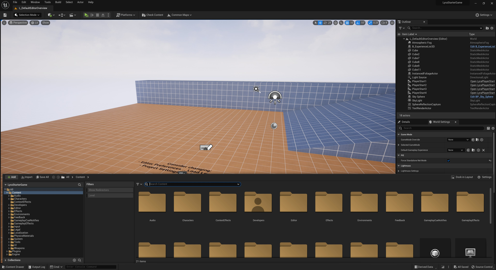
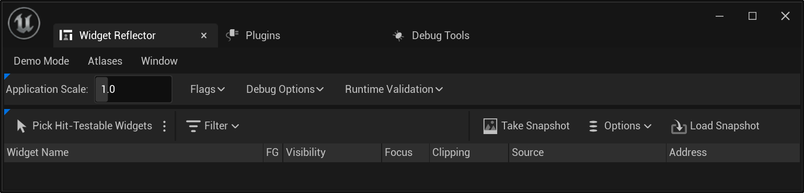
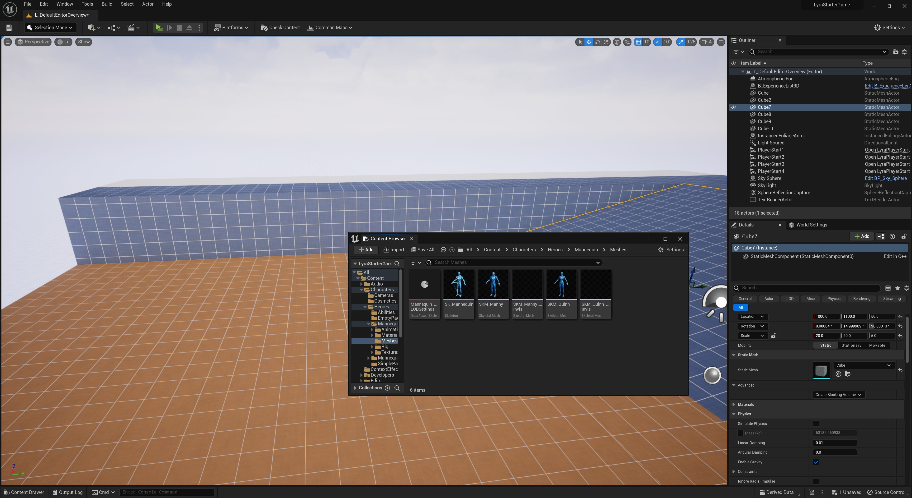
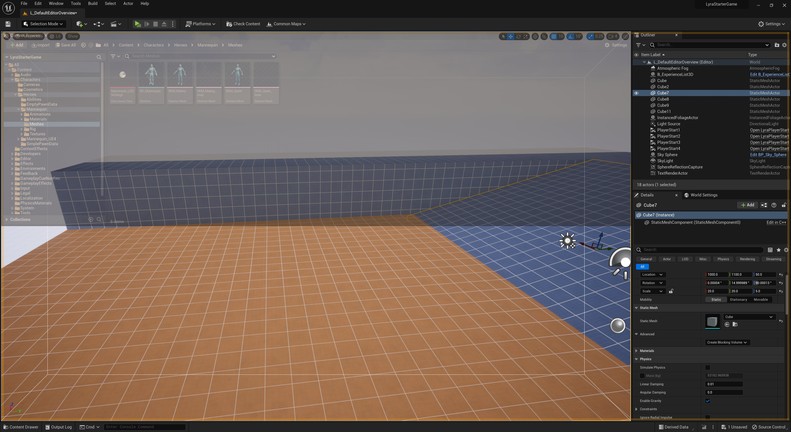
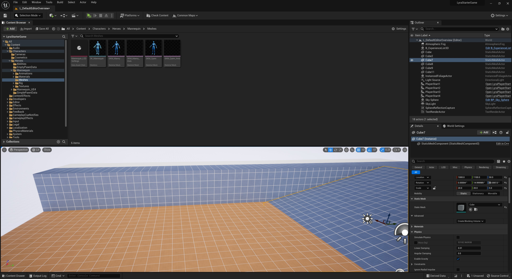
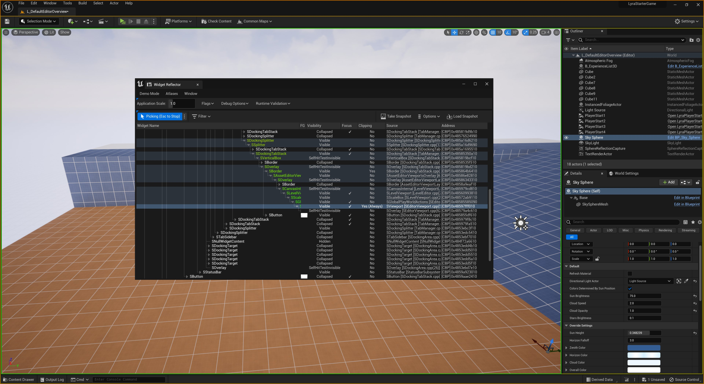

# Slate概述

> 路径：虚幻引擎5.7文档 / 创建用户界面 / Slate UI框架 / Slate概述

> 原始页面：https://dev.epicgames.com/documentation/unreal-engine/slate-overview-for-unreal-engine



**Slate** 是完全自定义、与平台无关的用户界面框架，旨在让工具和应用程序（比如虚幻编辑器）的用户界面或游戏中用户界面的构建过程变得有趣、高效。它将声明性语法与轻松设计、布局和风格组件的功能相结合，允许在UI上轻松实现创建和迭代。

Slate UI解决方案使得为工具和应用程序组合图形用户界面和快速迭代这些界面变得极其简单。

## 声明性语法

Slate的声明性语法使得程序员可以访问构建UI，而无需添加间接层。提供了一组完整的宏来简化声明和创建新控件的过程。

```
	SLATE_BEGIN_ARGS( SSubMenuButton )		: _ShouldAppearHovered( false )		{}		/** 将显示在按钮上的标签 */		SLATE_ATTRIBUTE( FString, Label )		/** 单击按钮时调用 */		SLATE_EVENT( FOnClicked, OnClicked )		/** 将放置在按钮上的内容 */		SLATE_NAMED_SLOT( FArguments, FSimpleSlot, Content )		/** 在悬停状态下是否应显示按钮 */		SLATE_ATTRIBUTE( bool, ShouldAppearHovered )	SLATE_END_ARGS()
```

## 合成

Slate的合成框架使得快速重新排列UI元素以进行原型和迭代变得简单。

下面是正在合成的UI的一部分的示例：

```
	// 为静态网格体添加一个新的部分	ContextualEditingWidget->AddSlot()	.Padding( 2.0f )	[		SNew( SDetailSection )		.SectionName("StaticMeshSection")		.SectionTitle( LOCTEXT("StaticMeshSection", "Static Mesh").ToString() )		.Content()		[			SNew( SVerticalBox )			+ SVerticalBox::Slot()			.Padding( 3.0f, 1.0f )			[				SNew( SHorizontalBox )				+ SHorizontalBox::Slot()				.Padding( 2.0f )				[					SNew( SComboButton )					.ButtonContent()					[						SNew( STextBlock )						.Text( LOCTEXT("BlockingVolumeMenu", "Create Blocking Volume") )						.Font( FontInfo )					]					.MenuContent()					[						BlockingVolumeBuilder.MakeWidget()					]				]			] 		]	]; 
```

上面的合成创建以下UI元素：

## 风格

可以创建风格并将它们应用于控件的各个部分。这使得迭代UI中组件的外观以及共享和重复使用风格变得很容易。

```
	// 工具栏	{		Set( "ToolBar.Background", FSlateBoxBrush( TEXT("Common/GroupBorder"), FMargin(4.0f/16.0f) ) ); 		Set( "ToolBarButton.Normal", FSlateNoResource() );		// 注意：有意透明的背景		Set( "ToolBarButton.Pressed", FSlateBoxBrush( TEXT("Old/MenuItemButton_Pressed"), 4.0f/32.0f ) );		Set( "ToolBarButton.Hovered", FSlateBoxBrush( TEXT("Old/MenuItemButton_Hovered"), 4.0f/32.0f ) ); 		// 工具栏按钮有时为切换按钮，因此它们需要用到"勾选"状态的风格。		Set( "ToolBarButton.Checked", FSlateBoxBrush( TEXT("Old/MenuItemButton_Pressed"),  4.0f/32.0f, FLinearColor( 0.3f, 0.3f, 0.3f ) ) );		Set( "ToolBarButton.Checked_Hovered", FSlateBoxBrush( TEXT("Old/MenuItemButton_Hovered"),  4.0f/32.0f ) );		Set( "ToolBarButton.Checked_Pressed", FSlateBoxBrush( TEXT("Old/MenuItemButton_Pressed"),  4.0f/32.0f, FLinearColor( 0.5f, 0.5f, 0.5f ) ) ); 		// 工具栏按钮标签字体		Set( "ToolBarButton.LabelFont", FSlateFontInfo( TEXT("Roboto-Regular"), 8 ) );	} 
```

合成中使用的风格：

```
	SNew( SBorder )	.BorderImage( FEditorStyle::GetBrush( "ToolBar.Background" ) )	.Content()	[		SNew(SHorizontalBox) 		// 编译按钮（虚拟为多框按钮）		+SHorizontalBox::Slot()		[			SNew(SButton)			.Style(TEXT("ToolBarButton"))			.OnClicked( InKismet2.ToSharedRef(), &FKismet::Compile_OnClicked )			.IsEnabled( InKismet2.ToSharedRef(), &FKismet::InEditingMode )			.Content()			[				SNew(SVerticalBox)				+SVerticalBox::Slot()				.Padding( 1.0f )				.HAlign(HAlign_Center)				[					SNew(SImage)					.Image(this, &SBlueprintEditorToolbar::GetStatusImage)					.ToolTipText(this, &SBlueprintEditorToolbar::GetStatusTooltip)				]				+SVerticalBox::Slot()				.Padding( 1.0f )				.HAlign(HAlign_Center)				[					SNew(STextBlock)					.Text(LOCTEXT("CompileButton", "Compile"))					.Font( FEditorStyle::GetFontStyle( FName( "ToolBarButton.LabelFont" ) ) )					.ToolTipText(LOCTEXT("CompileButton_Tooltip", "Recompile the blueprint"))				]			]		]	] 
```

## 输入

Slate支持接受鼠标输入和键盘输入。它提供了一个灵活的键绑定系统，可以将任何键组合绑定到任何命令，包括动态修改这些绑定的能力。

## 输出

Slate使用目标未知的渲染基元，使得它可以在任何平台上运行。它目前针对的是虚幻引擎4 (UE4)渲染硬件接口(RHI)，因此它可以在运行UE4的任何平台上运行。

## 布局基元

布局基元使得构建静态和动态布局变得很简单。

```
	FString DefaultLayout =					TEXT( "	{" )					TEXT( "		\"type\": \"tabstack\"," )					TEXT( "		\"sizecoeff\": 1," )					TEXT( "		\"children\":" )					TEXT( "		[" )					TEXT( "			{" )					TEXT( "				\"type\": \"tab\"," )					TEXT( "				\"content\": \"Widget Inspector Tab\"" )					TEXT( "			}," )					TEXT( "			{" )					TEXT( "				\"type\": \"tab\"," )					TEXT( "				\"content\": \"Plugin Manager Tab\"" )					TEXT( "			}," )					TEXT( "			{" )					TEXT( "				\"type\": \"tab\"," )					TEXT( "				\"content\": \"Debug Tools\"" )					TEXT( "			}" )					TEXT( "		]" )					TEXT( "	}" ); 
```

上面的布局创建以下UI：



## 用户驱动型布局

Slate的停靠框架通过允许将它的选项卡式窗格重新排列和停靠到几乎任何您能想象到的布局中，将权力交到用户手中。自定义环境的能力允许用户以他们想要的方式使用他们想要使用的工具。

浮动选项卡：



将选项卡拖动到停靠目标：



已停靠的选项卡：



## 开发者工具

**Slate控件反射器（Slate Widget Reflector）** 提供一种调试和分析UI和相关代码的方法。这有助于追踪错误和不良行为，以及分析和优化用户接口。



## 引擎访问权限

Slate UI系统向程序员提供引擎和编辑器的直接访问权限，使得更容易实现新的功能和工具，以适应任何开发团队的工作流程和任何项目的需求。
