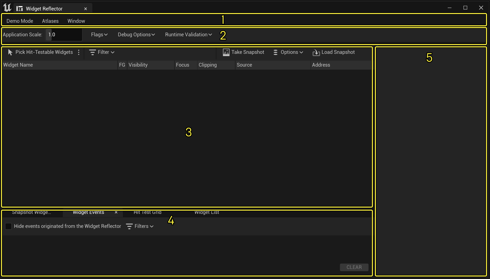
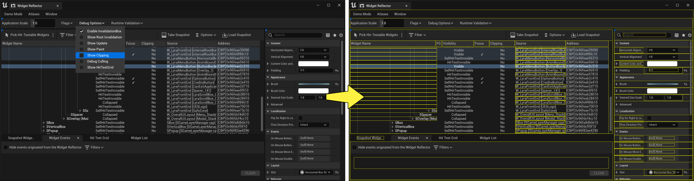
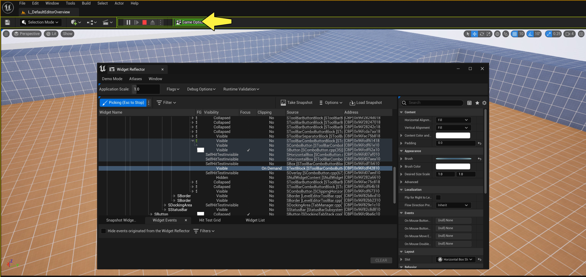
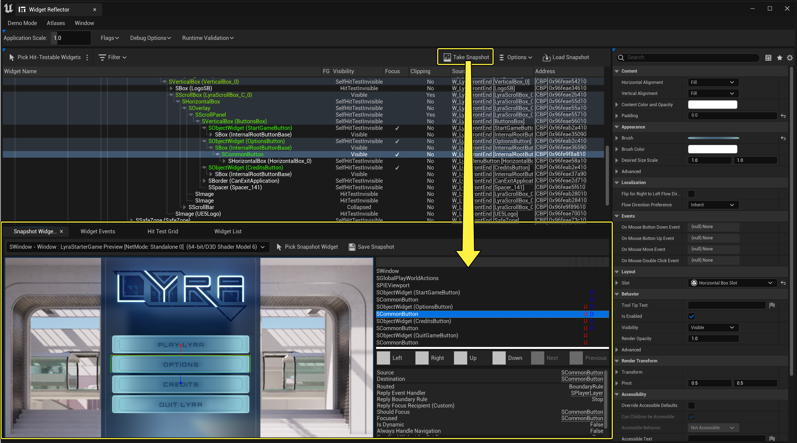
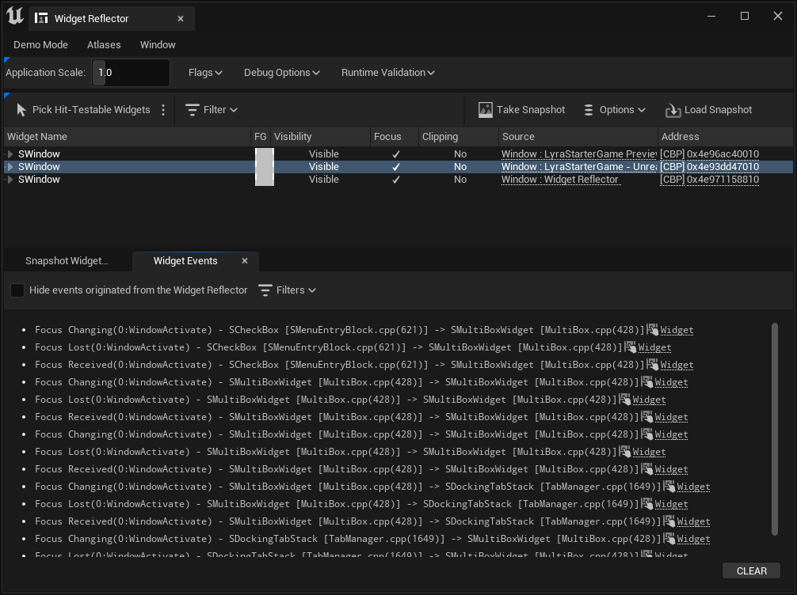

# 控件反射器

> 路径：虚幻引擎5.7文档 / 创建用户界面 / 测试和调试 / 控件反射器

> 原始页面：https://dev.epicgames.com/documentation/unreal-engine/using-the-slate-widget-reflector-in-unreal-engine

虚幻编辑器的UI是使用[Slate UI框架](../../slate-user-interface-programming-framework/index.md)编译的，**Widget Reflector** 工具让开发人员可以标识要用于为工具集渲染不同控件的[Slate API](https://dev.epicgames.com/documentation/unreal-engine/API/Runtime/Slate)。

虚幻编辑器中运行的控件反射器。

控件反射器默认内置在编辑器中，并且如果你是想要优化和调试项目UI的开发人员，请继续阅读入门指南：

## 入门

要在编辑器正在运行时打开控件反射器，请选择 **工具（Tools）** > **调试（Debug）** > **控件反射器（Widget Reflector）**。或者键入Ctrl+Shift+W或在控制台中输入WidgetReflector以打开工具。

> [!NOTE]
> 控件反射器在编辑器中可用，并可作为独立的应用程序。

## 用户界面

首次使用此工具时，显示以下界面。

点击显示全图。

| 区域 | 说明 |
| --- | --- |
| **1** | 主要菜单区域，具有演示模式、图集和窗口。 |
| **2** | 应用程序缩放和Slate调试选项区域。 |
| **3** | 控件层级区域让用户能够可视化控件层级、前景可视性以及焦点、裁剪、源和地址信息。此外，用户可以在此处获取和加载其虚幻应用程序的快照。 |
| **4** | 选项卡菜单区域，让用户能够可视化和调试快照控件、控件事件和点击测试网格。 |
| **5** | 控件细节区域。 |

### 演示模式

| 演示模式选项 | 用途 |
| --- | --- |
| **鼠标点击（Mouse Click）** | 启用此选项之后，用户能够演示鼠标点击事件，非常适合用于可视化光标事件的演示或用于录制演示。 |
| **键（Key）** | 启用此选项之后，用户能够演示按键事件，非常适合用于可视化按键的演示或用于录制演示。 |

### 图集

| 图集选项 | 用途 |
| --- | --- |
| **显示纹理图集（Display Texture Atlases）** | 选择此选项将打开纹理的NxN图集。 |
| **显示字体图集（Display Font Atlases）** | 选择此选项将打开字体的NxN图集。 |

#### 纹理图集

#### 字体图集

### 窗口

| 窗口选项 | 用途 |
| --- | --- |
| **Slate调试选项（Slate Debug Options）** | Slate调试选项让用户能够调整应用程序缩放以及切换控件缓存、无效调试、无效根调试、更新调试、绘制调试、显示裁剪和调试剔除标记。 如需了解这些标记的更多信息，请阅读[控制台Slate调试器](https://dev.epicgames.com/documentation/404)。 |
| **控件层级（Widget Hierarchy）** | 控件层级显示控件的父项和子项，包括这些控件是否可见以及是否在焦点中。用户还可以选择可进行点击测试的控件，将UMG根启用为层级过滤器，获取或加载应用程序UI的快照，以及（如果可用）指向控件的Slate源代码。 |
| **快照控件选择器（Sanpshot Widget Picker）** | 在从控件层级区域中获取快照后，应用程序的UI快照显示在快照控件选择器（Snapshot Widget Picker）选项卡中。 |
| **控件细节（Widget Details）** | 如有其他可用的控件细节，会显示在此区域中。用户可以选择将其他菜单挂接在此区域中。 |
| **控件事件（Widget Events）** | 已过滤的事件，例如焦点、输入、导航、bab或鼠标捕获事件将显示在控件事件区域中。 |
| **点击测试网格（Hit Test Grid）** | 在调试点击测试时，导航和事件信息将显示在点击测试网格（Hit Test Grid）选项卡中。 |

## 应用程序缩放

若要因演示、截屏或调试目的而更改应用程序的缩放，请输入新值或使用控件反射器的 **应用程序缩放（Application Scale）** 中的滑块。

> 图片已省略：undefined

调整应用程序的缩放。

## 标记

调整应用程序的缩放。

要开始调试应用程序的UI，请设置以下任何 **标记（Flags）**

- 无效调试
- 无效根调试
- 更新调试
- 绘制调试

> [!NOTE]
> 如需了解上述标记的更多信息，请阅读[Slate调试器控制台参考](https://dev.epicgames.com/documentation/404)。

### 显示裁剪

**显示裁剪（Show Clipping）** 标记显示如何裁剪控件。例如，此标记可以用于标识何时使用更小的面板裁剪较大的控件。

### 调试剔除

**调试剔除（Debug Culling）** 可供开发人员调试何时由一个控件（例如面板）剔除另一个控件。

### 控件缓存

InvalidationBox缓存系统支持 **控件缓存（Widget Caching）**，此功能在GlobalInvalidation模式下始终禁用。

## 控件层级

要查看与控件相关的层级信息，你可以 **选取绘制的组件（Pick Painted Widgets）**、**选取可进行点击测试的控件（Pick Hit-Testable Widgets）** 或 **显示焦点（Show Focus）** 控件。

### 选择绘制的控件

要选取绘制的控件，请执行以下步骤：

1. 在控件层级区域中，选择 **选取绘制的控件（Pick Painted Widgets）**。
2. 在应用程序UI上移动鼠标光标，直到找到你要查看的控件。

   
3. 按退出键（Escape），将焦点保持在你要查看的控件上。

在控件层级区域中，你可以查看以下属性。

> [!TIP]
> 要显示可用属性，请右键点击 **属性（Property）** 标头。

| 属性 | 说明 |
| --- | --- |
| **控件名称（Widget Name）** | 这是控件的名称，它会显示你或你的某个UI开发人员是否错误地命名了某个控件。 |
| **FG可视性（FG Visibility）** | 前景(FG)可视性用于帮助确定控件是否应在前景中可见。 |
| **焦点？（Focus?）** | 此属性有助于确定控件是否应在焦点中。 |
| **裁剪（Clipping）** | 此属性可帮助标识是否裁剪控件。 |
| **源（Source）** | 这是源代码的链接，也是控件的创建位置。当你的应用程序连接到IDE（例如C++调试器），你可以点击此超链接，在正确的位置打开文件。 |
| **地址（Address）** | 在C++调试器中设置条件断点时，知道控件的地址将很有帮助。 |

### 点击测试网格

点击测试网格对于希望可视化和查看控件点击框的开发人员很有帮助。要使用此功能，请执行以下步骤。

1. 选择 **选取可进行点击测试的控件（Pick Hit-Testable Widgets）**。
2. 将鼠标光标悬停在你要点击的控件上，或按ESC键，将焦点保留在控件上。

除了点击测试网格功能中可用的选项，可以设置以下标记。

| 标记 | 说明 |
| --- | --- |
| **在导航时可视化（Visualize on Navigation）** | 此设置仅在执行快照时可用，它让点击测试网格功能可以选取控件反射器内的控件。 |
| **拒绝控件反射器导航事件（Reject Widget Reflector navigation events）** | 此设置指示点击测试网格功能拒绝来自控件反射器的导航事件。 |

### 显示焦点

如果要显示具有焦点的控件，请执行以下步骤：

1. 选择 **显示焦点（Show Focus）**。
2. 使用鼠标光标选择控件，然后按ESC键以将焦点保留在控件上。

## 快照控件选取器

**快照控件选取器（Snapshot Widget Picker）** 保存应用程序中所有控件的图像和当前状态。要获取应用程序UI的快照，请执行以下步骤。

1. 在控件层级区域中，点击 **选项（Options）**。
2. 启用 **导航事件模拟（Navigation Event Simulation）**。

   > [!NOTE]
   > 此选项让开发人员可以模拟快照捕获的控件的导航事件。此外，此设置是可选的，应该仅在需要时启用。
3. 选择要获取快照的应用程序。
4. 点击 **获取快照（Take Snapshot）**。

   

用户可在此处使用快照中的点击测试网格，结果将显示在控件层级（Widget Hierarchy）面板中。快照将会保存应用程序UI的状态，以帮助开发人员标识需要修复的漏洞。此外，开发人员可以在快照区域中调试你的UI并模拟你应用程序的导航事件。

> [!NOTE]
> 仅可从编辑器的PIE模式和独立应用程序获取快照。

## 控件事件

当用户在UI上导航时，控件事件系统将消息清空到控件反射器中的输出日志中。

