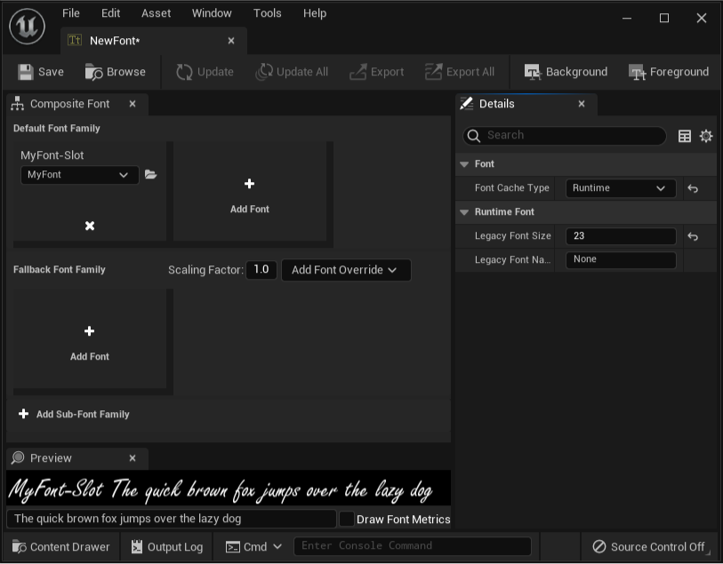
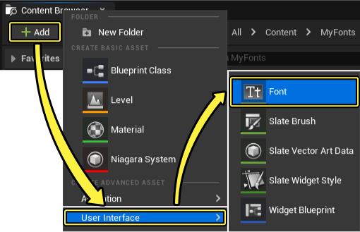
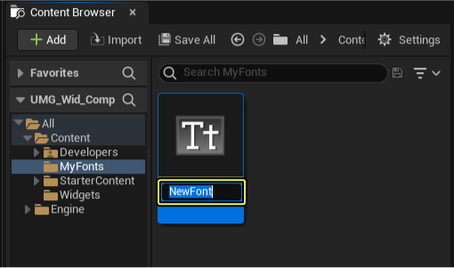
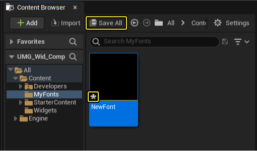
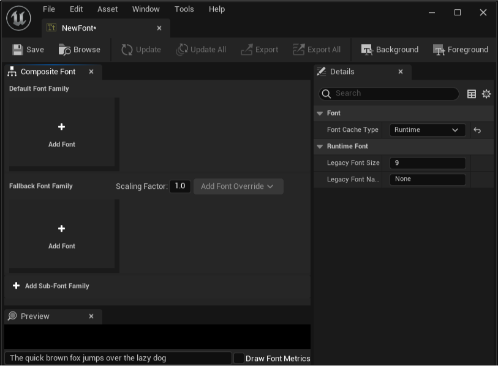
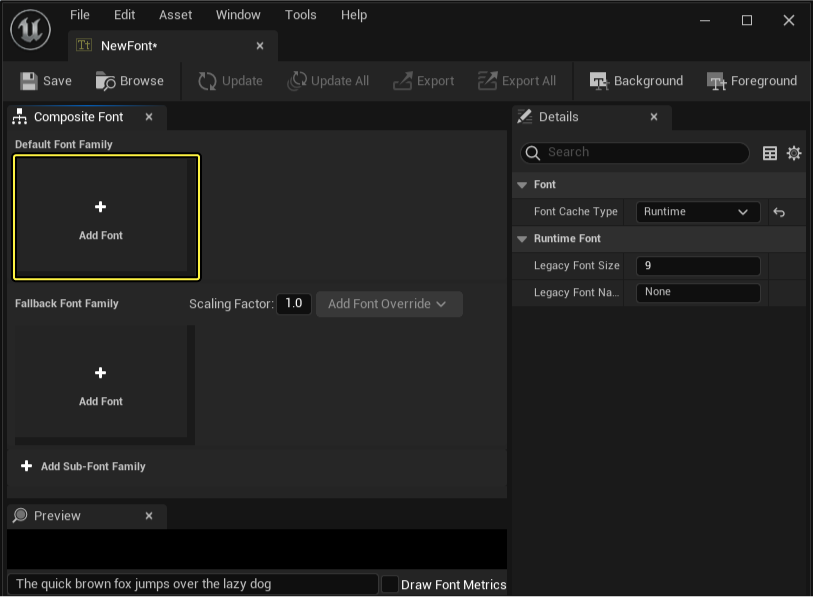
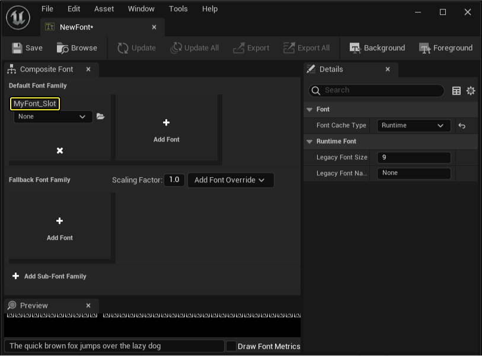
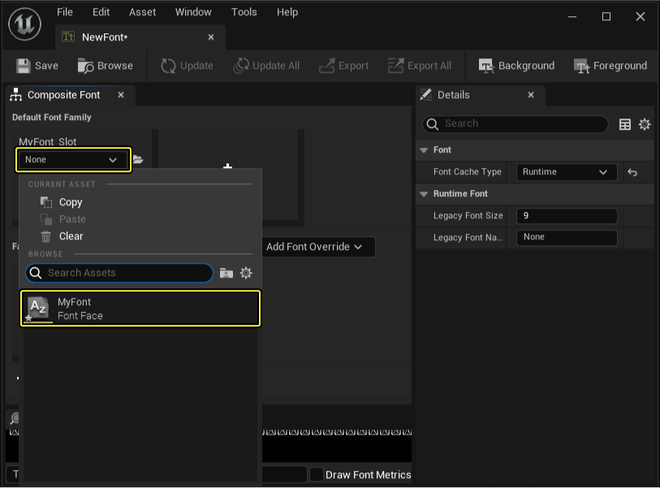

# 创建并指定字体

> 路径：虚幻引擎5.7文档 / 创建用户界面 / 文本格式设置、本地化和字体 / Fonts / 创建并指定字体

> 原始页面：https://dev.epicgames.com/documentation/unreal-engine/creating-and-assigning-fonts-in-unreal-engine-user-interface

在此指南中，您将了解如何创建空白字体资源（可对其指定字体风格资源，或直接使用字体编辑器导入新 TTF 或 OTF 字体文件）。

## 步骤

根据以下步骤自建字体资源，然后学习如何使用字体编辑器指定一个字体风格资源。

> [!NOTE]
> 在此指南中，我们使用的是 **Blank Template**，未加入 **Starter Content**、选择默认 **Target Hardware** 和 **Project Settings**。

### 创建字体资源

1. 点击 **Content Browser** 中的 **Add New** 按钮，然后选择 **User Interface** 下的 **Font** 选项。

   
2. 将新建一个合成字体资源，并弹出提示为其 **命名**。

   
3. 输入命名后，资源上将出现一个星号，说明资源尚未保存。点击 **Save All** 按钮保存资源，然后在弹出的菜单中确认保存。

   

### 指定字体风格资源

1. 创建空白字体资源后，便需要指定使用的字体风格。双击字体在字体编辑器中打开执行此操作。

   
2. 在字体编辑器中点击 **Add Font** 按钮新增一个字体槽。

   
3. 在字体编辑器中，为新添的字体插槽命名。

   
4. 使用字体命名下方的下拉选择选中已导入项目的字体风格资源。

   

   > [!NOTE]
   > 如尚未拥有字体风格资源，可使用下拉选择框旁的文件夹图标寻找并导入您自己的 TrueType Font（TTF）或 OpenType Font（OTF）字体文件。

## 最终结果

现在，你已经掌握了如何自建字体资源，并在字体编辑器中将导入的字体风格资源指定给字体资产。你的字体资产将可以在 UMG UI 设计器中使用。
