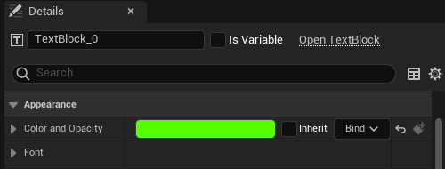
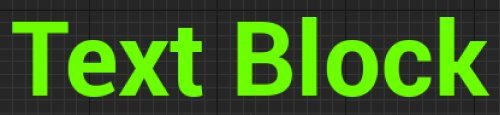
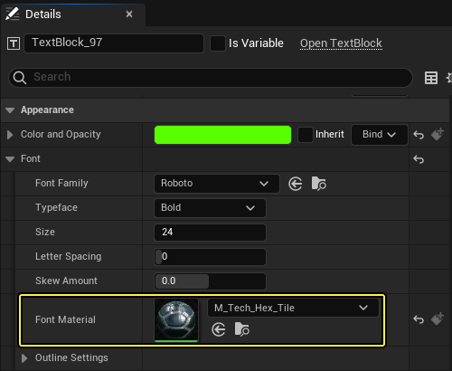
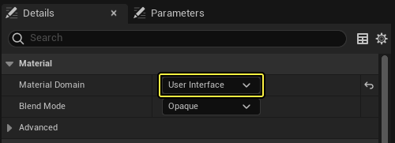
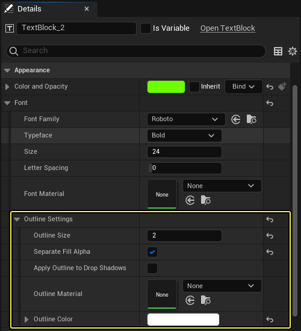
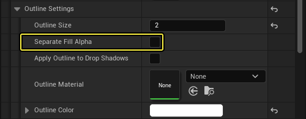

# 字体材质和外框

> 路径：虚幻引擎5.7文档 / 创建用户界面 / 文本格式设置、本地化和字体 / Fonts / 字体材质和外框

> 原始页面：https://dev.epicgames.com/documentation/unreal-engine/font-materials-and-outlines-in-unreal-engine

在 UMG 中除能够为 **字体** 设置 **颜色和不透明度** 之外，还可使用材质和字体外框进行更多 **字体** 设计。

## 字体颜色

对 **字体** 的 **颜色和不透明度（Color and Opacity）** 进行设置即可设置其 **顶点颜色**。

如未指定 **字体材质（Font Material）**，此操作将对文本应用纯色。

## 字体材质

可在 **Details** 面板中指定 **字体** 的 **字体材质**。

如 **字体材质** 不含 **顶点颜色（Vertex Color）** 节点，效果就像是简单乘法。

| 列 1 | 列 2 | 列 3 |
| --- | --- | --- |
| [undefined](https://d1iv7db44yhgxn.cloudfront.net/documentation/images/58b0093e-9b15-43f1-a0f5-2439f319c035/ue5_1-04-base-color.png) | Base Color material preview | Example of the Font Block with a Base Color node |
| 字体材质设置 | 字体材质预览 | 最终字体 |

然而如果在 **字体材质** 中放置一个 **Vertex Color** 节点，即可使用其输出在着色器中执行计算。

| 列 1 | 列 2 | 列 3 |
| --- | --- | --- |
| [undefined](https://d1iv7db44yhgxn.cloudfront.net/documentation/images/fbbde77b-12ff-4608-be37-4576a25ec14b/ue5_1-07-vertex-red-color.png) | Vertex Red Color material preview | Example of the Font Block with a Vertex Red Color node |
| 字体材质设置 | 字体材质预览 | 最终字体 |

用作字体材质的材质必须在 **User Interface** 域中。

## 字体外框

您可指定字体外框使用不同的 **外框颜色** 及材质。

指定的外框尺寸以 Slate 单位计。但字体大小为 1.0 时，1 个 Slate 单位等于 1 像素。

有趣的一点是您可以指定是否使用 **Separate Fill Alpha**。

启用此项后，填充区域的外框为透明， 可对字体透明度和字体外框进行单独调整。禁用此项后字体将覆盖在外框之上， 因此可添加透明度；通过透明度小于 1 的字体即可看到外框颜色和材质。

> 图片已省略：字体颜色Alpha = 0.5, 启用Separate Fill Alpha

字体颜色Alpha = 0.5，禁用Separate Fill Alpha

字体颜色Alpha = 0.5, 启用Separate Fill Alpha
