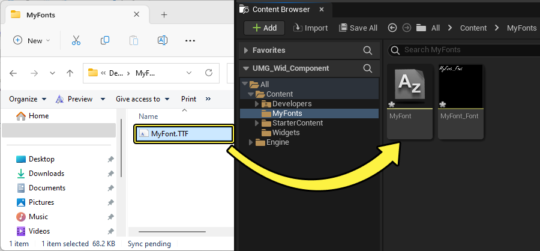
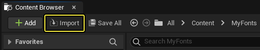
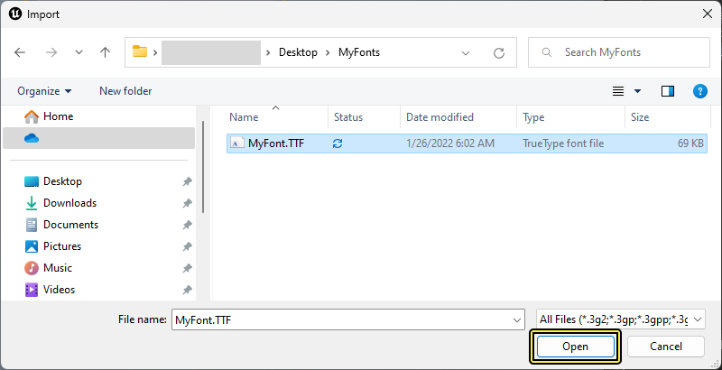
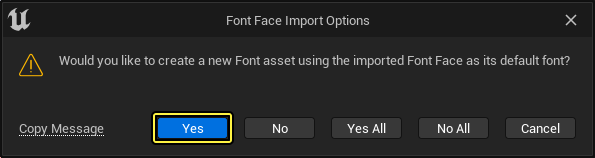
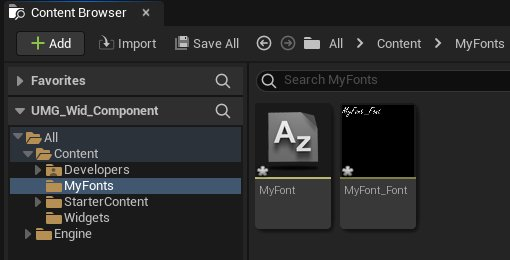
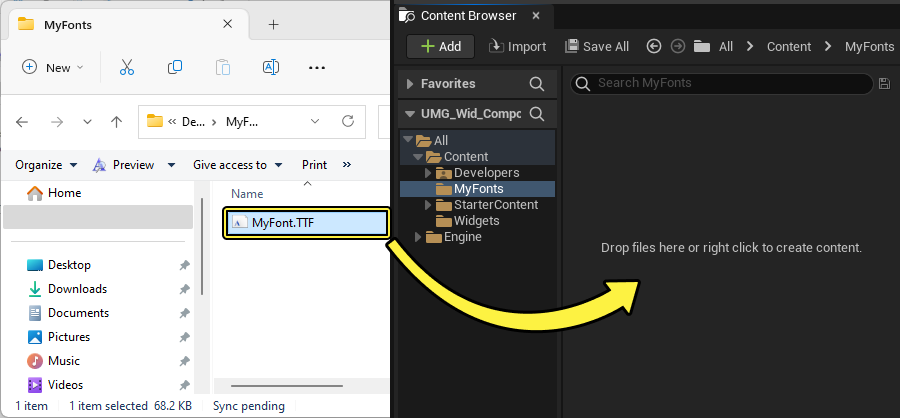

# 导入字体

> 路径：虚幻引擎5.7文档 / 创建用户界面 / 文本格式设置、本地化和字体 / Fonts / 导入字体

> 原始页面：https://dev.epicgames.com/documentation/unreal-engine/importing-fonts-in-unreal-engine

此指南说明如何将自建字体文件导入 **虚幻引擎**。

开始导入文件后，可在多种方法中进行选择，选择最适合您工作流程的方法。可选择的导入方法：

- 使用 Content Browser 的 Import 按钮。
- 拖放到 Content Browser 中
- 使用字体编辑器

导入字体时还可以在 **TrueType Font**（TTF）和 **OpenType Font**（OTF）之间进行选择。选择最能满足您需求的导入方法和字体类型。

> [!NOTE]
> 在此指南中，我们使用的是 **Blank Template**，未加入 **Starter Content**、选择默认 **Target Hardware** 和 **Project Settings**。

## 使用 Content Browser

可使用 Content Browser 的 **Import** 按钮选择 TTF 或 OTF 字体文件。

1. 在 Content Browser 中点击 **Import** 按钮。

   
2. **Import** 对话框出现后，导航至需要导入的 TFF 或 OTF 字体文件并将其选中。然后点击 **Open**。

   
3. 稍后将出现 **Font Face Import Options** 对话。从列出的选项中选择 **Yes**，在 Content Browser 中创建字体风格资源和合成字体资源。

   
4. 现在即可在文件夹层级中找到字体风格资源。

   

## 使用拖放

用户可将 `TTF` 或 `OTF` 文件直接 **拖放** 到 Content Browser 中创建字体资源。

1. 导航到保存 `TTF` 或 `OTF` 文件的文件夹。选择并长按将文件拖到 **文件浏览器** 中，开始导入进程。

   
2. 稍后将出现 **Font Import Options**。从列出的选项中选择 **Yes**，在 Content Browser 中创建字体风格资源和合成字体资源。

   
3. 现在即可在文件夹层级中找到字体风格资源。

   

## 使用字体编辑器

用户可直接从 **字体编辑器** 中的 [默认字体群](../font-asset-and-editor/index.md#defaultfontfamily) 列表导入并创建字体风格资源， 无需先导入字体资源再对其进行指定。

1. 打开一个现有 **字体** 资源或使用 Content Browser 中的 **+Add New** 按钮。

   > 图片已省略：Click the Add button in the Content Browser
2. 打开 **字体编辑器** 窗口。

   > 图片已省略：Font Editor window
3. 点击 **Add Font** 按钮为 **默认字体群** 添加一个新的字体选项。

   > 图片已省略：Click the Add Font button
4. 选择选项下拉旁边的 **folder** 按钮。

   > 图片已省略：Select the **folder** button
5. **Import** 对话框出现后，导航至需要导入的 `TFF` 或 `OTF` 字体文件并将其选中。然后点击 **Open**。

   > 图片已省略：Select Font in the Import dialog window
6. 之后将出现 **Save Font Face** 窗口。为字体命名，在游戏文件夹层级中选择相同路径。然后点击 **Save**。

   > 图片已省略：The Save Font Face window
7. 现在即可在文件夹层级中找到字体风格资源。

   > 图片已省略：The imported Font Face asset in folder

## 最终结果

了解如何使用多种方法进行导入后，即可使用这些选项将自建字体文件导入游戏和项目。
